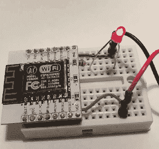

# 用基本无线方式控制 LED

> 原文：<https://dev.to/brightdevs/mastering-led-with-basic-wirelessly-47m4>

作为一个 DIY 爱好者，我喜欢浏览互联网寻找想法和灵感。所以我找到了一个相当不错的项目，叫做 [ESPBASIC](https://www.esp8266basic.com/) 。我听说过 BASIC，但我从未有机会学习或使用它，所以我认为是时候见见 BASIC 了(尽管它只是一个解释器)。我的抽屉里只有几个 ESP-12F 芯片，几根电缆和几个分散的 led，还有一个免费的试验板，这对于第一次接触 BASIC 来说已经足够了。我的想法很简单，也是典型的电子产品——我决定自己动手制作世界闪烁 LED。

# 燃烧的芯片

有几个步骤:

1.  将 uC 连接到任何 UART 控制器(我使用的是 pl2303)
2.  从[官网](https://www.esp8266basic.com/download.html)下载一个 flashing 工具
3.  选择端口和闪存固件

我在那里只有一个问题——司机。Windows 10 对驱动程序有点太严格了，所以我不得不下载我的 pl2303 驱动程序的旧版本，一切正常。除了我认为它是最容易安装的固件之一。

# 连接

在您的 WiFi AP 列表中应该会出现一个名为 like `ESP AA:BB:CC:DD:EE:FF`的网络。只需连接到它，发现设备的 IP(应该是`192.168.4.1`)并将其放入浏览器。
你的眼睛应该看到这样的东西:

[T2】](https://res.cloudinary.com/practicaldev/image/fetch/s--QvvkVGqL--/c_limit%2Cf_auto%2Cfl_progressive%2Cq_auto%2Cw_880/https://thepracticaldev.s3.amazonaws.com/i/g3lffbgf52futzva2e2b.png)

在`SETTINGS`选项卡中，您可以配置 ESP 连接到您的家庭 wifi，设置 OTA url(例如 GitHub 上托管的基本文件的 url)

# 你好世界

ESPBASIC 几乎有一个纯文本、一页的文档:
[https://docs . Google . com/document/d/1 eiyugfu 12 x 2 _ PMF U2 o 19 cclx 0 alglm 4 r 2 yxkyyjon 8/pub](https://docs.google.com/document/d/1EiYugfu12X2_pmfmu2O19CcLX0ALgLM4r2YxKYyJon8/pub)
所以我尝试将`Hello World`放在我的屏幕上，在`[EDIT]`选项卡中有以下代码:

```
print "Hello World" 
```

Enter fullscreen mode Exit fullscreen mode

然后是`Save`文件和`[RUN]`代码。

[T2】](https://res.cloudinary.com/practicaldev/image/fetch/s--zzw4RVPM--/c_limit%2Cf_auto%2Cfl_progressive%2Cq_auto%2Cw_880/https://thepracticaldev.s3.amazonaws.com/i/zee81r39y8s312cmdd4j.png)

耶！这很容易。但是如果你想多放一个`print`，你会在你的文本上面看到垃圾(`<hr>`标签)。快速查看文档，你应该会发现还有`wprint`功能，无需任何额外的代码就可以将文本显示在屏幕上。

# 眼花缭乱

我已将 LED 连接到 ESP-12 的 GPIO15 引脚。首先我会试着点亮我的灯。

```
print "Led ON"
io(po,15,1) 
```

Enter fullscreen mode Exit fullscreen mode

第一次尝试就成功了！就一条线，无线，不编译不闪。哇！
`io`只是一个 IO 操作功能
`po`的意思是‘引脚出’
`15`是引脚号
`1`是`high`状态(`0`是`low`)

下一步是在打开和关闭 LED 之间设置一个延迟:

```
io(po,15,1)
delay 500
io(po,15,0)
delay 500
io(po,15,1)
delay 500
io(po,15,0)
delay 500
io(po,15,1)
delay 500
io(po,15,0)
delay 500 
```

Enter fullscreen mode Exit fullscreen mode

它会闪烁，但只有几次 0.5 秒的延迟。我最不需要的就是这里有一个循环，然后我就会有一个令人敬畏的闪烁机器！

```
For x = 1 to 60
    io(po,15,1)
    delay 500
    io(po,15,0)
    delay 500
Next x 
```

Enter fullscreen mode Exit fullscreen mode

该代码持续 60 秒后。让它无限吧！

[](https://res.cloudinary.com/practicaldev/image/fetch/s--QZpCsAZJ--/c_limit%2Cf_auto%2Cfl_progressive%2Cq_66%2Cw_880/https://thepracticaldev.s3.amazonaws.com/i/fgr668ltx892c02gdidd.gif)T3】

```
variable = 0
Do
    io(po,15,variable % 2)
    delay 500
    variable = variable + 1
Loop until 0 'infinite 
```

Enter fullscreen mode Exit fullscreen mode

成功！但是 ESP 的“IDE”变得不可用。原因是`delay`操作占用了所有的处理器时间。
最好使用定时器功能，利用中断来计时。

```
variable = 0

Timer 500, [blink]

[blink]
    io(po,15,variable % 2)
    variable = variable + 1
wait 
```

Enter fullscreen mode Exit fullscreen mode

定时器每 500 毫秒才占用 CPU 时间，所以可以编辑代码并让它在后台运行。

最初发布于 [brightinventions.pl](https://brightinventions.pl/blog/)

作者 pawepapkiewicz，软件工程师@光明发明
[电子邮件](//pawel.papkiewicz@brightinventions.pl) [Github](https://github.com/papkie)