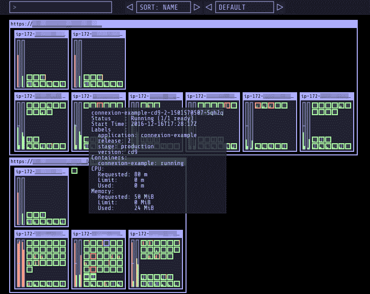
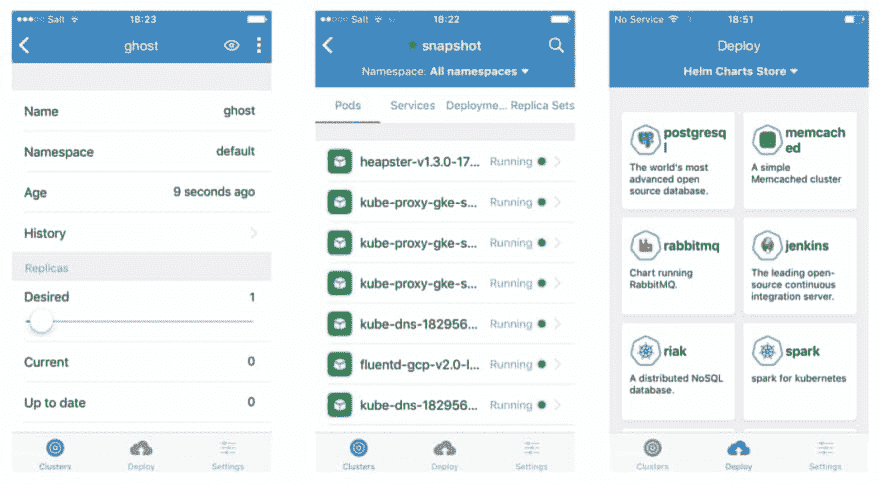
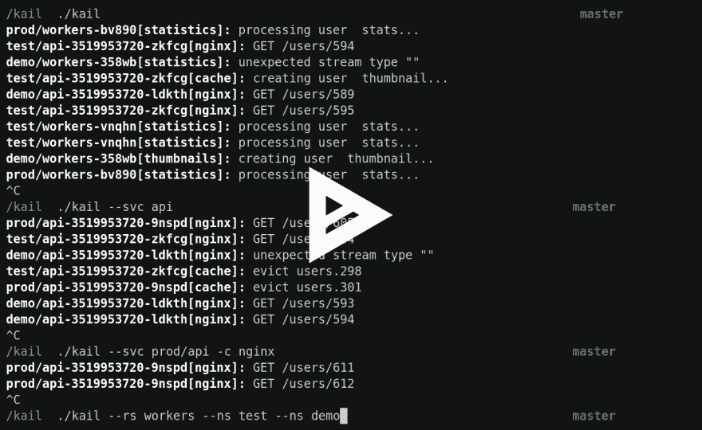
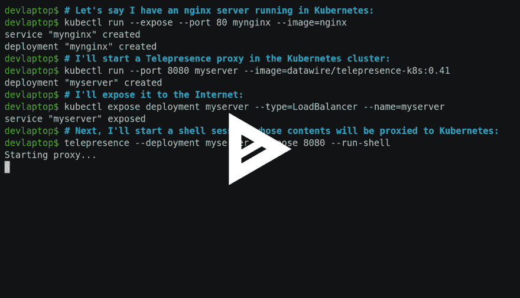
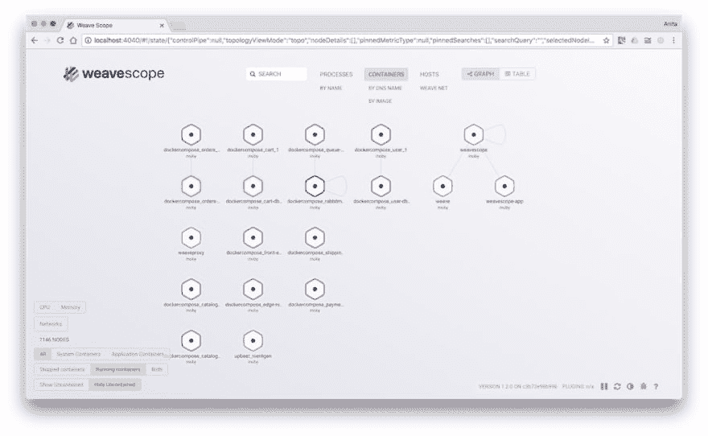
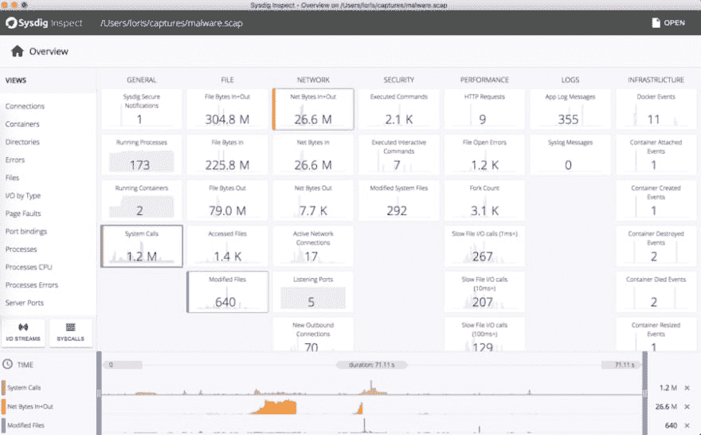

# 高效 SRE 和运营团队的 10 个开源 Kubernetes 工具

> 原文:[https://dev . to/abhishektiwari/10-open-source-tools-for-high-effective-kubernetes-sre-and-ops-teams-5 FMD](https://dev.to/abhishektiwari/10-open-source-tools-for-highly-effective-kubernetes-sre-and-ops-teams-5fmd)

[T2】](https://res.cloudinary.com/practicaldev/image/fetch/s--IZ7liZXn--/c_limit%2Cf_auto%2Cfl_progressive%2Cq_auto%2Cw_880/https://abhishek-tiwari.com/conteimg/2018/01/pexels-photo-256219.jpg)

如果您在 Kubernetes 中运行工作负载，您的站点可靠性工程(SRE)和运营(Ops)团队需要合适的工具来确保 Kubernetes 集群和其中运行的工作负载的高可靠性。在这里，我们列出了 10 个开源 Kubernetes 工具，帮助您的 SRE 和运营团队更有效地实现服务水平目标。

# Kube-ops-view

[Kube-ops-view](https://github.com/hjacobs/kube-ops-view) 为多个 Kubernetes 集群提供了一个通用的操作视图。对于 SRE 和运营团队来说，这是一个方便的工具。Kube-ops-view 提供只读系统仪表板。kube-ops-view 提供的一些很酷的功能，

*   在多个 Kubernetes 集群之间切换
*   渲染节点并指示它们的整体状态(“就绪”)
*   显示节点容量和资源使用情况(CPU、内存)
*   指示 pod 的状态(绿色:就绪/运行，红色:错误等)
*   为节点和窗格提供工具提示信息
*   制作 pod 创建和终止的动画
*   使用屏幕标记在电视屏幕上投影仪表盘

[T2】](https://res.cloudinary.com/practicaldev/image/fetch/s--YwsbNAd7--/c_limit%2Cf_auto%2Cfl_progressive%2Cq_auto%2Cw_880/https://abhishek-tiwari.com/conteimg/2018/01/kube-ops-view.png)

# 船舱

[Cabin](https://github.com/bitnami/cabin) 是 Kubernetes 的原生移动仪表盘应用。Cabin UI 是使用 React Native 构建的，因此可以在 iOS 和 Android 设备上运行。它是一个移动助手，提供细粒度的操作 Kubernetes 资源。客舱应用程序经过触摸优化。举例来说，你可以通过左滑动来删除窗格。您可以通过手指滚动来扩展部署。

[T2】](https://res.cloudinary.com/practicaldev/image/fetch/s--4B5xzNTk--/c_limit%2Cf_auto%2Cfl_progressive%2Cq_auto%2Cw_880/https://abhishek-tiwari.com/conteimg/2018/01/cabin-app-screenshots.jpg)

客舱中包含的一些有趣的功能，

*   无缝支持谷歌 Kubernetes 引擎(GKE)。您可以直接通过手机创建 GKE 集群。
*   早期支持帮助图表，您可以查看图表存储库，并在移动中一键启动图表。
*   访问 pod 日志，按标签搜索资源，通过更改部署的映像触发滚动更新等。

# Kubectx

如果您使用多个 Kubernetes 集群，Kubectx 是另一个必备工具。Kubectx 与 kubens 捆绑在一起，它们允许您在使用 kubectl 时在 Kubernetes 集群和名称空间之间切换。

[T2】](https://res.cloudinary.com/practicaldev/image/fetch/s--21EnqwLC--/c_limit%2Cf_auto%2Cfl_progressive%2Cq_66%2Cw_880/https://abhishek-tiwari.com/conteimg/2018/01/kubectx-demo.gif)

kubectx 和 kubens 支持 bash/zsh shell 上的制表符补全，以帮助您处理长上下文名称。您不必再记住完整的上下文名称。

# Kube-shell

Kube-shell 是一个集成的 shell，用于与 Kubernetes CLI 协同工作。它有一些非常漂亮的功能，例如

*   自动完成命令、自动建议、内嵌文档
*   使用向上/向下箭头键访问命令执行的历史
*   来自 kubeconfig 的当前上下文，在集群/名称空间之间轻松切换

[T2】](https://camo.githubusercontent.com/6dd81f81976c3abf550dddbed8dcc1fa93d86595/687474703a2f2f692e696d6775722e636f6d2f6466656c6b4b722e676966)

## 相关工具

Kube-prompt 是另一个具有自动完成功能的交互式 Kubernetes 客户端。它接受不带 kubectl 前缀的命令。

此外， [Kube-ps1](https://github.com/jonmosco/kube-ps1) 是一个简洁的脚本，它允许您将当前 Kubernetes 上下文和在 kubectl 上配置的名称空间添加到 Bash/Zsh 提示字符串中。

最后， [Kail](https://github.com/boz/kail) 是 Kubernetes 的尾巴。作为一个 Kubernetes 日志查看器，kail 允许您使用选择器从匹配的窗格中流式传输日志。

[T2】](https://asciinema.org/a/133521)

您可以根据标准标签选择器、名称、服务、部署等来匹配 pod。

# 网真

[Telepresence](https://www.telepresence.io) 是一款开源工具，可以让您在本地调试服务，同时保持与托管在远程 Kubernetes 集群和远程云资源(如数据库)中的依赖服务的连接。

[T2】](https://asciinema.org/a/117761)

我个人认为网真有很大的潜力。对于在 Kubernetes 上运行的服务来说，网真已经是一个强大的本地开发环境。现场调试部分是新的，但发展相当迅速。

# 编织范围

[Weave Scope](https://github.com/weaveworks/scope) 是 Docker 和 Kubernetes 的故障排除&监控工具。它自动构建您的应用和基础设施的逻辑拓扑，使您的 SRE 和运营团队能够直观地了解、监控和控制您的基于微服务的容器化应用。

[T2】](https://res.cloudinary.com/practicaldev/image/fetch/s--x-TRYFps--/c_limit%2Cf_auto%2Cfl_progressive%2Cq_auto%2Cw_880/https://abhishek-tiwari.com/conteimg/2018/01/topology-map.jpg)

除了拓扑视图之外，Weave 范围还可以提供一个深入视图，即节点和流程之间的所有内容，包括部署、服务、副本集、容器和容器。此外，您可以根据 CPU 和内存使用情况应用过滤器，或者使用搜索功能通过名称、标签甚至路径快速查找节点类型、容器和进程。

# 强力封印

强力封印灵感来自混沌猴，由彭博工程团队研发。它会给你的 Kubernetes 集群带来混乱，比如杀死目标豆荚和节点。它以两种模式运行:交互式和自主式。

> 交互模式旨在允许您发现您的集群的组件，并手动打破东西，看看会发生什么。它在节点、单元、部署和名称空间上运行。>自主模式读取策略文件，该文件可以包含任意数量的 pod 和节点方案。每个场景描述了要在集群上执行的匹配、过滤器和操作的列表。

策略文件以 [YAML 格式](https://github.com/bloomberg/powerfulseal/blob/master/tests/policy/example_config.yml)编写，包括将由自主代理执行的场景。

## 相关工具

kube-monkey 是网飞的混沌猴子在 Kubernetes 集群中的替代实现。它随机删除 Kubernetes 集群中的 pod，鼓励和验证故障恢复服务的开发。

# 土拨鼠

Marmot 是来自 Google 的工作流执行引擎，用于处理针对 DevOps/SRE 需求的工作流。它是作为处理基础设施变更的工具而设计的，但也可以与 Kubernetes 一起使用。

它特别适用于任何类型的操作，这些操作必须以一定的步调分步进行，并且可能需要健康状态检查。例如，你在 Kubernetes 上推出一个新的服务版本，有大量的实例，然后你执行一个增量但受控的推出(金丝雀发布)。

# [页](#ark)

Ark 是一个管理 Kubernetes 资源和卷灾难恢复的工具。Ark 为从一系列检查点备份和恢复 Kubernetes 资源和持久卷提供了一种简单且操作可靠的方法。备份文件存储在对象存储服务中(例如亚马逊 S3)。

Ark 使您能够以更有效的方式自动化以下场景，

*   缩短 TTR(响应时间)的灾难恢复
*   Kubernetes API 对象的跨云提供商迁移
*   开发和测试环境设置(+ CI)，通过生产的复制

Ark 附带一个集群内服务(Ark 服务器)和 CLI (Ark 客户端)。集群内服务完成了大部分繁重的工作，因为它运行所有的 Ark 控制器。Ark server 执行实际的备份，验证它并将备份文件加载到云对象存储中。

# Sysdig

Sysdig 是一个容器故障排除工具，它从 Linux 内核中捕获系统调用和事件。简单来说，Sysdig 就是你整个集群的 strace+tcpdump+htop+iftop+lsof+wireshark。

> Sysdig 通过安装到 Linux 内核中并捕获系统调用和其他操作系统事件，在操作系统级别对您的物理机和虚拟机进行检测。Sysdig 还可以为系统活动创建跟踪文件
> 
> ## 相关工具

[Sysdig Inspect](https://github.com/draios/sysdig-inspect) 是将 Sysdig 采集的数据可视化的界面。Sysdig Inspect 帮助 SRE 和运营团队进行集装箱故障排除和安全调查。

> Inspect 的用户界面旨在直观地导航包含 Linux 系统的粒度系统、网络和应用活动的数据密集型 Sysdig 捕获。Sysdig Inspect 帮助您了解趋势、关联指标并大海捞针。它附带了一些特性，旨在支持性能和安全性调查，以及深度容器自省。

[T2】](https://res.cloudinary.com/practicaldev/image/fetch/s--Ofctxnbh--/c_limit%2Cf_auto%2Cfl_progressive%2Cq_auto%2Cw_880/https://abhishek-tiwari.com/conteimg/2018/01/sysdig-inspect.jpg)

Sysdig Falco 是另一款基于 Sysdig 收集的粒度数据的工具。Falco 监控行为活动，它旨在检测您的应用程序中的异常活动。例如，使用 Falco，您可以检测以下活动，

*   外壳在容器内部运行
*   容器正在特权模式下运行
*   容器正在从主机装载敏感

# 最后的想法

Kubernetes 生态系统正在观察爆炸式增长。有大量的开源和商业工具可以帮助您更有效和高效地操作缺失关键的 Kubernetes 集群和服务。一如既往，确定 10 大工具并不容易。我们错过了什么吗？[在 Twitter 上告诉我们](https://twitter.com/abhishektiwari)你是否在生产中使用有趣的东西来管理 Kubernetes。