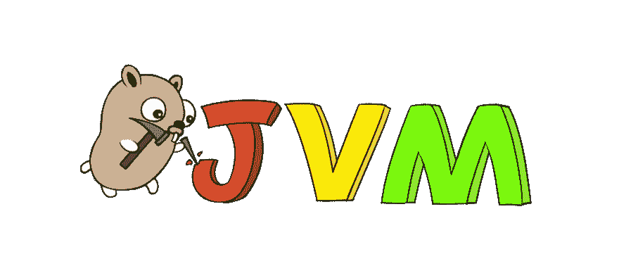

# 安装 Go 项目-面向 JVM 开发人员

> 原文：<https://dev.to/gimlet2/setup-go-project---for-jvm-developers-1915>

 

<figcaption>图片来自【https://github.com/zxh0/jvm.go】</figcaption>

我为 JVM 平台做开发已经有一段时间了。过去是**爪哇**，现在是**科特林**。这里一切似乎都合乎逻辑——这是您的 **Maven** 、 **Gradle** 或任何具有版本依赖关系的项目描述，当您进行构建时——工件就在这里。它给你一种工作空间的感觉。并行开发多个项目很容易——它们都是相互隔离的。

但是新的玩家来到了那个完美的世界。

**$GOROOT** ？ **$GOPATH** ？WTF？项目的依赖项在哪里？有版本之类的东西吗？我的二进制文件在哪里？！

我相信这样的生态系统设计是有一定的理性内核和推理的。但是从我(可能不仅仅是我)的经验来看，它看起来像是完全平行的宇宙。

为了处理它，我的第一个方法是复制项目目录中预期的 **$GOPATH** 文件夹结构— **bin** 、 **src** 和 **pkg** 。然后在 **src** 文件夹中创建正确的导入路径——像**github.com/gimlet2/<some project>**并在那里检查项目本身。在此操作之后，更新环境变量 **$GOPATH** 以指向项目目录。嗯，太复杂了。

[T2】](https://res.cloudinary.com/practicaldev/image/fetch/s--oGdZ0T9H--/c_limit%2Cf_auto%2Cfl_progressive%2Cq_auto%2Cw_880/https://cdn-images-1.medium.com/max/250/1%2AiEQB41x__t5yNiNAQVAieA.png)

为了稍微改进一下，我决定使用 dep 包管理器。它变得更好了。现在，对于每个项目，我都能够提供一个包含确切版本的依赖项列表。也许那不是真正的**走向**的方式，但我喜欢它。

但是，它离理想还差得很远。也许虚拟环境在这里能有所帮助？Python 中广泛使用它来解决类似的问题。我在 Github 上找到的第一个东西是 T2 goenv T3。这个项目不是在积极发展，但它做的工作。

它非常容易使用:

1.  安装它去找 github.com/crsmithdev/goenv
2.  签出您的项目
3.  然后，在你的项目文件夹中启动 github.com/me/myproject
4.  主动虚拟环境。goenv/激活

酷，它的工作！但是现在 dep 是一个问题。它验证您的项目位于适当的 **$GOPATH** 中。而 **goenv** 在 **~/中创建虚拟 **$GOPATH** 。goenv/ <项目名称>** 。在这个文件夹中，它还创建了 **bin** 、 **pkg** 和 src 文件夹以及您用 goenv init 命令指定的文件夹结构。几乎与我之前手动操作的步骤相同。它会创建一个指向实际项目文件夹的符号链接。因此，我对 **goenv** 做了一点改进，在激活环境时将它 cd 到这个虚拟项目文件夹中。

现在你可以马上运行 dep ensure 或者启动你的代码编辑器(我个人使用 [Visual Studio 代码](https://code.visualstudio.com/)进行 Go 开发)，使用 git 等等。我已经将这个变更作为一个拉请求提供给了原始项目。但是你也可以从我的叉子上安装它——去找 github.com/gimlet2/goenv 的。

也许这个设置不是最好的，但对我来说很有用。至少现在我知道什么在哪里，可以在一个命令中设置新的项目。