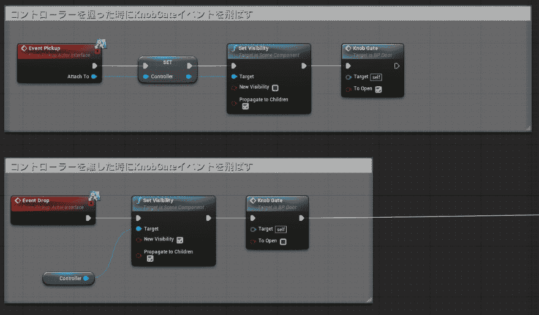
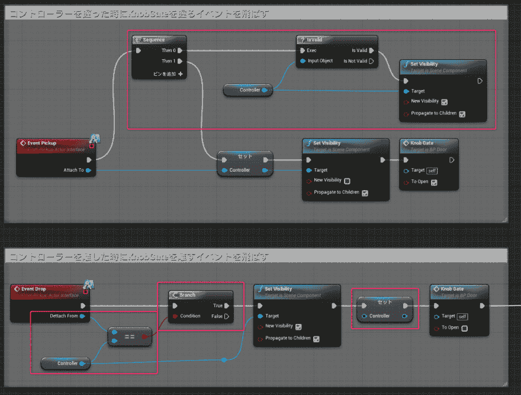
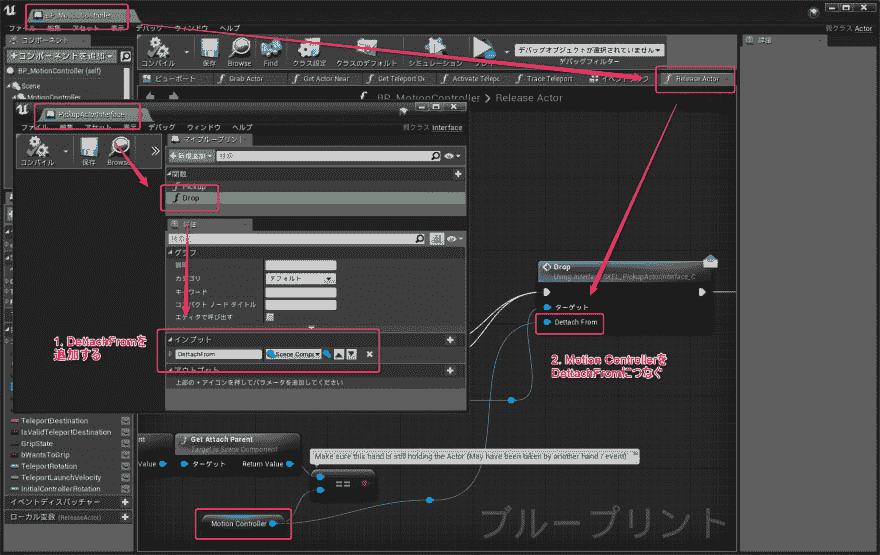

# 尝试用 Udemy 的“【UE4】Unreal Engine 4 + VR 进行建筑可视化”来改善门把手的处理

> 原文:[https://dev.to/shiena/udemy-ue4-unreal-engine-4-vr-2onp](https://dev.to/shiena/udemy-ue4-unreal-engine-4-vr-2onp)

# 前言

[在 Udemy](https://www.udemy.com) 中试着在[@shop_0761](https://dev.to/shop_0761) 先生的[【UE4】Unreal Engine 4 + VR 中进行建筑可视化](https://www.udemy.com/unrealengine-4-archviz-vr/)，有在意的举动

# 在意的部分

在这个讲座中，在 VR 内设置门，用控制器转动门把手就可以开门了。

[T2】](https://res.cloudinary.com/practicaldev/image/fetch/s--rQjL57HL--/c_limit%2Cf_auto%2Cfl_progressive%2Cq_auto%2Cw_880/https://dev-to-uploads.s3.amazonaws.com/i/p0laheo6kyk3i9kuxu4b.png)

抓住门把手就会调用`Pickup`活动，隐藏作为手对象的`Contoller`。
然后松开门把手，就会调用`Drop`活动再次显示`Controller`。

这时用双手抓住门把手的话，先握住的手会保持消失的状态，如下所示。

1.  用右手抓住门把手
    *   右手消失→ OK
2.  用左手抓住门把手
    *   用左手重新抓住消失→ OK
    *   右手也消失了→没有抓住的手想重新显示

而且不管先从哪只手放开都会变得奇怪。

*   先放开右手
    1.  左手也放开后重新显示→想保持左手抓住
    2.  右手保持消失→放开的手想再次表示
*   先放开左手
    1.  左手重新显示→确定
    2.  右手保持消失→没有抓住的手想重新表示

之后抓住这个的手抓住门把手，再次显示之前抓住的手。
再试着改善一下，即使放开之前抓住的手也什么都不做。

# 抓住门把手的处理的改善

在改善之前，首先决定规格。

1.  后来抓住的手抓住门把手
2.  重新显示之前抓住的手
3.  放开先抓住的手也什么都不做

因为已经实现了第一个项目，所以改善了剩下的两个的是用粉红色线包围的部分。

## 再次显示之前抓住的手

`Pickup`只要能够判定在呼叫事件时是否已经抓住就可以了，所以根据`Controller`是否有效而分支。

*   在`Drop`活动中在`Set Visibility`之后废弃`Controller`
*   在`Pickup`事件中将`Attach To`代入`Controller`之前，如果`IsValid`函数的结果为`Is Valid`，则用`Set Visibility`表示

用任何一只手抓住门把手时`Controller`为有效，双手分开时`Controller`为无效。

## 放开先抓住的手也什么都不做

`Drop`因为不知道活动被叫的时候放开了谁的手，所以有点堵塞，但是改造了从 VR Template 带来的 BP 后实现了。

[T2】](https://res.cloudinary.com/practicaldev/image/fetch/s--TfVENjHm--/c_limit%2Cf_auto%2Cfl_progressive%2Cq_auto%2Cw_880/https://dev-to-uploads.s3.amazonaws.com/i/e6cmkf0sb7yprhaazjop.png)

首先在`VirtualRealityBP/Blueprints/PickupActorInterface`的`Drop`的 Inputs 中添加变量。
接下来在`VirtualRealityBP/Blueprints/BP_MotionController`的`ReleaseActor`图表中，在`Drop`的自变量`DettachFrom`上加上`MotionController`。

这样一来，在门的`Drop`事件被叫走时可以放开手了，所以和变量`Contoller`进行比较，如果是相同的话，因为是之后抓住的手，所以进行处理，如果不是的话，因为是先抓住的手，所以可以判定为什么都不做。

# 最后

使用 VR Template 可以简单地安装抓取处理，改造也比较简单，所以推荐导入。
从这里开始，再用双手抓住的时候，好像可以扩大缩小，发展各种各样的事情。