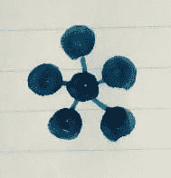
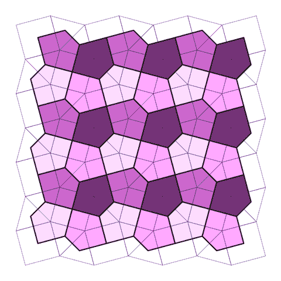
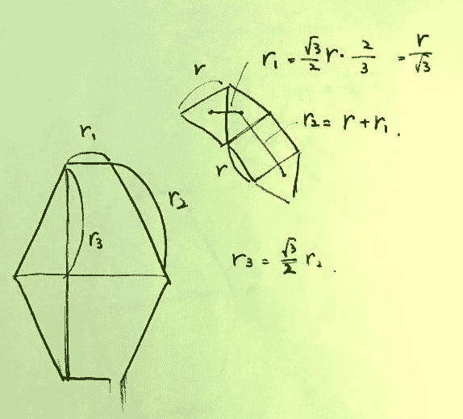
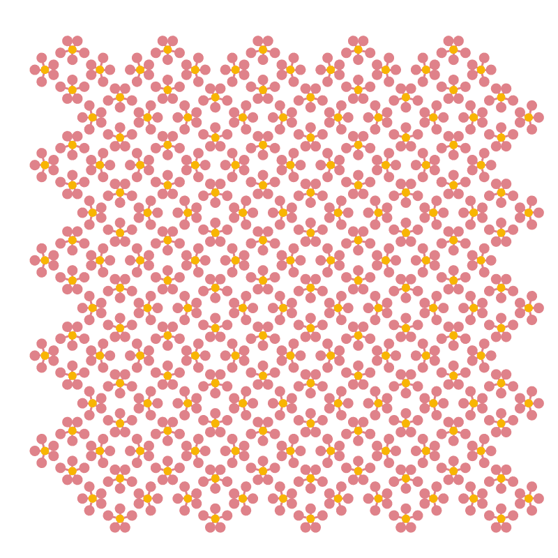
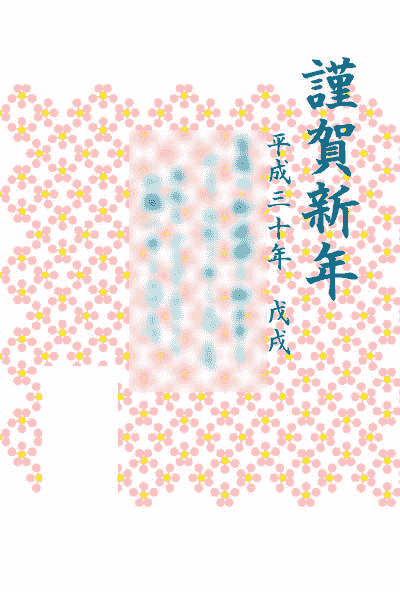

# 用 Clojure + quil 为贺年卡绘制花式图案

> 原文：<https://dev.to/lesguillemets/drawing-a-fancy-pattern-for-new-years-cards-with-clojure--quil-3ej8>

我喜欢寄新年贺卡。每年我都会准备设计，买这些空白卡片，然后在家打印出来。今年我想尝试用 [quil](https://github.com/quil/quil) ，基本上是用 clojure 中的[处理](https://processing.org/)，为它画一些奇特的图案。因为我根本不会画画...

编辑: [syngrato](https://dev.to/syngrato) 将这段代码改编成 ClojureScript(谢谢！).你可以在这里玩得开心。执照是麻省理工。

## 设计

### 母题

贺年卡适合什么样的图案？在日本(顺便说一句，我是日本人)，我们可以祝愿彼此健康和繁荣的东西一直很受欢迎——松树、鹤和乌龟等等。它们是健康和长寿的象征，因为它们长寿(松树总是绿色的)。另一个流行的标志是*ume*T2 梅，日本杏，因为它们在 spiring 开花最早，庆祝新年都是为了庆祝即将到来的春天。

*阳月华*花卉传统上被抽象成这样的设计(因为我没有词汇):

[T2】](https://res.cloudinary.com/practicaldev/image/fetch/s--0ycBad-t--/c_limit%2Cf_auto%2Cfl_progressive%2Cq_auto%2Cw_880/https://thepracticaldev.s3.amazonaws.com/i/jxzsfimripb6u6flcxk5.png)

(图片取自[该站点](http://hakko-daiodo.com/main-0)，允许复制)。五个带雄蕊的圆圈象征着*梅花*花。我喜欢它们，它的简洁会和 quil 搭配得很好。

我和妈妈谈了谈，她建议采用一种叫做[的传统设计利休梅](https://www.google.co.jp/search?q=%E5%88%A9%E4%BC%91%E6%A2%85%E3%80%80%E6%A8%A1%E6%A7%98&tbm=isch)(一定要查看谷歌图片搜索的链接)，花用 5+1 个圆圈+线连接中心和花瓣来象征。

[T2】](https://res.cloudinary.com/practicaldev/image/fetch/s--Ci30oJ_f--/c_limit%2Cf_auto%2Cfl_progressive%2Cq_auto%2Cw_880/https://thepracticaldev.s3.amazonaws.com/i/vnw6yb54zvs07t3sxhtp.JPG)

她说，这些花通常被分散开来形成一个图案。也许我可以把它们拼成一个图案？

### 图案

镶嵌总是一个有趣的话题。对于五边形，我发现开罗的五边形瓷砖非常漂亮和对称(记得我们会在五边形上放花)

[ ](https://res.cloudinary.com/practicaldev/image/fetch/s--c4H-HrLO--/c_limit%2Cf_auto%2Cfl_progressive%2Cq_auto%2Cw_880/https://thepracticaldev.s3.amazonaws.com/i/9825c93aw7uc1z5uakm9.png) ( [图片](https://commons.wikimedia.org/wiki/File:P2_dual.png) by [TED-43](https://commons.wikimedia.org/wiki/User:TED-43) ，在 CC-BY 许可下授权。)

让我们给每个五边形分配一朵花。从现在开始，我把 4 个五边形组成的六边形叫做 *Hexa* 。让正方形和正三角形的长度 *r* ，我在代码中设置为 50px。

## 编码

让我们看一个六边形，并说出一些长度。结构是如此优雅，我需要的每一个长度都可以精确计算。这是我在编码时画的一个涂鸦，展示了长度`r1` - `r3`是如何定义的。

[T2】](https://res.cloudinary.com/practicaldev/image/fetch/s---4JpjfpM--/c_limit%2Cf_auto%2Cfl_progressive%2Cq_auto%2Cw_880/https://thepracticaldev.s3.amazonaws.com/i/81fi4n68o4vm152a6940.jpg)

完成这些简单的数学运算后，编码本身就很简单了。为了使事情变得简单，六边形被画在它笔直站立的角度上。我定义`draw-flower`画一朵花；`draw-hex-pattern`对于一个 Hexa，其中 4 个`draw-flower`以适当的平移和旋转调用；然后`draw-hex-at`，以`(structure hexa x y)`的形式接受位置，其中`x`和`y`为六边形坐标。下面是完整的代码(可能不太理想)..

```
; licensed under the MIT license
(ns nen.core
  (:require [quil.core :as q]
            [quil.middleware :as m]))

(defstruct hexa :x :y)
(def r 50)
(def r1 (/ r (Math/sqrt 3)))
(def r2 (* r (+ 1 (/ 1 (Math/sqrt 3)))))
(def r3 (/ (* r (+ 1 (Math/sqrt 3))) 2))
(def corolla-size 15)
(def centre-size 12)
(def str-w 3)
(defn draw-corolla [x y]  (q/ellipse x y corolla-size corolla-size))
(defn draw-corolla-r [x y]
  (let [dx (* 0.1 corolla-size (- (Math/random) 0.5))
        dy (* 0.1 corolla-size (- (Math/random) 0.5)) ]
    (draw-corolla (+ x 0) (+ y 0))
    )
  )

(defn draw-flower []
  (q/fill 223 130 138)
  (doseq
    ; every corolla is located half-way for aesthetics
    [ [x y]
      [[0 0]
       [(/ r2 8) (/ r3 4)]
       [(/ r2 8) (- (/ r3 4))]
       [(/ (+ r1 r2) 4) (/ r1 4)]
       [(/ (+ r1 r2) 4) ( - (/ r1 4))] ]]
    (do
      (q/stroke 223 130 138)
      (q/stroke-weight str-w)
      (q/line (/ r1 2) 0 x y)
      (q/no-stroke)
      (draw-corolla-r x y)))
  (q/fill 248 181 0)
  (q/ellipse (/ r1 2) 0 centre-size centre-size)
  )

(defn draw-hex-pattern []
  (q/fill 223 130 138)

  (draw-flower)

  (q/with-translation
    [ (/ (+ r1 r2) 2) (- (/ r1 2)) ]
    (q/with-rotation
      [(/ Math/PI -2)]
      (draw-flower)))

  (q/with-translation
    [ (/ (+ r1 r2) 2)  (/ r1 2) ]
    (q/with-rotation
      [(/ Math/PI 2)]
      (draw-flower)))

  (q/with-translation
    [ (+ r1 r2) 0 ]
    (q/with-rotation
      [Math/PI]
      (draw-flower)))
  )

(defn draw-hex-at [h]
  (q/with-translation
    [
     (* (:x h) (+ r1 (/ r2 2)) )
     (+
       (* 2 r3 (:y h))
       (if (even? (:x h))
         0
         r3))]
    (draw-hex-pattern)))

(defn setup []
  (q/frame-rate 30)
  (q/color-mode :rgb)
  (for [x (range 10) y (range 5)]
    (struct hexa x y)))

(defn update-state [s] s)

(defn draw-state [state]
  (q/background 255)
  (q/no-loop)

  (q/with-translation [50 100]
    (doseq [h state]
      (draw-hex-at h)))

  (q/save "out.png")
  )

(q/defsketch nen
  :title "super-omedetai"
  :size [800 800]
  ; setup function called only once, during sketch initialization.
  :setup setup
  ; update-state is called on each iteration before draw-state.
  :update update-state
  :draw draw-state
  :features [:keep-on-top]
  :middleware [m/fun-mode]) 
```

Enter fullscreen mode Exit fullscreen mode

结果是这样的:

[T2】](https://res.cloudinary.com/practicaldev/image/fetch/s--ccsDfR1u--/c_limit%2Cf_auto%2Cfl_progressive%2Cq_auto%2Cw_880/https://thepracticaldev.s3.amazonaws.com/i/47vlujrkofnuj9e77xpo.png)

看起来很漂亮。我喜欢它。

在添加了一些文字和我手写的信息(在这个帖子里是模糊的)和我的名字后，这里是我的新年贺卡。我会利用左上角的空间给每个人添加一些个人信息。

[T2】](https://res.cloudinary.com/practicaldev/image/fetch/s--n69DqDY8--/c_limit%2Cf_auto%2Cfl_progressive%2Cq_auto%2Cw_880/https://thepracticaldev.s3.amazonaws.com/i/xb1t9apxmxi0ms8piaem.jpg)

祝大家新年快乐，希望 2018 年对我们所有人来说都是美好的一年。