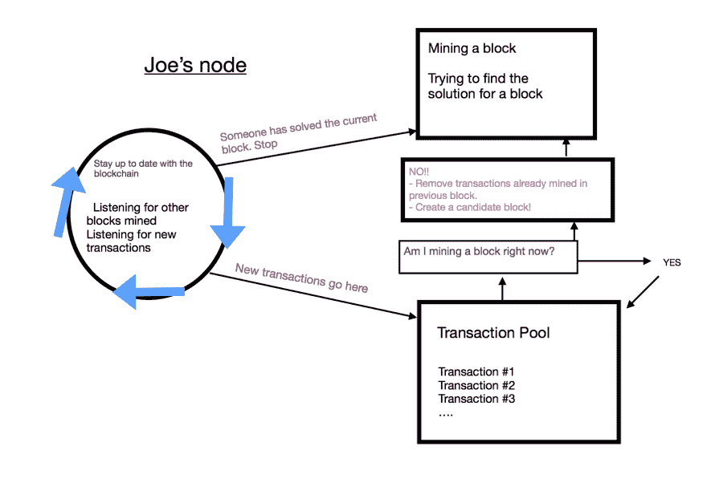
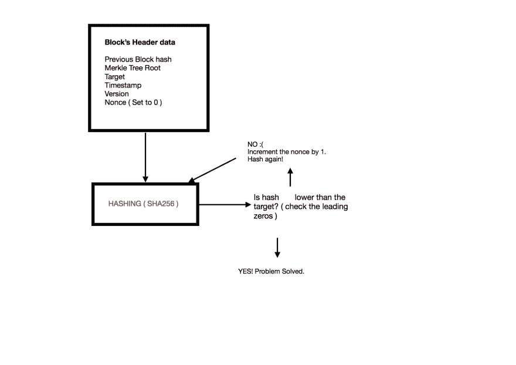

# 区块链:什么是挖矿？

> 原文：<https://dev.to/damcosset/blockchain-what-is-mining-2eod>

## 一些澄清

开矿的目的大概一开始有点混乱。在整篇文章中，我将把比特币区块链作为一个例子。采矿不是创造新的比特币。采矿是让区块链成为一个去中心化安全的机制。它保护了比特币系统的安全，并支持一个没有中央权威的系统。不要把给矿工的奖励(新比特币)和过程本身混为一谈。

## 挖掘比特币

矿工验证新的交易，并将其记录在全球分类账(区块链)。平均来说，每 10 分钟*挖掘*一个块(包含事务的结构)。矿工们竞相解决一个基于加密哈希算法的数学难题。找到的解决方案被称为*工作证明*。这个证明证明了一个矿工确实花了很多时间和资源来解决这个问题。当一个区块被“解决”时，包含的交易被视为*确认*，交易中涉及的比特币可以被消费。因此，如果你的钱包收到一些比特币，大约需要 10 分钟来确认你的交易。

当矿工们解决了复杂的数学问题时，他们会得到一份奖励。奖励有两种:新比特币或交易费。比特币的创造量每 4 年减少一次(准确地说是每 210，000 块)。今天，一个新创建的块创造了 12.5 个比特币。这个数字会一直往下，直到不再发行比特币。这将发生在 2140 年左右，届时将有大约 2100 万个比特币被创造出来。在这个日期之后，将不再发行比特币。

矿工也可以获得交易费形式的奖励。获胜的矿工可以在区块交易中“保留零钱”。随着每个区块创造的比特币数量减少，矿工收到的交易费将增加。2140 年后，获胜的矿工只会收到交易费作为他的奖励。

[T2】](https://res.cloudinary.com/practicaldev/image/fetch/s--omYjIpvh--/c_limit%2Cf_auto%2Cfl_progressive%2Cq_auto%2Cw_880/https://thepracticaldev.s3.amazonaws.com/i/m7p9fx3ctrrc74qwoncj.jpg)

每块发行的比特币数量除以每 210 000 块 2。所以我们可以用一些代码计算出比特币的最大金额。

```
 // First 210 000 blocks reward
const start_reward = 50

// The reward is modified every 210000 blocks
const reward_interval = 210000

const max_btc = () => {
  // 50 BTC = 5000000000 Satoshis
  // Satoshis are the smallest denomination in bitcoin
  let current_reward = 50 * 10 ** 8
  let total_btc = 0
  while( current_reward > 0 ){
    total_btc += reward_interval * current_reward
    current_reward = current_reward / 2
  }

  return total_btc
}

console.log(`The maximum amount of BTC created will be ${max_btc()} Satoshis, or ${max_btc() / 10**8} BTC`)
// The maximum amount of BTC created will be 2100000000000000 Satoshis, or 21000000 BTC 
```

Enter fullscreen mode Exit fullscreen mode

所以，是的，2100 万可能是比特币最终发行的最大数量！

## 总之，它是如何工作的？

问题是，在不信任网络中任何人的情况下，网络中的每个人如何就比特币所有权的普遍“真相”达成一致？区块链不是由任何中央权力机构创建或管理的。每个节点都可以访问作为权威记录的公共交易分类账。不知何故，网络中的每个节点，根据这些不安全的信息，得出相同的结论，并能够复制相同的账本。让我们尝试探索这是如何工作的。

如果我们举一个现实生活中的例子，可能会有所帮助。遇到阻碍 [#502426](https://blockchain.info/en/block/00000000000000000020c60222099aaebc6e7795784f74628ec640b223d3d339) 。我们将跟踪这个模块从构建到最终验证的生命周期。假设获胜的矿工叫乔。

### 前一个街区

在比特币的世界里，验证一个新的区块大约需要 10 分钟。我们的矿工乔正在竞争验证前一个区块 *502425* 。不幸的是，有人在他之前解决了这个问题。但是，一个街区竞争的结束意味着一个新的开始。一旦区块 502425 被开采，Joe 更新他的区块链的本地副本并开始创建一个*候选区块*，区块 502426。当乔的计算机(或*节点*)正在搜索前一个块的*工作证明*时，它也在监听新的事务。这些新事务被添加到*内存池*或*事务池*。这是事务等待的地方，直到它们可以被包括在新的块中并被验证。

### 创建候选块

当 Joe 的节点被通知当前块具有有效的工作证明时，它开始通过收集事务池中的事务来构建候选块。它会删除前一个块中已经存在的事务(如果有)。该区块被称为候选区块，因为它还没有有效的工作证明。

因此，我们可以看到块#502426 中有 3189 个事务。这是 Joe 创建候选块时事务池中存在的事务数量。

[T2】](https://res.cloudinary.com/practicaldev/image/fetch/s--VZraazvO--/c_limit%2Cf_auto%2Cfl_progressive%2Cq_auto%2Cw_880/https://thepracticaldev.s3.amazonaws.com/i/rwvlihren0yqfgiqh0gw.jpg)

#### 比特币基地事务

Joe 的节点做的第一件事是创建 *coinbase 事务*。很简单，这是他开采区块的报酬。此交易说= > *支付乔的钱包地址 xxx BTC，奖励他找到有效的工作证明*。这笔交易与其他交易不同，因为正如我之前解释的那样，奖励中的比特币是从无到有的。它们不是来自某人的钱包。乔的节点还计算块中的交易费用。

*乔的奖励=采矿块奖励+交易费*

在这种情况下，我们可以看到块奖励是 12.5 BTC(左栏中的*块奖励)，交易费等于 4.86507997 BTC(左栏*中的*交易费)。*

12.5+4.86507997 = 17.36507997 BTC

您可以在下面的列表中看到该交易的详细信息。

[T2】](https://res.cloudinary.com/practicaldev/image/fetch/s--6Ilo-czE--/c_limit%2Cf_auto%2Cfl_progressive%2Cq_auto%2Cw_880/https://thepracticaldev.s3.amazonaws.com/i/2y6fzv5xk2ocpekaevj6.png)

可以看到*没有输入(新生成的硬币)*。就像我说的，coinbase 交易不是来自任何人的钱包，所以它们不能有任何输入。你这里只有中奖矿工的钱包地址。

### 构造块头

在之前的一篇文章中，我描述了包含在 [a 块](https://dev.to/damcosset/blockchain-what-is-in-a-block-48jo)中的内容。Joe 的节点负责为他正在挖掘的块创建适当的块头。在[的文章](https://dev.to/damcosset/blockchain-what-is-in-a-block-48jo)中，我主要关注 merkle 树，这是一个事务摘要，并提到在块头中有三组不同的数据:以前的块散列、merkle 树根和挖掘竞争的数据。我们将在最后一个中深入探讨。

#### 数据字段

此元数据集包含:

*   版本:这是跟踪软件和/或协议升级的版本号。
*   时间戳:从 Unix 纪元开始的秒数。创建块的时间。
*   目标:该块的工作算法目标的证明
*   Nonce:用于工作证明算法的计数器

当#502426 区块被开采时，版本号是 2。当转换成 4 字节的小端格式时，它变成了 *0x20000000* 。(*版左栏*)

接下来，我们得到 4 字节的时间戳。这是自 1970 年 1 月 1 日以来经过的秒数。我们看到这个区块的时间戳是 *2018-01-03 21:12:39* (左栏中的*时间戳)。如果我们用秒来换算，我们得到 *1515013959* 秒。*

目标字段定义了使其成为有效区块所需的工作证明。简而言之，目标是由网络生成的，它定义了是什么使块的散列有效或无效。如果你的散列值高于目标值，那么它就是无效的。这是用来计算*难度*的。在我们街区，难度是*1931136454487.72*。看一下这个块的散列:

*000000000000000000020 c 60222099 aa ebc 6 e 7795784 f 74628 EC 640 b 223d 339*

有 18 个前导零。这是我们的困难。每一个少于 18 个前导零的散列都是无效的(每一个少于 17 个前导零的散列都低于所需的目标)。

最后一个字段是随机数。它被初始化为零。

现在一切都准备好了，乔的节点开采区块。目标是为 nonce 找到一个值，该值将导致散列值低于目标值。因此，挖掘节点将在获得有效哈希之前尝试数十亿或数万亿个 nonce 值。

## 采矿

在一张图中，挖掘是:

[T2】](https://res.cloudinary.com/practicaldev/image/fetch/s--GNqcAqzL--/c_limit%2Cf_auto%2Cfl_progressive%2Cq_auto%2Cw_880/https://thepracticaldev.s3.amazonaws.com/i/q63cjkwbd8ktp3l1ogvj.jpg)

如你所见，采矿就像彩票一样。没有办法预测哪个随机数将解决这个问题。

在[以前的文章](https://dev.to/damcosset/trying-to-understand-blockchain-by-making-one-ce4)中，我实现了一个简单的区块链，演示了 nonce 的概念以及它如何改变创建的散列。

以比特币为例，使用的哈希函数被称为 SHA256。给定相同的输入，散列算法总是产生相同的任意长度的数据。不可能用两个不同的输入计算相同的散列(冲突)。也不可能预先预测任何给定数据的输出。

SHA256 总是产生 256 位长的输出。挖掘就是找到 *nonce* ，这是我们每次运行哈希函数时唯一改变的输入。很容易证明所发现的随机数确实产生了有效的散列。所有的信息都是可用的，每个人都可以运行哈希函数并确认哈希是否有效。因为也不可能预测 nonce 将会是什么，所以它还充当了挖掘器工作以获得有效散列的证明(因此= > *工作证明*)。

### 调整目标

在比特币中，每 10 分钟左右就有一个区块被挖掘出来。难度是经过计算的，所以不会偏离这个极限太多。如果难度长期保持不变，而计算机能力增加，开采一个区块的时间会越来越少。为了确保这种情况不会发生，工作证明目标是一个动态参数。在比特币的世界里，目标是每 2016 块调整一次。然后，我们检查挖掘这 2016 个区块所花费的时间。应该用了 20160 分钟(2016 * 10 分钟)。难度的增加或减少取决于开采这些区块所花费的时间。

## 成功！！

Joe 的节点开始工作，并开始散列块的头。大约 10 分钟后，它会发现一个有效的散列。我们可以看到使用的随机数是 2469953656(左列中的*随机数)。*

Joe 的节点立即将该块传输给所有对等节点。他们需要在将新数据块传播给对等方之前对其进行验证。这是一个不诚实的矿工可以被发现的地方。如果数据无效，矿工就会浪费时间和计算能力。有效数据包括:

*   块头哈希小于目标值
*   块大小在可接受的范围内
*   块时间戳小于未来两小时。
*   第一个事务是 coinbase 事务(也是唯一的第一个)
*   coinbase 交易具有有效的奖励。
*   区块内的所有交易都是有效的(也有自己的核对表)

每个节点遵循完全相同的规则独立验证新块。这保证了矿工不能作弊。这是分散共识的关键组成部分。

如果该块是有效的，则其他开采者将用新的块 502246 来更新他们自己的区块链副本。乔的区块散列现在被所有矿工用来开采区块 502247。