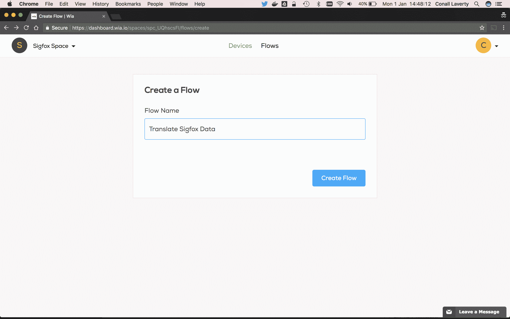
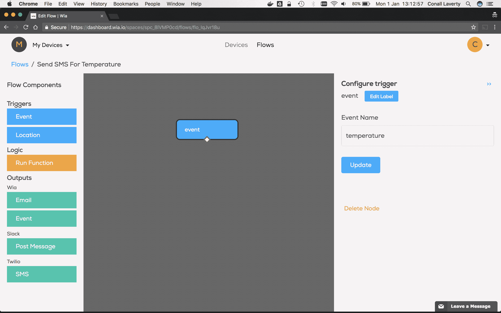
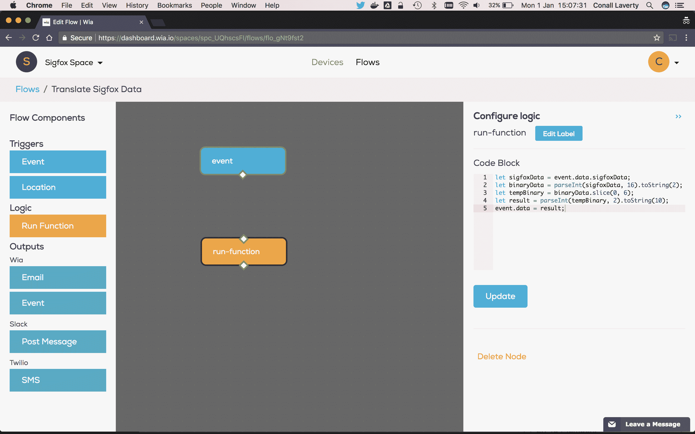
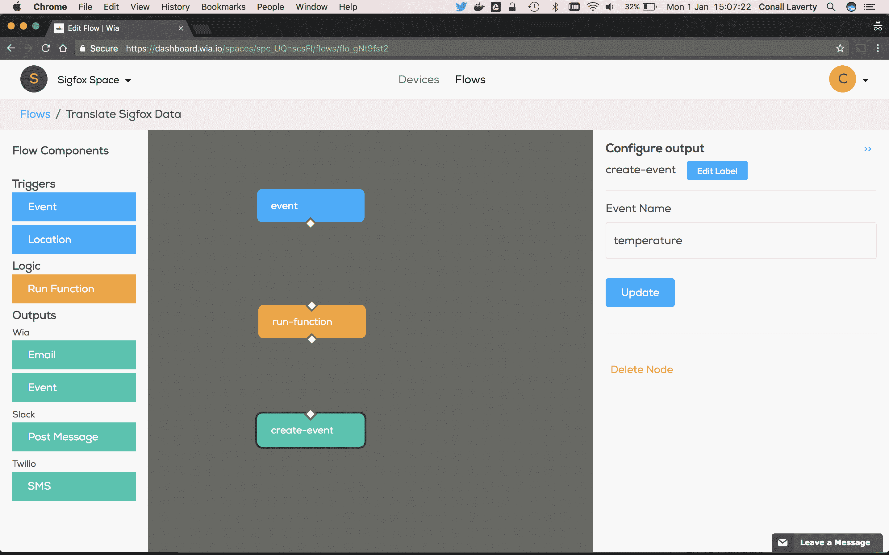
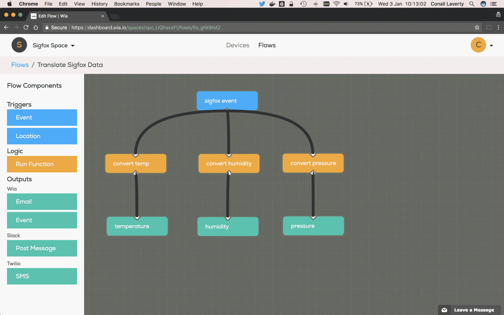

# 使用 Wia 理解 Sigfox 数据

> 原文:[https://dev . to/conalllaverty/make-sense-of-your-SIG fox-data-using-wia-2jb 8](https://dev.to/conalllaverty/make-sense-of-your-sigfox-data-using-wia-2jb8)

嗨，大家好，
今天我们将看看如何将 Sigfox 数据转换成人类可读的形式，以便在应用程序中轻松使用。在我们开始之前，先看一下[如何将任何 Sigfox 设备与 Wia 集成](https://blog.wia.io/how-to-integrate-any-sigfox-device-with-wia)教程，让您的设备连接到 Wia。

对于本教程，我的事件数据将包含十六进制字符串`aabbccdd`。我们将展示如何将其转换为二进制，取前 6 位作为我们的温度读数，并创建一个新事件。

### 创建一个流

*   转到`Flows`并点击`Create Flow`。
*   输入您的`Flow`的名称。我要叫我的`Translate Sigfox Data`。
*   然后，您将被重定向到 Flow Studio。

[T2】](//images.contentful.com/i5evrz7h2uo7/3gIRuDg17ayQUIa6gkOSIY/5e74ca322cea61a7b41b0716b7256a46/Screen_Shot_2018-01-01_at_14.48.11.png)

### 添加一个触发节点

*   在 Flow Studio 中，从左侧面板中拖动事件触发器节点。
*   选择节点，在右侧面板中输入`sigfoxDataUplink`作为事件名称，点击`Update`。

[T2】](//images.contentful.com/i5evrz7h2uo7/4Ytayplm4E2AWAmKYmkyic/d628ec1f07899fb9d158b70a442f0acc/Screen_Shot_2018-01-01_at_13.12.56.png)

### 添加一个逻辑节点

*   从左侧面板拖动一个`Run Function`逻辑节点。该节点允许您注入自己的 Javascript 并操作流经的数据。
*   将下面的代码复制到`Code Block`中，然后点击`Update`。

```
let sigfoxData = event.data.sigfoxData;
let binaryData = parseInt(sigfoxData, 16).toString(2);
let tempBinary = binaryData.slice(0, 6);
let result = parseInt(tempBinary, 2).toString(10);
event.data = result; 
```

<svg width="20px" height="20px" viewBox="0 0 24 24" class="highlight-action crayons-icon highlight-action--fullscreen-on"><title>Enter fullscreen mode</title></svg> <svg width="20px" height="20px" viewBox="0 0 24 24" class="highlight-action crayons-icon highlight-action--fullscreen-off"><title>Exit fullscreen mode</title></svg>

[T2】](//images.contentful.com/i5evrz7h2uo7/1P82GawV6wIMO8Ss8OUeUM/dda1ea3b3369bd01b61ed186a15697dd/Screen_Shot_2018-01-01_at_15.07.29.png)

### 添加一个输出节点

*   从左侧面板中拖动一个`Event`输出节点。
*   输入`temperature`作为事件的名称。

[T2】](//images.contentful.com/i5evrz7h2uo7/18ntUPD9IUSWoOgoOUsMMw/b8ad1506d4b91092aa1818ab2e3230f0/Screen_Shot_2018-01-01_at_15.07.21.png)

### 连接节点

*   单击事件节点底部的白色菱形，并将该线拖动到逻辑节点的输入端。
*   单击逻辑节点底部的白色菱形，并将该线拖动到输出节点的输入端。

[T2】](//images.contentful.com/i5evrz7h2uo7/74yWEqqklacqyQMmQKcaEQ/224b7e48b36f469be0cb49a1e461f14b/Screen_Shot_2018-01-01_at_15.07.48.png)

### 向您的设备添加流量

*   转到`Devices`并选择您想要添加流量的设备。
*   点击子菜单中的`Flows`，然后点击流程名称旁边的`Enable`。

### 运行流量

从设备发布一个事件，您将看到新的`temperature`事件通过。

### (可选)在同一个流中创建多个事件

如果您希望创建多个事件，只需对其他数据点执行前面的步骤。

[T2】](//images.contentful.com/i5evrz7h2uo7/3RIBfJoBS82IsCYyWacq46/77a636a32f3a5cd6d14b334b833e4091/Screen_Shot_2018-01-03_at_10.12.58.png)

那都是乡亲们！

附言:如果您在设置方面需要任何帮助，[发微博给我们](https://twitter.com/wiaio)或发电子邮件给 [support@wia.io](//mailto:support@wia.io)

*参考资料*

[Sigfox](https://www.sigfox.com) 是一家成立于 2009 年的法国物联网(IoT)公司，该公司建立无线网络以连接电表、智能手表和洗衣机等低能耗窄带对象，这些对象需要持续开启并发射少量数据。