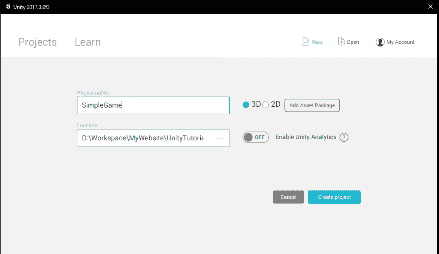
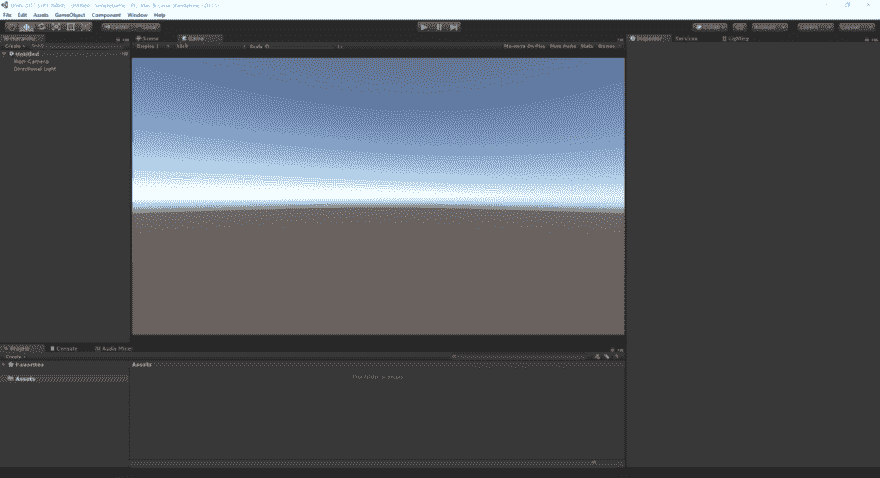
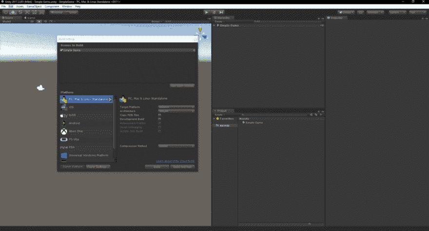
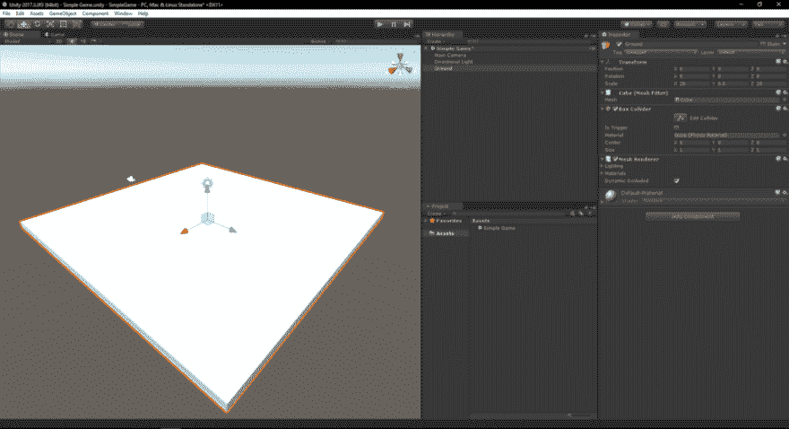
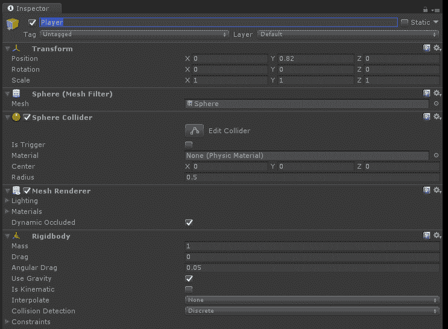
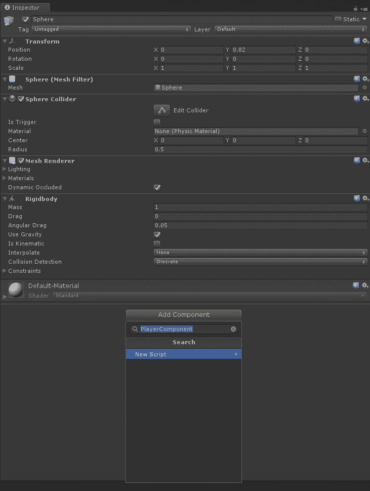
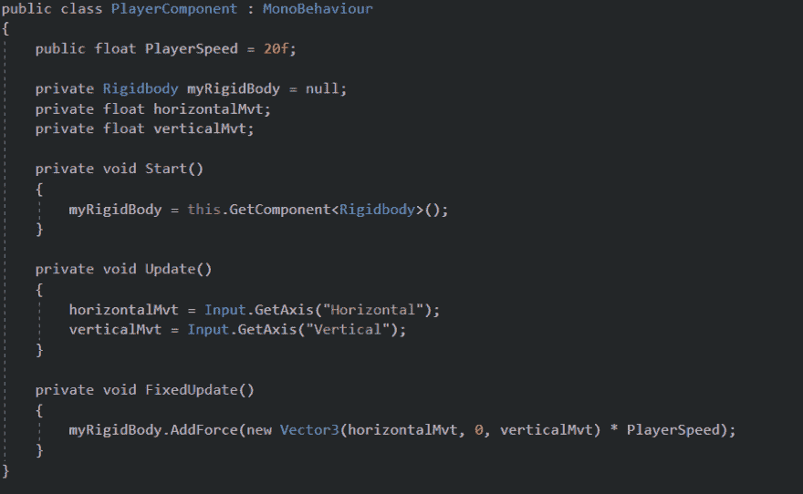
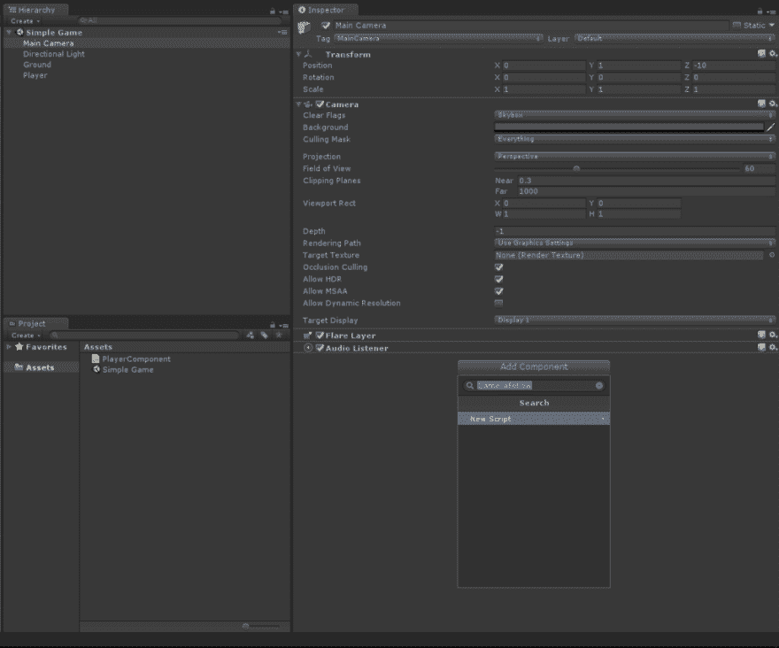
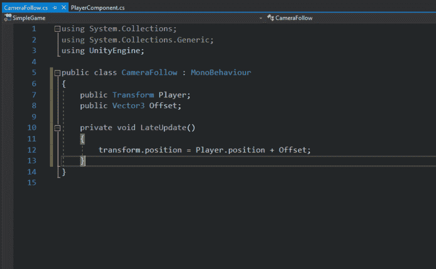
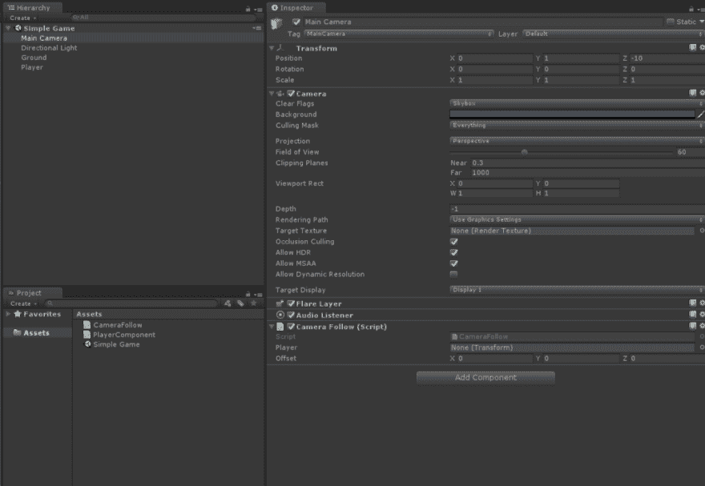

# 如何用 Unity3D 创建一个基础游戏！

> 原文：<https://dev.to/ghayoub/how-to-create-a-basic-game-with-unity3d-4cj4>

如果你不知道 Unity3D，那么这是一个允许你制作游戏的免费软件，它功能强大，易于操作。

这篇文章是给那些想通过 Unity3D 学习一点游戏开发的初学者的，我们将使用 C#和 Visual Studio 来编写代码，说够了让我们开始吧！

[T2】](https://res.cloudinary.com/practicaldev/image/fetch/s--8l7vN-oU--/c_limit%2Cf_auto%2Cfl_progressive%2Cq_auto%2Cw_880/http://ayoub-gharbi.org/blog/wp-content/uploads/2017/12/00.png)

打开 Unity3d

如果您是第一次，请创建一个帐户(允许您使用 Unity3d 功能，如 Unity Collaboration 或从 Unity asset store 下载资源..)

之后，命名你的游戏(我命名为“简单游戏”)，检查 3D，切换你的项目位置，如果你想点击创建项目！

[T2】](https://res.cloudinary.com/practicaldev/image/fetch/s--WsTlVlgD--/c_limit%2Cf_auto%2Cfl_progressive%2Cq_auto%2Cw_880/http://ayoub-gharbi.org/blog/wp-content/uploads/2017/12/01-1024x556.png)

几秒钟后，你将打开你的项目，你可以通过拖放任何窗口自定义默认布局，或者你可以去右上角有一个名为布局的选择按钮，并将其切换到最适合你的一个，我喜欢高布局，因为它给场景和游戏窗口更多的空间，但你可以选择任何你喜欢的 [](https://res.cloudinary.com/practicaldev/image/fetch/s--nMCPmMVW--/c_limit%2Cf_auto%2Cfl_progressive%2Cq_auto%2Cw_880/https://s.w.oimg/core/emoji/2.4/72x72/1f642.png)

我们现在需要做的第一件事是保存/创建一个场景，如果你注意到在层次选项卡中有一个未命名的对象，那就是我们的场景！但是我们需要通过点击文件保存它->场景另存为，给它起一个好名字，也许是“简单游戏” [](https://res.cloudinary.com/practicaldev/image/fetch/s--ROERhfb2--/c_limit%2Cf_auto%2Cfl_progressive%2Cq_auto%2Cw_880/https://s.w.oimg/core/emoji/2.4/72x72/1f609.png)

[T2】](https://res.cloudinary.com/practicaldev/image/fetch/s--PF1bwvCi--/c_limit%2Cf_auto%2Cfl_progressive%2Cq_auto%2Cw_880/http://ayoub-gharbi.org/blog/wp-content/uploads/2017/12/02-1024x553.png)

我们需要将我们最近创建的场景添加到构建设置中，这样当我们导出我们的游戏时，我们将在构建中包含它！

转到文件->构建设置；您可以将场景拖到空的“构建中的场景”窗口，或者您可以只单击添加打开的场景。

另一种方法是将场景拖到“构建场景”窗口中。

[T2】](https://res.cloudinary.com/practicaldev/image/fetch/s--UmN1fuOm--/c_limit%2Cf_auto%2Cfl_progressive%2Cq_auto%2Cw_880/http://ayoub-gharbi.org/blog/wp-content/uploads/2017/12/03-1024x556.png)

我们将创造一个我们的角色玩耍的地方。为了做到这一点，点击游戏对象->三维对象->立方体。

你会在场景中得到一个漂亮的立方体(是不是很酷？ [](https://res.cloudinary.com/practicaldev/image/fetch/s--nMCPmMVW--/c_limit%2Cf_auto%2Cfl_progressive%2Cq_auto%2Cw_880/https://s.w.oimg/core/emoji/2.4/72x72/1f642.png) )现在在检查器中尝试修改那个立方体的比例 X : 20，Y : 0.5 和 Z : 20。

确保缩放立方体的位置为 0，0，0。

[T2】](https://res.cloudinary.com/practicaldev/image/fetch/s--YcRapFsR--/c_limit%2Cf_auto%2Cfl_progressive%2Cq_auto%2Cw_880/http://ayoub-gharbi.org/blog/wp-content/uploads/2017/12/04-1024x555.png)

现在我们将添加我们的角色/玩家，同样的游戏对象-> 3D 对象->这一次我们将使用球体。

在检查器中，尝试将球体的位置更改为 X: 0，Y: 0.82，Z : 0。

现在我们需要给我们的角色添加物理元素，这样我们就可以在以后移动它。要做到这一点，选择层次中的球体，你可以在检查器中看到“添加组件”按钮，单击并搜索刚体，然后按 Enter 键！

请注意，我们在创建的立方体和球体中都有碰撞器组件，这些碰撞器将允许不同对象之间的物理交互。

[T2】](https://res.cloudinary.com/practicaldev/image/fetch/s--s902Ovxq--/c_limit%2Cf_auto%2Cfl_progressive%2Cq_auto%2Cw_880/http://ayoub-gharbi.org/blog/wp-content/uploads/2018/01/05.png)

在跳到代码部分之前，还有一件事要做，选择我们创建的球体，在检查器中将其命名为“Player”。

[T2】](https://res.cloudinary.com/practicaldev/image/fetch/s--8ujb8ntE--/c_limit%2Cf_auto%2Cfl_progressive%2Cq_auto%2Cw_880/http://ayoub-gharbi.org/blog/wp-content/uploads/2018/01/06.png)

在场景中选择播放器，进入检查器窗口，点击“添加组件”这一次你会计时播放器组件在搜索栏中，你会看到新的脚本弹出作为结果，点击输入，然后点击“创建和添加”。

现在我们有一个脚本附加到我们的播放器！双击脚本组件将其打开。

[T2】](https://res.cloudinary.com/practicaldev/image/fetch/s--0mLx0FOQ--/c_limit%2Cf_auto%2Cfl_progressive%2Cq_auto%2Cw_880/http://ayoub-gharbi.org/blog/wp-content/uploads/2018/01/07-1.png)

这差不多是我们球员的动作脚本。好了，让我们来看看我们写了什么:

```
public float PlayerSpeed = 20f;

private RigidBody myRigidBody = null;

private float horizontalMvt;

private float verticalMvt; 
```

Enter fullscreen mode Exit fullscreen mode

这定义了播放器的速度，使用“public”关键字，我们可以在检查器中看到这个变量，这样我们可以在以后调整这个值。

第二个是缓存这个游戏对象的刚体，这样我们以后可以使用它。

需要另外两个变量来存储玩家的水平和垂直运动！

```
horizontalMvt = Input.GetAxis("Horizontal");

verticalMvt = Input.GetAxis("Vertical"); 
```

Enter fullscreen mode Exit fullscreen mode

这两条线允许我们得到范围为-1 -> 1 的值(水平表示左右移动，垂直表示上下移动)。

为了避免输入丢失，我们需要在“更新”方法而不是“固定更新”方法中执行上述操作，以确保每帧只调用一次。

```
myRigidBody .AddForce(new Vector3(horizontalMvt, 0, verticalMvt) \* PlayerSpeed ); 
```

Enter fullscreen mode Exit fullscreen mode

这一行允许我们得到我们之前定义的刚体，并给我们的玩家增加力量，定义一个新的向量，包含之前定义的移动变量乘以我们稍后可以从检查员那里处理的速度。

现在单击屏幕中间上方的播放按钮，结果应该是这样的:

[http://ayoub-ghar bi . org/blog/WP-content/uploads/2018/01/00 . MP4](http://ayoub-gharbi.org/blog/wp-content/uploads/2018/01/00.mp4)

让我们添加一个允许摄像机跟随玩家的脚本:

[T2】](https://res.cloudinary.com/practicaldev/image/fetch/s--qwXYSPYP--/c_limit%2Cf_auto%2Cfl_progressive%2Cq_auto%2Cw_880/http://ayoub-gharbi.org/blog/wp-content/uploads/2018/01/08-1024x852.png)

确保相机被选中，并在检查器中添加组件，将其命名为 CameraFollow 双击脚本将其打开:

[](https://res.cloudinary.com/practicaldev/image/fetch/s--axMPI5sh--/c_limit%2Cf_auto%2Cfl_progressive%2Cq_auto%2Cw_880/http://ayoub-gharbi.org/blog/wp-content/uploads/2018/01/09.png)T3】

```
public Transform Player; 
```

Enter fullscreen mode Exit fullscreen mode

首先要做的是确保你有一个我们想要关注的玩家的参考(我们稍后将从检查员那里参考)。

```
public Vector3 Offset; 
```

Enter fullscreen mode Exit fullscreen mode

接下来，我们需要有一个 Vector3，我们将根据检查员的需要进行调整。

```
private void LateUpdate() { transform.position = Player.position + Offset; } 
```

Enter fullscreen mode Exit fullscreen mode

这个块允许摄像机以一定的偏移量跟随球员，所以我们可以在屏幕上看到它，否则他们会在相同的位置。

回到 Unity3d，您应该在检查器中看到类似这样的内容:

[T2】](https://res.cloudinary.com/practicaldev/image/fetch/s--AtsZs5w8--/c_limit%2Cf_auto%2Cfl_progressive%2Cq_auto%2Cw_880/http://ayoub-gharbi.org/blog/wp-content/uploads/2018/01/10-1024x706.png)

[T2】](https://res.cloudinary.com/practicaldev/image/fetch/s--gjA1RSqr--/c_limit%2Cf_auto%2Cfl_progressive%2Cq_auto%2Cw_880/http://ayoub-gharbi.org/blog/wp-content/uploads/2018/01/11-1.png)

尝试将我们的播放器拖放到 CameraFollow 脚本的播放器字段中。

将偏移更改为 X: 0，Y: 5，Z: -18。

点击播放并尝试！

[http://ayoub-ghar bi . org/blog/WP-content/uploads/2018/01/01 . MP4](http://ayoub-gharbi.org/blog/wp-content/uploads/2018/01/01.mp4)