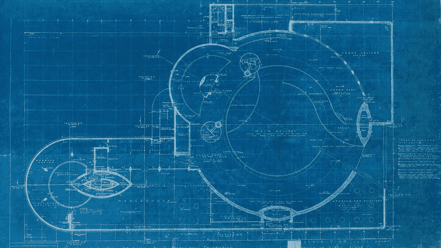
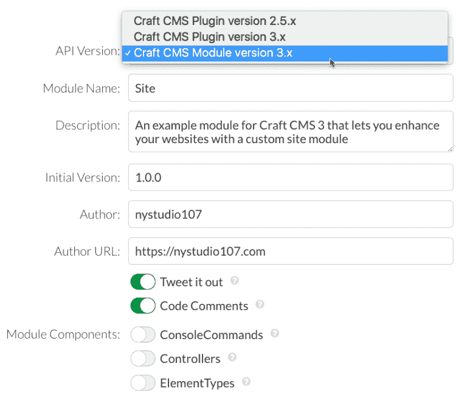

# 用自定义模块增强一个手工 CMS 3 网站

> 原文:[https://dev . to/gaijinity/enhancing-a-craft-CMS-3-website-with-a-custom-module-7k 7](https://dev.to/gaijinity/enhancing-a-craft-cms-3-website-with-a-custom-module-7k7)

# 使用自定义模块增强 Craft CMS 3 网站

### 用一个模块增强您客户的 Craft CMS 3 网站，让您无需使用或编写插件就能添加定制功能

安德鲁·韦尔奇

[T2】](https://res.cloudinary.com/practicaldev/image/fetch/s--6ECLjpjm--/c_limit%2Cf_auto%2Cfl_progressive%2Cq_auto%2Cw_880/https://nystudio107-ems2qegf7x6qiqq.netdna-ssl.com/img/blog/_1200x675_crop_center-center_82_line/craft-cms-3-yii2-custom-module.jpg)

有时你想用一些功能或设计来增强一个客户网站，这些功能或设计对那个网站来说是非常特殊的。当然，您可以通过从[插件工厂进行扫描折叠，使用客户插件来完成这项工作。io](https://pluginfactory.io/) 跟着[走，所以你想做一个飞行器 3 Plu g in？](https://dev.to/gaijinity/so-you-wanna-make-a-craft-3-plugin-76m-temp-slug-4321262)文章。

然而，对许多事情来说，这似乎是太多的工作。也许您只是想增强登录屏幕的外观，以应用带有 clien t 品牌的背景图像。一个顾客似乎有点多。

在 Craft CMS 3 中，Craft 引入了一个模块的概念，它完全适合这种类型的场景。

## 模块与插件

模块和插件之间的主要区别是:

*   plug in 可以被禁用
*   插件可以卸载
*   Plu g ins 有一个用于在 AdminCP 中进行设置的框架

除此之外，它们非常相似。模块和插件都是用 PHP 编写的，可以访问完整的 Craft CMS APIs。

请注意，您*也可以*在一个模块中进行设置和管理，但是您必须通过列出适当的事件、添加适当的路线等来“创建您自己的”模块。

<aside>Mod­ules are a per­fect fit when the func­tion­al­i­ty is an inte­gral part of the website</aside>

即使您不认为自己是一个“PHP 开发人员”，也很容易获得一个简单的模块并运行，它将在 Craft AdminCP 中加载一些定制的 CSS 或 JavaScript，从而增强您的客户端体验。

在本文中，我们将向您详细展示如何做到这一点。

## 引擎盖下的模块

考虑模块的一个好方法是，它们是不能被卸载的插件。它们在易于实现和提供插件功能之间取得了很好的平衡。

[T2】](https://res.cloudinary.com/practicaldev/image/fetch/s--EQyk9FUi--/c_limit%2Cf_auto%2Cfl_progressive%2Cq_auto%2Cw_880/https://nystudio107-ems2qegf7x6qiqq.netdna-ssl.com/img/blog/_1200x675_crop_center-center_82_line/module-plugin-balance.jpg)

虽然把模块分解成插件很诱人，但事实是插件实际上是建立在模块之上的！

<aside>So we should real­ly be think­ing of Plu­g­ins as enhanced Modules</aside>

看一下`craft\base\Plugin` :
的代码

```
 /**
 * Plugin is the base class for classes representing plugins in terms of objects.
 *
 * @property string $handle The plugin’s handle (alias of [[id]])
 * @property MigrationManager $migrator The plugin’s migration manager
 *
 * @author Pixel & Tonic, Inc. <support@pixelandtonic.com>
 * @since 3.0
 */
class Plugin extends Module implements PluginInterface
{
... 
```

这表明 Craft CMS 3 Plu g ins 实际上是 Yii2 模块，但只是添加了一些由像素&Ton IC 增强的功能。这些增强功能允许插件进行安装、设置和管理等。

请注意，您*也可以*在一个模块中进行设置和管理，但是您必须通过列出适当的事件、添加适当的路线等来“创建您自己的”模块。

这遵循了在[建立一个新的 Craft CMS 3 项目](https://dev.to/gaijinity/setting-up-a-new-craft-cms-3-project-nfp-temp-slug-9254661)文章中讨论的一个主题，即 Craft CMS 3 已经在[yi 2](http://www.yiiframework.com/doc-2.0/guide-intro-yii.html)之上完全重构。

<aside>Craft CMS 3 is now both a Con­tent Man­age­ment Sys­tem (CMS) and a Con­tent Man­age­ment Frame­work (CMF)</aside>

这是很重要的一点，因为许多通常使用 Lar avel 这样的框架构建的定制应用程序可以使用 Craft CMS 3 来构建。查看 Craft 3 的 [REST ful API，获取一个这样做的例子！](https://dotall.flipboxlabs.com/)

[T2】](https://res.cloudinary.com/practicaldev/image/fetch/s--kyppH-7O--/c_limit%2Cf_auto%2Cfl_progressive%2Cq_auto%2Cw_880/https://nystudio107-ems2qegf7x6qiqq.netdna-ssl.com/img/blog/_1200x675_crop_center-center_82_line/craft-cms-3-content-management-framework.jpg)

这意味着我们将会看到 Craft CMS 3 被用作一个框架&为那些想要一个免费的 CMS 后端的网络应用提供基础。但是我跑题了…

本文的其余部分将详细讨论定制模块，但是您可以在[插件工厂中创建自己的定制模块。io](https://pluginfactory.io/) 也是:

[T2】](https://res.cloudinary.com/practicaldev/image/fetch/s--9EyyC8AL--/c_limit%2Cf_auto%2Cfl_progressive%2Cq_auto%2Cw_880/https://nystudio107-ems2qegf7x6qiqq.netdna-ssl.com/img/blog/_768x652_crop_center-center_100_line/pluginfactory-io-custom-modules.png)

## 设置一个站点模块

因此，让我们来谈谈为我们的工艺网站建立一个实际的网站模块。这里列出的所有代码都可以在[站点模块](https://github.com/nystudio107/site-module) GitHub repo 中找到，如果你想下载的话。

我们的站点模块所做的只是加载一个[资产包](https://github.com/craftcms/docs/blob/v3/en/asset-bundles.md)，其中包含我们希望在 AdminCP 中加载的 CSS 和 JavaScript。

这允许你做一些事情，比如在登录屏幕上有一个客户品牌背景图像，或者通过 CSS 和 JavaScript 调整你认为合适的管理的外观和功能。

[T2】](https://res.cloudinary.com/practicaldev/image/fetch/s--hUjMbTDs--/c_limit%2Cf_auto%2Cfl_progressive%2Cq_auto%2Cw_880/https://nystudio107-ems2qegf7x6qiqq.netdna-ssl.com/img/blog/_1200x675_crop_center-center_82_line/craft-asset-bundles.jpg)

模块能做的远不止这些，事实上它们能做插件能做的任何事情。但是这个基础允许一个前沿的开发人员增强他们客户的网站，而不需要了解这个模块如何工作的细节。

你会发现，如果你用`composer create-project -s RC craftcms/craft PATH`命令[像素&吨集成电路建议](https://github.com/craftcms/docs/blob/master/en/installation.md#2-create-a-new-craft-project)创建你的新项目，他们甚至已经为你提供了一个样本`config/app.php`和`modules/Module.php`。我们对此做了一些调整，所以让我们开始吧！

下面是项目树的样子；同样，你可以从[站点模块](https://github.com/nystudio107/site-module) GitHub 页面:
下载完整的源代码

```
 vagrant@homestead ~/webdev/craft/site-module (develop) $ tree -L 8 .
.
├── CHANGELOG.md
├── composer.json
├── config
│   └── app.php
├── LICENSE.md
├── modules
│   └── sitemodule
│   ├── CHANGELOG.md
│   ├── config
│   │   └── app.php
│   ├── LICENSE.md
│   ├── README.md
│   └── src
│   ├── assetbundles
│   │   └── sitemodule
│   │   ├── dist
│   │   │   ├── css
│   │   │   │   └── SiteModule.css
│   │   │   ├── img
│   │   │   │   └── SiteModule-icon.svg
│   │   │   └── js
│   │   │   └── SiteModule.js
│   │   └── SiteModuleAsset.php
│   ├── SiteModule.php
│   └── translations
│   └── en
│   └── site-module.php
└── README.md

13 directories, 15 files 
```

如果它看起来很复杂，不要担心。那里的组织文件夹实际上比文件还多！它主要有三个部分:

1.  手艺的`config/app.php`
2.  `modules/sitemodule/src/SiteModule.php`中的模块本身
3.  我们在`modules/sitemodule/src/assetbundles/SiteAsset.php`中加载的资产包

我们不需要用`sitemodule/src`来命名空间，但是我们需要一个文件夹来把我们的模块中包含的所有东西放在一起(`sitemodule`)，以防我们有其他的模块，并且把我们所有的源代码放在一个`src`子目录中也是一个不错的选择。

您可以轻松地删除这两个目录，并将所有内容放入目录本身。

让我们来详细看看这三个部分:

## 1。编辑 config/app.php

`config/`目录里有很多你熟悉的配置文件，比如`general.php`、`db.php`等。用于 Craft CMS 3 中的各种设置。但是它也可以有一个`app.php`图标文件。

这个`app.php`配置文件非常强大，因为它允许你*覆盖或扩展 Craft CMS 3 Yii2 app* 的任何部分。再读一遍，因为它很大。通过一个简单的配置文件，我们可以扩展 Craft CMS 3 的 Yii2 应用程序，或者我们可以完全取代 func tion al i ty。

我们只是尝试一下，给它添加一些代码，告诉它我们的新模块，并为我们加载它。

```
 <?php
/**
 * Yii Application Config
 *
 * Edit this file at your own risk!
 *
 * The array returned by this file will get merged with
 * vendor/craftcms/cms/src/config/app/main.php and [web|console].php, when
 * Craft's bootstrap script is defining the configuration for the entire
 * application.
 *
 * You can define custom modules and system components, and even override the
 * built-in system components.
 */

return [

    // All environments
    '*' => [
        'modules' => [
            'site-module' => [
                'class' => \modules\sitemodule\SiteModule::class,
            ],
        ],
        'bootstrap' => ['site-module'],
    ],

    // Live (production) environment
    'live' => [
    ],

    // Staging (pre-production) environment
    'staging' => [
    ],

    // Local (development) environment
    'local' => [
    ],
]; 
```

我们给 Craft 我们的模块的类，以及引用它的句柄`site`，然后我们告诉它通过`bootstrap`为每个请求加载它。

## 2。模块类

接下来我们在`modules/sitemodule/src/SiteModule.php`中有自己的模块类。这是每个请求实际加载和执行的内容:

```
 <?php
/**
 * Site module for Craft CMS 3.x
 *
 * An example module for Craft CMS 3 that lets you enhance your websites with a custom site module
 *
 * @link https://nystudio107.com/
 * @copyright Copyright (c) 2018 nystudio107
 */

namespace modules\sitemodule;

use modules\sitemodule\assetbundles\sitemodule\SiteModuleAsset;

use Craft;
use craft\events\RegisterTemplateRootsEvent;
use craft\events\TemplateEvent;
use craft\i18n\PhpMessageSource;
use craft\web\View;

use yii\base\Event;
use yii\base\InvalidConfigException;
use yii\base\Module;

/**
 * Class SiteModule
 *
 * @author nystudio107
 * @package SiteModule
 * @since 1.0.0
 *
 */
class SiteModule extends Module
{
    // Static Properties
    // =========================================================================

    /**
     * @var SiteModule
     */
    public static $instance;

    // Public Methods
    // =========================================================================

    /**
     * @inheritdoc
     */
    public function __construct($id, $parent = null, array $config = [])
    {
        Craft::setAlias('@modules/sitemodule', $this->getBasePath());
        $this->controllerNamespace = 'modules\sitemodule\controllers';

        // Translation category
        $i18n = Craft::$app->getI18n();
        /** @noinspection UnSafeIsSetOverArrayInspection */
        if (!isset($i18n->translations[$id]) && !isset($i18n->translations[$id.'*'])) {
            $i18n->translations[$id] = [
                'class' => PhpMessageSource::class,
                'sourceLanguage' => 'en-US',
                'basePath' => '@modules/sitemodule/translations',
                'forceTranslation' => true,
                'allowOverrides' => true,
            ];
        }

        // Base template directory
        Event::on(View::class, View::EVENT_REGISTER_CP_TEMPLATE_ROOTS, function (RegisterTemplateRootsEvent $e) {
            if (is_dir($baseDir = $this->getBasePath().DIRECTORY_SEPARATOR.'templates')) {
                $e->roots[$this->id] = $baseDir;
            }
        });

        // Set this as the global instance of this module class
        static::setInstance($this);

        parent::__construct($id, $parent, $config);
    }

    /**
     * @inheritdoc
     */
    public function init()
    {
        parent::init();
        self::$instance = $this;

        if (Craft::$app->getRequest()->getIsCpRequest()) {
            Event::on(
                View::class,
                View::EVENT_BEFORE_RENDER_TEMPLATE,
                function (TemplateEvent $event) {
                    try {
                        Craft::$app->getView()->registerAssetBundle(SiteModuleAsset::class);
                    } catch (InvalidConfigException $e) {
                        Craft::error(
                            'Error registering AssetBundle - '.$e->getMessage(),
                            __METHOD__
                        );
                    }
                }
            );
        }

        Craft::info(
            Craft::t(
                'site-module',
                '{name} module loaded',
                ['name' => 'Site']
            ),
            __METHOD__
        );
    }

    // Protected Methods
    // =========================================================================
} 
```

`__construct()`方法可能看起来有点吓人，但是我们只是为我们的模块目录设置了一个 Yii2 别名，这样我们以后就可以使用它，然后进行设置，这样我们的模块就可以进行翻译，也可以在管理中使用模板。

跳过这一步，看看`init()`方法。

在这里，我们检查以确保这是一个 AdminCP 请求(从不单独/命令行请求)，然后列出`EVENT_BEFORE_RENDER_TEMPLATE`事件。

这个事件是在一个小模板即将被修改之前触发的。这让我们可以在加载完所有其他内容之后，最后加载资产包及其 CSS 和 JavaScript。

这很棒，因为我们通常希望忽略管理中某些东西的外观或功能，而 [CSS 特性](https://developer.mozilla.org/en-US/docs/Web/CSS/Specificity)意味着如果我们最后加载，我们就有机会做到这一点。

## 3。我们的资产组合

资产包只是任意资源的集合，如 CSS、JavaScript、图像等。需要在前端加载并可用。你可以点击阅读更多关于[资产债券的信息。](https://github.com/craftcms/docs/blob/master/en/asset-bundles.md)

这是我们的`modules/sitemodule/src/assetbundles/SiteAsset.php`的样子:

```
 <?php
/**
 * Site module for Craft CMS 3.x
 *
 * An example module for Craft CMS 3 that lets you enhance your websites with a custom site module
 *
 * @link https://nystudio107.com/
 * @copyright Copyright (c) 2018 nystudio107
 */

namespace modules\sitemodule\assetbundles\SiteModule;

use Craft;
use craft\web\AssetBundle;
use craft\web\assets\cp\CpAsset;

/**
 * @author nystudio107
 * @package SiteModule
 * @since 1.0.0
 */
class SiteModuleAsset extends AssetBundle
{
    // Public Methods
    // =========================================================================

    /**
     * @inheritdoc
     */
    public function init()
    {
        $this->sourcePath = "@modules/sitemodule/assetbundles/sitemodule/dist";

        $this->depends = [
            CpAsset::class,
        ];

        $this->js = [
            'js/SiteModule.js',
        ];

        $this->css = [
            'css/SiteModule.css',
        ];

        parent::init();
    }
} 
```

它只是将`sourcePath`设置为我们的`dist/`目录，这意味着`dist/`目录下的所有内容都应该在`web/cpresources/`中以散列目录名的形式发布。

然后它说我们依赖于已经加载的 AdminCP 资产包，并给出了我们想要注入到 AdminCP 模板中的 CSS & JavaScript 的路径。

你真正需要理解的是，`dist/`目录中的所有内容都将在`web/cpresources/`中发布，我们指定的 CSS & JavaScript 将被加载:

```
 vagrant@homestead ~/webdev/craft/site-module/modules/sitemodule/src/assetbundles/sitemodule (develop) $ tree -L 3 .
.
├── dist
│   ├── css
│   │   └── SiteModule.css
│   ├── img
│   └── js
│   └── SiteModule.js
└── SiteModuleAsset.php

4 directories, 3 files 
```

所以你可以随心所欲地修改`Site.css`和`Site.js`,它会被我们的管理模块加载。

## Mak ing 带着他高兴的姿势

为了方便起见，我们还需要确保我们的项目的`composer.json`文件中有以下内容:

```
 "autoload": {
    "psr-4": {
      "modules\\sitemodule\\": "modules/sitemodule/src/"
    }
  }, 
```

这就确保了计算机知道在哪里可以找到我们的模块。您可能还需要做:

```
 composer dump-autoload 
```

…如果您的`composer.json`中没有上述内容，从项目的根目录到 ry，重新构建 Com pos er autoload 映射。这将在你做`composer install`或`composer update`的任何时候自动调用。

## 动作中的模块

这是一个运行中的模块的简单例子，在我的新播客网站[开发模式上。调频](https://devmode.fm/):

[T2】](https://res.cloudinary.com/practicaldev/image/fetch/s--QjsjJ_Bi--/c_limit%2Cf_auto%2Cfl_progressive%2Cq_auto%2Cw_880/https://nystudio107-ems2qegf7x6qiqq.netdna-ssl.com/img/blog/_1200x923_crop_center-center_100_line/devmode-fm-craft-module.png)

使用一个小小的 CSS，它所做的就是把我们的彩色或完整的背景图片放在登录页面上:

```
 /**
 * SiteModule CSS
 *
 * @author nystudio107
 * @copyright Copyright (c) 2017 nystudio107
 * @link https://nystudio107.com
 * @package SiteModule
 * @since 1.0.0
 */

body.login {
    background-size: 600px;
    background-repeat: repeat;
    background-image: url('/img/site/devmode-fm-light-bg-opaque.svg');
}

body.login label, body.login #forgot-password {
    background-color: #FFF;
} 
```

你当然可以在一个模块中做更多的事情。我最近重新阅读了你现在正在阅读的网站，以使用 Craft CMS 3&[Tail wind CSS](https://tailwindcss.com/docs/what-is-tailwind/)。

作为这个过程的一部分，我重新编写了一个非常站点专用的插件，作为一个加载一些自定义 CSS 和 JavaScript 的模块，注册一个自定义插件 II，等等。

虽然这里给出的例子相对简单，但是您可以从一个模块中做一些事情，比如注册字段、添加分支过滤器以及其他类似的事情，就像您可以从一个插件中做一样。

一般的经验法则是，任何非常特殊的东西或“业务逻辑”的东西，你可能想把它重构为一个模块。然后把它放入网站的主页面，而不是作为一个单独的插件。

前往[插入工厂。io](https://pluginfactory.io/) 并构建自己的 cus tom Craft CMS 3 模块！

模块化万岁！

## 进一步阅读

如果你想获得新文章的通知，请在 Twitter 上关注[纽约时报 107](https://twitter.com/nystudio107) 。

版权所有 2020 nystudio107。由 nystudio107 设计