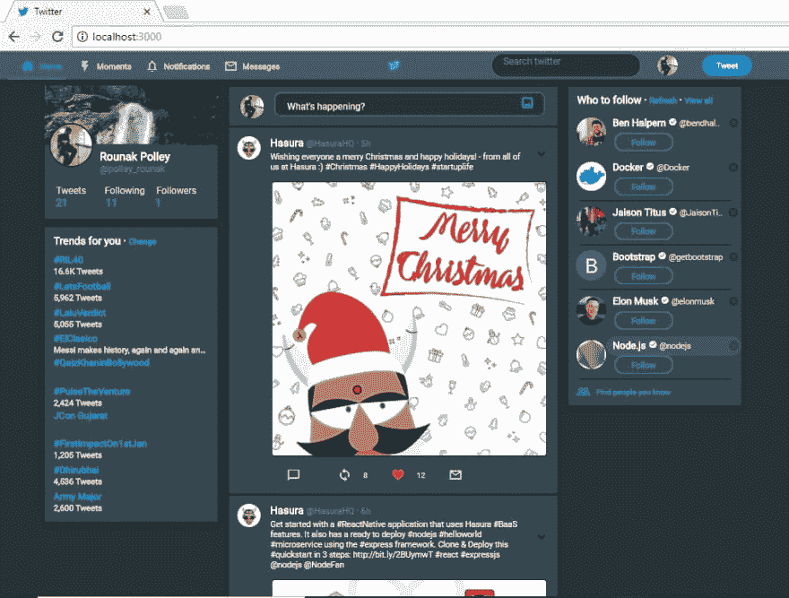
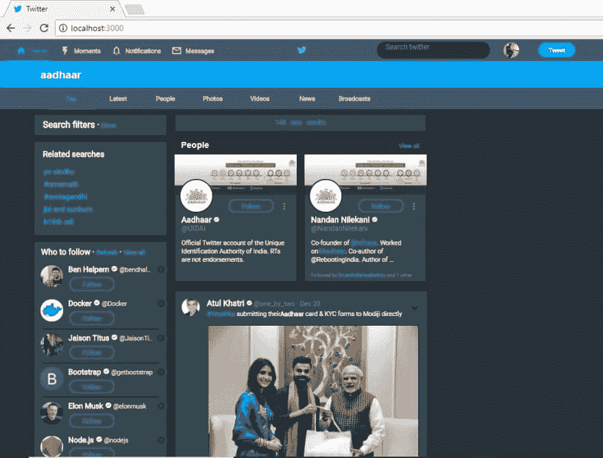

# 学习反应并使用 HPDF 任务 1 的材料界面

> 原文：<https://dev.to/rounakpolley/learning-reactjs-and-using-material-ui-for-hpdf-task-1-2d7d>

#### [我在哈苏拉集群上的项目](https://ui.deserve26.hasura-app.io/)

这是我第一次实习，这是第一周的总结...在此之前，我必须提一下，所有的实习生被分成了四组！
**ReactJS** ， **React-Native** ，**NodeJs-express**&**Python-Flask**。根据我的喜好，我得到了前端节点。

### HPDF 任务 1

第一周的任务很简单(尽管我到处都在努力)。我不得不使用 ReactJS 和 material-ui 克隆(复制或模仿)两个 twitter 页面。在我进入任何细节之前，我想让你看看结果。

你可以在这里查看代码 **GitHub 链接** : [Twitter 页面](https://github.com/rounakpolley/twitter-hpdf)它干净易懂。还有，这里是截图。

[T2】](https://res.cloudinary.com/practicaldev/image/fetch/s--v-PfiCfa--/c_limit%2Cf_auto%2Cfl_progressive%2Cq_auto%2Cw_880/https://thepracticaldev.s3.amazonaws.com/i/47ctkply003u97hpp4lr.JPG)

[T2】](https://res.cloudinary.com/practicaldev/image/fetch/s--bYijm1u3--/c_limit%2Cf_auto%2Cfl_progressive%2Cq_auto%2Cw_880/https://thepracticaldev.s3.amazonaws.com/i/ntsjtq0w7iui09tyjv8a.JPG)

### 学习阶段

整整一年前，我开始从互联网上学习新技能，因为学期推迟了，我已经完成了我的学习。从那以后，只要我喜欢，我就一直在学习新的和美妙的东西。但是，通过所有这些事情的学习，最难的是前端 web 开发。因为我喜欢设计东西，会浪费额外的时间来调整颜色代码和尺寸，使页面反应灵敏，并检查所有可能的屏幕方向。在前端，我从 HTML5、CSS3、JS6 开始，然后是 Bootstrap、jQuery，我甚至在 Photoshop 中学习了网页设计课程。我本来打算学 React，结果碰巧我学完了。

起初我尝试了 EDX T1，然后是 T2 udemy T3，因为这些是我以前学习过的地方。但是，最终以**学究**结束，学习 react 是有趣的虚拟 DOM，单页应用和所有这些。然后我转到 [Material-ui](http://www.material-ui.com/) 现在这里没有教程，我只需要阅读文档并进行实验。每次都花了 2-3 天..
我尝试了 material-ui 几乎所有的组件。

### 克隆推特

事实上，我不得不在 twitter 上开一个账户，因为我以前没有。我用了一段时间 twitter 来熟悉它，或者可能是因为加入一个新的社交媒体/微博平台感觉很好。

#### 现在开始编码

因为代码已经在 GitHub 上了，所以我会告诉你我是如何完成这个任务的。我决定把这些页面分成普通的部分，然后把它们组装在一起。我使用一个简单的**提升状态**在页面间导航。

这里，我是如何分解它的..

`App.js`根据它的状态(`this.state.page`)呈现两个页面中的一个，它只是将状态作为道具传递给下一个阶段`twitter_base.js`这里是所有基于道具的组装发生的地方。

我为整个应用程序定制了单独的`muiTheme`,它还包含了这个项目的 react 元素共有的特定样式属性(一种全局变量),比如`muiTheme.palette.primaryTextColor: grey50`。我输入了所有其他的反应堆部件。

我制作了一个单独的组件文件夹，包含页面的各个部分，如..
`AppBar.js``Follow.js``Related.js``Trends.js``User.js`等等..
默认情况下，这些文件都导出了一个 react 元素，然后我将它导入到`twitter_base.js`中。我没有使用任何显式的样式表，我只使用了内联样式。在几乎所有的情况下，我都使用了 material-ui 本身的颜色，并且没有像往常一样使用颜色代码。

此外，这个项目的设计是响应性的，因为 material-ui 没有响应功能，我不想使用 bootstrap 或编写媒体查询。事实上，实际的桌面版 twitter 也没有太大的反应。

实际上，第一次使用 material-ui 并不是一次顺利的经历，因为很多事情并不像预期的那样工作。在其他情况下，大多数情况下 **stackoverflow** 会回答我的问题，但这次我从 ReactJS 的 GitHub 问题中获得了大部分帮助。当这些都无济于事时，我会去 **Hasura Slack 社区**寻求帮助。

我在期限内轻松地完成了任务(我不必像以前的一些项目那样彻夜不眠。

### 坏事发生

由于学期的原因，我已经迟到了，但是我的卡片上也有节日。但是，最糟糕的事情即将到来..我一生都在使用 **windows 操作系统**，因此我认为这次我应该开始使用 Linux。因为，作为一名计算机专业的学生，不熟悉 **Linux** 对我来说相当尴尬。因此，我在我的旧笔记本上安装了最新版本的 Ubuntu，由于我的粗心大意，我最终删除了分区表和我所有的数据..

事实上，我不知道我的潜水数据也会受到影响。我仍在寻找找回我的东西的方法，因为上面有一些非常重要的东西。我还找不到任何方法来恢复它

#### 如果有人知道我的数据恢复问题的解决方案，请在评论区告诉我。

稍后我会单独写一篇关于它的博客...

#### 一个 Windows 用户在 Linux 上的恐怖

[T2】](https://res.cloudinary.com/practicaldev/image/fetch/s--Qc-2opYX--/c_limit%2Cf_auto%2Cfl_progressive%2Cq_66%2Cw_880/https://thepracticaldev.s3.amazonaws.com/i/73gns0eykjw7qoojtmvj.gif)