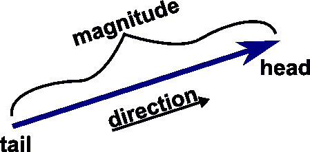
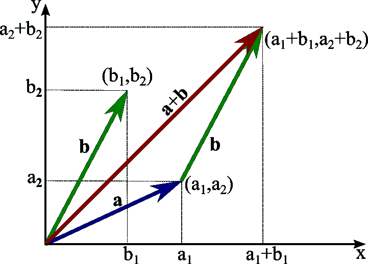
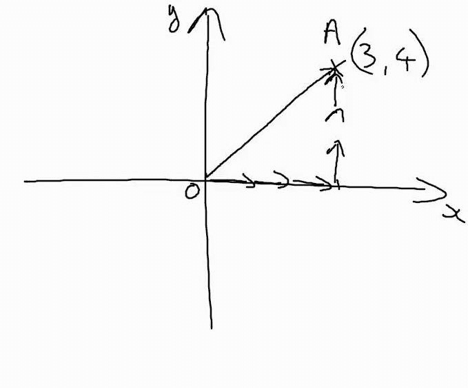
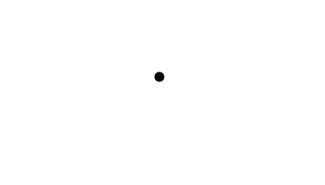

# LTC4 -爱上矢量

> 原文：<https://dev.to/rpalo/ltc4---falling-in-love-with-vectors-182>

这是一个系列的一部分。如果你错过了它们，我建议你读一下第一课、[第二课](https://assertnotmagic.com/2017/09/16/p5-part-2-looping-targets/)和[第三课](https://assertnotmagic.com/2017/10/09/p5-part-3-rainbow-collections/)。

在第 4 课中，我将开始转移注意力，不再仅仅学习如何编程，而是开始将我们的新知识应用到物理、模拟和更复杂的动画中。这一次，我们有几个目标。我想回顾一下使用 JavaScript 对象，并补充上节课结束时我们所学的内容。这将包括向我们的对象添加**方法**。我还想开始介绍一点点物理学，以及它如何帮助我们制作一些伟大的动画。P5 库中使这种方式变得更容易的一部分是内置的 Vector 对象，所以我们也将学习这些内容。但我知道你来这里的真正目的。让我们看看这次我们在做什么。

[T2】](https://res.cloudinary.com/practicaldev/image/fetch/s--jdxc6KFi--/c_limit%2Cf_auto%2Cfl_progressive%2Cq_66%2Cw_880/https://assertnotmagic.com/img/vectors-complete-demo.gif)

没错！我们要做一个落球。逼真的落球。当我们点击鼠标时，重力会自动反转。是只有我，还是这里变得越来越令人兴奋？？这是我们的正式要求。

> 我们的草图必须包含一个在重力影响下移动的球，使用加速度、速度和位置的模拟来产生真实的效果。当球到达屏幕边缘时，它将停止。鼠标一点，重力就会逆转。

你知道该怎么做。让我们挑选一个更简单的版本，然后开始。

## 第一步。落下的球

对于这第一步，让我们忽略屏幕边缘的停止和切换方向。我们想要的只是球落下来。我将逐步停止复习前两节课的内容，所以如果你错过了，我建议你回去看看。抓住你信任的`index.html`，开始新的`sketch.js`。

```
function setup() {
  createCanvas(600, 600);
  background(255);
  stroke(0);
  fill(0);

  // Stuff to setup our ball will go here
}

function draw() {
  background(255);  // Clear the page before redrawing

  // Stuff to animate our ball will go here
} 
```

Enter fullscreen mode Exit fullscreen mode

到目前为止，所有这些应该看起来非常熟悉。让我们进入正题。我们知道我们将需要一个球，但是首先，让我介绍一下 Vector，它将把我们带到软件版本，即 [P5 Vector](https://p5js.org/reference/#/p5.Vector) ，我已经给了你一个文档的链接。如果你是那种超常的人，就去看看吧。下一节将更深入地介绍向量。多是为了背景，但也是因为爱向量，控制不住自己。如果你像我妻子一样，对事物背后的数学一点也不感兴趣，TLDR 就是向量是在一个地方跟踪 X 和 Y 值(有时甚至是 Z 值)的一种巧妙的方式，同时还有一些很好的辅助函数。如果你的心没有被好奇心之火点燃，请随意跳过下一部分。

### 向量

向量是一个数学概念。从根本上说，它们只是一个有大小(大小、长度)和方向的值。现在，这是人们总是给的定义，它不是一个有用的定义。让我解释得更清楚一点。你可以把向量想象成一个带有一点附加信息的普通数字。例如，假设你在一辆车里。你正以每小时 10 英里的速度行驶。为什么这么慢？因为你很谨慎——我不知道。这是你的车。想怎么开就怎么开。无论如何，知道你的速度是好的。速度是一个普通的旧数字(也称为[标量](http://www.mathwords.com/s/scalar.htm))。但是，知道你的车往哪个方向开也是很好的！你正以每小时 10 英里的速度向北行驶吗？南方？垂直向上，因为——令人惊讶的是——这是一艘宇宙飞船？这些都会产生非常不同的结果，你可以看到方向信息不能仅仅存储在一个简单的数字中。这就是矢量的用处。

[T2】](https://res.cloudinary.com/practicaldev/image/fetch/s--e0axZAq4--/c_limit%2Cf_auto%2Cfl_progressive%2Cq_auto%2Cw_880/https://assertnotmagic.com/img/vector-simple.png)

矢量实际上只是一个箭头。它知道它有多长，它指向哪个方向。写向量有很多方法。一种方法就是简单的`<magnitude> <angle>`。比如，一个位置:你离我 5 英尺，正东偏北 15 度。但是在我们陷入混乱之前，有一个更简单的方法。我们来谈谈数学。

#### 矢量数学

可以把矢量加在一起！下一部分可能会吓到你。保持冷静，试着一次专注于一件事，我们会度过难关的。向量的一个好处是，只要你保持它们的长度和方向不变，你就可以随意移动它们(在纸上或在脑海中)。

[T2】](https://res.cloudinary.com/practicaldev/image/fetch/s--1uSE36R2--/c_limit%2Cf_auto%2Cfl_progressive%2Cq_66%2Cw_880/https://assertnotmagic.com/img/vectors-moving.gif)

这些都是同一个矢量！如果你仍然不相信，给我一秒钟，我会给你一个更好的解释，一旦我们谈到这个添加业务。所以！假设你只要保持长度和方向不变就能移动矢量，那么想象你有两个不同的矢量:A 和 b，为了把它们相加，你可以把第二个的尾部移到第一个的尖端。最终位置是总和！

[T2】](https://res.cloudinary.com/practicaldev/image/fetch/s--EdbCcIRu--/c_limit%2Cf_auto%2Cfl_progressive%2Cq_auto%2Cw_880/https://assertnotmagic.com/img/vector_2d_add.png)

能够做到这一点，实际上导致了一个很好的方式来书写和思考向量。如果你可以把几个向量加在一起，组成其他向量，想象一下，如果我们有一大包向量，它们的长度都正好是一个单位。有的水平指向，有的垂直指向。

[T2】](https://res.cloudinary.com/practicaldev/image/fetch/s--T8BufWNq--/c_limit%2Cf_auto%2Cfl_progressive%2Cq_auto%2Cw_880/https://assertnotmagic.com/img/unit-vectors.jpg)

你可以添加许多你想要的东西！在物理和微积分中，我们经常把 X 方向长度为一个单位的向量称为 *i* 。Y 方向的那个叫做 *j* 。为了生成一个从原点(0，0)到点(3，4)的矢量，你需要 3 个 *i* 矢量和 4 个 *j* 矢量。我们可以把 O 到 A 的向量写成 3 *i* + 4 *j* 。有了这个方便的向量 x + y 符号，添加向量就更容易了！假设我们有一个从(0，0)到(7，8)的向量。我们称他为 c，我们也有一个从(0，0)到(1，3)的向量。如果我们想知道 C + D 是什么，我们可以把所有的 *i* 和 *j* 加起来！

C = 7 *i* + 8 *j* 。

D = 1 *i* + 3 *j* 。

所以，C + D = 8 *i* + 11 *j* ！没问题！

在 *i* 旁边的数字的另一个名字是 **X 部件**。 *j* 旁边的数字是 **Y 组件**。为了更简短，你可以用尖括号写向量:< x，y >。

还有一点:你可以把任何向量乘以一个标量(就像我们上面说的，只是一个数)。所以，如果 C 还是 7 *i* + 8 *j* ，那么 4 x C 等于 28 *i* + 32 *j* 。好了，这足够让我们完成我们需要做的事情了。

### 现在来讲一些物理学

现在你对向量有了一些背景，我们来谈谈三个(可能是新的)术语:**位置**、**速度**、**加速度**。

位置是一个向量，表示物体在空间中的位置。对于我们的二维例子，一个简单的 X，Y 向量就足够了。

速度可以描述为位置随时间的*变化。例如，如果你在点(3，5)，下一秒，你移动到(7，10)，然后在那一秒，你在 X 方向移动了 4 个空格，在 y 方向移动了 5 个空格。你可以把你的**速度**写成< 4，5 >。*

加速度也差不多。它是**速度**随时间的*变化。所以你做和速度一样的数学，但是你用速度作为变化的东西。如果你以每小时 10 英里的速度向北行驶，下一秒你以每小时 12 英里的速度向北行驶，那么你的速度在那一秒增加了每小时 2 英里。你的加速度是向北 2 英里每小时。举个更矢量 Y 的例子，如果你的速度现在是< 4，5 >，一秒钟后，你的速度增加到< 6，8 >，你的 X 速度增加了 2，Y 速度增加了 3。所以，你可以把你的加速度写成< 2，3 >。*

清澈如泥？这里有一些等式可能会有所帮助。它们肯定会对我们的代码有所帮助。

`final_velocity = initial_velocity + acceleration*time`

`final_position = initial_position + velocity*time`。

如果你在动画/模拟中使用**位置、速度和加速度**的组合，它们将看起来非常真实，因为它们所基于的数学是世界实际上是如何工作的！

### 无聊！请输入更多代码！

```
 var ball;

function setup() {
  createCanvas(600, 600);
  background(255);
  stroke(0);
  fill(0);

  ball = {
    pos: createVector(width / 2, height / 2),
    vel: createVector(0, 0),
    accel: createVector(0, 0)
  };

} 
```

Enter fullscreen mode Exit fullscreen mode

我们已经建立了一个名为`ball`的新对象。这个球有一个位置(画布的中间)，速度(零)，加速度(零)，就像我们在上面看到的一样。我们使用 P5 的内置`createVector`函数，放入我们的 X 和 Y 组件。稍后您会看到这有多方便。让我们在 draw 函数中画出我们的球。

```
 function draw() {
  background(255);
  ellipse(ball.pos.x, ball.pos.y, 10, 10);
} 
```

Enter fullscreen mode Exit fullscreen mode

看看我们如何得到向量的`.x`和`.y`分量？这是新的动画。

[T2】](https://res.cloudinary.com/practicaldev/image/fetch/s--GZb1KtoZ--/c_limit%2Cf_auto%2Cfl_progressive%2Cq_auto%2Cw_880/https://assertnotmagic.com/img/ball-not-falling.png)

万岁！但是它为什么不动呢？嗯，我们没有像我们说的那样更新我们的位置，速度和加速度！让我们现在做那件事。

```
var ball;

function setup() {
  createCanvas(600, 600);
  background(255);
  stroke(0);
  fill(0);

  ball = {
    pos: createVector(width / 2, height / 2),
    vel: createVector(0, 0),
    accel: createVector(0, .1)  // << Let's add some acceleration.
                                // Remember in the canvas that positive
                                // is down!
  };

}

function draw() {
  background(255);
  // Remember our physics equations?
  ball.vel.add(ball.accel);
  ball.pos.add(ball.vel);
  // They're so beautiful!
  ellipse(ball.pos.x, ball.pos.y, 10, 10);
} 
```

Enter fullscreen mode Exit fullscreen mode

每画一圈，我们都通过增加加速度来更新速度。然后我们通过增加速度来更新我们的位置！运行你的模拟，你会发现所有这些数学都是值得的。

[T2】](https://res.cloudinary.com/practicaldev/image/fetch/s--RTSgfOm---/c_limit%2Cf_auto%2Cfl_progressive%2Cq_66%2Cw_880/https://assertnotmagic.com/img/ball-dropping.gif)

让我们再做一次清理，使我们的代码真正有意义。

```
var ball, gravity;  // << We're going to replace our hard-coded value!

function setup() {
  createCanvas(600, 600);
  background(255);
  stroke(0);
  fill(0);

  gravity = .1;

  ball = {
    pos: createVector(width / 2, height / 2),
    vel: createVector(0, 0),
    accel: createVector(0, gravity)  // << acceleration is gravity!
  };

}

function draw() {
  background(255);
  ball.vel.add(ball.accel);
  ball.pos.add(ball.vel);
  ellipse(ball.pos.x, ball.pos.y, 10, 10);
} 
```

Enter fullscreen mode Exit fullscreen mode

好的。有很多新的数学/物理概念，没有多少新的 JavaScript。深呼吸。吃点零食。这个项目的其余部分应该看起来更熟悉。

## 第二步:停止

让我们进入下一个要求。当球接近画布边缘时，它应该停止。我觉得你可以自己处理这件事。在继续阅读之前，先试一试。

```
var ball, gravity;

function setup() {
  createCanvas(600, 600);
  background(255);
  stroke(0);
  fill(0);

  gravity = .1;

  ball = {
    pos: createVector(width/2, height/2),
    vel: createVector(0, 0),
    accel: createVector(0, gravity),
  };

}

function draw() {
  background(255);
  ball.vel.add(ball.accel);
  ball.pos.add(ball.vel);

  // Here's the stopping magic.
  if (ball.pos.y > height - 10) {
    ball.pos.y = height - 10;
    ball.vel.set(0, 0);
  }

  ellipse(ball.pos.x, ball.pos.y, 10, 10);
} 
```

Enter fullscreen mode Exit fullscreen mode

如果球的 Y 位置将要离开画布，我们停止球并确保它呆在原地。如果你不用看答案就能完成，那就和你击掌吧！击掌，即使你不得不偷看，因为你在编程，这使你很酷！

## 第三步:切换方向

我们旅程的第三步是当我们点击鼠标时转换重力的方向。我认为你也可以自己做这件事！

```
function mouseClicked() {
  gravity *= -1;
  ball.accel.y = gravity;
} 
```

Enter fullscreen mode Exit fullscreen mode

[T2】](https://res.cloudinary.com/practicaldev/image/fetch/s--U8RwEgdA--/c_limit%2Cf_auto%2Cfl_progressive%2Cq_66%2Cw_880/https://assertnotmagic.com/img/switch-directions-1.gif)

哦不！我们的球飞向太空！想看些有趣的东西吗？再次点击并等待。我们的球会坠落回地球。看起来我们需要更新我们的停止代码来包含画布的上边界。

```
 if (ball.pos.y > height - 10) {
    ball.pos.y = height - 10;
    ball.vel.set(0, 0);
  }
  if (ball.pos.y < 10) {
    ball.pos.y = 10;
    ball.vel.set(0, 0);
  } 
```

Enter fullscreen mode Exit fullscreen mode

就这样，我们成功了！这是我们的最终代码。

```
var ball, gravity;

function setup() {
  createCanvas(600, 600);
  background(255);
  stroke(0);
  fill(0);

  gravity = .1;

  ball = {
    pos: createVector(width/2, height/2),
    vel: createVector(0, 0),
    accel: createVector(0, gravity),
  };

}

function draw() {
  background(255);
  ball.vel.add(ball.accel);
  ball.pos.add(ball.vel);

  // Here's the stopping magic.
  if (ball.pos.y > height - 10) {
    ball.pos.y = height - 10;
    ball.vel.set(0, 0);
  }
  if (ball.pos.y < 10) {
    ball.pos.y = 10;
    ball.vel.set(0, 0);
  }

  ellipse(ball.pos.x, ball.pos.y, 10, 10);
}

function mouseClicked() {
  gravity *= -1;
  ball.accel.y = gravity;
} 
```

Enter fullscreen mode Exit fullscreen mode

## 附加步骤:用对象方法清理

我想再向您展示一个东西，它将帮助我们稍微清理一下代码，使其更容易阅读:**对象方法**。

在上面的代码中，我们用`pos, vel, accel`定义了我们的`ball`对象。这些是**属性**，或者可以使用`.`(点)操作符设置和读取的值。本质上只是变量。但是！你也可以用函数做同样的事情！这里有一个例子。

```
var banana = {
  color: "Yellow",
  length: 6,
  greet: function() {
    console.log("HI!  I'M A BANANA!");
  }
};

banana.greet();
// HI!  I'M A BANANA! 
```

Enter fullscreen mode Exit fullscreen mode

您可以使用关键字`this`访问同一对象的其他功能和属性。`this`本身就是一个棘手的犹太教话题。[这篇关于 Dev.to](https://dev.to/yaphi1/understanding-this-in-javascript) 的文章是一个很好的解释。如果你仍然困惑，尝试搜索“JavaScript this”。这是一个给很多人带来问题的话题，所以有很多很好的尝试来解释它。

```
var banana = {
  color: "Yellow",
  length: 6,
  greet: function() {
    console.log("HI!  I'M A BANANA!");
  },
  chomp: function(amount) {
    this.length -= amount;
    this.greet();
  }
};

banana.chomp(4);
// HI!  I'M A BANANA!
banana.length;
// 2 
```

Enter fullscreen mode Exit fullscreen mode

让我们将它应用到我们的`ball`代码中。

```
var ball, gravity;

function setup() {
  createCanvas(600, 600);
  background(255);
  stroke(0);
  fill(0);

  gravity = .1;

  ball = {
    pos: createVector(width/2, height/2),
    vel: createVector(0, 0),
    accel: createVector(0, gravity),
    // Here's our new functions
    update: function() {
      this.vel.add(this.accel);
      this.pos.add(this.vel);

      if (this.pos.y > height - 10) {
        this.pos.y = height - 10;
      }
      if (this.pos.y < 10) {
        this.pos.y = 10;
      }
    },
    display: function() {
      ellipse(this.pos.x, this.pos.y, 10, 10);
    }
  };

}

function draw() {
  // See how clean our draw function becomes?
  // Most of the logic that is internal to how a ball works
  // is inside the ball object now!
  background(255);
  ball.update();
  ball.display();
}

function mouseClicked() {
  gravity *= -1;
  ball.accel.y = gravity;
} 
```

Enter fullscreen mode Exit fullscreen mode

## 包装完毕

这是对物理学、向量和对象方法的一个很好的开始。随着 JavaScript 的发展，他们使得用可读和可理解的方式做这些事情变得更加容易。大多数现代浏览器也支持这些更简单的方式。我们将在下一课中使用其中的一些功能，让我们的生活更加轻松。

* * *

*原帖 [`assert_not magic?`](https://assertnotmagic.com/2017/12/28/p5-part-4-falling-in-love-with-vectors/)*

*封面图片来源:NASA*