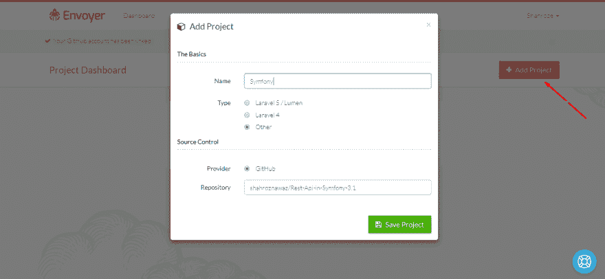
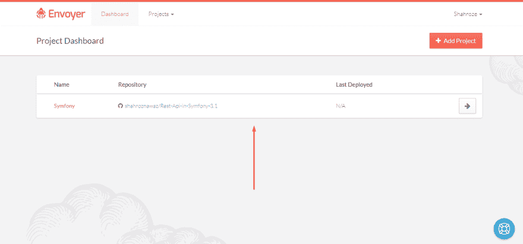
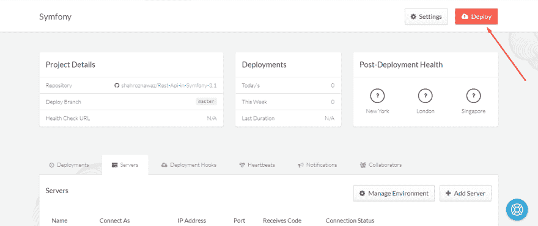
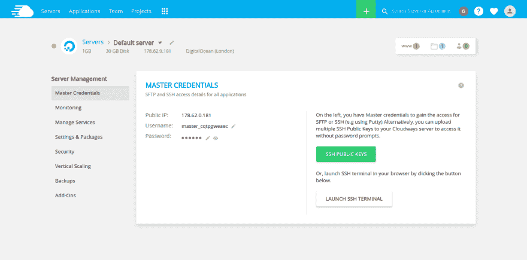
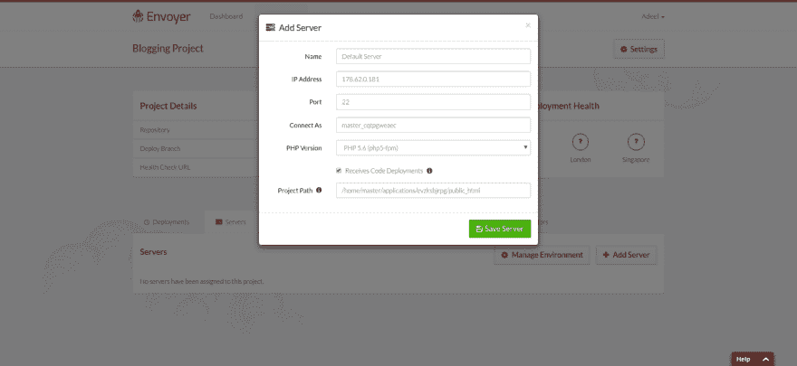
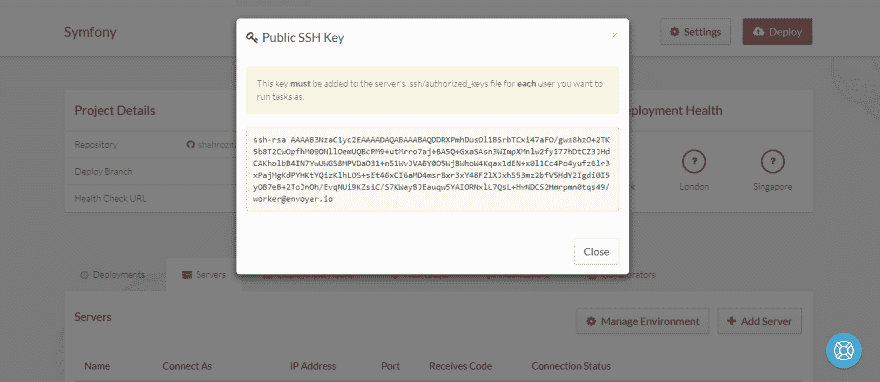
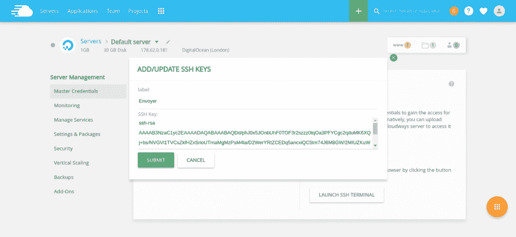
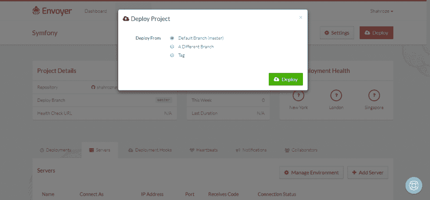
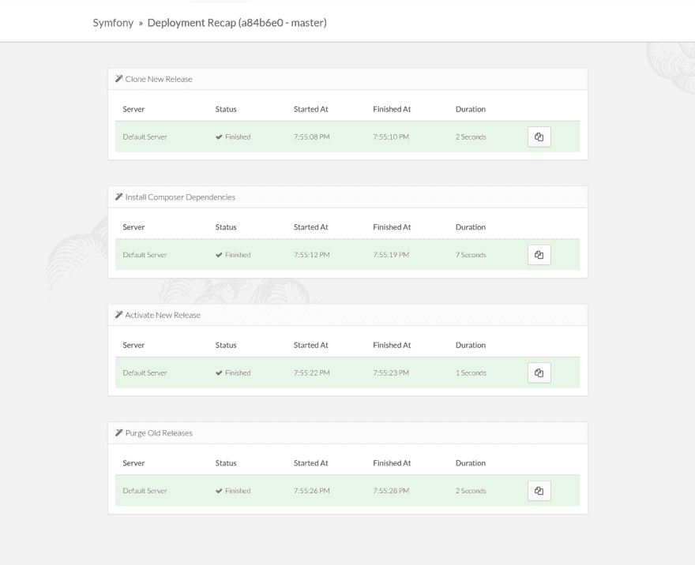
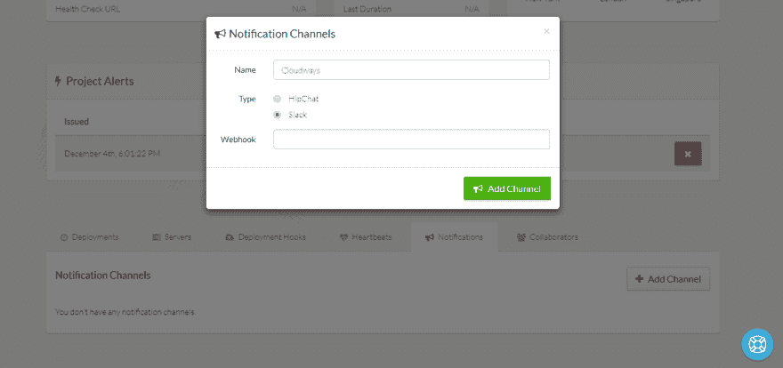

# 我如何使用 Envoyer 实现 Symfony 部署自动化

> 原文：<https://dev.to/_shahroznawaz/how-i-automated-symfony-deployment-with-envoyer-212f>

开发人员有不同的选项和工具来为他们的项目创建自动部署。这些自动部署选项确保不会浪费时间在文件之间手动添加新的编码块。好消息是开发者现在可以从很多部署工具中选择，包括 DeployBot 和 DeployHQ。

出于本文的目的，我选择了流行的零时间部署工具“Envoyer”，它是由 Laravel 的创建者 Taylor Otwell 创建的。虽然 Envoyer 被认为是部署 Laravel 应用程序的“默认”选项，但我将展示它在 Cloudways 上部署 Symfony 应用程序的能力。

Symfony 背后的团队最近发布了 Symfony 的最新版本，3.4 和 4.0。与标准发布版本相比，这些版本具有不同的结构。我就不赘述 [Symfony 4](http://symfony.com/4) 的细节了。同样，如果你想将 Symfony 3.x 升级到版本 4，请遵循这个[详细的升级指南](https://github.com/symfony/symfony/blob/master/UPGRADE-4.0.md)。

所以现在，回到正题。

Envoyer 是一个部署工具，用于 PHP 应用程序的部署。该工具最大的优点是部署期间零停机。这意味着您的应用程序和使用它的客户甚至没有意识到已经推出了新版本。Envoyer 与主要的存储库管理平台(如 Github、GitLab 和 Bitbucket)配合良好。其他好处包括不受限制的部署和团队成员。

下面的教程将指导您使用 Envoyer 在 Cloudways 上部署 Symfony 应用程序。

## 创建一个 Envoyer 帐户并添加一个项目

创建一个 Envoyer 帐户并登录。接下来，添加一个新项目。出于本教程的目的，我使用我的 Github 帐户登录。

[T2】](https://res.cloudinary.com/practicaldev/image/fetch/s--NYfMjKTn--/c_limit%2Cf_auto%2Cfl_progressive%2Cq_auto%2Cw_880/https://www.cloudways.com/blog/wp-content/uploads/image2-68.png)

## 连接 GitHub 库

接下来，连接您的 Github 存储库。只需复制 Github repo URL 的用户名/存储库，并将其粘贴到输入框中。因为我没有部署 Laravel 应用程序，所以选择另一个单选按钮，并点击 Save Project 按钮。

[T2】](https://res.cloudinary.com/practicaldev/image/fetch/s--2a5MRGqm--/c_limit%2Cf_auto%2Cfl_progressive%2Cq_auto%2Cw_880/https://www.cloudways.com/blog/wp-content/uploads/image5-42.png)

项目将被添加到帐户中，GitHub 存储库现在将连接到 Envoyer。

[T2】](https://res.cloudinary.com/practicaldev/image/fetch/s--6Oo1NE1n--/c_limit%2Cf_auto%2Cfl_progressive%2Cq_auto%2Cw_880/https://www.cloudways.com/blog/wp-content/uploads/image10-63.png)

## 添加服务器

下一步是集成 Cloudways 服务器。为此，请转到“服务器”选项卡，然后单击“添加服务器”按钮。

[T2】](https://res.cloudinary.com/practicaldev/image/fetch/s--8NsQ52Uo--/c_limit%2Cf_auto%2Cfl_progressive%2Cq_auto%2Cw_880/https://www.cloudways.com/blog/wp-content/uploads/image12-44.png)

接下来，登录到您的 Cloudways 帐户，并从 Cloudways 控制台的 Server Management 选项卡内的 Master Credentials 部分获取用于添加服务器的凭证。

[T2】](https://res.cloudinary.com/practicaldev/image/fetch/s--NTxMInPd--/c_limit%2Cf_auto%2Cfl_progressive%2Cq_auto%2Cw_880/https://www.cloudways.com/blog/wp-content/uploads/image9-27.png)

填写所有必填字段，输入 Cloudways 应用程序的完整绝对路径，然后保存服务器。

[T2】](https://res.cloudinary.com/practicaldev/image/fetch/s--9gwAFOKS--/c_limit%2Cf_auto%2Cfl_progressive%2Cq_auto%2Cw_880/https://www.cloudways.com/blog/wp-content/uploads/image8-31.png)

保存服务器后，您将获得一个 SSH 密钥。

[T2】](https://res.cloudinary.com/practicaldev/image/fetch/s--cxNioffj--/c_limit%2Cf_auto%2Cfl_progressive%2Cq_auto%2Cw_880/https://www.cloudways.com/blog/wp-content/uploads/image13-38.png)

复制密钥，然后到 Cloudways 控制台，单击“SSH 公共密钥”按钮。为您的密钥添加一个标签，然后单击提交。

[T2】](https://res.cloudinary.com/practicaldev/image/fetch/s--QAR0NMon--/c_limit%2Cf_auto%2Cfl_progressive%2Cq_auto%2Cw_880/https://www.cloudways.com/blog/wp-content/uploads/image1-72.png)

添加 SSH 密钥后，您应该能够连接到您的服务器。单击微小的刷新按钮来测试连接状态。

## 最终部署

至此，一切都已正确设置。最后一步是单击 Deploy 按钮进行实际的项目部署。您也可以在设置中选择“代码推送时部署”选项，通过 Git 推送部署应用程序。

[T2】](https://res.cloudinary.com/practicaldev/image/fetch/s--NYfMjKTn--/c_limit%2Cf_auto%2Cfl_progressive%2Cq_auto%2Cw_880/https://www.cloudways.com/blog/wp-content/uploads/image2-68.png)

Envoyer 将询问您需要从哪个分支或标签部署应用程序代码。我选择了默认分支，它也是主分支。

[T2】](https://res.cloudinary.com/practicaldev/image/fetch/s--h7EnGSA9--/c_limit%2Cf_auto%2Cfl_progressive%2Cq_auto%2Cw_880/https://www.cloudways.com/blog/wp-content/uploads/image4-55.png)

现在按下部署按钮。可以在部署选项卡中查看部署过程。通过单击部署状态旁边的箭头按钮，可以获得与部署相关的其他信息。

[T2】](https://res.cloudinary.com/practicaldev/image/fetch/s--cLpk7_Gd--/c_limit%2Cf_auto%2Cfl_progressive%2Cq_auto%2Cw_880/https://www.cloudways.com/blog/wp-content/uploads/image7-30.png)

您可以清楚地看到，Envoyer 在服务器上部署应用程序花费的时间最少。

## Cloudways 上的部署文件夹

部署完成后，登录 Cloudways 上的 SSH 终端，并移动到您的应用程序文件夹。您会发现两个文件夹，当前和发布。

[T2】](https://res.cloudinary.com/practicaldev/image/fetch/s--pwBOTOtx--/c_limit%2Cf_auto%2Cfl_progressive%2Cq_auto%2Cw_880/https://www.cloudways.com/blog/wp-content/uploads/image14-33.png)

当前文件夹包含正在开发的主应用程序，而发布文件夹包含以部署日期和时间命名的以前的发布文件夹。

[T2】](https://res.cloudinary.com/practicaldev/image/fetch/s--7FhUbufO--/c_limit%2Cf_auto%2Cfl_progressive%2Cq_auto%2Cw_880/https://www.cloudways.com/blog/wp-content/uploads/image11-49.png)

你可以从三个地方(纽约、伦敦、新加坡)查看你的申请状态。如果发生灾难，您可以选择回滚当前部署。为此，通过在设置中提供运行状况检查 URL 来启用此选项。此外，您可以设置心跳来监视应用程序的 cron 作业。您还可以设置一个通知通道，比如 Slack 和 Hipchat，来接收与部署相关的通知。

[T2】](https://res.cloudinary.com/practicaldev/image/fetch/s--M8Xu0YwC--/c_limit%2Cf_auto%2Cfl_progressive%2Cq_auto%2Cw_880/https://www.cloudways.com/blog/wp-content/uploads/image6-41.png)

## 把一切都包起来

如您所见，Envoyer 是部署 PHP 应用程序的绝佳选择。流程很简单，您可以直接将流程连接到版本控制平台，以确保始终部署最新版本的应用程序。如果你在这个过程中需要帮助，请发表评论，我会尽快回复你。