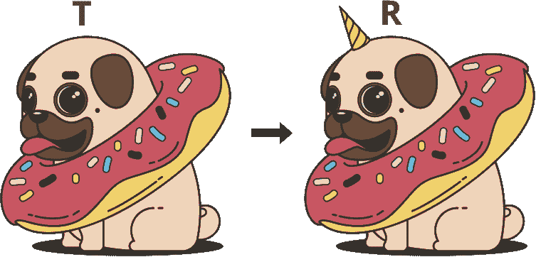

# 如何使用科特林的“it 也让应用运行”

> 原文：<https://dev.to/worker8/how-to-use-kotlins-it-also-let-apply-run-301b>

Kotlin 正在 Android 开发中正式使用，每个 Android 开发者大概都在忙着接 Kotlin。包括我。

在我的科特林之旅中，我偶然发现了这些神奇的方法

```
 .also()
    .let()
    .apply()
    .run() 
```

Enter fullscreen mode Exit fullscreen mode

它们很神奇，因为它们可以表演一些科特林魔法，同时又非常像英语单词。由于这种相似性，我甚至尝试用它们来造句。假设 Apply 是一个人名，我可以用它们造一个语法正确的英语句子:`it also let Apply run`。

废话不说，我发现根据他们的名字真的很难理解用法。

`Standard.kt`里也有`with`等朋友，但我想保持这个帖子重点。所以剩下的我就不写了。其实我只是懒的把它们都覆盖到ಠ_ಠ.我想去滑雪，现在已经是冬天了，耶！3

* * *

## 1。让和运行转换

#### 1a。帕格类比，第一部分

有一句名言“开始学习就是开始忘记”。所以让我们暂时忘记`it also let apply run`。好吧，这是我瞎编的。先说一个简单的要求。

假设你有一个`pug`。

[T2】](https://res.cloudinary.com/practicaldev/image/fetch/s--1qxFzxaq--/c_limit%2Cf_auto%2Cfl_progressive%2Cq_auto%2Cw_880/https://i.imgur.com/ToWqEup.png)

你想给它加上一个角。

下面是执行此操作的代码。

```
val pug: Pug = Pug()
val hornyPug: HornyPug = putHornOn(pug) 
```

Enter fullscreen mode Exit fullscreen mode

```
fun putHornOn(): HornyPug {
   // put horn logic
   return hornyPug
} 
```

Enter fullscreen mode Exit fullscreen mode

现在它已经变成了长着角的哈巴狗，姑且称之为`hornyPug`:

[T2】](https://res.cloudinary.com/practicaldev/image/fetch/s--qMnONpwW--/c_limit%2Cf_auto%2Cfl_progressive%2Cq_auto%2Cw_880/https://i.imgur.com/OBKDqZL.png)

从`pug`到`hornyPug`，原来的`pug`变了。我称之为“转型”。

让我们用`run`
重写这个

```
val pug: Pug = Pug()
val hornyPug: HornyPug = pug.run { putHornOn(this) } 
```

Enter fullscreen mode Exit fullscreen mode

这里用`let`
重写

```
val pug: Pug = Pug()
val hornyPug: HornyPug = pug.let { putHornOn(it) } 
```

Enter fullscreen mode Exit fullscreen mode

#### 1b。函数定义

看一下`let`和`run`是怎么写的`Standard.kt`:

```
public inline fun <T, R> T.let(block: (T) -> R): R = block(this)
public inline fun <T, R> T.run(block: T.() -> R): R = block() 
```

Enter fullscreen mode Exit fullscreen mode

一开始可能很难读懂，现在我们只关注`return type`:

*   `R`是返回类型
*   `T`是调用对象的输入或类型。

意思是`T`型在`let`或`run`之后会变成`R`型。

在我们的例子中，`pug`是`T`，`hornyPug`是`R`。

[T2】](https://res.cloudinary.com/practicaldev/image/fetch/s--93mStnWT--/c_limit%2Cf_auto%2Cfl_progressive%2Cq_auto%2Cw_880/https://i.imgur.com/GoeRwHu.png)

#### 1c。钥匙带走:

*   每当变换发生时，使用`let`或`run`

* * *

## 2。应用并且也不转换

#### 2a。帕格类比，第二部分

让我们做同样的事情。

假设你有一只哈巴狗在垃圾桶里。(提示:垃圾桶不重要)

[T2】](https://res.cloudinary.com/practicaldev/image/fetch/s--M2epLpZX--/c_limit%2Cf_auto%2Cfl_progressive%2Cq_auto%2Cw_880/https://i.imgur.com/ofsH4Jw.png)

你想让它`bark()`:“汪！”

[T2】](https://res.cloudinary.com/practicaldev/image/fetch/s--6olQVIDL--/c_limit%2Cf_auto%2Cfl_progressive%2Cq_auto%2Cw_880/https://i.imgur.com/Zui4Ew0.png)

吠完了，还是那只老哈巴狗。

[T2】](https://res.cloudinary.com/practicaldev/image/fetch/s--M2epLpZX--/c_limit%2Cf_auto%2Cfl_progressive%2Cq_auto%2Cw_880/https://i.imgur.com/ofsH4Jw.png)

下面是代码:

```
val pug: Pug = Pug()
pug.bark()
// after barking, pug is still pug, nothing changes 
```

Enter fullscreen mode Exit fullscreen mode

```
class Pug {
    fun bark() {
        // Log.d("pug", "woof!") // print log to Android Studio
        // no return, which means, return Unit in Kotlin
    }
} 
```

Enter fullscreen mode Exit fullscreen mode

`.bark()`、`pug`前后仍然是`pug`，没有什么变化。

让我们用`apply`
重写这个

```
val pug: Pug = Pug()
val stillPug = pug.apply { bark() } 
```

Enter fullscreen mode Exit fullscreen mode

现在，使用`also`

```
val pug: Pug = Pug()
val stillPug = pug.also { it.bark() } 
```

Enter fullscreen mode Exit fullscreen mode

#### 2b。函数定义

看看`apply`和`also`是怎么写的`Standard.kt`:

```
public inline fun <T> T.apply(block: T.() -> Unit): T { block(); return this }
public inline fun <T> T.also(block: (T) -> Unit): T { block(this); return this } 
```

Enter fullscreen mode Exit fullscreen mode

注意，现在它没有了`R`类型，因为`T`原来的对象类型，在`apply`或`also`之后返回了`T`。

[T2】](https://res.cloudinary.com/practicaldev/image/fetch/s--Lo76dfqW--/c_limit%2Cf_auto%2Cfl_progressive%2Cq_auto%2Cw_880/https://i.imgur.com/tIyJYHW.png)

在我们这里，`T`就是`pug`，前后不变。

#### 2c。钥匙拿走

当没有变换时，使用`apply`或`also`。

* * *

## 3。有点困惑，改名怎么样？

我交谈过的大多数开发人员发现`it also let apply run`的命名令人困惑。我想知道如果我们有一个更好的命名是否会更容易理解？

让我们试试这个，Kotlin 允许我们将一个方法名作为另一个方法名。

```
import kotlin.apply as perform
import kotlin.run as transform
import kotlin.also as performIt
import kotlin.let as transformIt 
```

Enter fullscreen mode Exit fullscreen mode

解释:

*   如果没有转换，我们使用`perform()`或`performIt()`
*   如果有变换，我们用`transform()`或`transformIt()`

让我们来看看这个用例。

#### 3a。配置示例-执行()

如果我们需要创建一个文件，并配置它:

```
 val file = File()
    file.setReadable(true)
    file.setExecutable(true)
    file.setWritable(true) 
```

Enter fullscreen mode Exit fullscreen mode

在上面的代码中，我们通过运行 3 行代码来配置`file`。最后，`file`并没有变化成别的东西。所以`no transformation`。我们用的是`perform`版本。

```
 File().perform {
        setReadable(true)
        setExecutable(true)
        setWritable(true)
    } 
```

Enter fullscreen mode Exit fullscreen mode

在这种情况下，`performIt`也会起作用:

```
 File().perform {
        it.setReadable(true)
        it.setExecutable(true)
        it.setWritable(true)
    } 
```

Enter fullscreen mode Exit fullscreen mode

但是`perform`更好，因为我们并不真的需要`it`

#### 3b。对对象执行任务- performIt()

如果我们需要对一个对象执行一个任务，例如，当一个崩溃发生时，我们想要发送`user.id`、`user.name`和`user.country`到`Crashlytics`。

在这种情况下，有`no transformation`在进行。我选择`performIt()`版本。

```
 user.performIt {
        Crashlytics.sendId(it.id)
        Crashlytics.sendName(it.name)
        Crashlytics.sendCountry(it.country)
    } 
```

Enter fullscreen mode Exit fullscreen mode

`perform()`也会起作用。

```
 user.perform {
        Crashlytics.sendId(id)
        Crashlytics.sendName(name)
        Crashlytics.sendCountry(country)
    } 
```

Enter fullscreen mode Exit fullscreen mode

选择`perform`还是`performIt`是个人喜好的问题。我认为我们不应该浪费太多时间去考虑选择哪一个。

#### 3c。创建视图固定器-转换

假设我们有一个创建`ViewHolder`的方法。

```
 fun create(parent: ViewGroup): PugViewHolder {
        val itemView = LayoutInflater.from(parent.context).inflate(R.layout.item_pug, parent, false)
        return PugViewHolder(itemView)
    } 
```

Enter fullscreen mode Exit fullscreen mode

我们可以看到`itemView`在结尾是`transformed`变成`PugViewHolder`。所以我们可以用`transformIt`版本。

```
 fun create(parent: ViewGroup): PugViewHolder {
        return LayoutInflater.from(parent.context).inflate(R.layout.item_pug, parent, false).transformIt {
            PugViewHolder(it)
        }
    } 
```

Enter fullscreen mode Exit fullscreen mode

同样，`transform()`版本也可以。所以我不写 3d 了。

* * *

## 4。一起工作

考虑这样一种情况，我们需要

1.  创建文件
2.  将文件设置为可读、可写、可执行
3.  返回文件的根路径

```
 fun createFile_setMode_returnRootPath(): String {
        val file = File()
        file.setReadable(true)
        file.setExecutable(true)
        file.setWritable(true)
        val rootPath = findRootPath(file)
        return rootPath
    } 
```

Enter fullscreen mode Exit fullscreen mode

使用魔法函数重写:

```
 fun createFile_setMode_returnRootPath(): String {
        return File()
            .perform {
                setReadable(true)
                setExecutable(true)
                setWritable(true)
            }
            .transformIt { findRootPath(it) }
    } 
```

Enter fullscreen mode Exit fullscreen mode

希望有帮助！

红利独角兽哈巴狗。
[T3】](https://res.cloudinary.com/practicaldev/image/fetch/s--TfHx4huP--/c_limit%2Cf_auto%2Cfl_progressive%2Cq_auto%2Cw_880/https://i.imgur.com/IsHDGV6.png)

所有的哈巴狗都是从 [freepik](https://www.freepik.com/free-vector/fun-set-of-pugs-with-costumes_1357330.htm#term=dog&page=1&position=36) 带回来的，没有一只哈巴狗在制作过程中受到伤害。