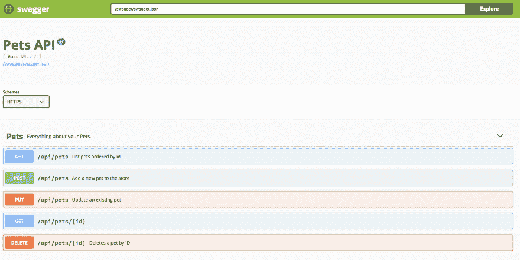

# Jooby:将 Java/Kotlin API 导出到 Swagger/RAML

> 原文:[https://dev . to/edgarespina/jooby-export-your-javakotlin-API-to-swaggerraml-45g 9](https://dev.to/edgarespina/jooby-export-your-javakotlin-api-to-swaggerraml-45g9)

# 概述

编写软件时，文档是必不可少的，特别是如果你编写复杂的业务需求、开源软件、API 等..

> 每个人都想要好的文档，但是没有人想写它。

编写好的文档很难，需要时间，而且总是会过时。

我发现这些规则在编写文档时很有用:

1.  保持文档简单(不要太简单)
2.  像对待需求一样对待文档
3.  使用工具使文档保持最新

例如，JavaDoc(规则 3)是一个很好的工具，它:

*   让文档靠近源代码
*   生成反映源代码当前状态的静态站点

当然，您需要保持 JavaDoc 注释的更新，但是至少文档足够接近您的源代码，并且例如可以通过工具和/或代码审查作为开发过程的一部分被强制执行(规则#2)。

在这篇文章中，我们将导出一个 Jooby API 给 Swagger 和 RAML。

# 养蜂工具

[ApiTool](http://jooby.org/doc/apitool) 模块类似于 JavaDoc。它是一个工具，可以扫描您的代码，并产生一个中间表示，可以导出到 Swagger 或 RAML。

ApiTool 模块的目标是:

*   *开发者第一*。您专注于您的 API 和业务需求(不需要考虑 Swagger/RAML 细节)。
*   *清理源代码*。你的方法并没有充满注释。
*   *使用 JavaDoc* 。文档是从现有的 JavaDoc 注释中提取的(编写一次文档)。

# 演示

我们将模仿来自 [swagger.io](https://swagger.io) 的 [Petstore](http://petstore.swagger.io/#) API 演示的子集。

为了增加乐趣，我们将:

*   使用 [Kotlin](https://kotlinlang.or) 编写 API
*   使用[杰克逊](http://jooby.org/doc/jackson)进行 JSON 处理
*   使用[光](http://jooby.org/jdbc)数据库连接池
*   使用 [Flyway](http://jooby.org/doc/flyway) 运行数据库迁移
*   使用 [Jdbi](http://jooby.org/doc/jdbi3) 访问数据库

听起来很多，对吧？幸运的是，API 只有几行代码，在 [Jooby](http://jooby.org) :

```
/**
 * Kotlin ApiTool.
 */
class App : Kooby({

    /** JSON: */
    use(Jackson())

    /** Database: */
    use(Jdbc())
    use(Flywaydb())
    use(Jdbi3()
            .doWith { jdbi ->
                jdbi.installPlugin(SqlObjectPlugin())
                jdbi.installPlugin(KotlinPlugin())
                jdbi.installPlugin(KotlinSqlObjectPlugin())
            }
            /** Simple transaction per request and bind the PetRepository to it:  */
            .transactionPerRequest(
                    TransactionalRequest()
                            .attach(PetRepository::class.java)
            ))

    /** Export API to Swagger and RAML: */
    use(ApiTool()
            .filter { r -> r.pattern().startsWith("/api") }
            .swagger()
            .raml())

    // Home page redirect to Swagger:
    get { Results.redirect("/swagger") }

    /**
     * Everything about your Pets.
     */
    path("/api/pet") {
        /**
         * List pets ordered by id.
         *
         * @param start Start offset, useful for paging. Default is `0`.
         * @param max Max page size, useful for paging. Default is `20`.
         * @return Pets ordered by name.
         */
        get {
            val db = require(PetRepository::class)

            val start = param("start").intValue(0)
            val max = param("max").intValue(20)

            db.list(start, max)
        }

        /**
         * Find pet by ID
         *
         * @param id Pet ID.
         * @return Returns `200` with a single pet or `404`
         */
        get("/:id") {
            val db = require(PetRepository::class)

            val id = param<Long>("id")

            val pet = db.findById(id) ?: throw Err(Status.NOT_FOUND)

            pet
        }

        /**
         * Add a new pet to the store.
         *
         * @param body Pet object that needs to be added to the store.
         * @return Returns a saved pet.
         */
        post {
            val db = require(PetRepository::class)

            val pet = body<Pet>()

            val id = db.insert(pet)

            Pet(id, pet.name)
        }

        /**
         * Update an existing pet.
         *
         * @param body Pet object that needs to be updated.
         * @return Returns a saved pet.
         */
        put {
            val db = require(PetRepository::class)

            val pet = body<Pet>()
            if (!db.update(pet)) {
                throw Err(Status.NOT_FOUND)
            }
            pet
        }

        /**
         * Deletes a pet by ID.
         *
         * @param id Pet ID.
         * @return A `204`
         */
        delete("/:id") {
            val db = require(PetRepository::class)

            val id = param<Long>("id")

            if (!db.delete(id)) {
                throw Err(Status.NOT_FOUND)
            }
            Results.noContent()
        }
    }
}) 
```

<svg width="20px" height="20px" viewBox="0 0 24 24" class="highlight-action crayons-icon highlight-action--fullscreen-on"><title>Enter fullscreen mode</title></svg> <svg width="20px" height="20px" viewBox="0 0 24 24" class="highlight-action crayons-icon highlight-action--fullscreen-off"><title>Exit fullscreen mode</title></svg>

我们使用方法通过[安装几个模块。](https://static.javadoc.io/org.jooby/jooby/1.2.3/org/jooby/Jooby.html#use-org.jooby.Jooby.Module-) 

```
 /** JSON: */
    use(Jackson())

    /** Database: */
    use(Jdbc())
    use(Flywaydb())
    use(Jdbi3()
            .doWith { jdbi ->
                jdbi.installPlugin(SqlObjectPlugin())
                jdbi.installPlugin(KotlinPlugin())
                jdbi.installPlugin(KotlinSqlObjectPlugin())
            }
            /** Simple transaction per request and bind the PetRepository to it:  */
            .transactionPerRequest(
                    TransactionalRequest()
                            .attach(PetRepository::class.java)
            )) 
```

<svg width="20px" height="20px" viewBox="0 0 24 24" class="highlight-action crayons-icon highlight-action--fullscreen-on"><title>Enter fullscreen mode</title></svg> <svg width="20px" height="20px" viewBox="0 0 24 24" class="highlight-action crayons-icon highlight-action--fullscreen-off"><title>Exit fullscreen mode</title></svg>

用于 JSON 处理的[杰克逊](http://jooby.org/doc/jackson)模块。

[Jdbc](http://jooby.org/doc/jdbc) 模块使用[光](https://github.com/brettwooldridge/HikariCP)创建一个高性能连接池。数据库详细信息(url、用户、密码)列在`application.conf`文件中。

[Flyway](http://jooby.org/doc/flyway) 模块选择先前创建的数据库，并从`src/resources/db/migration`目录运行数据库迁移。

Jdbi 模块通过类似 DAO/Repository 的类为您提供数据库访问。 [Jdbi](http://jdbi.org) 也是一个非常轻量级的库，我们必须通过`plugins`安装或添加新功能。我们在这里添加了知识库支持和 [Kotlin](https://kotlinlang.org) 相关插件。

最后我们安装 [ApiTool](http://jooby.org/doc/apitool) :

```
 /** Export API to Swagger and RAML: */
    use(ApiTool()
            .filter { r -> r.pattern().startsWith("/api") }
            .swagger()
            .raml()) 
```

<svg width="20px" height="20px" viewBox="0 0 24 24" class="highlight-action crayons-icon highlight-action--fullscreen-on"><title>Enter fullscreen mode</title></svg> <svg width="20px" height="20px" viewBox="0 0 24 24" class="highlight-action crayons-icon highlight-action--fullscreen-off"><title>Exit fullscreen mode</title></svg>

我们不想导出我们所有的路线，只导出那些在`/api`路径下的路线，这就是`filter`线路所做的。

调用`swagger()`和`raml()`将我们的 API 导出到那些格式。

如果您运行该应用程序，您应该会看到如下内容:

[T2】](https://res.cloudinary.com/practicaldev/image/fetch/s--HpAvQU2e--/c_limit%2Cf_auto%2Cfl_progressive%2Cq_auto%2Cw_880/http://jooby.org/resourcimg/apitool-swagger.png)

# apitool 目标

让我们回顾其中一条路线:

```
 /**
     * Everything about your Pets.
     */
    path("/api/pet") {
        /**
         * List pets ordered by id.
         *
         * @param start Start offset, useful for paging. Default is `0`.
         * @param max Max page size, useful for paging. Default is `20`.
         * @return Pets ordered by name.
         */
        get {
            val db = require(PetRepository::class)

            val start = param("start").intValue(0)
            val max = param("max").intValue(20)

            db.list(start, max)
        }
    ... 
```

<svg width="20px" height="20px" viewBox="0 0 24 24" class="highlight-action crayons-icon highlight-action--fullscreen-on"><title>Enter fullscreen mode</title></svg> <svg width="20px" height="20px" viewBox="0 0 24 24" class="highlight-action crayons-icon highlight-action--fullscreen-off"><title>Exit fullscreen mode</title></svg>

正如承诺的那样，ApiTool 模块

*   让您专注于 API，
*   保持代码的整洁
*   用 JavaDoc 注释补充输出。

源代码中没有任何与 Swagger/RAML 相关的内容。

# 终注

[ApiTool](http://jooby.org/doc/apitool) 模块自动将您的 API 导出到 Swagger/RAML。你不需要浪费时间添加任何额外的东西。

在开发模式下运行应用程序会有一些开销，因为 [ApiTool](http://jooby.org/doc/apitool) 会扫描和分析代码以生成 Swagger/RAML。一旦您通过向 Maven/Gradle 项目添加编译时进程来部署应用程序，这种开销就消除了。

[ApiTool](http://jooby.org/doc/apitool) 还:

*   使用 Kotlin 和 Java 代码
*   支持脚本/lambda 路由，以及 Mvc 路由

源代码可在[这里](https://github.com/jooby-project/apitool-kotlin-starter)获得

编码快乐！