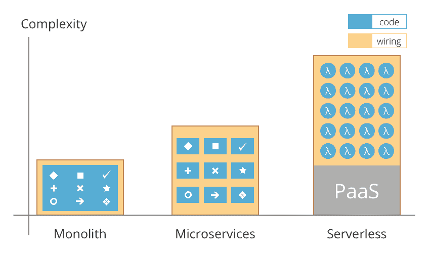

# 无服务器的发展:单片微服务-FaaS

> 原文：<https://dev.to/jignesh_simform/evolution-of-serverless-monolithic-microservices-faas-3hdp>

代表单片—>微服务—> [无服务器架构](https://www.simform.com/serverless-architecture-guide/) (FaaS)的数字化转型方法是由对更高敏捷性和可扩展性的需求驱动的。为了跟上竞争，组织需要快速更新其技术堆栈，最终使软件成为一个与众不同的因素。

因此，微服务架构成为为开发团队提供灵活性和其他好处的关键方法，例如使用基础设施即服务(IaaS)和平台即服务(PaaS)环境以极快的速度交付应用的能力。

这个想法的概念是将单一的应用程序分解成更小的服务，每个服务都有自己的业务逻辑。在一个整体架构中，一个错误的服务就可能导致整个应用服务器和其上运行的所有服务停止运行。

而在微服务中，每个服务都在自己的容器中运行，因此应用架构师可以独立开发、管理和扩展这些服务。

微服务可以单独扩展和部署，并用不同的编程语言编写。但是，许多组织在部署其微服务架构时面临的一个关键决策是在 IaaS 和 PaaS 环境之间做出选择。

微服务涉及源代码管理、构建服务器、代码库、映像库、集群管理器、容器调度器、动态服务发现、软件负载平衡器和云负载平衡器。它还需要一个成熟的敏捷和 DevOps 团队来支持持续交付。

## 接近无服务器

然而，无服务器架构更进了一步，将应用程序细化到功能和事件的层次。因此，很明显，工作单元变得越来越小。

我们已经从单片到微服务再到功能。FaaS 还改进了 PaaS 模型 ie 的缺点。开发和运营之间的伸缩和摩擦。

扩展 PaaS 上托管的微服务极具挑战性且非常复杂。该架构可能包含用不同编程语言编写的元素，部署在多个云和本地位置，运行在不同的容器上。

当对应用程序的需求增加时，所有底层组件都必须协调扩展，或者您必须能够确定哪些单个元素需要扩展以满足需求的激增。

即使您将 PaaS 应用程序设置为自动扩展，除非您知道流量趋势，否则您也不会在单个请求的级别上这样做。因此，就成本而言，FaaS 应用程序要高效得多。

[T2】](https://res.cloudinary.com/practicaldev/image/fetch/s--6kiPopsB--/c_limit%2Cf_auto%2Cfl_progressive%2Cq_auto%2Cw_880/https://www.simform.com/wp-content/uploads/2017/12/complexity.png)

不过，微服务和 FaaS 总会有共存的空间，因为有些事情你根本不能用函数来做。例如，API/微服务将总是响应更快，因为它可以保持到数据库和其他东西的连接开放和就绪。

此外，这里还要注意的一点是，通过将 API 网关后面的一组功能组合在一起，您已经创建了一个微服务。这表明这两者可以很好地共存。

这种高层流程与传统方法保持一致。关键的区别在于，在函数的情况下，容器是由 FaaS 平台中使用的算法创建和销毁的，操作团队对此没有控制权。

* * *

*但是随着功能的简化和成本的降低，复杂性也在增加，我在[无服务器架构综合指南](https://www.simform.com/serverless-architecture-guide/)中讨论了这一点，并深入讨论了无服务器应用的优缺点、工作原理、FaaS、案例研究等等。*

如果你对无服务器架构有任何疑问，欢迎在评论区提问。