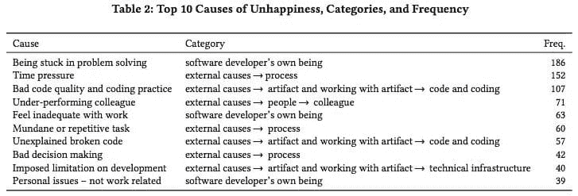
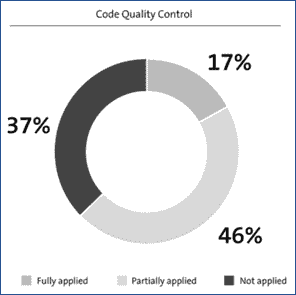
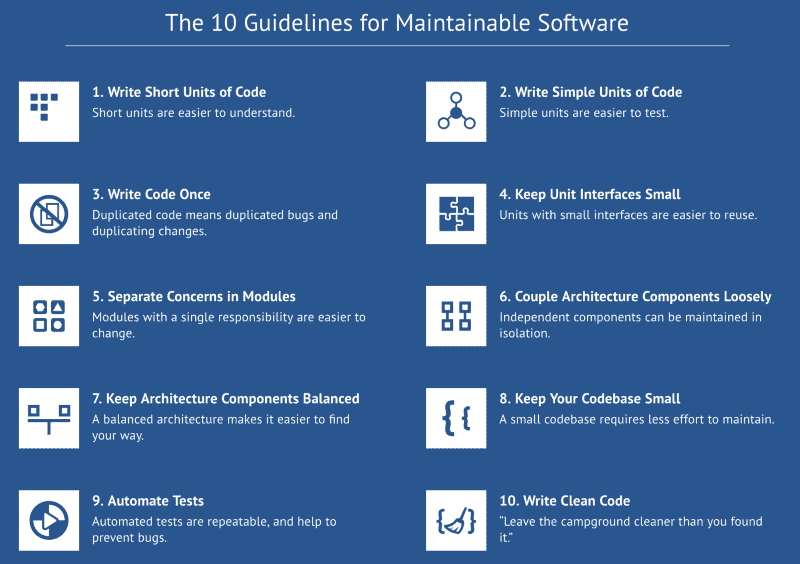

# 驱动创造力的约束

> 原文：<https://dev.to/jstvssr/constraints-that-drive-creativity-2d8p>

#### 不同的代码质量哲学

[T2】](https://res.cloudinary.com/practicaldev/image/fetch/s--ndTNl7BO--/c_limit%2Cf_auto%2Cfl_progressive%2Cq_auto%2Cw_880/https://cdn-images-1.medium.com/max/1024/1%2AcsU2lnqC18RrziVSmOy_rQ.jpeg)

你应该测量和控制代码质量吗？根据 O'Reilly Media 和我在[软件改进小组](https://www.sig.eu/)的同事进行的[调查](https://www.sig.eu/insight/improving-code-quality/)，几乎所有的开发人员都说是！以下是一些令人信服的理由:

*   **快乐:**更好的代码和快乐的开发者一起走。写好的代码更有趣。事实上，*糟糕的*代码质量和编码实践被[认定为](https://t.co/YO2Y0MHXuD)开发人员不快乐的第三大原因。如果开发人员的幸福感不足以作为内在原因，那么想想随之而来的生产率的提高和保留。

<figure> 

<figcaption>摘自[《论软件开发人员的不快乐》](https://t.co/YO2Y0MHXuD)由丹尼尔·格拉齐奥丁、法比安·法格霍尔姆、王晓凤、佩卡·亚伯拉罕森在 EASE 2017 大会上发表并呈现。</figcaption>

</figure>

*   **速度**:好的代码更容易理解，更容易适应，更容易测试，更容易复用。根据定义。现在快速写下一些糟糕的代码，修复错误或添加功能将会在未来花费更多的时间。或者换句话说:[“当前开发速度是过去开发质量的函数”](https://twitter.com/brianm/status/763442655632224256)。

> 布莱恩·麦卡利斯特@布里安姆当前开发速度是过去开发质量的函数。2016 年 8 月 10 日下午 18:31858685

*   敏捷:在软件开发中保持敏捷不仅仅是关于过程和最佳实践，还包括对你的代码进行频繁的修改。以容纳和运输下一个特征。或者响应不断变化的需求。或者因为你学会了如何更好地表达你的意图。高质量的代码允许你频繁而毫不费力地做出这些改变。
*   用户满意度:当开发人员快乐、快速、敏捷时，他们可以开发出最好的产品。具备用户期望和欣赏的功能、性能、可靠性和其他质量特征。所以最终，更好的代码意味着更好的业务。

#### 大多数团队没有恰当地控制代码质量

所以代码质量带来了引人注目的好处。但现在令人震惊的是。并不是所有的专业软件开发团队都以专业的方式度量和控制代码质量。事实上，当评估过去几年许多组织的软件开发实践时，我们发现大约 83%的团队根本不控制代码质量，或者只是部分地控制。

<figure> 

<figcaption>摘自《打造软件团队》(2016)</figcaption>

</figure>

#### 有何不可？

不应用代码质量控制的主要原因是什么？可用于此的工具有什么问题？

1.  **误报和缺乏可操作的建议:**不幸的是，许多代码质量工具向用户提供大量违规警告，其中只有一小部分是有效的*和****。*** 因此，这些工具的输出常常被忽略。**
***   **太贵太难配置**:为了提高输出的有效性和可操作性，一些工具提供了广泛的配置选项。它们还提供了扩展标准行为的可能性，为您的团队或您的产品提供特定的规则集。这样的配置和定制可能看起来是一个很酷的高级功能。事实上，它们可能被宣传为独特的卖点，证明较高的许可费是合理的。但事实上，这意味着您需要投入高级开发人员的宝贵时间来学习和维护这些本来就不便宜的工具。*   没有明确的标准，跨团队和技术:定制的另一个缺点是它破坏了标准化。当每个团队或者开发人员使用他自己的一套质量规则，或者甚至不同的编程语言使用不同的规则时，那么作为开发人员，我们如何能够追求相同的质量水平呢？软件开发是一门社会技术学科，就像驾驶一样。在交通和发展中，只有当我们都坚持同样的交战规则时，我们才能防止事故和快速行进。**

 **#### 不同的代码质量哲学

在[软件改进小组](https://www.sig.eu/)，我们着手解决控制代码质量的(经济)必要性和代码质量工具的不良采用之间的明显冲突。为此，我们需要从不同的角度来看待代码质量。

我们的关键见解是，我们需要从在特定代码位置观察到的单个代码质量违规，提升到表征整个代码库或其重要部分的质量配置文件的抽象级别。

最简单的例子是**“超过 15 行代码的方法中代码行的百分比”**。这个质量概要可以描述一个类、一个包或者整个代码库的可读性。较低的百分比意味着较高的可读性。虽然基于特定代码位置(这里是方法)的质量度量，但是概要文件并没有指出任何特定的位置是“违规”的。相反，我们可以在更高的抽象层次上制定质量规范，例如通过要求所述百分比不超过例如 **20%** 。

质量概要文件允许为与代码质量(例如方法长度)高度相关的度量设置**清晰的、可操作的阈值**(例如 15)。但是它们也有一个内在的概念**容忍度**，相当数量的代码被允许超过阈值(例如 20%)，但是开发人员在这些限制范围内保留决定接受哪些违规者和重构哪些违规者的自由。

#### 面向未来的代码十大准则

基于这一理念，我们为面向未来的代码制定了十条准则。

<figure> 

<figcaption>来自[“构建可维护的软件”](http://shop.oreilly.com/product/0636920049159.do)的编写经得起未来考验的代码的十条指导方针为代码质量提供了一个雄心勃勃但又可实现的定义。</figcaption>

</figure>

注意，这些是**准则**，而不是**规则**。一个规则是二元的，在对与错之间划一条线。合规或违规。但是指导方针只是提供方向。指南允许在明确的范围内进行选择。在软件开发中，就像在艺术中一样，精心选择的约束没有限制，但是**增强了创造力。**

> “创造力是由约束驱动的”——戴夫·格雷

我们根据数百个软件系统的代码分析结果校准了这些指南中的阈值和容差。这 10 条准则为代码质量提供了一个清晰的定义。对“完成”的定义是雄心勃勃的，但由于内在的容忍性，没有过分的限制。我们建立了一个更好的代码中心，在你的代码库上为你检查那些指导方针。

#### 更好的代码中枢

[Better Code Hub](https://bettercodehub.com/) 的目的是展示一种不同的代码质量控制方法是可能的。一种更简单、限制更少、更有趣的方法。这就是它为你做的:

1.  **提供一个清晰的完成定义**，它独立于技术、团队或产品。代码质量的单一标准。
2.  **易于采用和即时反馈。**通过 GitHub Marketplace(对开源、初创企业和教育用途免费)，您可以在几分钟内运行更好的 Code Hub。通过拨动一个开关，您可以激活对每个推拉请求的反馈。
3.  重构帮助:更好的代码中枢不仅告诉你你的代码遵守和不遵守哪些准则。它还为您提供了重构候选对象。当您选择要重构的候选对象时，您可以实时预测您的准则遵从性将会受到怎样的影响。

所以，如果你的团队还没有度量和控制代码质量，现在是时候开始了。给[更好的代码 Hub](https://bettercodehub.com/) 试试。会很好玩的！

[*约斯特·维瑟*](https://www.linkedin.com/in/jstvssr) *是软件改进小组的首席技术官，拉德布大学大规模软件系统教授，也是奥莱利著作《构建可维护软件》和《构建软件团队》的作者。*

*   [构建可维护的软件，Java 版](http://shop.oreilly.com/product/0636920049159.do)
*   [构建可维护的软件，C#版本](http://shop.oreilly.com/product/0636920049555.do)
*   [建立软件团队](http://shop.oreilly.com/product/0636920048565.do)
*   [更好的代码中心- GitHub 市场](https://github.com/marketplace/better-code-hub)

* * ***