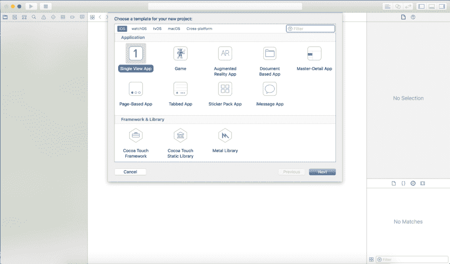
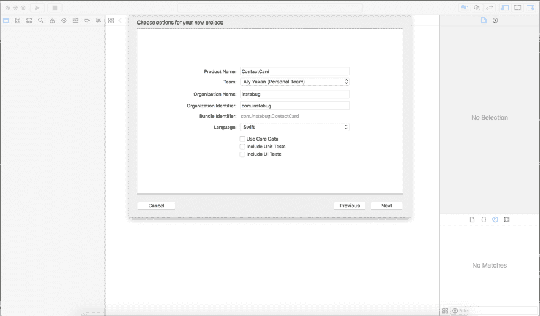
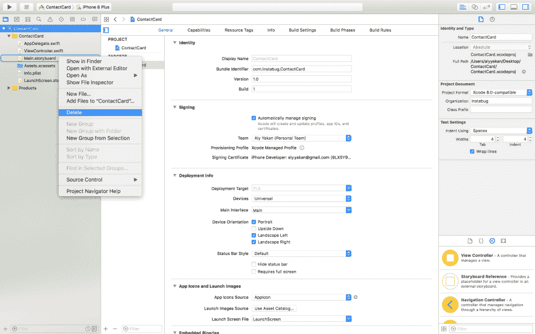
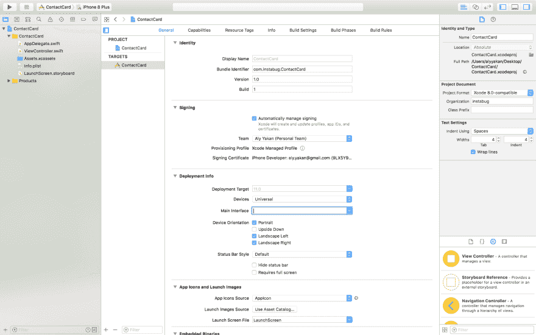
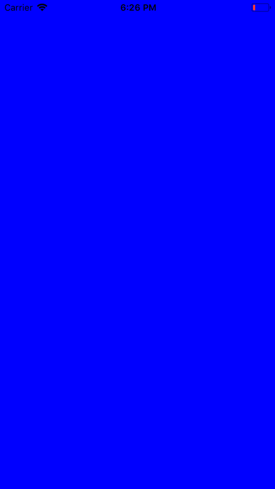
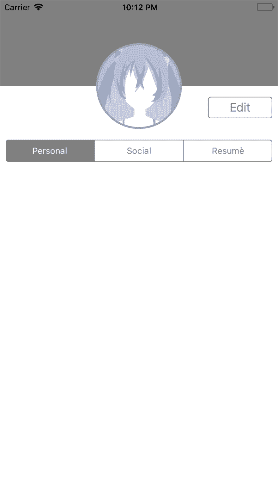
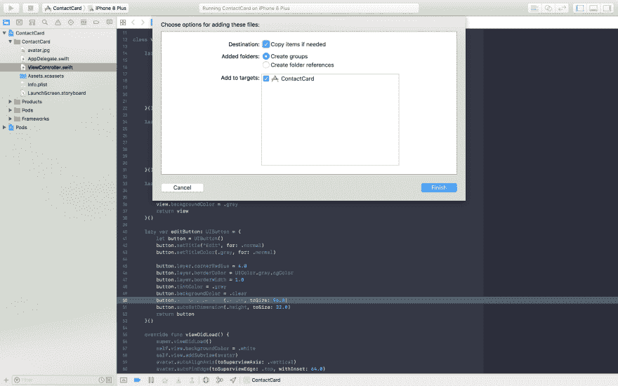
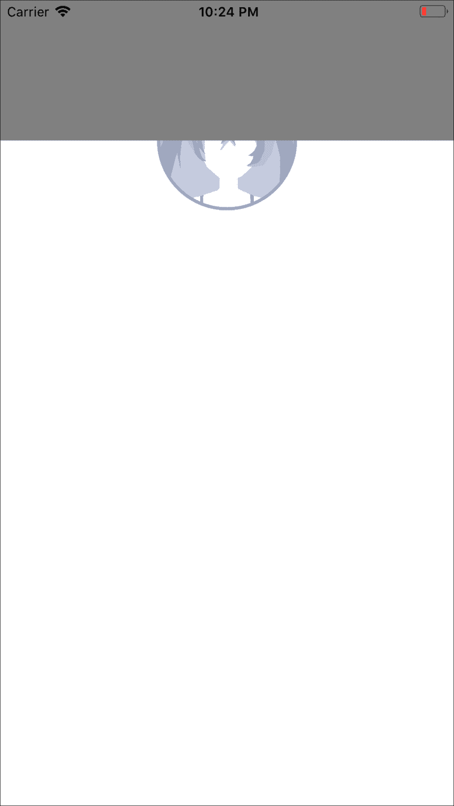
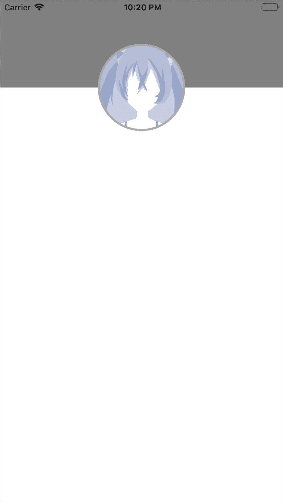
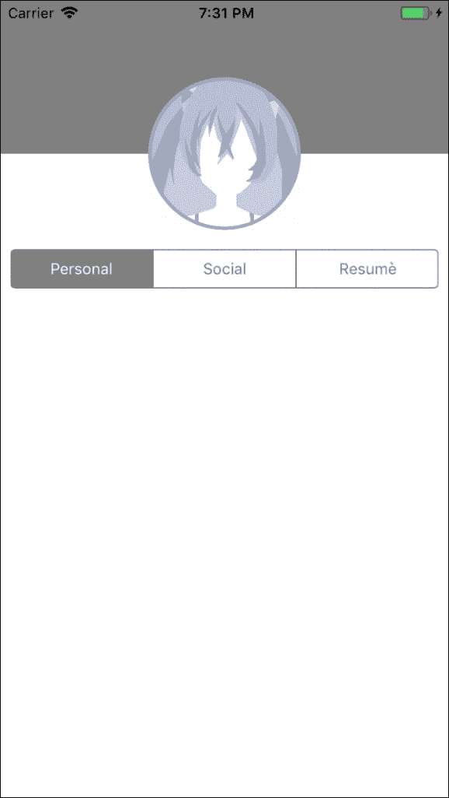

# 使用 PureLayout 以编程方式创建 UIViews 约束

> 原文:[https://dev . to/insta bug/creating-ui views-constraints-programmably-using-pure layout-48am](https://dev.to/instabug/creating-uiviews-constraints-programmatically-using-purelayout-48am)

#### 作者[阿里·亚坎](https://dev.to/alyakan)

今天，我们将带您浏览[以编程方式创建约束](https://blog.instabug.com/2017/12/nslayoutconstraint-programmatically/?utm_source=devto&utm_medium=referral&utm_content=nslayoutconstraint)——完全用代码构建一个简单的移动应用程序的 UI，而不使用故事板或笔尖。我不会去争论哪个更好，因为简单地说，它们都有各自的优点和缺点，所以我只在这里留下这个链接，它更深入地探讨了这个问题:[https://www . top tal . com/IOs/IOs-user-interfaces-story boards-vs-nibs-vs-custom-code](https://www.toptal.com/ios/ios-user-interfaces-storyboards-vs-nibs-vs-custom-code)。

### 概述

本教程是使用 Xcode 9 和 Swift 4 编写的。我还假设您熟悉 Xcode、Swift 和 CocoaPods。

不再拖延，让我们开始构建我们的项目:一个简单的联系人卡片应用程序。本教程旨在教你如何用代码构建你的应用程序的用户界面，因此，它不会包含任何关于应用程序功能的逻辑，除非它符合本教程的目的。

### 设置项目

首先启动 Xcode ->“创建一个新的 Xcode 项目”。选择“单视图应用程序”，然后按“下一步”。

[T2】](https://res.cloudinary.com/practicaldev/image/fetch/s--CrtL2c2D--/c_limit%2Cf_auto%2Cfl_progressive%2Cq_auto%2Cw_880/https://i2.wp.com/blog.instabug.com/wp-content/uploads/2017/10/Screen-Shot-2017-10-22-at-5.31.15-PM.png%3Fw%3D2400%26ssl%3D1)

你可以给这个项目起任何你喜欢的名字，我选择叫它“联系卡”，没有明显的原因。取消勾选以下所有三个选项，当然，选择 Swift 作为编程语言，然后按“下一步”。

[T2】](https://res.cloudinary.com/practicaldev/image/fetch/s--xMFiVamz--/c_limit%2Cf_auto%2Cfl_progressive%2Cq_auto%2Cw_880/https://i1.wp.com/blog.instabug.com/wp-content/uploads/2017/10/Screen-Shot-2017-10-22-at-5.31.53-PM.png%3Fw%3D2400%26ssl%3D1)

在计算机上选择一个位置来保存项目。取消选中“在我的 Mac 上创建 Git 存储库”，然后按“创建”。

因为我们不会使用故事板，或者笔尖，继续删除“Main.storyboard ”,它可以在项目导航器中找到:

[T2】](https://res.cloudinary.com/practicaldev/image/fetch/s--NFRwVy7C--/c_limit%2Cf_auto%2Cfl_progressive%2Cq_auto%2Cw_880/https://i0.wp.com/blog.instabug.com/wp-content/uploads/2017/10/Screen-Shot-2017-10-22-at-5.40.20-PM.png%3Fw%3D2400%26ssl%3D1)

之后，在项目导航器中点击项目，在“General”选项卡下找到“Deployment Info”部分，删除“Main Interface”旁边的内容，通常是“Main”这个词。这告诉 Xcode 在应用程序启动时加载哪个故事板文件，但是因为我们刚刚删除了“Main.storyboard ”,保留这一行会使应用程序崩溃，因为 Xcode 找不到该文件。

[T2】](https://res.cloudinary.com/practicaldev/image/fetch/s--0WgEAqlT--/c_limit%2Cf_auto%2Cfl_progressive%2Cq_auto%2Cw_880/https://i2.wp.com/blog.instabug.com/wp-content/uploads/2017/10/Screen-Shot-2017-10-22-at-5.41.49-PM.png%3Fw%3D2400%26ssl%3D1)

所以继续删除“主要”这个词。

### 创建 ViewController

此时，如果您运行应用程序，将会出现黑屏，因为应用程序现在没有任何 UI 源来呈现给用户，所以下一部分我们将为它提供一个 UI 源。打开“AppDelegate.swift”并在`application(_ application: UIApplication, didFinishLaunchingWithOptions launchOptions: [UIApplicationLaunchOptionsKey: Any]?)`中插入以下代码片段:

```
 self.window = UIWindow(frame: UIScreen.main.bounds) 
    let viewController = ViewController() 
    self.window?.rootViewController = viewController    
    self.window?.makeKeyAndVisible() 
```

<svg width="20px" height="20px" viewBox="0 0 24 24" class="highlight-action crayons-icon highlight-action--fullscreen-on"><title>Enter fullscreen mode</title></svg> <svg width="20px" height="20px" viewBox="0 0 24 24" class="highlight-action crayons-icon highlight-action--fullscreen-off"><title>Exit fullscreen mode</title></svg>

这基本上是为用户与应用程序的交互提供了一个窗口。该窗口的视图控制器是项目创建时提供的，可以在“ViewController.swift”中找到。为了快速测试一下是否一切正常，请转到“ViewController.swift”并在`viewDidLoad()`方法中插入下面一行:

```
 self.view.backgroundColor = .blue 
```

<svg width="20px" height="20px" viewBox="0 0 24 24" class="highlight-action crayons-icon highlight-action--fullscreen-on"><title>Enter fullscreen mode</title></svg> <svg width="20px" height="20px" viewBox="0 0 24 24" class="highlight-action crayons-icon highlight-action--fullscreen-off"><title>Exit fullscreen mode</title></svg>

现在，在您首选的模拟器设备上运行应用程序。

在 Xcode 中导航文件的一个有用的快捷方式是“⇧⌘O ”,然后输入文件名，甚至是你要找的一段代码，屏幕上会出现一个文件列表，你可以从中选择。

运行应用程序后，模拟器屏幕上的结果应该是这样的:

[T2】](https://res.cloudinary.com/practicaldev/image/fetch/s--I5oauyNv--/c_limit%2Cf_auto%2Cfl_progressive%2Cq_auto%2Cw_880/https://i0.wp.com/blog.instabug.com/wp-content/uploads/2017/10/Simulator-Screen-Shot-iPhone-7-2017-10-22-at-18.26.00.png%3Fw%3D638%26ssl%3D1)

当然我们不会用那种难看的蓝色，所以只要把`viewDidLoad()`里面的`.blue`替换成`.white`就可以了。

### 布局用户界面

为了设计我们的 UI，我们将使用一个非常有用的库，它将使我们的生活变得更加容易。它的回购可以在 https://github.com/PureLayout/PureLayout T2 找到。要安装 PureLayout，您应该首先打开您的终端并“cd”到项目的目录中。你可以通过键入`cd`，然后一个空格，然后将你的项目的文件夹拖放到终端中，并按下“Enter”键。现在，在终端中运行以下命令:

`pod init`
T1】

这应该是运行第二个命令后终端的输出:

[T2】](https://res.cloudinary.com/practicaldev/image/fetch/s--sc0jJqT_--/c_limit%2Cf_auto%2Cfl_progressive%2Cq_auto%2Cw_880/https://i1.wp.com/blog.instabug.com/wp-content/uploads/2017/10/Screen-Shot-2017-10-22-at-6.34.32-PM.png%3Fw%3D2400%26ssl%3D1)

之后，关闭 Xcode，打开 Finder 里面的文件夹，你应该会找到一个叫“的东西。xcworkspace”。如果我们需要使用 CocoaPods，我们将打开它来访问我们的应用程序。现在找到一个名为“PodFile”的文件，在短语`use_frameworks!`下面写下下面一行

`pod “PureLayout”`

再次在您的终端上运行 pod install，然后按“Command + B”来构建您的项目。

### 茶歇

现在一切都准备好了，让我们开始真正的工作。前往“ViewController.swift”并喝杯咖啡，因为这是最终结果的样子:

[T2】](https://res.cloudinary.com/practicaldev/image/fetch/s--HrBgq_gb--/c_limit%2Cf_auto%2Cfl_progressive%2Cq_auto%2Cw_880/https://thepracticaldev.s3.amazonaws.com/i/plomvfzwebnz62jf2qcp.png)

### 创建图像视图

在`import UIKit`下面插入一行`import PureLayout`，以便能够使用该文件中的库。接下来，在类声明之下和任何函数之外，我们将开始创建`Avatar ImageView`惰性变量，如下所示，代码片段:

```
lazy var avatar: UIImageView = {
    let imageView = UIImageView(image: UIImage(named: "avatar.jpg"))
    imageView.autoSetDimensions(to: CGSize(width: 128.0, height: 128.0))
    imageView.layer.borderWidth = 3.0
    imageView.layer.borderColor = UIColor.lightGray.cgColor
    imageView.layer.cornerRadius = 64.0
    imageView.clipsToBounds = true
    return imageView
}() 
```

<svg width="20px" height="20px" viewBox="0 0 24 24" class="highlight-action crayons-icon highlight-action--fullscreen-on"><title>Enter fullscreen mode</title></svg> <svg width="20px" height="20px" viewBox="0 0 24 24" class="highlight-action crayons-icon highlight-action--fullscreen-off"><title>Exit fullscreen mode</title></svg>

至于图像，在你的桌面上找到任何你想用作头像的图像，把它放到 Xcode 的文件夹下，在我的例子中是“联系人卡片”，然后勾选“如果需要，复制项目”。

[T2】](https://res.cloudinary.com/practicaldev/image/fetch/s--z_IwvZUE--/c_limit%2Cf_auto%2Cfl_progressive%2Cq_auto%2Cw_880/https://i0.wp.com/blog.instabug.com/wp-content/uploads/2017/10/Screen-Shot-2017-10-23-at-10.06.50-PM.png%3Fw%3D2400%26ssl%3D1)

然后点击“完成”。之后，将该文件的名称及其扩展名写在`UIImage`的声明中，而不是“avatar.jpg”。

对于那些不知道的人来说，惰性变量就像普通变量一样，只是它们直到第一次被需要或者被调用时才会被初始化(或者分配内存空间)。这意味着当视图控制器被初始化时，惰性变量不会被初始化，而是等到稍后真正需要它们的时候，这为其他进程节省了处理能力和内存空间。这些在初始化 UI 组件时特别有用。

### PureLayout 在行动

正如您在初始化中看到的，这一行`imageView.autoSetDimensions(to: CGSize(width: 128.0, height: 128.0))`是 PureLayout 的实际应用。只用一行代码，我们就为`UIImageView`的高度和宽度设置了一个约束，所有必要的`NSLayoutConstraint`行都创建好了，而没有处理庞大函数调用的麻烦。如果您已经通过编程处理过创建约束，那么您现在一定已经爱上了这个出色的库。

为了使这个图像看起来更圆，我们将它的角半径设置为它的宽度或高度的一半，即 64.0 磅。此外，为了让图像本身考虑图像视图的圆度，我们将`clipsToBounds`属性设置为 true，这告诉图像应该裁剪掉我们刚刚设置的半径之外的任何内容。

然后我们开始创建一个`UIView`，它将作为灰色头像后面视图的上半部分。以下惰性变量是该视图的声明:

```
lazy var upperView: UIView = {
    let view = UIView()
    view.autoSetDimension(.height, toSize: 128)
    view.backgroundColor = .gray
    return view
}() 
```

<svg width="20px" height="20px" viewBox="0 0 24 24" class="highlight-action crayons-icon highlight-action--fullscreen-on"><title>Enter fullscreen mode</title></svg> <svg width="20px" height="20px" viewBox="0 0 24 24" class="highlight-action crayons-icon highlight-action--fullscreen-off"><title>Exit fullscreen mode</title></svg>

### 添加子视图

在我们忘记之前，让我们创建一个名为`func addSubviews()`的函数，它将我们刚刚创建的视图(以及我们将要创建的所有其他视图)作为子视图添加到视图控制器的视图:

```
func addSubviews() {
    self.view.addSubview(avatar)
    self.view.addSubview(upperView)
} 
```

<svg width="20px" height="20px" viewBox="0 0 24 24" class="highlight-action crayons-icon highlight-action--fullscreen-on"><title>Enter fullscreen mode</title></svg> <svg width="20px" height="20px" viewBox="0 0 24 24" class="highlight-action crayons-icon highlight-action--fullscreen-off"><title>Exit fullscreen mode</title></svg>

现在将下面一行添加到`viewDidLoad(): self.addSubviews()`

### 设置约束

为了了解我们的进度，让我们为这两个视图设置约束。创建另一个名为 func setupConstraints()的函数，并插入以下约束:

```
func setupConstraints() {
    avatar.autoAlignAxis(toSuperviewAxis: .vertical)
    avatar.autoPinEdge(toSuperviewEdge: .top, withInset: 64.0)
    upperView.autoPinEdge(toSuperviewEdge: .left)
    upperView.autoPinEdge(toSuperviewEdge: .right)
    upperView.autoPinEdgesToSuperviewEdges(with: .zero, excludingEdge: .bottom)
} 
```

<svg width="20px" height="20px" viewBox="0 0 24 24" class="highlight-action crayons-icon highlight-action--fullscreen-on"><title>Enter fullscreen mode</title></svg> <svg width="20px" height="20px" viewBox="0 0 24 24" class="highlight-action crayons-icon highlight-action--fullscreen-off"><title>Exit fullscreen mode</title></svg>

现在在`viewDidLoad()`内部通过添加函数调用来调用`setupConstraints()`，如下:`self.setupConstraints()`。在调用`addSubviews()`后添加这个。这应该是最终输出:

[T2】](https://res.cloudinary.com/practicaldev/image/fetch/s--JQ3I778S--/c_limit%2Cf_auto%2Cfl_progressive%2Cq_auto%2Cw_880/https://thepracticaldev.s3.amazonaws.com/i/ob9e1fqa2xotpro2f4u8.png)

### 带到前面

哎呀，这好像不对。如您所见，我们的`upperView`位于`avatar`之上。这是因为我们在`upperView`之前添加了`avatar`作为子视图，由于这些子视图是以某种堆栈的形式排列的，所以看到这个结果是很自然的。为了解决这个问题，我们可以把这两条线互相替换，但是我还想告诉你另一个技巧，那就是:`self.view.bringSubview(toFront: avatar)`。

这种方法将使头像从底部一直回到顶部，不管它上面有多少视图。所以选择你喜欢的方法。当然，为了可读性，如果子视图碰巧相交，最好按照它们应该出现在另一个上面的顺序添加子视图，同时记住，第一个添加的子视图将在堆栈的底部，因此任何其他相交的视图将出现在它的顶部。

这才是它真正的样子:

[T2】](https://res.cloudinary.com/practicaldev/image/fetch/s--GOVO74Io--/c_limit%2Cf_auto%2Cfl_progressive%2Cq_auto%2Cw_880/https://thepracticaldev.s3.amazonaws.com/i/vlub2ygvfouxn5o85a6l.png)

### 创建分段控制

继续，我们现在将创建分段控件，它是包含三个部分的灰色条。创建分段控件实际上很简单。只需执行以下操作:

```
lazy var segmentedControl: UISegmentedControl = {
    let control = UISegmentedControl(items: ["Personal", "Social", "Resumè"])
    control.autoSetDimension(.height, toSize: 32.0)
    control.selectedSegmentIndex = 0
    control.layer.borderColor = UIColor.gray.cgColor
    control.tintColor = .gray
    return control
}() 
```

<svg width="20px" height="20px" viewBox="0 0 24 24" class="highlight-action crayons-icon highlight-action--fullscreen-on"><title>Enter fullscreen mode</title></svg> <svg width="20px" height="20px" viewBox="0 0 24 24" class="highlight-action crayons-icon highlight-action--fullscreen-off"><title>Exit fullscreen mode</title></svg>

我相信一切都很清楚，唯一不同的是在初始化时，我们为它提供了一个字符串数组，每个字符串代表一个我们想要的部分的标题。我们还将 selectedSegmentIndex 设置为 0，这告诉分段控件在初始化时高亮显示/选择第一个分段。剩下的只是你可以随意摆弄的造型。

现在让我们继续，通过在`func addSubviews(): self.view.addSubview(segmentedControl)`的末尾插入下面一行，将其添加为子视图，它的约束将是:

```
 segmentedControl.autoPinEdge(toSuperviewEdge: .left, withInset: 8.0)
    segmentedControl.autoPinEdge(toSuperviewEdge: .right, withInset: 8.0)
    segmentedControl.autoPinEdge(.top, to: .bottom, of: avatar, withOffset: 16.0) 
```

<svg width="20px" height="20px" viewBox="0 0 24 24" class="highlight-action crayons-icon highlight-action--fullscreen-on"><title>Enter fullscreen mode</title></svg> <svg width="20px" height="20px" viewBox="0 0 24 24" class="highlight-action crayons-icon highlight-action--fullscreen-off"><title>Exit fullscreen mode</title></svg>

花点时间想想这些。我们告诉分段控件，我们希望将它固定在超级视图的左侧，但是，我们希望有一点点间距，而不是将它直接固定在屏幕的边缘。如果你注意到，我用的是所谓的八点网格，所有的间距和大小都是 8 的倍数。我对分段控件的右侧做了同样的操作。至于最后一个约束，它只是简单地说将其顶部以 16 点的间距钉在 avatar 的底部。

将上述约束添加到`func setupConstraints()`后，运行代码并确保其如下所示:

[T2】](https://res.cloudinary.com/practicaldev/image/fetch/s--1EkJA6oh--/c_limit%2Cf_auto%2Cfl_progressive%2Cq_auto%2Cw_880/https://thepracticaldev.s3.amazonaws.com/i/htbxlfdnywj4zhegvikr.png)

### 添加按钮

现在来看这个小教程的最后一块 UI，就是“编辑”按钮。添加以下惰性变量:

```
lazy var editButton: UIButton = {
    let button = UIButton()
    button.setTitle("Edit", for: .normal)
    button.setTitleColor(.gray, for: .normal)
    button.layer.cornerRadius = 4.0
    button.layer.borderColor = UIColor.gray.cgColor
    button.layer.borderWidth = 1.0
    button.tintColor = .gray
    button.backgroundColor = .clear
    button.autoSetDimension(.width, toSize: 96.0)
    button.autoSetDimension(.height, toSize: 32.0)
    return button
}() 
```

<svg width="20px" height="20px" viewBox="0 0 24 24" class="highlight-action crayons-icon highlight-action--fullscreen-on"><title>Enter fullscreen mode</title></svg> <svg width="20px" height="20px" viewBox="0 0 24 24" class="highlight-action crayons-icon highlight-action--fullscreen-off"><title>Exit fullscreen mode</title></svg>

不要担心初始化有多大，但是请注意我是如何通过调用函数 button.setTitle 和 button.setTitleColor 来设置标题及其颜色的。

现在，像其他组件一样，将按钮添加为子视图，并添加以下约束，使其出现在应该出现的位置:

```
editButton.autoPinEdge(.top, to: .bottom, of: upperView, withOffset: 16.0)
editButton.autoPinEdge(toSuperviewEdge: .right, withInset: 8.0) 
```

<svg width="20px" height="20px" viewBox="0 0 24 24" class="highlight-action crayons-icon highlight-action--fullscreen-on"><title>Enter fullscreen mode</title></svg> <svg width="20px" height="20px" viewBox="0 0 24 24" class="highlight-action crayons-icon highlight-action--fullscreen-off"><title>Exit fullscreen mode</title></svg>

这里我们只为按钮设置了右边和上边的约束，因为我们给了它一个大小，它不会扩展，也不需要其他东西。现在继续运行这个项目，看看最终的结果:

[T2】](https://res.cloudinary.com/practicaldev/image/fetch/s--D_BLnZsD--/c_limit%2Cf_auto%2Cfl_progressive%2Cq_auto%2Cw_880/https://thepracticaldev.s3.amazonaws.com/i/22x04slfiupxn7ykgkaa.png)

### 一些最后的笔记

尝试一下，添加尽可能多的 UI 元素。尝试重新创建任何你认为有挑战性的应用程序视图。从简单开始，然后从那里开始积累。试着在一张纸上画出 UI 组件，这样你就可以想象它们是如何组合在一起的。

**在 blog.instabug.com[了解更多信息](https://blog.instabug.com/?utm_source=devto&utm_medium=referral&utm_content=nslayoutconstraint)。**