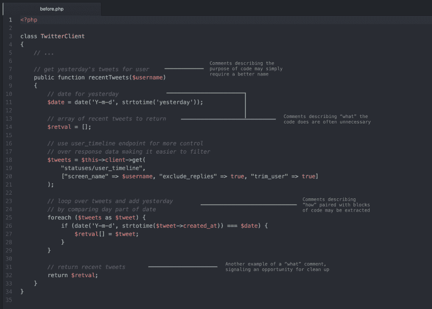
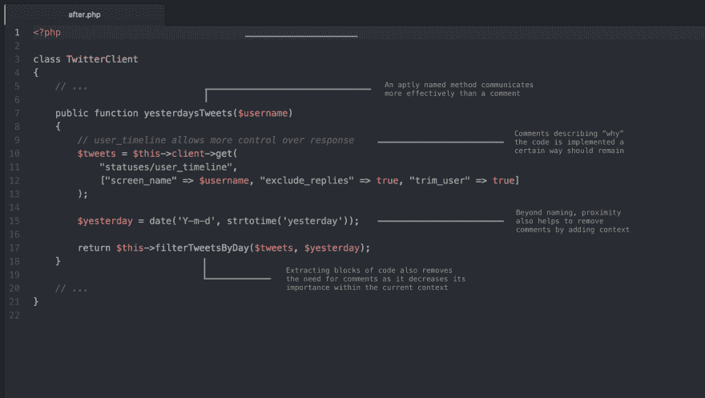
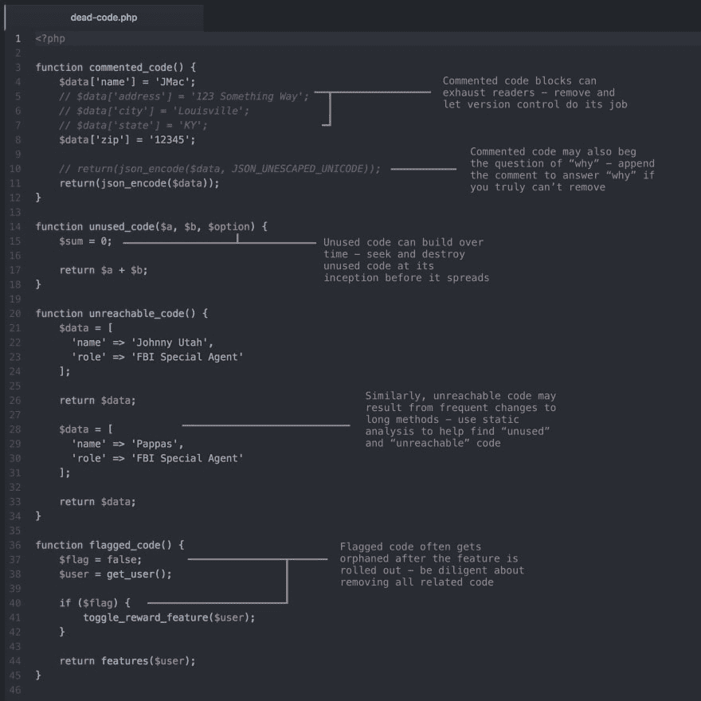
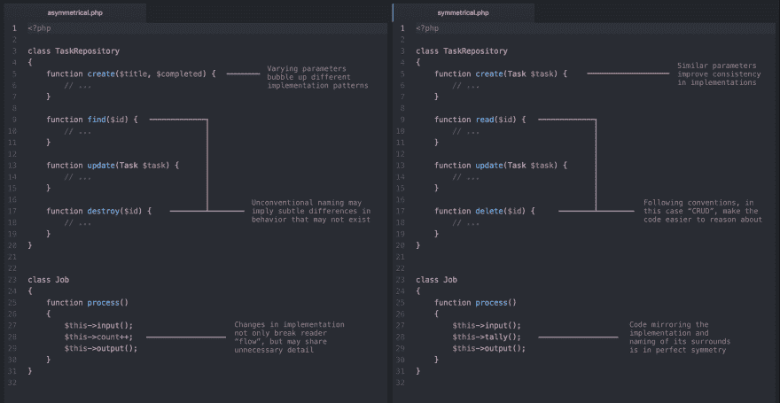
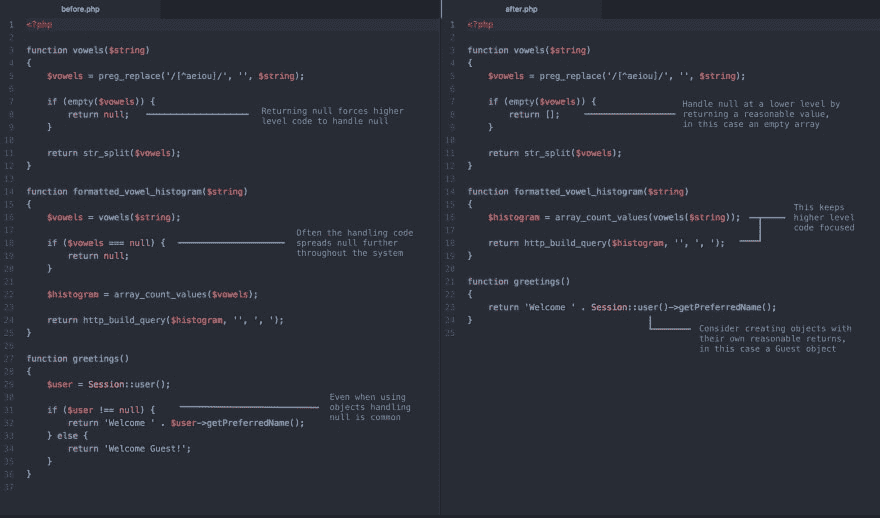
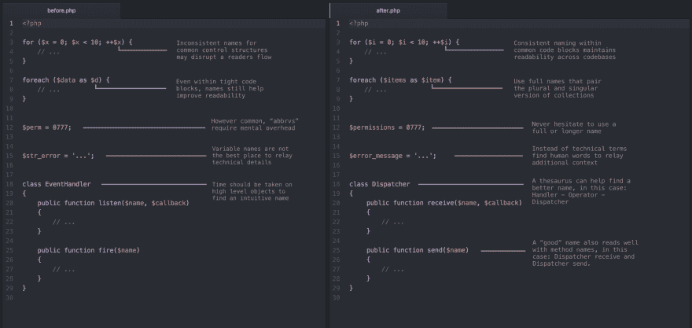

# 又一个月的干净代码

> 原文:[https://dev.to/gonedark/another-month-of-clean-code-4gig](https://dev.to/gonedark/another-month-of-clean-code-4gig)

上个月我发表了[一个月的干净代码](https://dev.to/gonedark/a-month-of-clean-code-tips-709)。现在又一个月过去了，我有了更多的例子。对于那些在推特上关注我的，你可能已经看过一些了。

尽管如此，这篇文章还是提供了额外的细节——超过了我 280 个字符的篇幅。因此，这里是我最近的“干净代码”推文的另一个集合。

## 删除注释

在这条推文中，我要求你删除评论。我很久以前就在我的[移除评论](https://jason.pureconcepts.net/2015/03/removing-comments/)的帖子里推了这个。事实上，我真的觉得这个实践让我走上了干净代码的道路。

后来我偶然发现了罗布·派克的一段话，这段话非常有效地完美总结了这一观点:

> 【评论是】一件微妙的事情，需要品味和判断。出于几个原因，我倾向于删除评论。首先，如果代码是清晰的，并且使用了好的类型名和变量名，它应该解释清楚。第二，注释不会被编译器检查，所以不能保证它们是正确的，尤其是在代码被修改之后。误导性的评论可能会非常混乱。第三，排版问题:注释杂乱代码。

为了强调这三点，在删除注释之前考虑下面的代码*:*

[T2】](https://res.cloudinary.com/practicaldev/image/fetch/s--6m9HfBpB--/c_limit%2Cf_auto%2Cfl_progressive%2Cq_auto%2Cw_880/https://thepracticaldev.s3.amazonaws.com/i/21sb87l3qafmx0as40cu.png)

虽然这段代码在技术上没有任何问题，但我还是列举了几个注释没有价值的例子。当与删除注释后的相同代码进行比较时，我们发现了代码更干净的机会。

[T2】](https://res.cloudinary.com/practicaldev/image/fetch/s--KxIsPPw_--/c_limit%2Cf_auto%2Cfl_progressive%2Cq_auto%2Cw_880/https://thepracticaldev.s3.amazonaws.com/i/7etjlkbb33spb5oks8be.png)

对我来说，删除注释并不一定是为了实现虚构的*自文档化代码*。我的经验告诉我，注释本身很少对代码有益。迫使自己限制它们的使用或者完全删除它们总是会产生更干净的代码。

> 杰森[@戈纳达克](https://dev.to/gonedark)🔥强迫自己删除注释是干净代码的最好驱动力之一。下面是一些如何 sp…[twitter.com/i/web/status/9…](https://t.co/TFNVRkyIXy)2017 年 11 月 16 日下午 16:22的小技巧

* * *

## 死代码

在[这条推文](https://twitter.com/gonedark/status/933363670494666752)中，我提到了类似的话题*死亡代码*。虽然注释是死代码的一种形式，但还有更多。

[T2】](https://res.cloudinary.com/practicaldev/image/fetch/s--9GudXZ3z--/c_limit%2Cf_auto%2Cfl_progressive%2Cq_auto%2Cw_880/https://pbs.twimg.com/media/DPP4S7kW0AA_Xph.jpg:large)

死代码可以被视为对代码没有影响。但是没有什么比这更偏离事实了。它不仅扰乱了未来读者的流动，还可能影响他们的决定。随着时间的推移，这可能会破坏代码库。

静态分析工具或 linter 可以帮助识别死代码。花一个下午的时间运行一个，开始系统地删除死代码——在代码没有真正死的情况下，可以很容易地引用和恢复单独的提交。

> Jason mccreary[@ gone dark](https://dev.to/gonedark)☠️“死代码”久而久之就能烂掉一个代码库。下面是几种常见的死代码。要勤快彻底 ab…[twitter.com/i/web/status/9…](https://t.co/rflTzebkpB)2017 年 11 月 22 日下午 15:56

* * *

## 对称

在[这篇推文](https://twitter.com/gonedark/status/936275444420268032)中，我介绍了一个更高层次的对称*原理*。与我的其他技巧相比，这绝对是一种艺术形式。用代码实现可能需要很长时间。

然而，对称最好用例子来说明。

[T2】](https://res.cloudinary.com/practicaldev/image/fetch/s--sAsUgHnF--/c_limit%2Cf_auto%2Cfl_progressive%2Cq_auto%2Cw_880/https://thepracticaldev.s3.amazonaws.com/i/conaag68upn4u4is1mhc.png)

重要的是，代码的对称性出现在代码的所有方面，而不仅仅是它的结构。对称应该出现在名称、格式、语法甚至模式中。真正对称的代码是最干净的代码。

> 杰森[@戈纳达克](https://dev.to/gonedark)🔥对称是干净代码的标志。对称代码不仅易读，而且可预测。下面是…[twitter.com/i/web/status/9…](https://t.co/Yi5so2n9te)2017 年 11 月 30 日下午 16:47

* * *

## 合理回报

在[这篇推文](https://twitter.com/gonedark/status/938793333526163457)中，我关注的是返回值。使用*合理的*返回值可以避免编写代码来检查或验证这些值。

[T2】](https://res.cloudinary.com/practicaldev/image/fetch/s--Nzdu-IVS--/c_limit%2Cf_auto%2Cfl_progressive%2Cq_auto%2Cw_880/https://pbs.twimg.com/media/DQdDPMhUEAAX5_y.jpg:large)

目前，确定一个价值似乎很有挑战性。通常，排除过程会有所帮助。让数据类型、方法名或相关代码来指导您的决策。最终，除非你的语言优雅地处理`null`，否则任何其他值都是更合理的选择。

> Jason McCreary[@ gone dark](https://dev.to/gonedark)处理返回值占了我们代码库的很多。我们可以利用“合理 ret…[twitter.com/i/web/status/9…](https://t.co/bpn0VLnaY5)2017 年 12 月 07 日下午 15:32来清理这段代码

* * *

## 命名事情是~~难~~易

在这篇推文中，我分享了一些让命名变得更简单的方法。我在关于[编写干净代码](https://dev.to/gonedark/writing-clean-code)的第一篇文章中提到了命名事物的做法。这些示例有助于展示现实世界中的实践:

[T2】](https://res.cloudinary.com/practicaldev/image/fetch/s--tyxsL-vj--/c_limit%2Cf_auto%2Cfl_progressive%2Cq_auto%2Cw_880/https://thepracticaldev.s3.amazonaws.com/i/nw9no6uibrqzitpeazhx.png)

最后，我试着平衡名字和角色。当在有限的范围内命名一个变量时，我经常使用一个简短的、普通的名字。当命名整个系统中引用的对象时，我经常使用同义词库来找到一个更加上下文相关的名称。

> 杰森[@戈纳达克](https://dev.to/gonedark)🔥给事物命名肯定是困难的。我发现完整的名字旨在传达一个人的背景，最具可读性……[twitter.com/i/web/status/9…](https://t.co/100t0DXkCN)2017 年 12 月 14 日下午 16:12

* * *

***想要更多清理技巧？** [在 Twitter 上关注我](https://twitter.com/gonedark)获得每周提示、代码推文和其他随机信息。*