# 具有使用特征查询的后退的基本格网布局

> 原文:[https://dev . to/惠晶/basic-grid-layout-with-fallbacks-using-feature-queries-5211](https://dev.to/huijing/basic-grid-layout-with-fallbacks-using-feature-queries-5211)

我使用 CSS grid(以下简称 grid)已经有一段时间了，虽然我经常谈论我们如何使用 grid 来制作各种创造性的布局，但我完全知道基本的 Grid 仍然是 web 上非常需要的一种设计模式。

许多与开发伙伴的关于使用网格的对话都涉及到令人恐惧的“但是”语句，例如“但是旧的浏览器呢？我得支持**INSERT _ RANDOM _ OLD _ BROWSER _ HERE**。这完全可以理解，因为我也意识到没有足够多的人知道[功能查询](https://drafts.csswg.org/css-conditional-3/#at-supports)的神奇之处。

这篇文章又太长了😌这是目录，如果你对某一部分感兴趣的话。而[演示](https://www.chenhuijing.com/demos/grids-basic/)的[源代码](https://github.com/huijing/demos/tree/master/grids-basic)可以在 GitHub 上获得。

## 优雅地后退

**@supports** 规则，又名 feature queries，是一个条件组规则，它的条件测试用户代理是否支持 CSS property:value 对。简单地说，这是一个 if 语句，用于检查浏览器是否支持特定的 CSS 属性。

以下是目前对它的支持情况(截至 2017 年 12 月 19 日):
[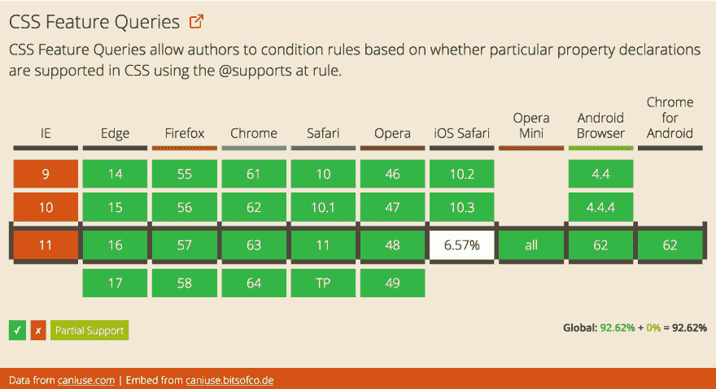](https://res.cloudinary.com/practicaldev/image/fetch/s--57KKUM62--/c_limit%2Cf_auto%2Cfl_progressive%2Cq_auto%2Cw_880/https://cdn.rawgit.com/huijing/filerepo/gh-pages/devto/devto-caniusefq.jpg)

我已经感觉到你的眼睛盯着 Internet Explorer 的红色栏，但是请和我呆在一起，不要在功能查询上认输。特性查询的工作原理是，对于不支持它的浏览器，完全忽略@supports 块中的所有样式。

让我们来看看这个基本的例子:

```
main {
  background-color: red;
}

@supports (display:grid) {
  main {
    background-color: green;
  }
} 
```

<svg width="20px" height="20px" viewBox="0 0 24 24" class="highlight-action crayons-icon highlight-action--fullscreen-on"><title>Enter fullscreen mode</title></svg> <svg width="20px" height="20px" viewBox="0 0 24 24" class="highlight-action crayons-icon highlight-action--fullscreen-off"><title>Exit fullscreen mode</title></svg>

对于支持 grid 的浏览器，`main`元素的背景色将是绿色(因为条件解析为 true)，而对于不支持 grid 的浏览器，`main`的背景色将是红色。

这种行为意味着我们可以基于我们想要使用的特性在增强的样式上分层，并且这些样式会在支持它们的浏览器中显示出来。但对于那些没有，他们将得到一个更基本的外观，无论如何仍然有效。这将是我们前进的方向。

> 网站不需要在每个浏览器上都看起来一样。

## CSS 的首要原则:规范

在我们深入讨论之前，我想强调一下，在网络上实现布局与在其他媒体上有很大的不同。为什么？因为我们的画布就是浏览器，操纵布局的唯一方式是通过代码。

画布和我们的输入之间的这种分离程度意味着我们必须了解将代码呈现在屏幕上的浏览器的工作方式，清楚地了解我们编写的代码将如何被解释。

一年多以前，我问了一个问题，[你对 CSS 显示了解多少？](//%7B%7B%20site.url%20%7D%7D/blog/how-well-do-you-know-display/)那是我第一次坐下来真正阅读 [CSS 显示模块 Level 3](https://www.w3.org/TR/css-display-3/) 规范。布局是一个相当大的主题，跨越多个规范，包括 [CSS 定位布局模块第 3 级](https://www.w3.org/TR/css-position-3/)、 [CSS 框对齐模块第 3 级](https://www.w3.org/TR/css-align-3/)、 [CSS 内在&外在尺寸模块第 3 级](https://www.w3.org/TR/css-sizing-3/)等等。你明白了。

这些规范本身会自由地相互引用，因此阅读其中的一个规范会导致您的浏览器选项卡集呈指数级增长，因为您会链接到越来越多的相关规范(或者可能只有我会这样)😈。

## 你说的这个显示器是什么？

如果你不像我一样对阅读规范感兴趣，让我们简单地看一下 CSS 显示规范的一些要点。

1.  浏览器绘制框
2.  CSS 生成一个盒子树
3.  每个框代表画布上相应的元素
4.  对于每个元素，CSS 基于元素的`display`属性生成零个或多个框

如果你以前从未读过该规范，我怀疑你不会知道`display`属性定义了元素的**显示类型**，这就是元素如何生成框的。有两种基本显示类型，内部和外部。

**内部显示类型**决定了子框的布局。

**外部显示类型**决定了盒子本身如何参与布局。

还有其他显示值，如 **< display-listitem >** ，**<display-internal>**， **< display-box >** 和 **< display-legacy >** 。

一个**格式化上下文**是一组相关的框被布局的环境，不同的格式化上下文将根据不同的规则组来布局它们的框。

在 1998 年 CSS2 工作草案中，我们从[块格式化上下文](https://www.w3.org/TR/CSS2/visuren.html#block-formatting)和[内联格式化上下文](https://www.w3.org/TR/CSS2/visuren.html#inline-formatting)开始，但是随着更多布局选项的加入，我们现在也有了[表格格式化上下文](https://www.w3.org/TR/CSS2/tables.html#table-display)、 [flex 格式化上下文](https://www.w3.org/TR/css-flexbox-1/#flex-formatting-context)、[网格格式化上下文](https://www.w3.org/TR/css-grid-1/#grid-formatting-context)和 [ruby 格式化上下文](https://drafts.csswg.org/css-ruby-1/#ruby-formatting-context)。

**块级元素**是生成块级主框的元素，参与块格式化上下文。**内联级元素**是不构成新的内容块的元素，它们的内容分布成行。它们生成内联级别的框，这些框参与内联格式上下文。

然而，内联块元素*不是*内联框。它以这种中间状态存在，因为它作为单个不透明框参与内联格式上下文。

好了，我认为现在关于规范的讨论已经足够了。有太多的内容要介绍，所以为了更容易消化，我可能会将它分成几部分🤓。

## 基本，好像真的基本

前几天晚上，我刚刚看了 Rachel Andrew 在 [NordicJS](http://nordicjs.com/) 的演讲，她讲述的内容之一(我在推特上直播)是如何通过理解浏览器如何处理被覆盖的 CSS 属性来优雅地后退。

液体错误:内部

我将在布局演示中使用 25 个卡片样式的项目。每张卡片都有一幅图像、一个标题和一个副标题。标题和副标题的长度各不相同，因为这就是现实生活的运作方式。这篇文章中演示的所有布局都将使用的标记看起来像这样:

```
<main class="grid">
    <div class="grid__item">
      
      <h2>Card title</h2>
      <p>Because the card pattern is soooo popular right now...</p>
    </div>
    <div class="grid__item">
      
      <h2>Card title</h2>
      <p>Because the card pattern is soooo popular right now, but not all text are made the same</p>
    </div>
    <!-- And repeat the .grid__item another 23 times -->
</main> 
```

<svg width="20px" height="20px" viewBox="0 0 24 24" class="highlight-action crayons-icon highlight-action--fullscreen-on"><title>Enter fullscreen mode</title></svg> <svg width="20px" height="20px" viewBox="0 0 24 24" class="highlight-action crayons-icon highlight-action--fullscreen-off"><title>Exit fullscreen mode</title></svg>

因此，让我们从使用`inline-block`的最基本的布局开始。

### `inline-block`布局

因为我是一个坚持惩罚的人，这个基本布局被测试为在 IE8 上工作(不是更早，因为我不是一个受虐狂)。此选项假设每张卡片都是固定大小的(例如 20em)，并且整个布局将在视窗上居中。

<figure>[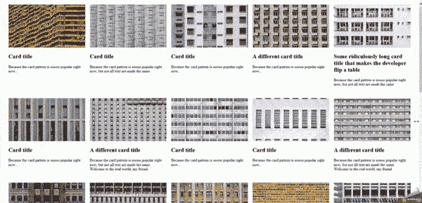](https://res.cloudinary.com/practicaldev/image/fetch/s--Isq7wGYa--/c_limit%2Cf_auto%2Cfl_progressive%2Cq_66%2Cw_880/https://cdn.rawgit.com/huijing/filerepo/gh-pages/devto/gb-inlineblock.gif) 

<figcaption>这其实挺有求必应的(在 IE8 上没少)</figcaption>

</figure>

这样做的代码并不复杂，因为布局容器被设置为`display: inline-block`，居中包括在其父元素上使用`text-align: center`，在本例中是`body`元素。

```
body {
  text-align: center;
}

.grid {
  display: inline-block;
}

.grid__item {
  width: 20em;
  display: inline-block;
  vertical-align: top;
  margin: 1em 0.5em;
  text-align: left;
} 
```

<svg width="20px" height="20px" viewBox="0 0 24 24" class="highlight-action crayons-icon highlight-action--fullscreen-on"><title>Enter fullscreen mode</title></svg> <svg width="20px" height="20px" viewBox="0 0 24 24" class="highlight-action crayons-icon highlight-action--fullscreen-off"><title>Exit fullscreen mode</title></svg>

如果您希望网格中的所有项目都具有相同的固定宽度，这种方法相当有效，并且不需要太多代码。如果你的图片高度不一样，你可能会遇到问题。

<figure>[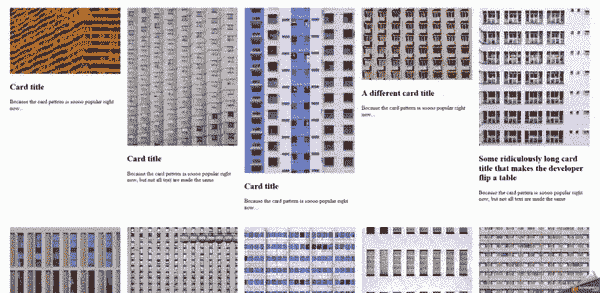](https://res.cloudinary.com/practicaldev/image/fetch/s--PkBWNhEp--/c_limit%2Cf_auto%2Cfl_progressive%2Cq_66%2Cw_880/https://cdn.rawgit.com/huijing/filerepo/gh-pages/devto/gb-inlineblock2.gif) 

<figcaption>嗯，有些人可能不喜欢这个</figcaption>

</figure>

我将在另一篇文章中讨论图像处理问题，但是为了支持 IE8，我们不能使用当前的标记。此外，如果最后一行的项目数少于总列数，它们最终会居中对齐，这可能也是您不希望的。

好的，让我们来看看另一个属于基本类别的方法。

### `float`布局

啊，值得信赖的花车。在相当长的一段时间里，这是一种流行的方法，我相信有许多网站仍然在使用这种技术。在大多数情况下，响应性的基于浮动的布局并不简单。

浮动本来就不是用来做页面布局的，因此清除浮动会带来很多麻烦，尤其是在处理布局中不规则大小的项目时。

由于对媒体查询的严重依赖，许多设计人员只是选择限制网格的最大宽度，因此您不必编写大量的媒体查询来支持越来越大的视口。我要忘记这一点，将我的布局的列数最大化为 5🤷。

<figure>[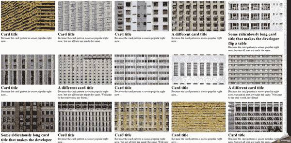](https://res.cloudinary.com/practicaldev/image/fetch/s--Na91yvIP--/c_limit%2Cf_auto%2Cfl_progressive%2Cq_66%2Cw_880/https://cdn.rawgit.com/huijing/filerepo/gh-pages/devto/gb-float.gif) 

<figcaption>卡片的柔性布局</figcaption>

</figure>

我只想补充一点，如果我们想让`inline-block`布局项目占据视窗的宽度，我们也可以使用相同的媒体查询，而不是使用固定的宽度。

好的，下面的代码会很长...

```
.clearfix::after {
  content: '';
  display: table;
  clear: both;
}

.grid__item {
  float: left;
  padding: 0.5em;
  width: 100%;
}

@media screen and (min-width: 480px) {
  .grid__item {
    width: 50%;
  }

  .grid__item:nth-child(2n+1) {
    clear: left;
  }
}

@media screen and (min-width: 768px) {
  .grid__item {
    width: 33.333%;
  }

  .grid__item:nth-child(2n+1) {
    clear: none;
  }

  .grid__item:nth-child(3n+1) {
    clear: left;
  }
}

@media screen and (min-width: 1024px) {
  .grid__item {
    width: 25%;  
  }

  .grid__item:nth-child(3n+1) {
    clear: none;
  }

  .grid__item:nth-child(4n+1) {
    clear: left;
  }
}

@media screen and (min-width: 1280px) {
  .grid__item {
    width: 20%;  
  }

  .grid__item:nth-child(4n+1) {
    clear: none;
  }

  .grid__item:nth-child(5n+1) {
    clear: left;
  } 
} 
```

<svg width="20px" height="20px" viewBox="0 0 24 24" class="highlight-action crayons-icon highlight-action--fullscreen-on"><title>Enter fullscreen mode</title></svg> <svg width="20px" height="20px" viewBox="0 0 24 24" class="highlight-action crayons-icon highlight-action--fullscreen-off"><title>Exit fullscreen mode</title></svg>

我还作弊，给布局容器添加了一个`.clearfix`类，因为不清除它就不能有基于浮动的布局。你就是不能。抱歉。但是不管布局项目的宽度是固定的还是灵活的，仍然需要用于激活和移除清除的`nth-child`选择器。

正因为如此，这种特殊的编写浮动代码的风格在 IE8 上并不适用。仅限 IE9 及以上。为了解决`nth-child`支持问题，我们需要额外的包装器来包装每个视口的项目数量。因此，我承认过去拒绝过我的设计师们提出的“4-3-2-1”响应式色谱柱的多种方案。

### 回退术冠军:`inline-block`

鉴于这种基本布局是基本的后备方案，我会选择使用`inline-block`技术，因为它的代码少得多，而且看起来还不错。请记住:

> 网站不需要在每个浏览器上都看起来一样。

## beggy，就是这样，基础又前卫

因此，这将是我们使用 Flexbox 的第一层功能查询。Flexbox 的想法在 2008 年之前就已经讨论过了，2009 年发布了规范的第一个工作草案。但是 Flexbox 的实现相当混乱。

问题是，许多开发人员在生产中使用了这个尚未完成的特性，所以当涉及到更新实现时，每个人都陷入了困境。嗯，那个时代已经过去了，现在，Flexbox 的支持非常好。

[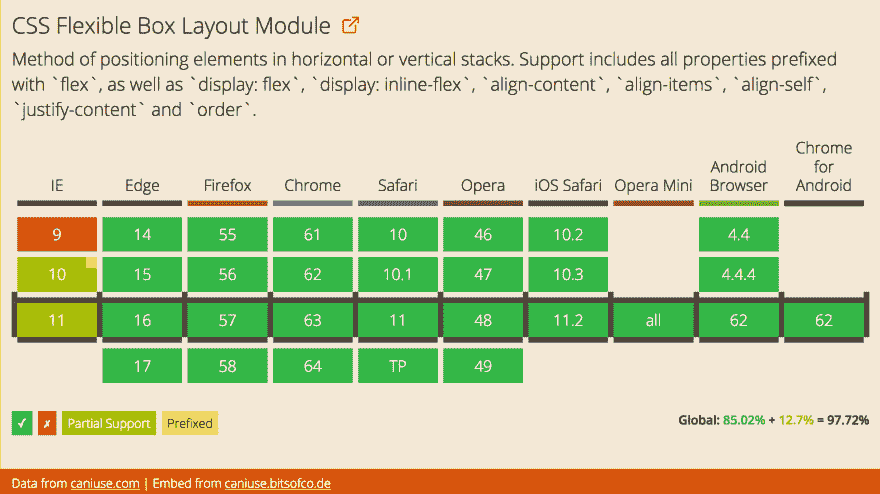T2】](https://res.cloudinary.com/practicaldev/image/fetch/s--JJxjVUt---/c_limit%2Cf_auto%2Cfl_progressive%2Cq_auto%2Cw_880/https://cdn.rawgit.com/huijing/filerepo/gh-pages/devto/devto-caniuseflexbox.jpg)

我听到的一个常见问题是很难用 Flexbox 创建网格系统。关于 Flexbox 的问题是，即使你可以用它来创建一个网格系统，这也不是最好的办法。Flexbox 适合在一个维度**中布置项目，其中行和列**之间没有关系。更像是 flex 孩子的菊花链。

<figure>[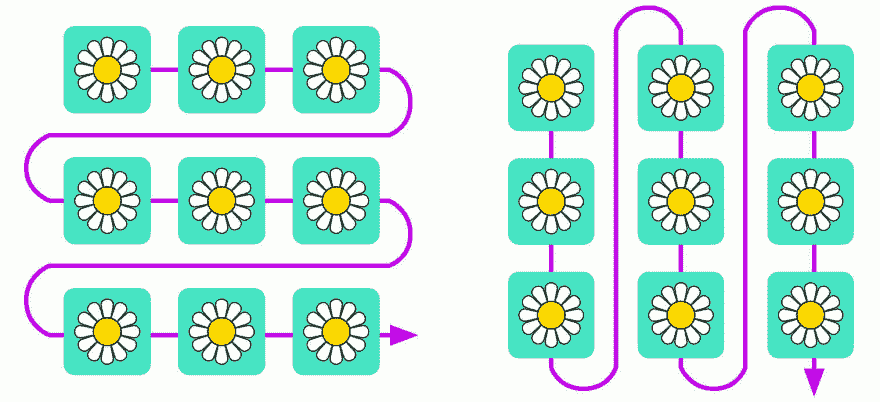](https://res.cloudinary.com/practicaldev/image/fetch/s--7usksSKr--/c_limit%2Cf_auto%2Cfl_progressive%2Cq_auto%2Cw_880/https://cdn.rawgit.com/huijing/filerepo/gh-pages/devto/devto-daisychain.jpg) 

<figcaption>或行或列</figcaption>

</figure>

柔性项目在*柔性线*内布置和对齐，柔性线是图中的紫色线。仅供参考，这些图表是我从了不起的[布兰达·斯托勒](http://brendastorer.com/)(我告诉过她)那里偷来的，用来说明这个概念。好吧，她的比我的好看，但我不能直接用她的，那是剽窃。

```
.grid {
  display: flex;
  flex-wrap: wrap;
  margin: -1em 0 1em -0.5em;
}

.grid__item {
  padding: 1em 0 0 0.5em;
  flex: 1 0 20em;
} 
```

<svg width="20px" height="20px" viewBox="0 0 24 24" class="highlight-action crayons-icon highlight-action--fullscreen-on"><title>Enter fullscreen mode</title></svg> <svg width="20px" height="20px" viewBox="0 0 24 24" class="highlight-action crayons-icon highlight-action--fullscreen-off"><title>Exit fullscreen mode</title></svg>

所以请记住，Flexbox 并不擅长成为一个真正的网格。它本身不处理装订线，因此使用负边距在每个布局项目之间获得一些空间。总的来说，Flexbox 保持得很好，直到我们到达布局的最后一行。除非它恰好以一个整齐的数字结束，否则我们通常会以一些奇怪的孤立布局项目结束。

<figure>[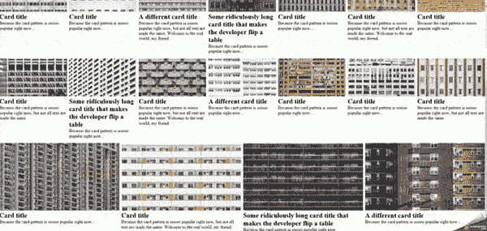](https://res.cloudinary.com/practicaldev/image/fetch/s--eXiajkfy--/c_limit%2Cf_auto%2Cfl_progressive%2Cq_66%2Cw_880/https://cdn.rawgit.com/huijing/filerepo/gh-pages/devto/gb-flex.gif) 

<figcaption>嗯，我们告诉他们要灵活</figcaption>

</figure>

我们可以通过对 floats 做同样的事情来解决这个问题，也就是说，引入一系列媒体查询，就像这样:

```
.grid__item {
  padding: 1em 0 0 0.5em;
}

@media screen and (min-width: 480px) {
  .grid__item {
    width: 50%;
  }
}

@media screen and (min-width: 768px) {
  .grid__item {
    width: 33.333%;
  }
}

@media screen and (min-width: 1024px) {
  .grid__item {
    width: 25%;  
  }
}

@media screen and (min-width: 1280px) {
  .grid__item {
    width: 20%;  
  } 
} 
```

<svg width="20px" height="20px" viewBox="0 0 24 24" class="highlight-action crayons-icon highlight-action--fullscreen-on"><title>Enter fullscreen mode</title></svg> <svg width="20px" height="20px" viewBox="0 0 24 24" class="highlight-action crayons-icon highlight-action--fullscreen-off"><title>Exit fullscreen mode</title></svg>

另一个选择是限制每个布局项目的最大宽度，这样孤立的项目就不会增长到荒谬的大小。但是，默认情况下，所有内容都将靠左对齐，可能会出现布局容器右侧有多余空白的情况。

[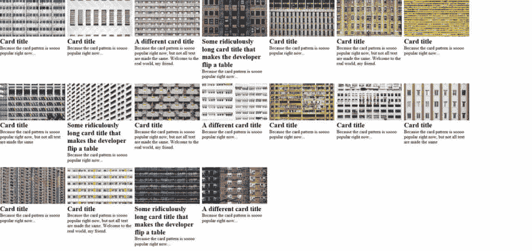T2】](https://res.cloudinary.com/practicaldev/image/fetch/s--LQ5k7Ter--/c_limit%2Cf_auto%2Cfl_progressive%2Cq_auto%2Cw_880/https://www.chenhuijing.cimg/posts/grid-basic/flex-orphan-1280.jpg)

如果你不介意，那太好了。但是有趣的是，大多数人喜欢把事情放在中间🤷。

### 稍微讲一下方框对齐

回车，**框对齐**。

我知道我说过不要再谈论更多的规范了，但是这非常重要，我只涉及其中的一小部分，特别是关于[内容分发](https://www.w3.org/TR/css-align-3/#content-distribution)的部分，也就是说，将一个盒子的内容在它自己内部对齐。

为此有两个相关属性，`align-content`和`justify-content`，以及一个简写`place-content`。截至发稿时，`place-content`仅在 Chrome 59 及以上版本以及 Firefox 中受支持(但不确定从哪个版本开始)。

这些属性的行为会因它们所应用的容器而略有不同，所以我现在只关注 flex 容器的行为。`justify-content`影响每条挠曲线中的挠曲线项，并沿**主轴**应用。`align-content`影响挠曲线本身，并沿**横轴**应用。

为什么不用横轴和纵轴？因为在各种配置中，这些物理方向可能根据应用于弯曲容器的弯曲方向以及文档的书写模式而不同。下图只是所有可能排列的子集。

[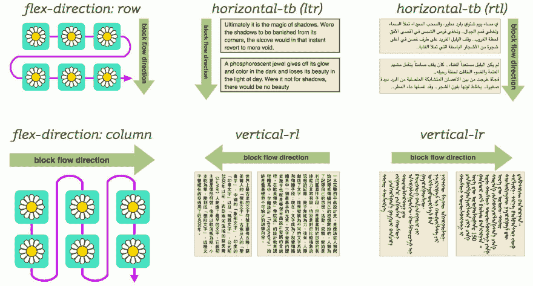T2】](https://res.cloudinary.com/practicaldev/image/fetch/s--YOfZZ4Ca--/c_limit%2Cf_auto%2Cfl_progressive%2Cq_auto%2Cw_880/https://cdn.rawgit.com/huijing/filerepo/gh-pages/devto/devto-directions.jpg)

对于这个特殊的演示，我们坚持使用最常见的设置`flex-direction: row`和编写模式`horizontal-tb`。这里的用例是将内容沿水平面(即主轴)居中。所以我们想要访问的属性将是`justify-content`。

这个属性有无数的值，那些用于分发内容的值和那些用于定位内容的值。对于定位，我们有`center`、`flex-start`、`flex-end`、`start`和`end`。对于配送，我们有`stretch`、`space-around`、`space-between`和`space-evenly`。

那些以`flex-`为前缀的值只适用于 flex 容器，但除此之外，它们会做它们说要做的事情，因为项目将与容器的开始/中心/结尾对齐。不幸的是，`justify-content: center` 有一个 [IE11 bug，所以也许我们可以用`space-around`来代替。](https://github.com/philipwalton/flexbugs/issues/128)

对于分配，`stretch`的处理方式与`flex-start`相同。其他三者之间的区别是每个项目之间的空间大小。`space-between`将导致该行的第一个和最后一个项目与容器的边缘齐平。

[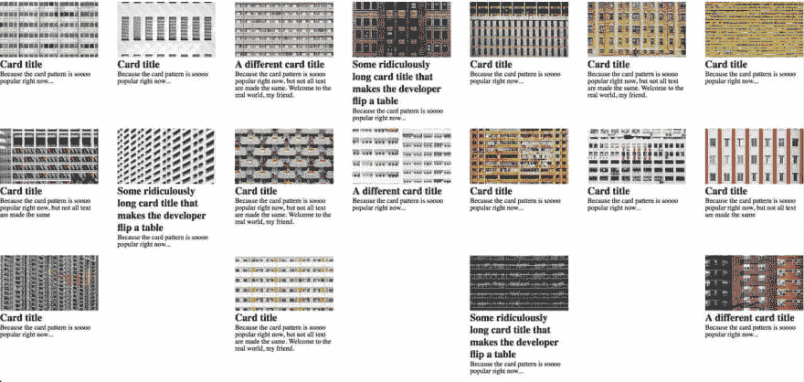T2】](https://res.cloudinary.com/practicaldev/image/fetch/s--Ygb9byEr--/c_limit%2Cf_auto%2Cfl_progressive%2Cq_auto%2Cw_880/https://www.chenhuijing.cimg/posts/grid-basic/space-between-1280.jpg)

给每个项目周围相等的空间。

[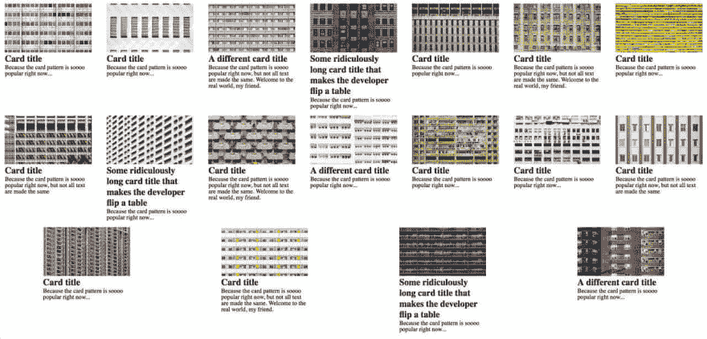T2】](https://res.cloudinary.com/practicaldev/image/fetch/s--hWS6ejRf--/c_limit%2Cf_auto%2Cfl_progressive%2Cq_auto%2Cw_880/https://www.chenhuijing.cimg/posts/grid-basic/space-around-1280.jpg)

截止到本文撰写时，只有 Firefox 支持的`space-evenly`将所有项目均匀地分布在一行中，因此第一个和最后一个项目与容器边缘之间的间距与项目之间的间距相同。

[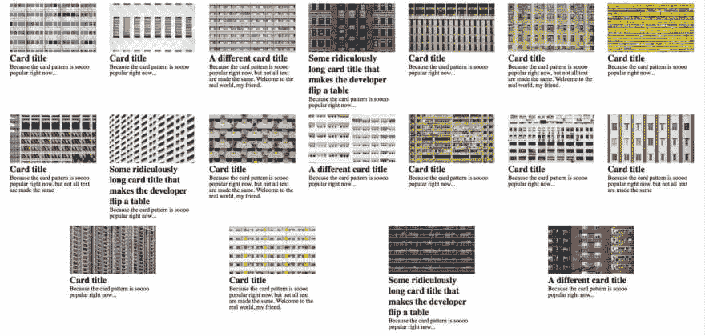T2】](https://res.cloudinary.com/practicaldev/image/fetch/s--kPFrLJfP--/c_limit%2Cf_auto%2Cfl_progressive%2Cq_auto%2Cw_880/https://www.chenhuijing.cimg/posts/grid-basic/space-evenly-1280.jpg)

就我个人而言，我将选择`justify-content: space-around`选项，因此我的 flexbox 代码将看起来像这样:

```
@supports (display:flex) {
  .grid {
    display: flex;
    flex-wrap: wrap;
    margin: -1em 0 1em -0.5em;
    justify-content: space-around;
  }

  .grid__item {
    padding: 1em 0 0 0.5em;
    flex: 1 0 20em;
    max-width: 20em;
    width: auto;
    margin: initial;
  }
} 
```

<svg width="20px" height="20px" viewBox="0 0 24 24" class="highlight-action crayons-icon highlight-action--fullscreen-on"><title>Enter fullscreen mode</title></svg> <svg width="20px" height="20px" viewBox="0 0 24 24" class="highlight-action crayons-icon highlight-action--fullscreen-off"><title>Exit fullscreen mode</title></svg>

`width: auto`用于重置应用在基本布局上的`width`值，同样适用于`margin: initial`。现在，因为 IE11 和更低版本不支持特性查询，所以这个代码块中的任何代码都不适用于那些浏览器。因此，这些浏览器缺乏对`initial`属性的支持也是一个争论点。

碰巧的是，支持特性查询的浏览器也能识别`initial`，所以我们可能很幸运。除了迷你歌剧。但是我检查了一下它看起来怎么样，它真的没有那么糟糕，所以我只是在那里留有额外的空白。否则，您可以为 flex 布局的边距设置一个显式值，这也很好。

同样，让孤立项以不同的方式显示是否可以接受，这取决于您。如果你的布局项目没有横跨整个项目宽度的图像，这可能是好的，或者它可能没有。每个背景都不一样。

> 网站不需要在每个浏览器上都看起来一样。

## 为什么你好，格子，你革命，你...

关于网格，我想说的太多了，但是我会把它全部包含进去，并且只讨论在这篇文章的范围内实现基本网格布局所必需的内容。

Grid 是我见过的最令人印象深刻的 CSS 新特性，很大程度上是因为它是在 flag 后面开发的。这意味着开发人员可以测试网格，并向浏览器供应商提供反馈，但不会编写尚未完全成熟的产品代码。

Rachel Andrew 一再强调的这种方法的唯一问题是，开发人员的反馈并不像我们希望的那样热情。

> 瑞秋安德鲁@ rachelandruw如果你不测试新的 CSS(如网格布局)并提供反馈，那你就是把你未来的工具托付给了我们中极少数会做的人。2016 年 7 月 15 日下午 16:56[](https://twitter.com/intent/tweet?in_reply_to=753996654777360384)[](https://twitter.com/intent/retweet?tweet_id=753996654777360384)[](https://twitter.com/intent/like?tweet_id=753996654777360384)

CSS 工作组已经将所有的[规范工作草案放到了 GitHub](https://github.com/w3c/csswg-drafts) 上，我们所有人都可以自由参与讨论、提出问题和提供反馈。如果您发现了一些微小的东西，比如规范中的一个错别字，您可以提交一个 pull 请求。老实说，这并不需要太多的努力。

网格不同于我们过去使用的所有布局技术，因为它是唯一可以在容器中工作的解决方案(这个概念归功于 Rachel Andrew)。它要求你对你脑海中的网格有一个宏观的看法，而不是单独地确定每个项目的大小，这有时可能会导致“只见树木不见森林”的情况。

> 这里的主要好处是，我们不需要元素在放置时相互依赖。我们可以指定它们在 x 和 y 轴上的位置，而与它们周围的东西无关。
> 
> —布伦达·斯托勒

<figure>[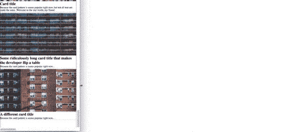](https://res.cloudinary.com/practicaldev/image/fetch/s--Mr8T_LXw--/c_limit%2Cf_auto%2Cfl_progressive%2Cq_66%2Cw_880/https://cdn.rawgit.com/huijing/filerepo/gh-pages/devto/gb-grid.gif) 

<figcaption>这才叫行为端正</figcaption>

</figure>

另一个只与网格相关的奇妙功能是`grid-gap`。我们现在可以告诉浏览器，我们希望我们的布局中的项目之间的差距，浏览器将计算出来。我们之所以有这个特性，是因为 Rachel Andrew 在 CSS Day 和规范作者[现场的 Elika J. Etemad](http://fantasai.inkedblade.net/) (又名 Fantasai)将它写入了规范。[详细故事在这里](https://rachelandrew.co.uk/archives/2015/11/03/three-years-with-css-grid-layout/)。

无论如何，有了网格，我们终于有了一个合法的技术来在网格中布局项目。就像匹诺曹终于变成了一个真正的男孩。没有复杂的数学来确定每个项目的最佳宽度，没有更多的混乱负空白的差距。只是很好的固体 CSS 网格代码。

```
@supports (display:grid) {
  .grid {
    display: grid;
    grid-template-columns: repeat(auto-fill, minmax(20em, 1fr));
    grid-gap: 0.5em;
    margin: initial;
  }

  .grid__item {
    padding: initial;
    max-width: none;
  }
} 
```

<svg width="20px" height="20px" viewBox="0 0 24 24" class="highlight-action crayons-icon highlight-action--fullscreen-on"><title>Enter fullscreen mode</title></svg> <svg width="20px" height="20px" viewBox="0 0 24 24" class="highlight-action crayons-icon highlight-action--fullscreen-off"><title>Exit fullscreen mode</title></svg>

网格如何工作的基本前提包括通过`grid-template-columns`和`grid-template-rows`定义网格。这些属性允许您分别为列和行定义网格轨迹的大小。然后，我们可以在网格中放置项目，或者自己放置，或者让浏览器替我们放置。

对于一个常规的基本网格，浏览器可以做得比我们好得多，因为，你知道，他们比我们更擅长数学？说真的，[网格自动布局算法](https://www.w3.org/TR/css-grid-1/#grid-item-placement-algorithm)真的很棒。

在这个基本网格中，我们使用了`repeat()`函数和`minmax()`函数。`repeat()`功能为我们省去手工重复相同的列/行模式的麻烦。它还带有`auto-fill`或`auto-fit`参数，这意味着浏览器将根据可用空间决定网格应该有多少列或多少行。

`minmax()`取 2 个参数，一个介于 *<最小值>* 和 *<最大值>* 值之间的大小范围。让我们将网格项的最小宽度限制在一个固定/不可变的宽度( *< min >* )，而 *< max >* 值可以是一个固定值，一个灵活值，或者由内容大小使用`min-content`或`max-content`来确定。

```
grid-template-columns: repeat(auto-fill, minmax(20em, 1fr)); 
```

<svg width="20px" height="20px" viewBox="0 0 24 24" class="highlight-action crayons-icon highlight-action--fullscreen-on"><title>Enter fullscreen mode</title></svg> <svg width="20px" height="20px" viewBox="0 0 24 24" class="highlight-action crayons-icon highlight-action--fullscreen-off"><title>Exit fullscreen mode</title></svg>

这一行告诉浏览器，在给定的空间允许的情况下，我希望拥有尽可能多的至少 20ems 宽的网格列。如果有多余的空间，请将其平均分配到所有列中。没有额外的数学计算，没有大量的媒体询问🙆。

```
grid-gap: 0.5em; 
```

<svg width="20px" height="20px" viewBox="0 0 24 24" class="highlight-action crayons-icon highlight-action--fullscreen-on"><title>Enter fullscreen mode</title></svg> <svg width="20px" height="20px" viewBox="0 0 24 24" class="highlight-action crayons-icon highlight-action--fullscreen-off"><title>Exit fullscreen mode</title></svg>

我只需要将`grid-gap`设置为我想要的任何间距值，而不是在每个网格项目之间使用填充和边距。`grid-gap`实际上是`<‘grid-row-gap’> <‘grid-column-gap’>?`的简称，接受两个参数。如果只使用 1 个参数，两个属性将采用相同的值。

## 共现

最终的布局代码看起来像这样，这是基于我的决定:对基本浏览器使用内联块技术，对 yes-flex-no-grid 浏览器使用空间环绕技术，对所有新用户使用 grid。

```
body {
  text-align: center;
}

.grid {
  display: inline-block;
}

.grid__item {
  width: 20em;
  display: inline-block;
  vertical-align: top;
  margin: 1em 0.5em;
  text-align: left;
}

@supports (display:flex) {
  .grid {
    display: flex;
    flex-wrap: wrap;
    margin: -1em 0 1em -0.5em;
    justify-content: space-around;
  }

  .grid__item {
    padding: 1em 0 0 0.5em;
    flex: 1 0 20em;
    max-width: 20em;
    width: auto;
    margin: initial;
  }
}

@supports (display:grid) {
  .grid {
    display: grid;
    grid-template-columns: repeat(auto-fill, minmax(20em, 1fr));
    grid-gap: 0.5em;
    margin: initial;
  }

  .grid__item {
    padding: initial;
    max-width: none;
  }
} 
```

<svg width="20px" height="20px" viewBox="0 0 24 24" class="highlight-action crayons-icon highlight-action--fullscreen-on"><title>Enter fullscreen mode</title></svg> <svg width="20px" height="20px" viewBox="0 0 24 24" class="highlight-action crayons-icon highlight-action--fullscreen-off"><title>Exit fullscreen mode</title></svg>

如果你问我，我不认为这是一个过度的代码量。当然，你可以不同意。我希望这将使你相信，逐步增强你的 CSS 是一个有价值的设计模式，可以增加你的技能。

此外，如果你以前没有阅读过说明书，请开始阅读。它们是浏览器应该如何运行的根源，所以如果你发现一个看起来不正确的行为，它很可能是一个浏览器错误。我们可以向各自的浏览器供应商提出这些问题。瞧！你让网络变得更好了🎊。

最后，跟我一起说...

> 网站不需要在每个浏览器上都看起来一样。

直到下一个！🤗

## 有用的资源

*   [特征查询:‘@ supports’规则](https://drafts.csswg.org/css-conditional-3/#at-supports)
*   [CSS @ MDN 上的 supports](https://developer.mozilla.org/en-US/docs/Web/CSS/%40supports)
*   [在 CSS 中使用特征查询](https://hacks.mozilla.org/2016/08/using-feature-queries-in-css/)
*   [CSS 布局的演变:90 年代到未来](http://fantasai.inkedblade.net/weblog/2012/css-layout-evolution/)
*   [格子抓取&围棋模式](https://gridbyexample.com/patterns/)
*   [CSS 网格布局示例](http://igalia.github.io/css-grid-layout/)
*   [CSS 网格布局代码笔集合](https://codepen.io/collection/XRRJGq/)

*最初发表于 2017 年 9 月 9 日[www.chenhuijing.com](https://www.chenhuijing.com/blog/basic-grid-with-fallbacks/)。*