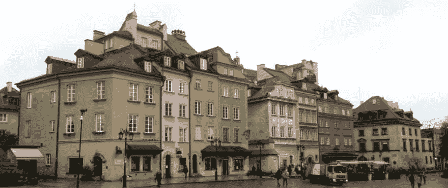

# PHP 中欧会议 2017

> 原文：<https://dev.to/moxio/php-central-europe-conference-2017-2j7>

11 月初，我参加了第一届 [phpCE](https://2017.phpce.eu/) ，这是中欧的一个新的 PHP 社区会议，由 PHPCon Poland 和 Brno PHP conference 合并而来。在这篇博文中，我想分享我的一些经历和我在那次活动中学到的东西，包括有趣的内容、我自己的两次演讲以及与社区的互动。

## 内容

没有好的内容，会议就什么都不是，phpCE 肯定没有辜负它的期望。当然，我不能在一篇博文中描述我所学到的一切，但我肯定会分享一些个人的亮点。

[Andreas Heigl](https://twitter.com/heiglandreas) 以他的主题演讲“[如何从技术会议中获得最大收益”拉开了会议的序幕！](https://joind.in/event/php-central-europe-conference/how-to-get-the-most-out-of-a-tech-conference)’，包含一些适用于初次与会者和经验丰富的与会者的实用技巧。他不仅为参加会谈提供建议，还为在*走廊轨道*(包括[吃豆人规则](http://ericholscher.com/blog/2017/aug/2/pacman-rule-conferences/))的社交活动提供建议。

[塞巴斯蒂安·博格曼](https://twitter.com/s_bergmann)展示了“[特定于领域的断言](https://joind.in/event/php-central-europe-conference/domain-specific-assertions)”，讲述了在 PHPUnit 断言中使用领域的不确定语言如何有助于让你的同事、你未来的自己甚至非开发人员更容易理解它们。他的演讲实际上并不局限于断言，而是从总体上为可理解的程序辩护(并反对“代码”这个术语)。

GDPR 就要来了，你准备好了吗？'，[米开朗基罗·范·达姆](https://twitter.com/DragonBe)谈到了来自欧盟的通用数据保护条例，该条例将于 2018 年 5 月 25 日生效。因为这个话题在荷兰还没有得到太多的关注(据我所知)，对我来说，这个演讲真的是一个大开眼界的机会，让我开始阅读并采取措施。米开朗基罗的演讲已经包含了许多实现兼容系统的实用提示。

另一个非常有趣的环节是[Nikola poa](https://twitter.com/nikolaposa)讲述在“[走过“不幸之路”](https://joind.in/event/php-central-europe-conference/journey-through-unhappy-path---dealing-with-exceptional-conditions)的旅程”中异常处理的最佳实践。事实上，我本人没能参加这次演讲(因为要同时发言)，但我听到了很多非常积极的反应，并在事后与 Nikola 谈了一些这个话题。我们非常重视 Moxio 中设计良好的异常处理(尤其是汤姆在论文项目中对[所做的研究)，所以很高兴看到这个主题在会议上得到应有的关注。](https://www.moxio.com/blog/14/understanding-exceptional-flow)

微服务和事件驱动的架构是 phpCE 上的热门话题，两人都在谈论这个话题，分别是[Mariusz Gil](https://twitter.com/mariuszgil)([用传奇模式](https://joind.in/event/php-central-europe-conference/modeling-complex-processes-and-time-with-saga-pattern))和[Christopher Riley](https://twitter.com/giveupalready)([微服务与分布式 Monolith](https://joind.in/event/php-central-europe-conference/microservices-vs-the-distributed-monolith) )。他们都描述了微服务如何正确地要求基于异步事件的方法，以及在这样的架构中的故障处理(而不是尝试分布式的、长时间的事务)如何意味着拥抱最终的一致性。Saga 模式可以被视为故障处理的一种方法，它描述了在流程的不同步骤中对故障事件采取的行动。

## 说话之间

对我来说，参加 phpCE 2017 的主要原因是作为一名演讲者，被邀请发表我的演讲'[PHP 核心开发入门](https://joind.in/event/php-central-europe-conference/getting-started-with-php-core-development) ' ( [幻灯片](https://speakerdeck.com/aboks/getting-started-with-php-core-development-phpce-2017))。在这个演讲中，我描述了我对 PHP 编程语言本身的第一次贡献，从遇到一个 bug 到编写一个测试，修复 C 源代码和修补文档。在这次演讲中，我想展示，基于我自己的经验，任何 PHP 程序员都可以为 PHP 项目做出贡献，即使没有任何 PHP 核心和/或编写它的 C 编程语言的经验。根据我听到的反应，我希望参加这次演讲的一些人现在已经对 PHP 做出了他们的第一份贡献。

最终我结束了第二次会议，代替另一个不得不取消的演讲者。在这个空位上，我发表了“[语义网简介](https://joind.in/event/php-central-europe-conference/introduction-to-the-semantic-web)”([幻灯片](https://speakerdeck.com/aboks/introduction-to-the-semantic-web-phpce-2017))，这是我早些时候在 DPC17 做的一个演讲。它旨在向观众展示 RDF、OWL 和 W3C 的其他语义 web 标准的优势和局限性，这些标准为智能代理可以使用的链接数据 Web 开辟了可能性。会议结束后，我得到了一些关于用 RDF 表示非事实数据的非常有趣的问题，这可以通过一种叫做*具体化*的技术来实现。我一定会把这个话题纳入我的最新报告中。

## 社区

虽然 phpCE 有很多有趣的内容，但好的内容也可以在很多其他地方找到:书籍、视频和博客文章。真正让一个伟大的会议与众不同的是与社区成员的互动。从这个角度来看，会议地点的偏远(在 Ossa，距离华沙大约一个小时的车程)实际上是理想的。在其他会议上，相当一部分与会者在一天的活动结束后离开会场(在家中或市中心的酒店过夜)，而在 phpCE，几乎所有代表都住在 Ossa 酒店。这给了我们很多机会在主要会议前后与其他开发者进行讨论和交流。我结识了新朋友，在吃饭、深夜在酒店酒吧喝酒，以及新发现的一个接一个的保龄球运动中获得了许多有趣的见解。

[T2】](https://res.cloudinary.com/practicaldev/image/fetch/s--zCgQM42b--/c_limit%2Cf_auto%2Cfl_progressive%2Cq_auto%2Cw_880/https://www.moxio.com/documents/gfx/blog/20171205_phpce_1.jpg)

偏远地区的一个缺点是周围实际上没什么可看的。为了弥补这一点，phpCE 团队在会议前一天在华沙为演讲者组织了一个开放日。我们和一名导游以及一辆共产主义时期的旧巴士一起在市中心散步和开车。这是一个很好的机会，可以看到华沙的一些文化和历史亮点，了解一些关于波兰的知识，并在会议开始前会见其他发言者。

## 得出结论

我真的很喜欢参加 phpCE 2017。会议充满了精彩的内容，从中我学到了很多东西，我遇到了很多非常好的人，总体来说我度过了一段美好的时光。我可以强烈推荐参加这个会议的下一届会议，它将于 2018 年秋季在布拉格举行。

*这篇文章最初发表在[Moxio 博客](https://www.moxio.com/blog/22/php-central-europe-conference-2017)上。*