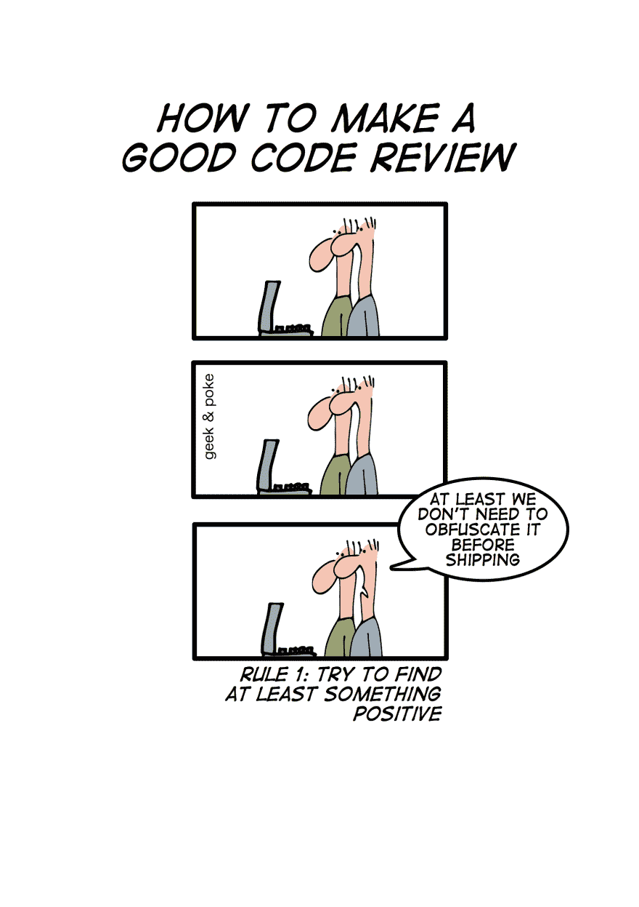

# 初学编码的 5 个技巧

> 原文:[https://dev.to/martyhimmel/5-tips-for-beginning-coders-1ek](https://dev.to/martyhimmel/5-tips-for-beginning-coders-1ek)

在过去的一年里，我培训了一些以前从未写过代码的人(其中一个人从设计工作过渡到了开发工作)，并与相对较新的开发人员一起工作。以下是那段时间出现的一些话题。

## 可读性强的代码胜过聪明的代码。

如果 6 个月后你还不能理解，那就重新考虑一下。考虑同一个函数的这两个版本:

```
function a(b,c) {
    return a+b;
}

function sum(firstNumber, secondNumber) {
    return firstNumber + secondNumber;
} 
```

<svg width="20px" height="20px" viewBox="0 0 24 24" class="highlight-action crayons-icon highlight-action--fullscreen-on"><title>Enter fullscreen mode</title></svg> <svg width="20px" height="20px" viewBox="0 0 24 24" class="highlight-action crayons-icon highlight-action--fullscreen-off"><title>Exit fullscreen mode</title></svg>

通过查看第一个函数名和它的参数列表，并不能 1)立即看出这个函数做了什么，或者 2)甚至暗示它做了什么。第二个函数在不查看函数内部的情况下就很清楚它做了什么。

虽然这是一个非常简单的例子，但是您可以想象这将如何应用于更复杂的代码。本漫画来自[极客&戳](http://geek-and-poke.com/geekandpoke/2010/11/1/how-to-make-a-good-code-review.html)要开车点到家:
[](https://res.cloudinary.com/practicaldev/image/fetch/s--NmvKhMLu--/c_limit%2Cf_auto%2Cfl_progressive%2Cq_auto%2Cw_880/http://s3.media.squarespace.com/production/2129687/19317774/.a/6a00d8341d3df553ef013488a2d48f970c-pi)

## 代码越少越好。

这里的例外是，如果它与上面的第一个提示相反。

更高的代码行数并不是好工作的标志。编程的目的不是写很多代码——而是解决一个问题，创造一些东西，等等。你需要写的代码越少越好。较少的代码通常更容易维护，也不太复杂。

在这里，懒惰可能是一种优势。🤓

## 需要沟通。

人们不会读心术——你必须和你的团队交流。需要帮助吗？问吧。有想法吗？分享一下。看到项目的问题了吗？大声说出来，不管问题的大小。一个未被检查的错误很容易影响代码的其他区域，并产生更大的问题。

这不是远程/分布式团队所独有的。我和完全远程的团队一起工作过，那里的沟通非常好。我们一整天都在有规律地交谈，并且完成了很多事情。电子邮件、信使、文本、电话、Slack、谷歌视频等等。形式并不重要(尽管有些东西更适合某些类型的交流),只是简单的交流。

我也曾在缺乏沟通的完全本地化的团队中工作过。不可避免地，关于谁在做什么，需要做什么，以及我们的优先事项是什么的问题出现了。缺乏沟通是任何团队及其项目的最大障碍之一。

无论团队结构如何，沟通都是必须的。

## 读取别人的代码。

这可能很难，尤其是当你开始的时候。但是不要放弃！

阅读其他人的代码的好处之一是你可以看到其他的风格和技术。代码就像人一样多种多样。虽然某些风格和技术有很好的论据，但也有同样好的反驳。

在阅读其他人的代码时，你会发现许多可以帮助你写出更好代码的东西。也许是一个新的设计模式，一个你选择的语言中的新的核心功能，或者一个 API 的一部分是如何构建的。所有这些(以及更多)都可以激发你自己的想法，帮助你提高自己的技能。

## 求助！

当您遇到某个特定的代码问题而需要帮助时，请向他人求助！谷歌非常适合解决常见问题，但是当你处理特定项目的任务时，你可能需要另一双眼睛或其他人来解决问题。你会惊讶这有多有用。

而对于那些职业，工业，设计等。，问题-联系那些主动提供帮助或回答问题的人。就我个人而言，我在教人和回答他们的问题中找到了很多乐趣。我知道很多其他开发者也是这样做的。

根据我的经验，大多数开发人员都乐于帮助他人。 [dev.to](https://dev.to) 上的社区就是一个很好的例子。

我最喜欢的 Twitter 帖子之一是由斯蒂芬妮·赫尔伯特发起的。

> 斯蒂芬妮·赫尔伯特[@塞胡尔伯特](https://dev.to/sehurlburt)对于有能力给予帮助的人:现在就发布到你的时间线上&然后你就可以提出问题了。有所不同2017 年 7 月 23 日上午 06:10[](https://twitter.com/intent/tweet?in_reply_to=889004724669661184)[](https://twitter.com/intent/retweet?tweet_id=889004724669661184)[](https://twitter.com/intent/like?tweet_id=889004724669661184)

愿意回答问题的人多得惊人。更重要的是那些愿意提供帮助的人的技能水平和背景各不相同。

很多人都想尽他们所能提供帮助——不要害怕开口！

* * *

对于新开发人员，你最喜欢的建议是什么？