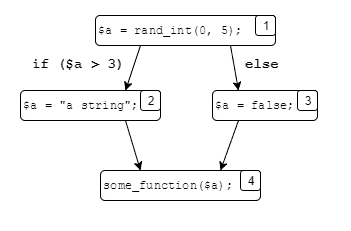

# 类型推理的什么、为什么和如何

> 原文:[https://dev . to/tddenbraber/the-what-why-and-how-of-type-inference-2a3i](https://dev.to/tddenbraber/the-what-why-and-how-of-type-inference-2a3i)

在我上一篇关于 PHP 程序异常流程的文章中，我展示了我的项目的全球概况。在这篇文章中，我将更深入地讨论算法的一个组成部分:类型推断。我们将讨论什么是类型推理，为什么需要它，以及如何完成它。

### 等等，什么？

“类型推断”这个词听起来可能很吓人，但是它背后的原理非常简单。考虑以下代码:

```
<?php 
class Elf { 
    public function __construct(string $name) {
        /* constructor code */
    }

    public function getName() : string { 
        /*... an implementation ...*/ 
    } 

    public function say(string $what_to_say) : void { 
        /*... also an implementation ... */ 
    } 
}

$an_elf = new Elf("Legolas");

if ($an_elf->getName() === "Legolas") { 
    $an_elf->say("They're taking the hobbits to Isengard!"); 
} 
```

看着这段代码，我们可以说一些事情。例如，我们可以说表达式`"Legolas"`属于类型`string`，因为它是用引号括起来的文本。我们还知道任何出现的`$an_elf`变量都是类型`Elf`，因为`$an\_elf`只被赋值一次，也就是类型`Elf`的表达式`new Elf("Legolas")`。我不知道你是否注意到了，但是...我们已经推断出了一些类型。类型推断只不过是在[编译时间](https://en.wikipedia.org/wiki/Compile_time)推断程序中表达式的类型，即不实际运行程序。

[T2】](https://res.cloudinary.com/practicaldev/image/fetch/s--iOztURQq--/c_limit%2Cf_auto%2Cfl_progressive%2Cq_66%2Cw_880/https://cdn-images-1.medium.com/max/500/0%2ATGF9qo8PWpjEn180.gif)

### 但是为什么呢？

那你为什么想这么做呢？嗯，很可能你已经在使用它了，甚至可能还不知道。如果您使用的是 IDE，它可能会告诉您表达式和变量的类型。它可能支持“点击进入定义”:你点击一个类型为`Elf`的表达式，你的光标自动移动到`Elf`类的定义。你已经猜到了:由于类型推断，这种交互是可能的。

类型推断还有助于在运行代码之前发现错误。尝试在下面的代码片段中找出错误:

```
<?php
function tell_me(string $what_to_tell) { /* some implementation */}
tell_me(["where is Gandalf, for I much desire to speak to him"]); 
```

当你的 IDE 有类型推断时，它会警告你正在用类型为`array`的参数调用函数`tell_me`，而函数的定义明确声明它需要一个`string`。在这种情况下，这是很容易看到的。但是如果这些语句位于不同的文件中呢？当表达式的类型在编译时已知时，ide 和静态分析工具可以警告程序员他们犯了一个错误。类型推断在开发时会有很大的帮助。更好的是:你可能已经在使用由类型推理算法驱动的工具，甚至可能不知道。

### 牛逼！我们如何做到这一点？

当我们回顾我们在第一个代码片段中用来推断类型的过程时，我们可以看到我们使用了两个主要方法。

1.  我们观察了“独立”表达式，如`"Legolas"`或`new Elf(...)`，并推断出这些表达式的类型。
2.  我们将表达式的类型传播到其他表达式。例如，`$an_elf`的每一次出现都具有类型`Elf`，因为在程序开始时它被分配了类型`Elf`的表达式`new Elf(...)`。

有趣的是，这些方法是相辅相成的。例如，如果我们想知道`$an_elf->getName()`的类型，我们必须知道`$an_elf`的类型:这个类型需要从程序中较早的一个定义中传播。当我们知道`$an_elf`的类型是`Elf`时，完整的表达式可以被解析，因为我们可以接着查看`Elf::getName()`的定义，它说这个函数返回一个`string`。因此`$an_elf->getName()`的类型是字符串。

实现一个只在“独立”表达式上使用推断类型的类型推断算法并不太难。将抽象语法树(AST)的简单遍历与足够的程序语言知识结合起来就可以完成这项工作。当您还想将表达式的类型传播到其他表达式时，这就变得有趣了。为了做到这一点，我们需要知道哪些表达式依赖于其他表达式。我们可以在这里辨别两种类型的依赖:控制依赖和数据依赖。控制依赖说明了执行的顺序，而数据依赖描述了哪些变量影响其他变量。

控制流数据通常表示为控制流图(CFG)。图中的节点是线性执行的指令集，即一个接一个地执行。边缘代表程序中可能出现的“跳转”。考虑下面的片段。

```
<?php 
$a = rand_int(0,5); 
if ($a > 3) { 
    $a = "a string"; 
} else { 
    $a = false; 
} 
some_function($a); 
```

该代码片段的 CFG 如下所示:

[T2】](https://res.cloudinary.com/practicaldev/image/fetch/s--UEYxi36F--/c_limit%2Cf_auto%2Cfl_progressive%2Cq_auto%2Cw_880/https://cdn-images-1.medium.com/max/351/0%2APnHL_wW7ChhgMpJS.png)

从 CFG 中，我们可以清楚地看到 if 分支或 else 分支将被执行，但肯定不会同时执行。在代码片段中，使用了变量`$a`。但是这个片段中的`$a`是什么类型呢？正确答案是`$a`可以是`string`、`integer`或`boolean`。然而，这并不真正有用:虽然这是真的，但它并没有说很多。由于`$a`在程序中多次改变，很难确定变量`$a`的含义。

但是如果我们稍微改变一下程序呢？例如，我们可以说，每个变量可能只被赋值*一次*。通过这种方式，我们可以随时确定变量的类型，因为它只是被初始化而不是被改变。这种形式被称为[单一静态分配(SSA)形式](https://en.wikipedia.org/wiki/Static_single_assignment_form)。在 SSA 中，上面的代码片段如下所示:

```
<?php
$a_1 = rand_int(0,5); 
if ($a_1 > 3) { 
    $a_2 = "a string"; 
} else { 
    $a_3 = false; 
} 
some_function(φ($a_2, $a_3)); 
```

这个代码片段的行为与前面的代码片段完全相同，但是每个变量只被赋值一次。这使得类型推断的过程稍微容易一些，因为变量现在在其整个生命周期中只能有一种类型。通过保持从 SSA 形式的变量到原始程序中的变量的链接，我们可以将推断的类型转移回非 SSA 形式的原始程序。然而，将程序翻译成 SSA 格式也只能做到这一步。您可能已经注意到代码片段最后一行中奇怪的`φ`函数。`φ`实际上告诉我们，我们无法真正知道这里将使用哪个变量。`φ($a_2, $a_3)`的值要么是`$a_2` *要么是* `$a_3`:我们确实知道这些变量中的一个将被用作`some_function`的参数，但是我们无法知道在编译时是哪个。`φ`函数的类型是其所有参数类型的并集。在这个例子中，类型或者是`string`(源自`$a_2`)或者是布尔型(源自`$a_3`)。

### 包装完毕

在这篇文章中，我们涉及了很多内容。总结一下，键入推论…

*   是在编译时推导表达式类型的过程；
*   启用各种工具来帮助你，软件开发人员；
*   可以通过结合对编程语言和流程信息的深入了解来完成。

敬请关注下一篇关于调用图构建的文章！

### 工具

有一些工具可以用来创建 CFG 和执行类型推断。例如:

*   PHP-CFG —生成 PHP 程序 CFG 的工具
*   [PHP-Types](https://github.com/ircmaxell/php-types) —对 CFG 进行类型推断的工具。

*原载于 2017 年 12 月 17 日*[*【www.moxio.com】*](https://www.moxio.com/blog/25/understanding-exceptional-flow-type-inference)*。*

* * *