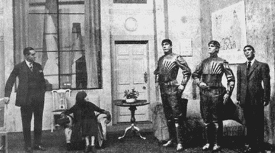
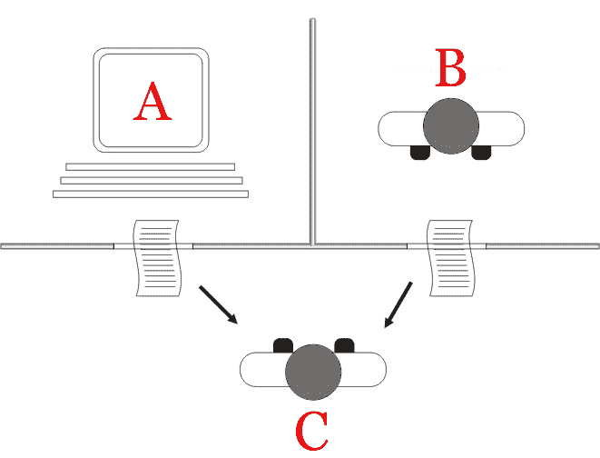
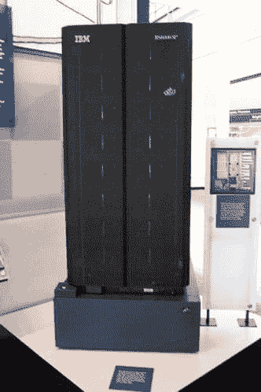

# 人工智能简史

> 原文：<https://dev.to/lschultebraucks/a-short-history-of-artificial-intelligence-7hm>

*[最早发表于 lasseschultebraucks.com](https://lasseschultebraucks.com/ai/machine%20learning/2017/12/17/a-short-history-of-artificial-intelligence.html)*

什么是人工智能？人工智能在过去达到了什么程度？在过去的几年里，人工智能有哪些显著的里程碑？人工智能在 5 年、20 年、50 年、100 年后会解决什么？人工智能的未来会是怎样的？

围绕人工智能有许多问题。我们已经可以回答其中的一些问题，并谈论我们过去用人工智能解决的问题。

另一方面，谈论未来的情景，特别是如果我们谈论超级智能，结果是困难的。但是有些情况我们可以思考和评估。

## 人工智能的定义

人工智能是一个术语，由两个词组成。

### 人为的

人造的是不真实的东西，因为它是模拟的，所以有点假。我能想到的最简单的人造的东西就是人造草。人造草不是真草，所以有点假。出于各种原因，它被用来替代真正的草。人造草经常用于体育运动，因为它更有抵抗力，因此可以比真草使用更长时间。也比真草容易打理。我确信有更多理由支持人造草和反对真草。但这不是我想说的重点。关键是，有些东西是人造的，可以替代真实的东西，这是有原因的。

### 智力

智力是一个非常复杂的术语。它可以用许多不同的方式来定义，如逻辑、理解、自我意识、学习、情感知识、计划、创造力，当然还有解决问题。

我们称我们，人类，聪明，因为我们都做这提到的事情。我们感知我们的环境，从中学习，并根据我们的发现采取行动。

这同样适用于动物。关于动物智力有趣的一点是，有许多不同的物种，因此我们可以比较物种之间的智力。

在这两种情况下(人类智能和动物智能)，我们谈论自然智能(NI)。

除了人类和动物之外，还有关于植物智能的争论。植物的智慧显示出与人类或动物的不同。这里的主要原因是因为植物没有大脑或神经元网络，但它们对环境做出反应。植物智能本身是一个非常有趣的话题，因为植物智能不是通过运动或琵琶的反应立即可见的。

如果我们谈论人工智能(AI ),我们指的是计算机科学的一个子领域。人工智能是由机器、计算机和主要是软件来发挥作用的。机器模仿，这里我们看到了为什么叫人工，某种基于环境、观察、奖励和学习过程的认知功能。

为了更好地理解人工智能，我们回顾了人工智能的历史，以了解人工智能的能力以及他的现状与现在的关系。

## 人工智能的历史和里程碑

人工智能的历史相当有趣，大约始于 100 年前。

### 罗森公司的万能机器人(R.U.R .)

1920 年，捷克作家卡雷尔·恰佩克出版了一部名为《Rossumovi univerzálníRoboti 》( Rossum 的通用机器人)的科幻剧，该剧也以 R.U.R .而闻名。该剧引入了机器人一词。R.U.R .谈的是一家工厂，这家工厂生产名为机器人的人造人。它们不同于今天的机器人术语。在 R.U.R .机器人是有生命的生物，更类似于克隆人这个术语。机器人在苏联首先为人类工作，但后来出现了机器人叛乱，导致了人类的灭绝。

[T2】](https://res.cloudinary.com/practicaldev/image/fetch/s--VZ-3kEoW--/c_limit%2Cf_auto%2Cfl_progressive%2Cq_auto%2Cw_880/https://i2.wp.com/upload.wikimedia.org/wikipedia/commons/8/87/Capek_play.jpg%3Fw%3D730%26ssl%3D1)

因为不同的原因，这出戏很有趣。首先，它引入了机器人这个术语，尽管它并不完全代表机器人的现代概念。接下来，它也讲述了机器人的创造，因此某种人工智能，这首先似乎是对人类的积极影响，但后来是威胁整个人类的机器人叛乱。

文学和电影中的人工智能，本身就是一个很大的话题。R.U.R .的例子应该显示了人工智能对研究和社会的重要性和影响。

### 艾伦·图灵

艾伦·图灵于 1912 年 6 月 23 日出生于伦敦。他之所以广为人知，是因为加密了“谜”的密码，这是纳粹德国用来通信的。艾伦·图灵的研究也导致了他的计算理论，该理论涉及如何有效地解决问题。他在图灵机模型中提出了他的想法，图灵机今天仍然是计算机科学中的一个流行术语。图灵机是一种抽象机器，尽管模型简单，但它可以构建任何算法的逻辑。由于同时在神经学、信息论和控制论方面的发现，艾伦·图灵创造了建造电子大脑的想法。

[T2】](https://res.cloudinary.com/practicaldev/image/fetch/s--FNFm2M1o--/c_limit%2Cf_auto%2Cfl_progressive%2Cq_auto%2Cw_880/https://i1.wp.com/upload.wikimedia.org/wikipedia/commons/5/55/Turing_test_diagram.png%3Fw%3D730%26ssl%3D1)

第二次世界大战结束几年后，图灵引入了他广为人知的图灵测试，试图定义机器的智能。该测试背后的想法是，如果机器(A)和人(B)通过自然语言进行交流，而第二个人(C)，即所谓的电梯，不能检测到哪个交流者(A 或 B)是机器，那么机器(例如计算机)就被称为智能的。

### 达特茅斯会议

1956 年，可能出现了第一个人工智能车间，人工智能研究领域随之诞生。来自卡耐基梅隆大学(CMU)、麻省理工学院(麻省理工学院)的研究人员和 IBM 的员工一起成立了人工智能研究院。在接下来的几年里，他们取得了巨大的进步。几乎每个人都非常乐观。

二十年内，机器将能做人类能做的任何工作。"——司马贺(CMU)

*“在一代人的时间内……创造‘人工智能’的问题将得到实质性的解决”——马文·明斯基(麻省理工学院)*

那是在 20 世纪 60 年代。在接下来的几年里，进度慢了下来。由于没有认识到任务的艰巨性，诺言被违背了。

### 第一个艾冬天

由于过于乐观的环境和没有出现突破，美国和英国政府削减了人工智能的探索性研究。接下来的几年被称为(第一个)艾冬天。人们失去了热情，没有人愿意资助人工智能研究。公众对人工智能的兴趣降低了。这是在 1974 年左右。

### 专家系统

在第一个 AI 寒冬之后，人工智能以所谓“专家系统”的形式回来了。

专家系统是在特定领域回答问题和解决问题的程序。他们模仿某个特定领域的专家，按照规则解决问题。专家系统中有两种类型的引擎:第一种是知识引擎，它表示关于特定主题的事实和规则。第二种是推理机，它将知识引擎中的规则和事实应用到新的事实中。

#### 综合整体设计

1981 年，一个名为 SID(综合集成设计)的专家系统设计了 93%的 VAX 9000 CPU 逻辑门。SID 系统存在于 1000 条手写规则中。CPU 的最终设计花了 3 个小时计算，在许多方面超过了人类专家。例如，SID 产生了比手工设计的更快的 64 位加法器。此外，每个门的错误率(来自人类专家的大约每 200 个门 1 个错误)要低得多，在 SID 系统的最终结果中大约每 20，000 个门 1 个错误。

### 第二个艾冬天

在经历了一系列金融挫折后，第二次人工智能寒冬出现在 80 年代末和 90 年代初。因苹果(Apple)和 IBM 制造的台式电脑而遭受损失的专家系统和硬件公司的倒下，再次导致人们对人工智能的兴趣下降，一方面来自公众，另一方面来自投资者。

### 深蓝色

几经沉浮，深蓝成为第一台打败国际象棋世界冠军加里·卡斯帕罗夫的国际象棋计算机。1997 年 5 月 11 日，IBM 的国际象棋计算机在 6 局比赛后以 3 比 2 击败了加里·卡斯帕罗夫。

[T2】](https://res.cloudinary.com/practicaldev/image/fetch/s--jRhnvMyJ--/c_limit%2Cf_auto%2Cfl_progressive%2Cq_auto%2Cw_880/https://i2.wp.com/upload.wikimedia.org/wikipedia/commons/thumb/b/be/Deep_Blue.jpg/399px-Deep_Blue.jpg%3Fresize%3D332%252C498%26ssl%3D1)

深蓝使用树搜索来计算最多 20 个可能的移动。它通过一个主要由手写的价值函数来评估位置，后来通过分析数千场比赛来优化该函数。深蓝还包含了许多特级大师游戏的开局和残局库。

1997 年，深蓝以 11.38 GFLOPS 的速度位列第 259 位。包括:1997 年最强大的超级计算机拥有 1，068 GFLOPS，今天(2017 年 12 月)最强大的超级计算机拥有 93，015 GFLOPS。

FLOPS 代表每秒浮点运算次数，GFLOPS 中的“G”代表千兆。所以相当于 1 GFLOPS 的是 10⁹ FLOPS。

### 21 世纪:深度学习、大数据和人工通用智能

在过去的二十年里，人工智能迅猛发展。人工智能市场(硬件和软件)在 2017 年已经达到 80 亿美元，研究公司 IDC(国际数据公司)预测，到 2020 年该市场将达到 470 亿美元。

通过大数据、更快的计算机和过去几年机器学习技术的进步，这一切都是可能的。

随着神经网络的使用，像视频处理、文本分析和语音识别这样的复杂任务现在可以处理，并且已经存在的解决方案将在未来几年变得更好。

### Atari 游戏

2013 年，世界上最重要的人工智能研究之一 DeepMind 推出了一种人工智能，它可以在人类玩家的水平之上玩几个雅达利游戏。这首先看起来不是很有表现力，但他们只是使用了强化学习和神经网络来让 AI 自我学习这些游戏。此外，他们只是将像素作为代理人的输入，因此没有根据代理人的移动给予直接的奖励分数。

2015 年，他们进一步推出了一个更聪明的代理，该代理成功地独自玩了 49 款经典的雅达利游戏。

除了来自老式复古游戏机的经典游戏，DeepMind 正在为更复杂的游戏开发人工智能，例如星际争霸 2。星际争霸 2 是一款即时战略(RTS)游戏，是最受欢迎的 1 对 1 电子竞技游戏。星际争霸 2 在韩国非常受欢迎，最好的星际争霸 2 职业玩家来自韩国。尽管如此，仍有许多欧洲和北美职业球员以打球为生。星际争霸 2 是一个比经典电子游戏复杂得多的游戏:你可以做更多可能的动作，你并不了解你对手的一切，你必须侦察他，探索他在做什么。在星际争霸 2 中，每一分钟都有几十个战略决策需要选择，一般来说，与经典电子游戏相比，这更需要考虑。

目前的人工智能不是很好，它只能玩迷你游戏，如建筑单位。关于星际争霸 2 的人工智能我非常兴奋，因为我是星际争霸 2 的超级粉丝，我对人工智能将如何改变星际争霸 2 的元游戏以及它将探索什么样的新战术感到兴奋。

### AlphaGo

除了经典的雅达利游戏，DeepMind 还成功地用他的人工智能 AlphaGo 击败了世界上最好的人类围棋选手。2015 年 10 月，他们首次以五比零击败了欧洲围棋冠军范辉。赛后，围棋界有很多人对 AlphaGo 持怀疑态度，因为范辉是“唯一”一个 2 段(9 段中最好的)欧洲冠军。因此，DeepMind 团队飞往韩国，迎战九段棋手 Lee Sedol。李·塞多尔被认为是世界上最好的围棋选手之一。在 DeepMind 成功赢得前 3 场比赛后，Lee Sedol 似乎非常绝望。但在第四局中，AlphaGo 在犯了一个明显的错误后输了。在最后一场比赛中，AlphaGo 可能会再次获胜。最终，AlphaGo 以 4-1 战胜了 Lee Sedol。

如果你对 AlphaGo 的故事更感兴趣，我推荐这部电影。在我看来，这部电影很棒，除了人工智能的技术影响之外，它还展示了对围棋界的影响。

2017 年 DeepMind 发布了下一代 AlphaGo。AlphaGo Zero 建立在精简的硬件上，刚刚学会与自己对弈。经过三天的训练，AlphaGo Zero 比 AlphaGo 版本更强，AlphaGo 版本击败了 Lee Sedol，并以 100-0 战胜了他的年轻版本。经过 40 天的训练，它还击败了他以前版本的 AlphaGo Zero。

## 接下来是什么？

没人知道，我也不知道。

这个答案可能很不令人满意，因此让我们来谈谈可能的情况。

### 人工通用智能，超级智能——AI 接管？

到目前为止，也有一些人工智能系统是专家，例如 AlphaGo (Zero)，他掌握了围棋，可能超过人类特级大师。但是还没有人工通用智能(AGI)。AGI 指的是一种人工智能，它能成功地完成人类能完成的任何智力任务。图灵测试是测试人工智能是否是 AGI 的一个例子。

超级智能将 AGI 带入下一个阶段。超智能指的是一种 AGI，它比人聪明，在任何人类能做的智力工作中都能胜过人类。

什么时候会有 AGI，什么时候会有超智能，这个问题当然很难回答(几乎所有的答案都是指未来预测)。牛津大学人工智能研究员尼克·博斯特罗姆(Nick Bostrom)在一篇论文中评价了这个问题。

人工智能接管指的是超级智能将接管世界并与人类对抗的场景。这是一个受欢迎的科幻主题，100 年前在苏联开始使用，现在仍用于更现代的电影，如《终结者》或《黑客帝国》。那么，人工智能有一天会接管世界，这只是虚构的还是可能的？

我对此没有 100%的把握。我更倾向于没有人工智能接管的观点。但也有许多人，如埃隆·马斯克、斯蒂芬·霍金和比尔·盖茨，担心人工智能的可能性。因此，我认为我们不应该称人工智能接管为一个纯粹虚构的场景，我们应该意识到这一点，并采取负责任的行动。

如果你对 AGI 和超级智能感兴趣，我推荐你读读尼克·博斯特罗姆的书《超级智能——道路、危险、策略》。

## 结论

已经有人工智能系统可以在特定领域超越人类，比如下围棋或数据分析。今天，如果我们谈论生产中的人工智能系统，我们指的是专家。但是现在还没有能像人类一样工作的人工智能(AGI ),也没有比人类更聪明的超级智能。

*[最早发表于 lasseschultebraucks.com](https://lasseschultebraucks.com/artificial-intelligence-history)*