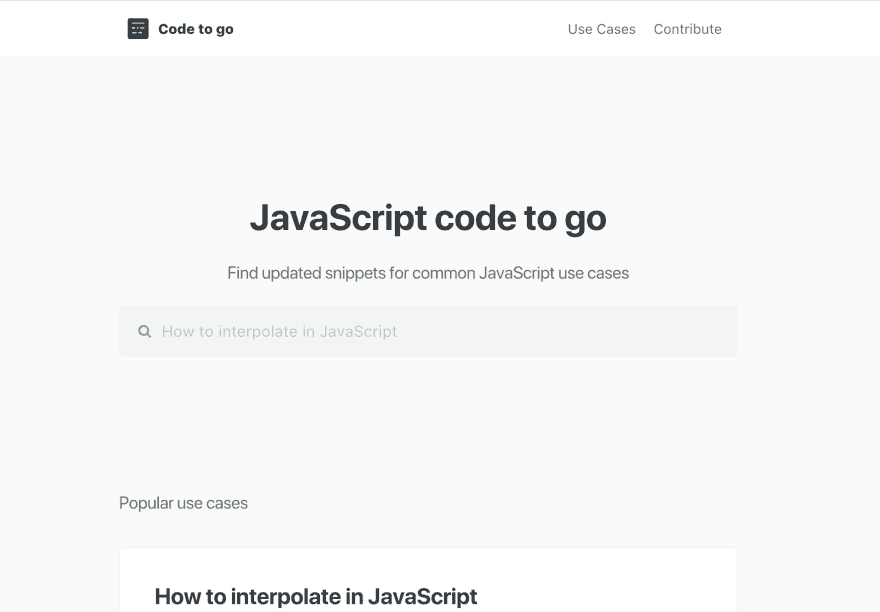
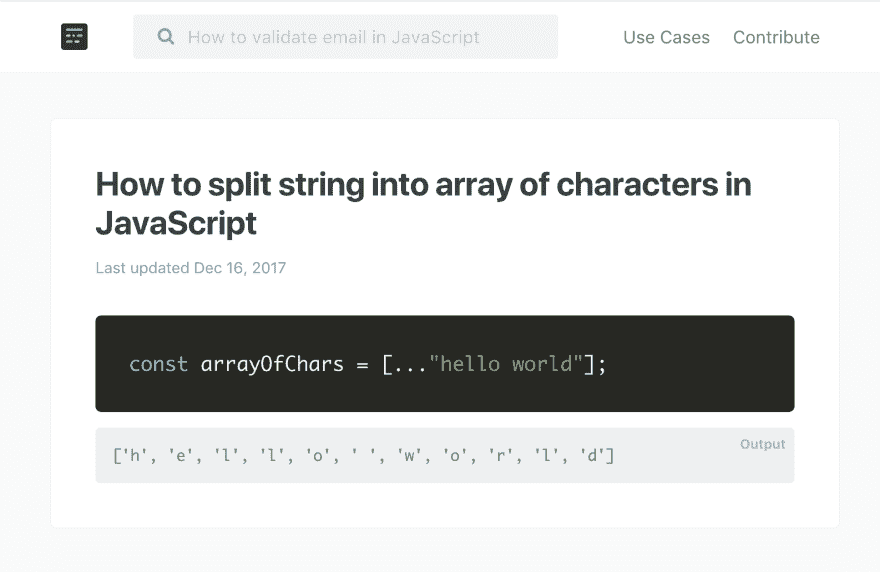
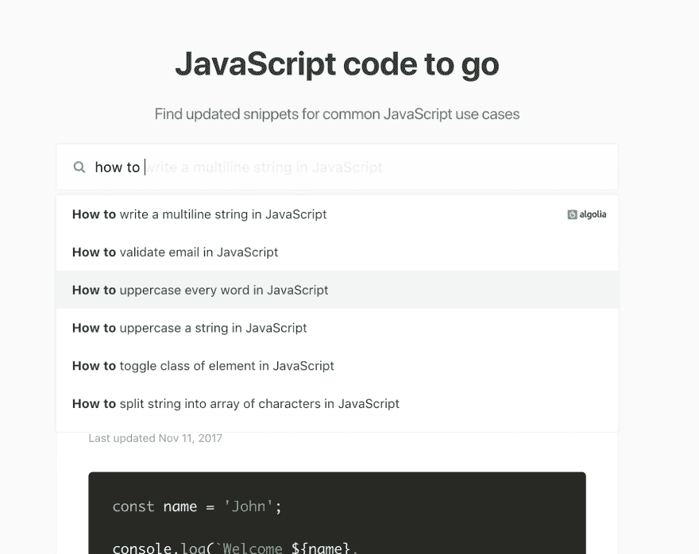
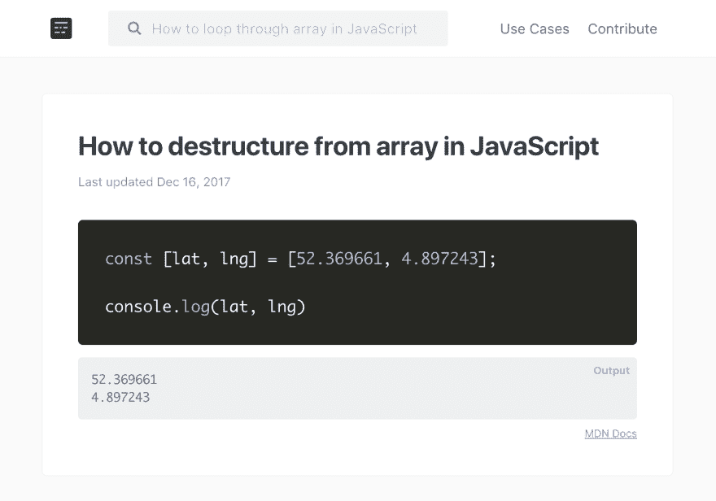

# Code to go:帮助您找到常见用例的更新代码片段

> 原文:[https://dev . to/jadjoubran/code-to-go-help-you-find-updated-snippets-for-common-use-cases-7b 7](https://dev.to/jadjoubran/code-to-go-helping-you-find-updated-snippets-for-common-use-cases-7b7)

[Code to go](https://codetogo.io) 是一个网站，旨在帮助学习 JavaScript 的开发人员找到最新的、准确的、随时可用的 JavaScript 片段，用于常见的用例。

[T2】](https://res.cloudinary.com/practicaldev/image/fetch/s--O1qBex56--/c_limit%2Cf_auto%2Cfl_progressive%2Cq_auto%2Cw_880/https://thepracticaldev.s3.amazonaws.com/i/64tpcgduu6kbm7lfa81t.png)

Code to go 背后的动机是，如果你在 2017 年教某人 JavaScript，他们很可能会在谷歌上搜索一些简单的问题，例如:

**如何在 JavaScript 中把一个字符串拆分成字符数组**

然而，这个搜索结果将产生一个 7 年前被问到的 [Stackoverflow 问题](https://stackoverflow.com/questions/6484670/how-do-i-split-a-string-into-an-array-of-characters)，被标记为重复，并且有一个推荐使用`split('')`的公认答案。

虽然在这里使用`split('')`可能没什么大不了的，但学习者会立即失去在这里找到正确答案的信心，因为评论明确指出他们不应该使用`split('')`。

我意识到有一个 stackoverflow 无法填补的空白，那就是提供可以随时使用的简短代码片段，尤其是对初学者而言。

这正是 Code to go 要做的事情。

[T2】](https://res.cloudinary.com/practicaldev/image/fetch/s--JiCpLvwP--/c_limit%2Cf_auto%2Cfl_progressive%2Cq_auto%2Cw_880/https://thepracticaldev.s3.amazonaws.com/i/5iqy335h2jw4jhvnwp4h.png)

Code to go 上给出的答案大多数时候是自给自足的。它们很容易理解，并且它们代表了通用的场景，这使得开发人员可以根据自己的场景修改这些片段。

[T2】](https://res.cloudinary.com/practicaldev/image/fetch/s--frpk8n3L--/c_limit%2Cf_auto%2Cfl_progressive%2Cq_auto%2Cw_880/https://thepracticaldev.s3.amazonaws.com/i/tdtze01sxzwti04wy4ij.png)

在撰写本文时，Code to go 有 50 个用例，您可以浏览或搜索。

我们计划增加更多，但是我们的首要任务是保持质量而不是数量。

如果在网站上找不到，你也可以建议一个用例。你可以简单地点击 Contribute 按钮或者直接去 [github 库](https://github.com/jadjoubran/codetogo.io/issues)创建一个新的问题。

同样重要的是要提到 Code to go 并不打算取代文档。只要有可能，我们的答案会链接到官方的 Mozilla 开发者网络文档，如下例所示。这使得答案很容易被初学者吸收，同时也让他们更深入地研究文档。

[T2】](https://res.cloudinary.com/practicaldev/image/fetch/s--242zUVwn--/c_limit%2Cf_auto%2Cfl_progressive%2Cq_auto%2Cw_880/https://thepracticaldev.s3.amazonaws.com/i/su4b9g1b6ndqibw2kr4r.png)

我希望这能让学习 javascript 变得更加愉快！