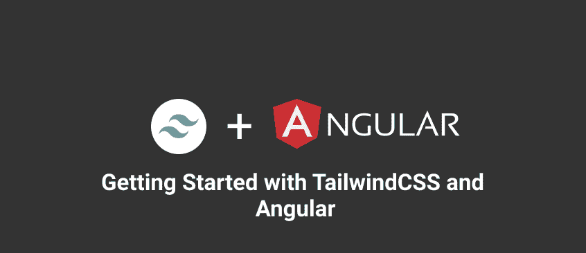

# Angular 项目中的 tailwindCSS 入门

> 原文:[https://dev . to/iam afro/getting-started-with-tailwindcss-in-your-angular-project-bc3](https://dev.to/iamafro/getting-started-with-tailwindcss-in-your-angular-project-bc3)

[T2】](https://res.cloudinary.com/practicaldev/image/fetch/s--KZoFTZKh--/c_limit%2Cf_auto%2Cfl_progressive%2Cq_auto%2Cw_880/https://thepracticaldev.s3.amazonaws.com/i/jftdorwqp0p7tsbdmrah.png)

**什么是顺风**

根据 [tailwind](https://tailwindcss.com) 网站的说法，“tailwind 是一个快速构建定制界面的实用优先框架”。从我的角度来看，tailwind 提供了易于记忆的 css 类来创建用户界面，同时编写最小的 css。

另一方面，它对你的网站应该是什么样子也没有意见，也不会强加一些你必须努力才能撤销的设计决定。

我不打算详细说明如何使用 tailwind，他们的[站点](https://tailwindcss.com)有简单的例子，并且有很好的文档记录。因此，我建议您在完成我将向您展示的设置过程后，查看一下它。

**入门**

所以要开始，你需要使用`angular-cli`创建一个新的角度项目。

`ng new tailwind-config`

运行命令启动新 angular-cli 项目。现在，要将顺风添加到我们的项目中，我们可以使用 CDN

`<link href="https://cdn.jsdelivr.net/npm/tailwindcss/dist/tailwind.min.css" rel="stylesheet">`

运筹学

我们可以使用它们各自的 cdn 将基本样式从实用类中分离出来

`<link href="https://cdn.jsdelivr.net/npm/tailwindcss/dist/preflight.min.css" rel="stylesheet">`

`<!--- Your stylesheet here --->`

`<link href="https://cdn.jsdelivr.net/npm/tailwindcss/dist/utilities.min.css" rel="stylesheet">`

但是我建议您从 NPM 安装该项目，这样您就可以根据自己的风格和品味进行配置。这也有助于您控制最终束的大小。所以我们将安装 NPM 的顺风机

`npm install tailwindcss --save-dev`

安装 tailwind 之后，您需要创建一个配置文件。现在，如果您想要定制它并插入新的实用程序类，这是必要的。

`./node_modules/.bin/tailwind init [filename]`

运行命令创建您配置文件。在我的例子中，我将把我的配置文件命名为`tailwind.js`。

**角度入门**

我将描述在我们的项目中使用顺风的两种不同方法。每种方法都有它的缺陷，它留给你去选择。

#### 方法 1:

###### 在我们的 webpack 配置中包含 tailwind build。

要使用这个方法，我们需要弹出项目的 webpack 配置文件。我们可以用下面的方法做到这一点。`ng eject`。之后，再次运行`npm install`。

添加顶部的`webpack.config.js`添加这条线注入顺风。

```
const tailwind = require('tailwindcss'); 
```

<svg width="20px" height="20px" viewBox="0 0 24 24" class="highlight-action crayons-icon highlight-action--fullscreen-on"><title>Enter fullscreen mode</title></svg> <svg width="20px" height="20px" viewBox="0 0 24 24" class="highlight-action crayons-icon highlight-action--fullscreen-off"><title>Exit fullscreen mode</title></svg>

在同一个文件中，您将看到一个 postcssPlugins 函数。在调用 autoprefixer 之前的函数中，我们将在那里包含我们的 tailwind 构建。

现在，函数应该如下所示:

```
const postcssPlugins = function() {
   ......

  };
  return [
    postcssUrl({
    ......

    tailwind('./tailwind.js'),
    autoprefixer()
  ].concat(minimizeCss ? [cssnano(minimizeOptions)] : []);
}; 
```

<svg width="20px" height="20px" viewBox="0 0 24 24" class="highlight-action crayons-icon highlight-action--fullscreen-on"><title>Enter fullscreen mode</title></svg> <svg width="20px" height="20px" viewBox="0 0 24 24" class="highlight-action crayons-icon highlight-action--fullscreen-off"><title>Exit fullscreen mode</title></svg>

您可能会遇到以下错误`atRule.before is not a function`。如果是这样，你需要安装最新的 postcss 模块。您可以使用以下命令来完成此操作。

`npm install postcss postcss-loader postcss-url --save-dev`

使用`npm start`启动您的服务器。

这种方法的问题是,`ng eject`硬编码了项目文件的路径，这使得它很难在不同的 pc 上重用，尤其是如果你有一个团队在处理同一个项目。这是我的配置文件的摘录。

```
'rxjs/util/tryCatch':
        'c:\\Users\\Test\\Desktop\\Work\\project\\node_modules\\rxjs\\_esm5\\util\\tryCatch.js',
'rxjs/util/toSubscriber':
        'c:\\Users\\Test\\Desktop\\Work\\project\\node_modules\\rxjs\\_esm5\\util\\toSub
 ............ 
```

<svg width="20px" height="20px" viewBox="0 0 24 24" class="highlight-action crayons-icon highlight-action--fullscreen-on"><title>Enter fullscreen mode</title></svg> <svg width="20px" height="20px" viewBox="0 0 24 24" class="highlight-action crayons-icon highlight-action--fullscreen-off"><title>Exit fullscreen mode</title></svg>

现在，如果您愿意编辑和重新配置您的 webpack-config 文件来解决这个问题，您可以停止使用这个方法，或者如果您只是好奇，可以查看下一个方法。

**方法二:**

##### 使用顺风的 cli

Tailwind 有一个 CLI 来创建配置文件和处理样式表。我假设您有一个注入了 tailwind 基本样式和实用程序的样式表。

`tailwind-build.css`

```
@tailwind prefilgiht;

@tailwind utilities; 
```

<svg width="20px" height="20px" viewBox="0 0 24 24" class="highlight-action crayons-icon highlight-action--fullscreen-on"><title>Enter fullscreen mode</title></svg> <svg width="20px" height="20px" viewBox="0 0 24 24" class="highlight-action crayons-icon highlight-action--fullscreen-off"><title>Exit fullscreen mode</title></svg>

我们将把这个样式表放在与项目的`styles.css`文件相同的文件夹中。您可以随意命名该文件。然后，我们将使用 tailwind CLI 输出包含 tailwind 的基本和实用样式的 styles.css 文件。

`./node_modules/.bin/tailwind build ./src/tailwind-build.css -c ./tailwind.js -o ./src/styles.css`

因为我们每次在启动服务器之前都需要这样做，所以我们可以将它添加到 package.json 文件中。

```
{
  "name": "tailwind-config",
  "version": "0.0.0",
  ........
  "scripts": {
  "prestart": "tailwind build ./src/taliwind-build.css -c ./tailwind.js -o ./src/styles.css",
   ..........
  }
}, 
```

<svg width="20px" height="20px" viewBox="0 0 24 24" class="highlight-action crayons-icon highlight-action--fullscreen-on"><title>Enter fullscreen mode</title></svg> <svg width="20px" height="20px" viewBox="0 0 24 24" class="highlight-action crayons-icon highlight-action--fullscreen-off"><title>Exit fullscreen mode</title></svg>

这将在我们的服务器启动之前构建出我们的`styles.css`文件。就是这样。

可能会有几个解决方案，如果你有，可以在下面的评论中提出来。或者在 twitter 上提到我[@ iamafaro](https://twitter.com/iamafro)。