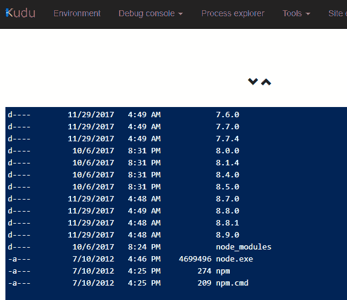
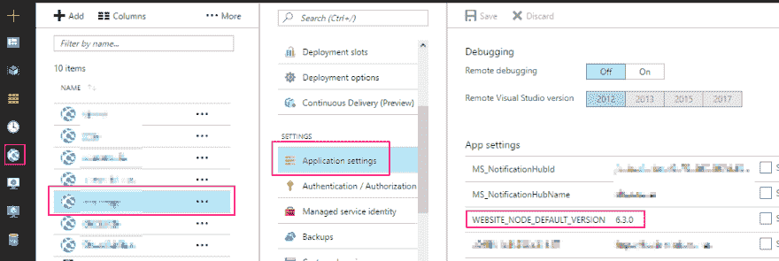

# 更新本地(Windows10)和 Azure NodeJS 版本并保持同步

> 原文:[https://dev . to/code prototype/updating-local window S10-and-azure-nodejs-version-and-keep-them-in-sync-c2n](https://dev.to/codeprototype/updating-localwindows10-and-azure-nodejs-version-and-keep-them-in-sync-c2n)

总有一天，我们都必须升级到最新或稳定的 NodeJS 版本。这不是我每天、每周甚至每个月都要做的事情，所以我很容易忘记上次是怎么做的。我的记忆力没那么好。在 Windows 10 上使用 NodeJS 进行开发，在 Azure 上托管产品，这让我觉得这项任务更加艰巨。所以这一次，我决定记录。希望这能对未来的你我有所帮助。

首先，我们必须确定我们想要什么版本的 NodeJS。顺便说一句，我们并不总是想要“最新的”。如果想要长期支持版本(LTS)，选择偶数版本如 6.x.y，或 8.x.y 等。但我们必须确保无论我们选择哪个版本，它都受到 Azure 的支持。

去[https://nodejs.org/download/release/](https://nodejs.org/download/release/)你会看到所有已经发布的 NodeJS 版本。本文发表时，9.3.0 版本是最新的，但 8.9.3 是 8.x 系列的最后一个。

然而，我们不能简单地使用 8.9.3，因为在撰写本文时，Azure 只支持 8.9.0。我们可以找到的方法是进入[https://[your-azure-app-name]. SCM . azure websites . net/debug console/](https://%5Byour-azure-app-name%5D.scm.azurewebsites.net/DebugConsole/)，然后在控制台键入命令

`ls D:\"Program Files (x86)"\nodejs`

[T2】](https://res.cloudinary.com/practicaldev/image/fetch/s--rCqwy0WP--/c_limit%2Cf_auto%2Cfl_progressive%2Cq_auto%2Cw_880/https://thepracticaldev.s3.amazonaws.com/i/gyophl4w2xcdp5kr7iu8.png)

让我们从 8.9.0 开始，在您进行开发工作的 Windows 10 上，以下是步骤:

1.  在 Windows 10 上，以管理员身份启动 PowerShell。
2.  键入命令

    `npm i -g npm`

3.  键入命令

    `wget https://nodejs.org/dist/v8.9.0/win-x64/node.exe -OutFile 'C:\Program Files\nodejs\node.exe'`

4.  一旦完成，您可以用

    `node -v`
    进行验证

如果遇到什么问题，请咨询
[https://stackoverflow.com/a/39602646/1244013](https://stackoverflow.com/a/39602646/1244013)

接下来，让我们在 Azure 上更新到 NodeJS 的相同版本。登录到[https://portal.azure.com](https://portal.azure.com)

1.  在左侧菜单中，选择**应用服务**
2.  选择您的 NodeJS 应用
3.  在**设置**下，选择**应用设置**
4.  在弹出的新刀片上向下滚动到**应用程序设置**，找到网站 _ 节点 _ 默认 _ 版本，从任何版本更改为 8.9.0 
5.  不要忘记保存
6.  很遗憾，请重启您的应用服务。
7.  要进行验证，请返回 Kudu 控制台([https://[your-azure-app-name]. SCM . azure websites . net/debug console](https://%5Byour-azure-app-name%5D.scm.azurewebsites.net/DebugConsole))，键入`node -v`