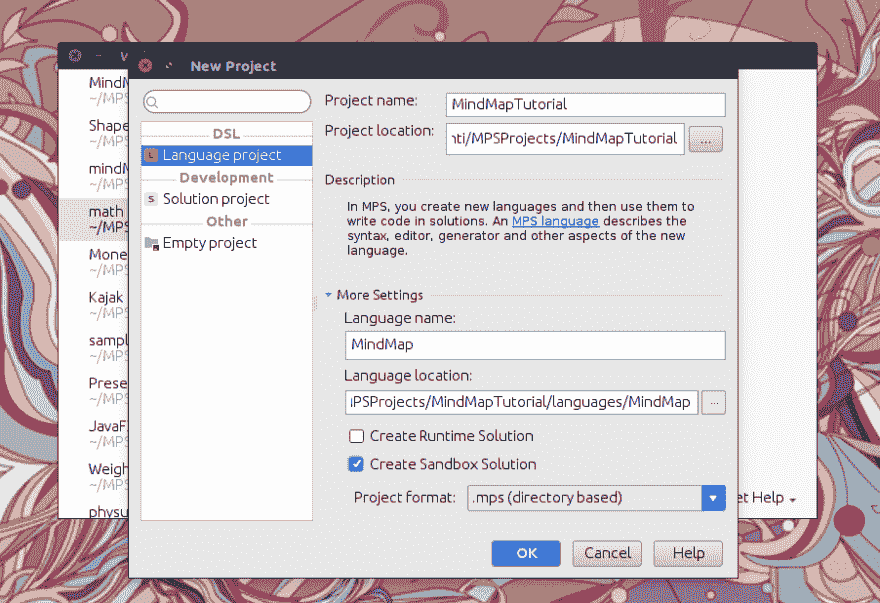
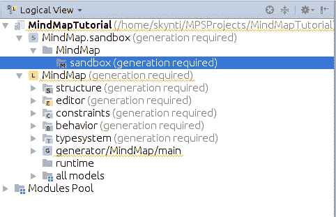
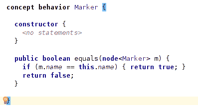
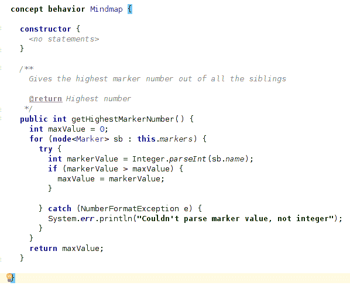
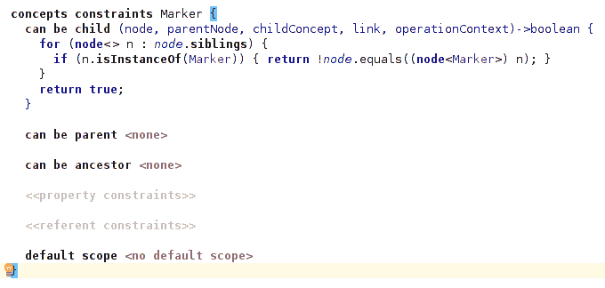
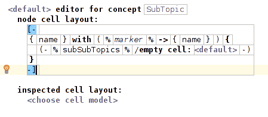
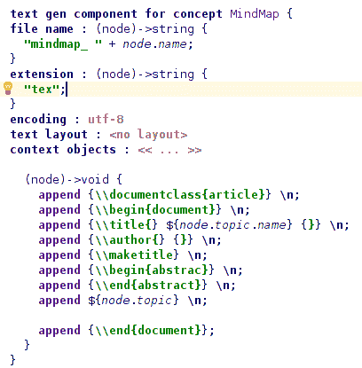
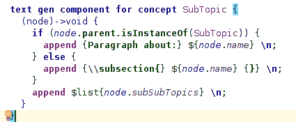

# 使用 JetBrains MPS 创建简单的语言

> 原文:[https://dev . to/Antoine/creating-a-simple-language-using-jetbrains-MPs-c7d](https://dev.to/antoine/creating-a-simple-language-using-jetbrains-mps-c7d)

# 项目的演示

这个项目的目标是构建一种语言来定义思维导图。这些思维导图有多个层次的主题，还包括每个主题的潜在标记。思维导图文件将能够生成 LaTeXfile，该文件将具有根据思维导图的主题定义的部分和子部分。我们将遵循的 UML 图是这样的:

本教程面向有一些使用面向对象语言经验的程序员，尤其是类似 Java 的语言。

本教程可以与这个 [git 库](https://github.com/AntoineGagnon/MindMapMPS)结合使用，以遵循每个提交的每个步骤。

# 初始设置

## 安装

要安装该程序，确保我们拥有最新稳定版本的最佳方式是前往官方[下载页面](https://www.jetbrains.com/mps/download)下载我们操作系统的版本。MPS 可以在 Windows、Mac 和大多数版本的 Linux 上使用。

## 创建项目

启动 MPS 后，选择我们希望用于编辑器的主题和快捷方式，然后单击“创建新项目”。在本文中，我们使用了默认的 IntelliJ 主题和默认快捷键。

正如我们在项目创建窗口的左侧看到的，我们可以用**语言项目**创建一个新语言，用**解决方案项目**创建一个使用 MPS 创建的 DSL 的解决方案，或者创建一个空项目并从头开始构建一切。

我们将创建一种新语言，因此单击**语言项目**，为我们的项目和我们的语言选择一个名称，并确保我们单击**创建沙盒解决方案**复选框，以便能够测试我们的语言。我们的菜单应该是这样的:

 
现在我们只需点击 OK 来创建我们的项目。

## 导航逻辑视图

[T2】](https://res.cloudinary.com/practicaldev/image/fetch/s--pgPVfsFr--/c_limit%2Cf_auto%2Cfl_progressive%2Cq_auto%2Cw_880/https://thepracticaldev.s3.amazonaws.com/i/0t63nj1jy572rr0izrl5.png)

正如我们所看到的，逻辑视图将语言测试所在的沙箱和语言模块分开，这里简称为**思维导图**，并在其名称前用 L 图标标识。我们将主要关注语言部分，注意不同方面的定义，如**结构、编辑器、约束等**。

# 语言创造

我们现在将关注语言创造。我们将编辑语言模块，并使用 MPS 提供的沙箱测试语言的效果。

## 沙盒使用

为了能够在沙盒中使用语言，我们需要确保在更改后通过右键单击语言模块并单击**重建语言思维导图**来重建语言。在我们的第一个概念被创建后，我们将能够通过右击**思维导图.沙箱**模块内的**沙箱**模型并选择**新思维导图**来创建一个新的思维导图文件。

## 结构

我们语言的结构是我们语言的概念之间的属性和关系的定义。我们将首先通过右键单击**结构**方面并选择**新概念**来创建一个新概念，从而创建一个空概念。

我们将首先创建思维导图的基本概念。我们可以看到，如果我们打开概念文件，编辑过程是非常不同的，这是因为 MPS 是一个直接编辑我们程序的抽象语法树(AST)的投影编辑器。主要的区别在于，MPS 不会让我们在任何我们想写的地方写，而是指导我们用符合语法的元素来填充文件中的空白。

让我们通过编辑空字段将我们的概念的名称更改为*思维导图*，然后将**实例可以是根**属性更改为*真*。我们的思维导图概念现在位于抽象语法树的顶端，我们可以从那里构建元素。

让我们通过实现 *INamedConcept* 接口向我们的思维导图添加一个名称属性，我们还可以使用 Ctrl + Space 快捷键来自动完成名称，并获得我们可以使用的不同概念的建议。我们可以使用 Ctrl + B 导航到的这个接口有一个将被实现的**名称:字符串**属性，并且还向该属性添加了一些函数和重构选项。

我们可以添加一个别名，默认情况下将在编辑器中使用该别名来定义我们的概念，还可以添加一个简短的描述，当使用自动完成功能时，该描述将显示在工具提示中，当尝试使用**思维导图**概念时，该描述将显示在其他菜单中。

现在我们需要将主题添加到我们的思维导图中，我们将创建一个新的**主题**概念，所有其他类型的主题都将从这个概念中派生出来。一旦我们的概念被创建，我们给它命名，并在同一个字段中使用 Alt + Enter 快捷键来访问类操作，在这里我们单击 **Make abstract** 选项。让我们也让这个主题实现 **INamedConcept** 接口，因为我们也需要为我们的主题命名。

我们还计划能够为我们的主题添加一个标记，所以让我们创建一个名为 **Marker** 的新概念，它只是实现了 **INamedConcept** 接口，并且有一个别名和一个描述。
现在我们可以回到我们的**主题**概念，并添加一个标记参考。为此，我们首先输入属性的名称，这里是*标记*，然后按键进入下一个字段并添加*标记*类。我们将把多重性留在 *[0..1]* 因为我们的主题只能有零个或一个标记。我们还将添加一个*标记*子元素到**思维导图**概念中，并使用 *[0..n]* 多样性，因为我们可以定义
多个标记，稍后我们的主题将引用这些标记。

现在，我们能够创建不抽象的主题，并将在思维导图中使用。通过遵循 UML 图，我们创建了一个名为 *CentralTopic* 的新概念，它将扩展 *Topic* 类，而不是 *BaseConcept* ，我们给它一个别名和一个简短的描述。
然后我们可以回到思维导图，添加一个 **CentralTopic** 类的子类，我们称之为 *centralTopic* ，它将有一个 *[0..1]* 多重性。
按照与 **CentralTopic** 相同的模式，我们将创建一个 *MainTopic* 概念，并将其添加为 **CentralTopic** 的子主题，带有一个 *[0..n]* 多重性，作为一个中心话题可以有多个主要话题。我们还将对一个子标题为*的子标题为*的概念做同样的事情，这个子标题为 *[0..n]* 主主题**的多重性**，但对其子主题有所扭曲，因为它们也是**子主题**类型，并被称为*子主题*。

我们现在有了一个可以在沙盒中测试的功能性思维导图语言。虽然语法粗糙，有时令人困惑，但它让我们在不同的层次上创建主题，给它们分配在思维导图中创建的标记，并给它们命名。我们还可以通过按 Alt + X 来使用节点浏览器功能，以观察组成思维导图的不同元素。

## 行为

MPS 中的行为与方法非常相似，为概念定义功能。它们还提供了修改构造函数的可能性，尽管构造函数不能访问模型，因为它是在节点链接到树之前被调用的。

在我们的项目中，我们将为我们的**标记**概念添加一个**等于**函数，以及一个分析思维导图中标记名称的函数，并使用数字作为它们的名称从标记中挑选出最高的一个。这将用于在创建标记时逐渐增加标记的名称。

为了给我们的**标记**概念创建一个新的行为，我们进入它的编辑器页面，访问编辑器底部的**行为**标签，然后我们点击**点击创建新的方面**并选择**概念行为**。在我们刚刚创建的新方面中，我们可以看到我们可以访问构造函数，但是这里我们将通过点击 **concept methods** 并按。我们的函数将有一个*布尔*类型，并将被称为*等于*，它还将接受一个*节点<标记>其他标记*作为参数。函数体将简单地测试两个标记的名称是否相同，如下所示:

[T2】](https://res.cloudinary.com/practicaldev/image/fetch/s--E22Q-b8D--/c_limit%2Cf_auto%2Cfl_progressive%2Cq_auto%2Cw_880/https://thepracticaldev.s3.amazonaws.com/i/9zb1abpm2xmf1r160w6a.png)

我们现在将为**思维导图**概念做相同的行为创建过程，其中我们将创建一个函数，该函数将返回一个*整数*，并将被称为 *getHighestMarkerNumber* ，但不会有任何参数，因为它将分析调用节点本身。

该方法将遍历所有子标记，并尝试将它们的名称解析为整数，如果名称不是数字，则在打印未解析的错误管道时，异常被捕获并丢弃。如果它确实是一个数字，我们将该值与开始时创建的最大值变量进行比较，如果它更大，就用新的值更新我们的基值。我们最终在函数结束时返回最大值，就像这样:

[T2】](https://res.cloudinary.com/practicaldev/image/fetch/s--7irtWWC5--/c_limit%2Cf_auto%2Cfl_progressive%2Cq_auto%2Cw_880/https://thepracticaldev.s3.amazonaws.com/i/9upuryzuql5hju41uf2g.png)

## 约束

约束是定义我们的节点相互交互的方式以及它们可以拥有的属性的规则。

在我们的项目中，我们将实现一个约束，规定思维导图中定义的两个标记不能同名。为此，我们进入**标记**概念并访问编辑器底部的**约束**选项卡，然后我们可以点击**来创建新的方面**并选择**概念约束**。我们将编辑**可以是**的子函数，该函数根据内部定义的规则返回 true 或 false。我们可以通过这个函数访问模型，并且我们可以访问特定的函数来帮助我们。我们将访问所有标记的*兄弟节点*，并使用 *for 循环*遍历它们，使用之前定义的**等于**行为检查当前节点*节点*和兄弟节点 *n* 是否相同，并返回值。结束代码应该如下所示:

[T2】](https://res.cloudinary.com/practicaldev/image/fetch/s--G465U0sp--/c_limit%2Cf_auto%2Cfl_progressive%2Cq_auto%2Cw_880/https://thepracticaldev.s3.amazonaws.com/i/1xyl9bv9vcmjxydbanpy.png)

如果我们现在试图创建两个同名的标记，我们会得到一个错误，说这些标记不能是思维导图的子标记。

## 编辑和操作

编辑器在这里定义 AST 的投影，它可以是文本的、可视的，包括许多不同的布局和使用具体语法的规则。在我们的例子中，我们将关注一个简单的缩进文本语法，它类似于默认语法。

与之前的概念类似，我们将为我们的**思维导图**概念添加一个**概念编辑器**方面。对于单元格布局，我们将使用一个由关键字 **[-** 触发的**集合(缩进)**布局，或者可以使用 Ctrl + Space 快捷键找到它。这种布局允许我们在增加缩进的同时为子节点添加新的行。

在我们的布局中，我们可以添加*思维导图*关键字，后跟 *{name}* 属性，再次使用 Ctrl + Space 快捷键可以找到该属性。我们现在将添加带有关键字的*，后面是 *%markers%* 子关键字，最后我们可以添加 *about* 关键字和子关键字 *%centralTopic%* 来获得这一行:*

[T2】](https://res.cloudinary.com/practicaldev/image/fetch/s--_W3mO9wh--/c_limit%2Cf_auto%2Cfl_progressive%2Cq_auto%2Cw_880/https://thepracticaldev.s3.amazonaws.com/i/vah1uaym0k9o9k0z76tc.png)

**中心主题**概念编辑器和其他主题以如下方式构建，而标记编辑器没有被修改。这个概念编辑器也将使用缩进布局，从主题的 *{name}* 属性的第一行开始，带有关键字的*和 *%marker%* 引用，其中编辑器要求我们提供一个单元模型，这是标记显示的方式，我们将选择使用 *{name}* 属性。在使用 Alt + Enter 快捷键添加新行之前，这一整行将后跟一个左括号，然后在重新使用快捷键添加缩进之前，按下进入新行。现在我们在一个新的缩进行上，我们可以添加 *%mainTopics%* 子元素，再次添加一个新行，按最后添加一个右括号和一个新行来结束我们的 **CentralTopic** 具体语法。其他主题的构建方式完全相同，只是子主题不同，例如，**子主题**概念编辑器的构建方式如下:*

[T2】](https://res.cloudinary.com/practicaldev/image/fetch/s--Zt-SmqtV--/c_limit%2Cf_auto%2Cfl_progressive%2Cq_auto%2Cw_880/https://thepracticaldev.s3.amazonaws.com/i/tbcz8yobn0n9i5d000ul.png)

您还可以在编辑器的一部分上使用 Alt + 2 命令来修改元素属性，例如通过编辑 **no base style** 部分并添加一个 *text-background-color* 属性来修改其背景颜色。我们在我们的 **MainTopic** 的 name 元素上使用了 *# B3FFCF* 颜色，并且还在我们的 **SubTopic** 上使用了一个小函数来检查父节点是否也是一个 **SubTopic** 为了深入了解主题的深度，这个函数最终应该是这样的:

[T2】](https://res.cloudinary.com/practicaldev/image/fetch/s--GqR83LNZ--/c_limit%2Cf_auto%2Cfl_progressive%2Cq_auto%2Cw_880/https://thepracticaldev.s3.amazonaws.com/i/yir6jhwmjullajqrpk4g.png)

另一个可以添加的方面是动作，它们是在编辑器中使用的函数。它们通常采用复制/粘贴功能包装器的形式，向它们添加新的功能，或者简单地确保复制/粘贴功能正常工作，因为使用投影编辑器有时会导致使用它时出现一些问题。在我们的例子中，我们将使用节点工厂动作来管理节点的创建方式，为它们分配属性等，同时能够访问
模型，而**行为**方面的构造函数则不能。

我们可以继续访问**标记**概念，并为它创建一个新的**节点工厂**动作方面。这个动作将使用我们在思维导图中定义的行为函数增加标记的名称，我们将把它的名称设置为 *IncrementMarker* 。我们将创建一个新的**设置**，并将 *newNode 的名称*即标记的名称设置为*的字符串值，该字符串值包含* mindmap 节点的 *getHighestMarkerNumber* 函数加 1。这将增加标记的名称，每次我们创建一个新的。代码的最后一行应该如下所示:

[T2】](https://res.cloudinary.com/practicaldev/image/fetch/s--g805VsG3--/c_limit%2Cf_auto%2Cfl_progressive%2Cq_auto%2Cw_880/https://thepracticaldev.s3.amazonaws.com/i/ke85tud7s8mkzi7s3uau.png)

现在我们有了一个全功能的思维导图编辑器，有了颜色、漂亮的布局、一些添加的特性和对编辑器的约束。虽然有一种创建良好思维导图文件的方法很好，但最终目标是能够创建一个 LaTeXfile 来编写每个主题。

# 文本生成

MPS 中的文本生成允许我们使用布局、功能、完整的语言来创建完美的文本文件，并结合专用于文本生成的特定功能来添加和缩进我们的文本。

对于我们的思维导图，我们将关注 latex 中相对简单的文本生成，并将简单地使用 append 函数和一些子主题条件。如果你对 LaTeX 一无所知，你可以查看[这篇教程](https://www.sharelatex.com/learn/Learn_LaTeX_in_30_minutes)来开始学习，并且能够跟踪我们将要使用的领域。

为此，进入**思维导图**概念，用**概念文本生成说明**创建一个新的**文本生成**方面。我们的 textgen 的所有字段都可以通过按创建它将使用的函数来填充。我们将文件名设置为 *node.name* ，扩展名设置为 *"tex"* ，我们不会改变编码，但是如果您使用需要的特殊语言，您可以随意更改。我们不需要上下文对象，我们将直接编辑**使用祖先**字段的 textgen 来编辑它。我们将使用 append 函数创建 latex 文档的默认行，然后为每个标记创建新行，我们将把标题设置为 *node.centralTopic.name* 属性，我们文档的内容将只是我们的 *\${node.topic}* 的追加，最终结果如下所示:

[T2】](https://res.cloudinary.com/practicaldev/image/fetch/s--6lRGHlON--/c_limit%2Cf_auto%2Cfl_progressive%2Cq_auto%2Cw_880/https://thepracticaldev.s3.amazonaws.com/i/mw1420e1302gtj86amog.png)

现在我们可以继续我们的 **CentralTopic** 概念并创建一个 textgen。由于这个概念不是根概念，我们可以修改的元素要少得多，所以我们将简单地编辑语句，并且由于我们已经在我们的思维导图 textgen 中使用了主题的标题，这里我们将简单地使用*append \ $ list { node . main topics } \ n*添加子主主题和一个新行。

我们现在可以向我们的 **MainTopics** 概念添加一个文本 gen，并编辑该语句以追加文本 *\\section{* ，后跟 *\${node.name}* ，最后是右括号 *}* 和一个换行符。在下一行，我们可以添加副主题列表。

最后，我们可以为我们的 **SubTopics** 概念创建一个 textgen，并添加一个条件来检查*父节点*是否是 SubTopic，如果不是，则创建一个新的*子节*，如果是，则创建一个新的*段落*。正如我们在这里看到的，这个条件后面还有一个对*子主题*子主题的追加:

[T2】](https://res.cloudinary.com/practicaldev/image/fetch/s--yM7Gx9c1--/c_limit%2Cf_auto%2Cfl_progressive%2Cq_auto%2Cw_880/https://thepracticaldev.s3.amazonaws.com/i/7a3xreoisba4o2dfoamb.png)

您现在可以创建思维导图文件，编辑它，创建您的新主题并按 Ctrl + Shift + F9 或右键单击并使用**预览生成的文本**来访问您的结构化 text 文件！

现在，我们有了一个全功能的语言，它可以根据我们创建的元素生成 LaTeXfiles。

# 现在怎么办？

如果你想获得更多关于如何创建更复杂的语言的信息，使用代码生成代替简单的文本生成，或者只是想了解 MPS 的功能，你可以去 https://www.jetbrains.com/mps/learn/。