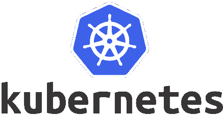
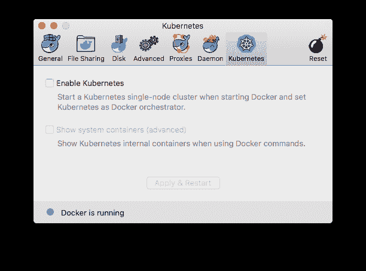
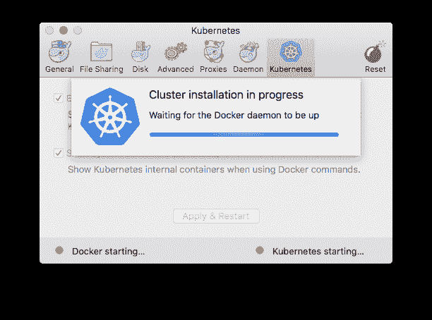
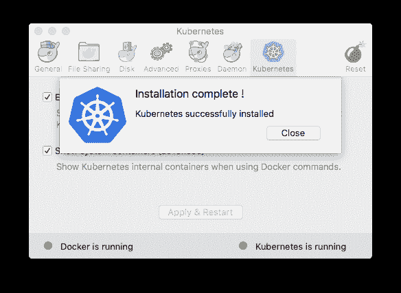
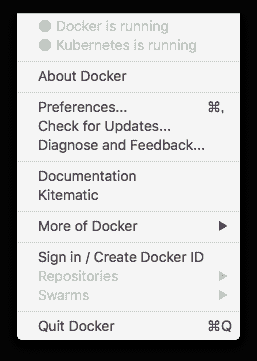
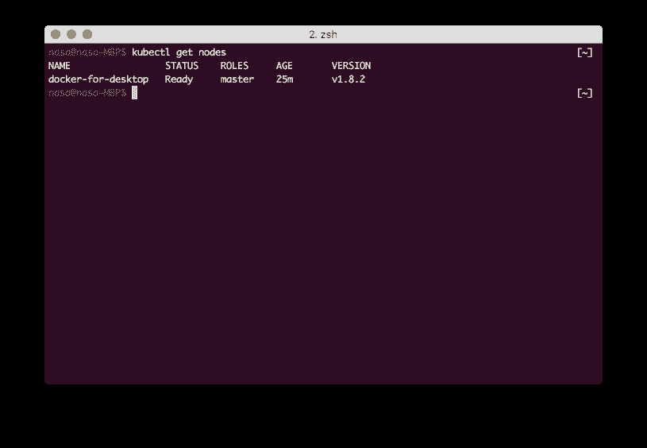

# Kubernetes-powered Docker for mac 发布！

> 原文:[https://dev . to/NASA 9084/kubernetes-powered-docker-for-MAC-is-released-c6m](https://dev.to/nasa9084/kubernetes-powered-docker-for-mac-is-released-c6m)

[T2】](https://res.cloudinary.com/practicaldev/image/fetch/s--WrGceu4l--/c_limit%2Cf_auto%2Cfl_progressive%2Cq_auto%2Cw_880/https://blog.web-apps.tech/conteimg/2017/12/kubernetes_logo.png)

在 DockerCon EU 2017 上，Docker 宣布将整合支持 Kubernetes 的[。](http://www.publickey1.jp/blog/17/dockerkubernetesdockercon_eu_2017.html)今天终于发布了 Kubernetes 支持版 Docker for mac (虽然是 Edge 发行版)

这样，如果使用的是 mac (可能是历史上最简单的)，就可以启动开发 Kubernetes 群集了！

本文总结了在 Docker for mac 上启动 Kubernetes 的步骤。

## Kubernetes 的启动步骤

如果使用的是 Docker for mac 的 Stable 版，则需要安装 Edge 版。
从
[Install Docker for mac](https://docs.docker.com/docker-for-mac/install/) 页面下载并安装边缘通道安装程序。

只要退出 Docker，就不需要自己卸载 Stable 版<sup>[[1]](#fn1)</sup> 。

安装 Edge 版，打开 Docker 的设定画面，如下追加了 Kubernetes 标签！ ！

[T2】](https://res.cloudinary.com/practicaldev/image/fetch/s--R9KbOQIp--/c_limit%2Cf_auto%2Cfl_progressive%2Cq_auto%2Cw_880/https://blog.web-apps.tech/conteimg/2017/12/docker-preference-general.png)

在 Kubernetes 选项卡中，可以轻松地启用和禁用 Kubernetes。

[T2】](https://res.cloudinary.com/practicaldev/image/fetch/s--87DcsbLm--/c_limit%2Cf_auto%2Cfl_progressive%2Cq_auto%2Cw_880/https://blog.web-apps.tech/conteimg/2017/12/docker-preference-kubernetes.png)

在`Enable Kubernetes`中打勾(`Show system containers`是自己喜欢的)，按下`Apply & Restart`按钮，就会显示“Kubernetes 的初次安装会花点时间，您要安装吗？ ”的确认画面会显示出来，按`Install`。

[T2】](https://res.cloudinary.com/practicaldev/image/fetch/s--8PjlsTiT--/c_limit%2Cf_auto%2Cfl_progressive%2Cq_auto%2Cw_880/https://blog.web-apps.tech/conteimg/2017/12/docker-preference-progress-kubernetes.png)

虽然会出现进度条，但没什么意义

几分钟后安装就结束了。

[T2】](https://res.cloudinary.com/practicaldev/image/fetch/s--CBReRT3g--/c_limit%2Cf_auto%2Cfl_progressive%2Cq_auto%2Cw_880/https://blog.web-apps.tech/conteimg/2017/12/docker-preference-done-kubernetes.png)

安全安装结束后，按`Close`后，关闭设定画面。

此时，Docker 菜单也显示了 Kubernetes 的状态。

[T2】](https://res.cloudinary.com/practicaldev/image/fetch/s--0nilGGni--/c_limit%2Cf_auto%2Cfl_progressive%2Cq_auto%2Cw_880/https://blog.web-apps.tech/conteimg/2017/12/docker-menu-kubernetes-is-running.png)

因为这次我打开了`Show system containers`，所以`docker ps`<sup>[[2]](#fn2)</sup> 之后 Kubernetes 动作所需的容器就启动了。

DNS、API Server、Etcd、Scheduler、Proxy 的最低配置。

我不知道 kubectl 是否会自动安装。 (因为已经安装了)

kubectl 已经安装了的情况下，会自动添加配置，可以通过以下命令选择 context 进行操作。

```
$ kubectl config use-context docker-for-desktop 
```

<svg width="20px" height="20px" viewBox="0 0 24 24" class="highlight-action crayons-icon highlight-action--fullscreen-on"><title>Enter fullscreen mode</title></svg> <svg width="20px" height="20px" viewBox="0 0 24 24" class="highlight-action crayons-icon highlight-action--fullscreen-off"><title>Exit fullscreen mode</title></svg>

[T2】](https://res.cloudinary.com/practicaldev/image/fetch/s--ADIZDQmr--/c_limit%2Cf_auto%2Cfl_progressive%2Cq_auto%2Cw_880/https://blog.web-apps.tech/conteimg/2017/12/docker-kubectl-get-nodes.png)

`kubectl get nodes`然后，可以看到集群确实以 1 节点结构启动。

* * *

1.  在 Edge 版的初次启动时卸载

2.  打`docker container ls`很麻烦呢