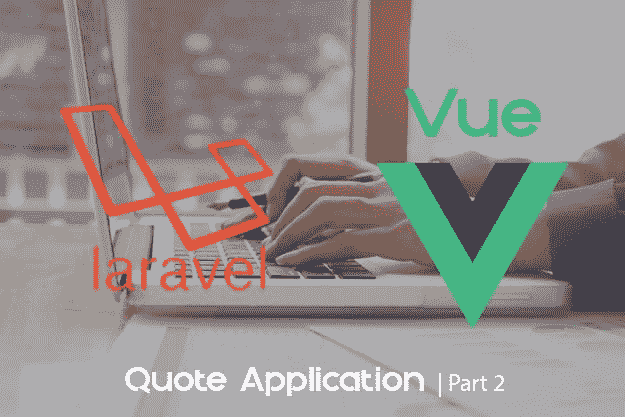
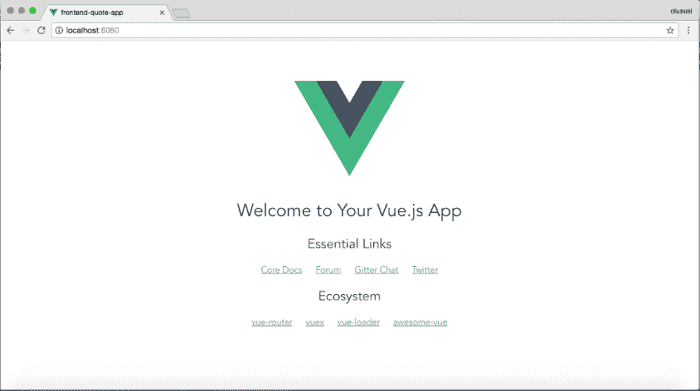
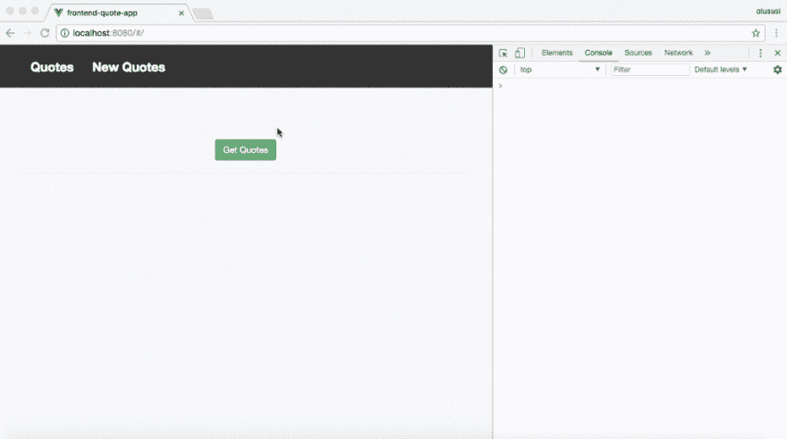
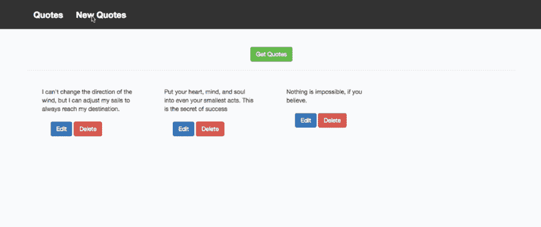

# 使用 Laravel 和 Vue 构建报价应用程序:第 2 部分

> 原文：<https://dev.to/yemiwebby/build-a-quote-application-using-laravel-and-vue-part-2-56kj>

[](https://res.cloudinary.com/practicaldev/image/fetch/s--ZhAtxSf2--/c_limit%2Cf_auto%2Cfl_progressive%2Cq_auto%2Cw_880/https://cdn-images-1.medium.com/max/625/1%2AL9ZGzB55ZHhXYG-VV4Uz9A.jpeg) 

<figcaption>报价申请第二部分</figcaption>

在本系列的第一部分中，我们成功地使用 Laravel 构建了报价应用程序的后端。我们还设置了端点来发布、获取、更新和删除数据库中的报价。最后，我们使用一个叫做[邮递员](https://www.getpostman.com/)的工具测试了我们的 API 的功能。

在本文中，我们将通过使用 Vue.js 构建前端来完成报价应用程序。

1.  向服务器发布新报价
2.  在保存报价后检索所有报价
3.  最后，编辑和删除报价。

在我们继续之前，在您选择的代码编辑器中打开本系列第一部分的源代码，并运行应用程序。保持这种运行是很重要的，因为本教程的目标之一是确保不同域上的后端和前端之间的顺利通信。这两个应用程序的完整代码可以在 Github 上找到，滚动到本教程的末尾访问链接。

### 让我们构建前端

从后端访问所有资源需要一个 HTTP 调用。为此，我们将使用 [Axios](https://github.com/axios/axios) ，这是一个基于 HTTP 客户端的浏览器和 node.js，但首先，让我们安装 Vue。[这里将使用 Vue-cli](https://github.com/vuejs/vue-cli) ，因为它将帮助我们快速搭建单页面应用程序。

```
# install vue-cli
$ npm install -g vue-cli 
```

接下来，我们将使用 CLI 设置我们的 Vue 应用程序。

```
# create a new project using the "webpack" template
$ vue init webpack-simple frontend-quote-app 
```

系统会提示您输入项目名称、描述、作者和其他信息。这应该初始化我们的应用程序，我们现在要做的就是，将目录更改为我们的项目文件夹，并安装所需的依赖项。

```
#change directory
$ cd frontend-quote-app

#install dependencies
$ npm install 
```

最后，为了服务于应用程序，运行

```
# run the application
$ npm run dev 
```

现在，你的浏览器中应该会打开一个类似下图的页面

[T2】](https://res.cloudinary.com/practicaldev/image/fetch/s--7-uuEjFs--/c_limit%2Cf_auto%2Cfl_progressive%2Cq_auto%2Cw_880/https://cdn-images-1.medium.com/max/1024/1%2AQMg6M5k869x8FMJ14yVEng.png)

### 组件

由于 Vue 为开发人员提供了在构建 web 应用程序时使用组件驱动方法的能力，我们将为我们的报价应用程序创建更多的组件。Vue CLI 已经生成了一个可以在 src/App.vue 中找到的主组件，它将被用作我们的应用程序的顶级组件。

### 创建一个组件

除了 Vue CLI 生成的默认组件，我们将需要更多的组件，即，' new-quote.vue '，quotes.vue '，quote.vue '。这些组件将用于添加一个新的报价，显示所有报价等，能够编辑和删除报价。

准备好了吗？我们开始工作吧！。

继续创建一个./src/components 文件夹，它将保存我们即将创建的所有组件。

在 components 文件夹中创建更多的组件 JS 文件，如 quote.vue、quotes.vue、new-quote.vue。

### 安装 NPM 模块

因为我们需要在上面创建的所有组件中发出 web 请求(API 调用)，所以安装 [Axios](https://github.com/axios/axios) 。

```
npm install axios --save 
```

出于路由目的，让我们也安装 [Vue 路由器](https://github.com/vuejs/vue-router)

```
npm install vue-router --save 
```

### 配置组件

刚刚创建了所需的工具和组件文件，接下来是通过创建单独的模板、逻辑和样式来开始配置这些文件。

首先，清理内部的默认内容。/src/App.vue。这个以后再补。

```
<template>

<div id="app">
...
</div>

</template>

<script type="text/babel">

export default {

data () {

return {

}
  }
}
</script>

<style lang="scss">
...
</style> 
```

### [T1】New-quote . vue](#newquotevue)

该组件负责添加新报价。每当提交发布新报价的表单时，将调用并执行函数“onSubmitted”。

```
<template>
   <div>
        <div class="col-lg-6 col-md-6 col-sm-6 col-xs-12">
            <form @submit.prevent="onSubmitted">
                <div class="form-group">
                    <label for="content">
                        <b>Quote</b>
                        </label>
                        <br>
                    <i> Write your quote</i>

                    <textarea name="" id="content" class="form-control" v-model="quoteContent" cols="80" rows="6"></textarea>
                </div>

                <div class="form-group">
                    <button type="submit" class="btn btn-success">
                        Submit
                    </button>
                </div>
            </form>
        </div>
    </div>
</template>

<script type="text/babel">
    ...
</script>

<style scoped>
...
</style> 
```

这个函数将带有报价数据的 HTTP 请求发送到服务器(Laravel 后端),并将其存储在数据库中。这种模式类似于我们在其他组件中所拥有的，这将很快被揭示。

```
<template>
...
</template>
<script type="text/babel">
    import axios from 'axios';
    export default {
        data() {
            return {
                quoteContent: ''
            }
        },
        methods: {
            onSubmitted() {
                axios.post('http://localhost:8000/api/quote',
                        {content: this.quoteContent})
                        .then((response) => {
                        window.location.href = "/";
                        })
            .catch ((error) => console.log(error)
            )}
        }
    }
</script>

<style scoped>
...
</style> 
```

注意 axios 在 onSubmitted()方法[中调用的 URL 和端点 http://localhost:8000/API/quote](http://localhost:8000/api/quote)？请记住，Laravel 后端是在本教程开始时启动的，假设该应用程序运行在本地主机端口 8000 上。如果您的后端运行在不同的端口上，请更改此 URL。

和风格

```
<style scoped>
#content {
    margin-top: 40px;
}
</style> 
```

### 定额。视图

这是报价组件的父组件。这里定义的属性用于将信息传递给子组件。

```
<!-- quotes.vue -->
<template>
    <div>
        <div class="text-center">
            <button class="btn btn-success" @click="onGetQuotes">
            Get Quotes
             </button>
        </div>
        <hr>

<app-quote v-for="quote in quotes" :qt="quote" :key="quote.id" @quoteDeleted="onQuoteDeleted($event)"></app-quote>
    </div>
</template>

<script type="text/babel">
    ...
</script> 
```

onGetQuotes()将发起对 API 后端的调用，并返回所有发布的报价作为响应。这是在装载实例后调用的。

```
<script type="text/babel">
    import Quote from './quote.vue';
    import axios from 'axios';

export default {
        data() {
            return {
                quotes: []
            }
        },
        methods: {
            onGetQuotes() {
                axios.get('http://localhost:8000/api/quotes')
                        .then(
                                response => {
                    this.quotes = response.data.quotes;
                }
                        )
                .catch(
                        error => console.log(error)
                );
            },
            onQuoteDeleted(id) {
                const position = this.quotes.findIndex((element) => {
                            return element.id == id;
                        });
                this.quotes.splice(position, 1);
            }
        },
        mounted: function () {
           this.onGetQuotes();
        },
        components: {
            'app-quote':Quote
        }
    }
</script> 
```

### Quote.vue

这是报价组件的子组件。条件声明用于切换编辑模式，当单击 edit 按钮时，调用 onEdit()方法，并将 vue 实例的 editing 属性设置为 true。另一方面，onCancel()和 onUpdtae()方法会在执行该函数的指定登录后将 editing 属性设置为 true。

```
<!-- quote.vue -->
<template>
<div>
    <div v-if="editing">
        <div class="col-lg-3 col-md-4 col-sm-6 col-xs-12">
            <div class="form-group" id="form__group">
                <label for="content"><b>Edit Quote</b></label><br>
                <textarea id="content" v-model="editValue" rows="10" cols="30" class="form-control"></textarea>
                <div class="control_1">
                    <button @click="onUpdate" class="btn btn-success">Save</button>
                    <button @click="onCancel" class="btn btn-danger">Cancel</button>
                </div>
            </div>
        </div>
    </div>

<div v-if="!editing">
        <div class="col-lg-3 col-md-4 col-sm-6 col-xs-12">
            <div class="quote-holder">
                <div class="quote">
                    {{ qt.content }}
                </div>

<div class="quote_control">
                    <div>
                        <div class="control_1">
                            <button @click="onEdit" class="btn btn-primary">
                                Edit
                            </button>
                            <button @click="onDelete" class="btn btn-danger">
                                Delete
                            </button>
                        </div>

<div class="control_2">
                        </div>
                    </div>
                </div>
            </div>
        </div>
    </div>
</div>

</template>

<script type="text/babel">
   ...
</script>

<style scoped>
   ...
</style> 
```

使用 props 选项声明和接收预期信息，在本例中为报价:

```
<script type="text/babel">
    import axios from 'axios';

export default {
        props: ['qt'],
        data() {
            return {
                editing: false,
                editValue: this.qt.content
            }
        },
        methods: {
            onEdit() {
                this.editing = true;
                this.editValue = this.qt.content
            },
            onCancel() {
                this.editing = false;
            },
            onDelete() {
                this.$emit('quoteDeleted', this.qt.id);
                axios.delete('http://localhost:8000/api/quote/' + this.qt.id)
                        .then(
                                response => console.log(response)
            )
            .catch (
                        error => console.log(error)
            )
            },
            onUpdate() {
                this.editing = false;
                this.qt.content = this.editValue;
                axios.put('http://localhost:8000/api/quote/' + this.qt.id,
                        {content: this.editValue})
                        .then(
                                response => console.log(response)
            )
            .catch (
                        error => console.log(error)
            )
                ;
            }
        }
    }
</script> 
```

风格

```
<style scoped>
a {
        cursor: pointer;
    }

.quote {
        display: block;
        margin-left: auto;
        margin-right: auto;
        /*min-height: 125px;*/
    }

.quote-holder {
        background: #ffffff;
        margin-bottom: 30px;
        position: relative;
        overflow: hidden;
        padding: 20px;
        min-height: 250px;
    }
    .quote_btn {
        border-radius: 0;
        width: 100%;
        display: block;
        cursor: pointer;
    }

.quote_control {
        width: 100%;
        display: flex;
        padding: 20px 20px 15px;
        background: #FFF;
    }

.control_1 {
        flex: 2;
    }
    .control_2 {
        flex: 1;
        /*display: flex;*/
        justify-content: flex-end;
        align-items: center;
        font-size: 20px;
        font-weight: bold;
        color: #51D2B7;
    }

#form__group{
        box-sizing: border-box;
        overflow: hidden;
    }

textarea {
        margin: 10px 0;
    }
</style> 
```

### index.html

引导类用于改进该应用程序中的样式。不要忘记在 index.html 文件中包含样式表:

```
<!DOCTYPE html>
<html lang="en">
  <head>
    <meta charset="utf-8">
    Vue + laravel

<link rel="stylesheet" href="https://maxcdn.bootstrapcdn.com/bootstrap/3.3.7/css/bootstrap.min.css" integrity="sha384-BVYiiSIFeK1dGmJRAkycuHAHRg32OmUcww7on3RYdg4Va+PmSTsz/K68vbdEjh4u" crossorigin="anonymous">

</head>
  <body>
    <div id="app"></div>
    <script src="/dist/build.js"></script>
  </body>
</html> 
```

### app . view

前面我们通过删除默认内容清理了这个文件。现在，填入:

```
<!-- App.vue -->
<template>
  <div id="app">
    <div class="container">
      <div class="row">
        <div class="col-xs-12">
         <nav class="navbar navbar-default navbar-fixed-top">
            <div class="container">
              <ul class="nav navbar-nav navbar-center links">
                <li><router-link to="/">Quotes</router-link></li>
                <li><router-link to="/new-quote"> New Quotes</router-link></li>
              </ul>
            </div>
          </nav>
        </div>
      </div>
      <hr>
      <div class="row">
        <div class="col-xs-12">
          <div id="view">
            <router-view></router-view>
          </div>
        </div>
      </div>
    </div>
  </div>
</template>

<script type="text/babel">
export default {
  data () {
    return {

}
  }
}
</script>

<style lang="scss">
#app {
  margin: 30px 0 0 0;
  background: #F7F8FB;
  min-height: 800px;
}

#view {
    margin-top: 80px;
  }

.navbar {
    background: #333333;
    min-height: 70px;
    font-weight: bold;
  }
  .links {
   margin-top: 10px;
  }

.links li a {
    color: #ffffff !important;
    font-weight: bold;
    font-size: 20px;
  }
</style> 
```

别忘了我们已经在 vue 文件中使用了定制的 html 标签。所有这些组件标签和路由都将由 src/main.js 管理。所以打开文件，填写下面的内容:

```
<!-- src/main.js -->
import Vue from 'vue'
import VueRouter from 'vue-router';

import App from './App.vue'
import Quotes from './components/quotes.vue';
import NewQuote from './components/new-quote.vue';

Vue.use(VueRouter);

const routes = [
  { path: '', component: Quotes},
  { path: '/new-quote', component: NewQuote },
];

const router = new VueRouter({
  node: 'history',
  routes: routes
});
new Vue({
  el: '#app',
      router: router,
  render: h => h(App)
}) 
```

### 【CORS】(跨产地资源共享)

现在，如果我们试图从我们的前端报价应用程序发布报价，我们将被重定向到主页，但报价不会被保存。检查浏览器将揭示错误是什么。

[](https://res.cloudinary.com/practicaldev/image/fetch/s--EgFywcSO--/c_limit%2Cf_auto%2Cfl_progressive%2Cq_66%2Cw_880/https://cdn-images-1.medium.com/max/1024/1%2APWK-01xS5UJu3Jv9jON9Mg.gif)T3】查看控制台

在你感到害怕之前，确认我们已经有了这个错误是很有趣的。在这个应用程序中，我们试图在两个不同的域之间创建一个直接连接。从技术上讲，一般不允许有两个不同的应用程序，用不同的域名交换数据。这是默认的一种安全措施，但是因为我们正在构建一个 API 后端，我们将不得不关闭这种保护，以允许我们的前端与后端有效地通信。

### 回到后台应用程序

早些时候，我说过我们需要保持我们的服务器运行，以防万一你没有做到这一点。

### 使命

我们的目标是能够定位来自不同域的所有 API 路由。为了实现这一点，我们必须创建一个新的中间件，注册它，并最终将这个中间件附加到我们的路由上。你可以在这里阅读更多关于 Laravel middleware[的信息。](https://laravel.com/docs/5.5/middleware)

### 创建中间件

在 Laravel 应用程序中创建中间件非常容易。为了本文的目的，将创建一个名为 Cors 的中间件，我们所要做的就是运行这个命令。因此，打开您的终端，开始吧:

```
php artisan make:middleware Cors 
```

这将在 app/Http/middleware/Cors.php 中创建一个中间件。现在是打开新创建的中间件并添加逻辑以接受来自 frontend-quote-app '的传入 HTTP 请求的时候了。

```
<?php

namespace App\Http\Middleware;

use Closure;

class Cors
{

    public function handle($request, Closure $next)
    {
        return $next($request)
            ->header('Access-Control-Allow-Origin', '*')
            ->header('Access-Control-Allow-Methods', 'GET, POST, PUT, PATCH, DELETE, OPTIONS')
            ->header('Access-Control-Allow-Headers', 'Content-Type, Authorization');
    }
} 
```

这里，HTTP 头被设置为允许前端应用程序获得从后端应用程序访问资源的权限。

既然我们已经将所需的逻辑添加到创建的中间件中，Laravel 需要知道一个新的中间件的存在，然后能够使用它。转到 app/Http/Kernel.php 并添加到内核类:

```
protected $middleware = [
       ...
        \App\Http\Middleware\Cors::class,
    ]; 
```

这样，我们应该能够成功地与我们的后端应用程序进行通信。

[T2】](https://res.cloudinary.com/practicaldev/image/fetch/s--SIGKgpGl--/c_limit%2Cf_auto%2Cfl_progressive%2Cq_66%2Cw_880/https://cdn-images-1.medium.com/max/1024/1%2AFivIY_jsF9gMZahKTbkumw.gif)

请在此随意尝试演示[。](http://demo.yemiwebby.com.ng/)

### 结论

所以在这个系列中，我们已经学会了:

*使用 Laravel
构建 API
*使用一个前端库(VueJs)消费用 Laravel
构建的 API
*确保两个独立域之间的顺畅通信。

我希望您已经看到了如何方便地将 Vuejs 与 Laravel API 后端连接起来。

在随后的帖子中，我们将了解如何向该应用程序添加身份验证，并只允许具有正确访问权限的用户能够执行某些操作，如编辑和删除特定报价。如果您觉得本教程很有帮助，有任何建议或遇到任何问题，请在下面留下您的评论。

这两个系列的源代码链接可以在 github、[后端](https://github.com/yemiwebby/backend-quote-app)和[前端](https://github.com/yemiwebby/frontend-quote-app)找到。