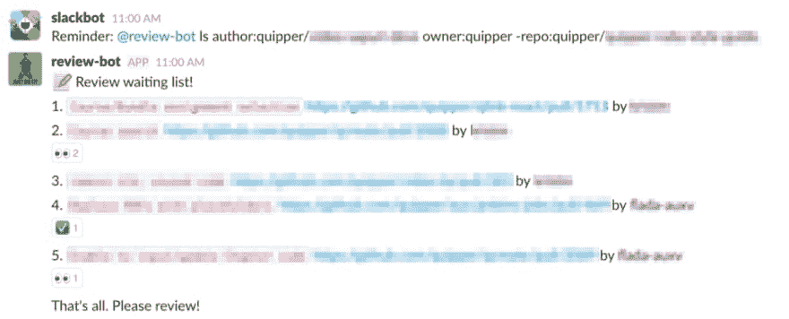
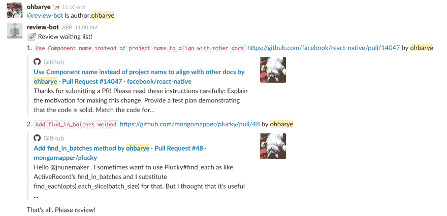

# 定期在时差中显示等待审阅的拉动式请求

> 原文:[https://dev . to/ohbarye/show-pull-requests-waiting-review-on-slack-periodicly-23h](https://dev.to/ohbarye/show-pull-requests-awaiting-review-on-slack-periodically-23h)

你的团队的评审过程成功吗？你的团队是否存在评审停滞，团队氛围变差的情况？

这是一个定期通知 Slack 等待审核的拉式请求列表的提示。

## 果壳

让我们用 [**审核-等待-列表-bot**](https://github.com/ohbarye/review-waiting-list-bot) 让你团队的审核过程变得流畅有趣！

## 是什么样子？

每天上午 11:00，我团队的 Slack channel bot 上的 JST 会通知我团队成员的待审核列表。

[T2】](https://res.cloudinary.com/practicaldev/image/fetch/s--SFTOzcvF--/c_limit%2Cf_auto%2Cfl_progressive%2Cq_auto%2Cw_880/https://thepracticaldev.s3.amazonaws.com/i/8u17fqcebmkrhwhh70lb.png)

每个拉取请求对应于每个发布。然后开发人员会做出类似“我在复习”的表情👀”“合并了！✅”的表情符号，并在线程中同步提问。多像工程师的行为啊！

当提到私有存储库时，它是没有品味的(并且它充满了马赛克，因为它是商业信息)。但是对于公共存储库，Slack 会自动扩展 pull 请求，所以看起来更精彩。

[T2】](https://res.cloudinary.com/practicaldev/image/fetch/s--JmiUc2M_--/c_limit%2Cf_auto%2Cfl_progressive%2Cq_auto%2Cw_880/https://thepracticaldev.s3.amazonaws.com/i/9wmaxdo8n6zfrughv3hg.png)

## 它是如何工作的？

简言之，

*   在 Heroku 中部署了一个名为[**review-waiting-list-bot**](https://github.com/ohbarye/review-waiting-list-bot)的 Slack 机器人(即使在 free dyno 中，由于工人进程不睡觉地工作，所以它总是对提及做出反应)
*   当它收到一个提示音时，它查询 GitHub API 并收集 pull 请求，然后将它们发布到 Slack
*   Slack 的提醒定期调用这个 bot

### 审核-等候名单-机器人

[https://github.com/ohbarye/review-waiting-list-bot](https://github.com/ohbarye/review-waiting-list-bot)

Node.js 做的 Slack bot，它使用 [Botkit](https://github.com/howdyai/botkit) 作为框架。

我想试试`async` / `await`所以我用 Node 8 做的。不幸的是，僵尸工具与`Promise`不兼容，它迫使开发者写这么多回调函数。https://github.com/howdyai/botkit/pull/278 试图解决这个问题，但是在长期放弃之后，作者的心似乎已经碎了。反正去哪儿调用 GitHub 在 bot 里的 API 是用`async` / `await`组织好的。

调用 bot 时可以指定`author`、`owner`、`repo`。排除条件(exclusive)也可用类似`-repo`的符号。详见[自述#用法](https://github.com/ohbarye/review-waiting-list-bot#usage)。

### 时差提醒

我还可以创建一个机制，定期在 bot 端发布，但我没有这样做。如果我这么做了，机器人将需要为此做一些设置(这意味着机器人将变成无状态的！).此外，一个熟悉 Slack 的团队必须能够充分利用 Slack 提供的提醒功能。

对了，每天早上 11 点提醒的时候，设置的命令如下。请注意，时区取决于提醒创建者的设置。

```
/remind #channel-name "@review-bot ls author:org/my-team owner:org -repo:design" every weekday at 11am 
```

关于提醒的详细信息，请参见[https://get . slack . help/HC/en-us/articles/208423427-Set-a-reminde](https://get.slack.help/hc/en-us/articles/208423427-Set-a-reminde)。

## 我的团队反应如何？

我在开发者大会上介绍之后，我公司的几个团队好像都在用。一些小组定期调用 Slack，而另一些小组在每天会议结束时手动调用，以同步他们的进度。

我不仅表扬了团队的活动，也表扬了个人的 OSS 活动。

## 印象

令人惊讶的是，不仅开发人员，而且产品经理都对这个机器人感到高兴。他们说，这有助于掌握发展的进程。

如果您是一名开发人员，并且他们公司有他们产品的用户，您可以立即收到反馈。这绝对是开发人员的乐趣，对吗？