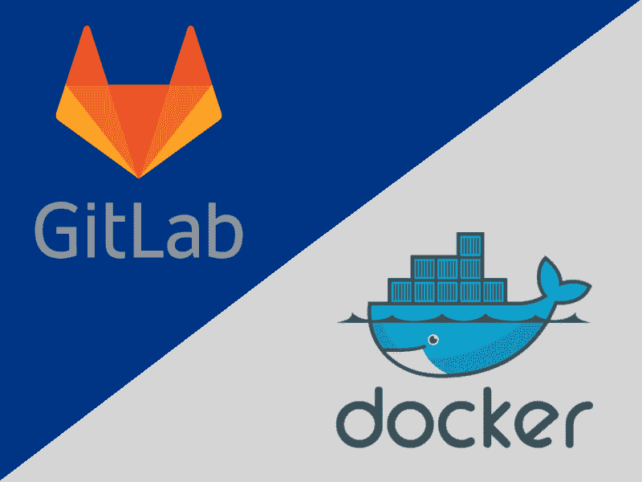
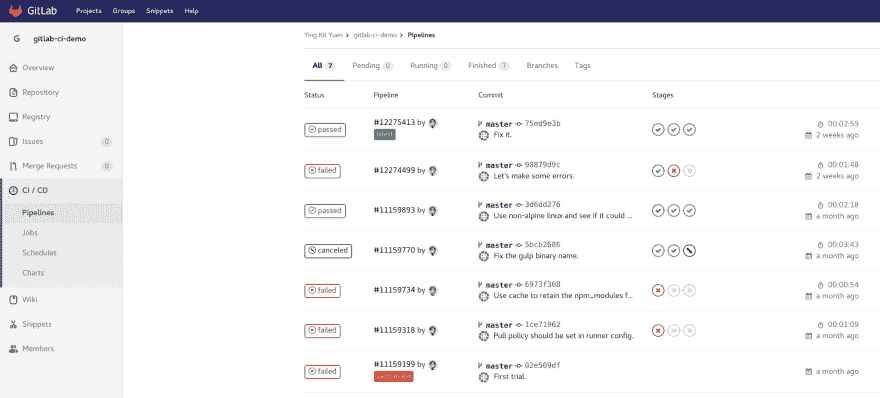
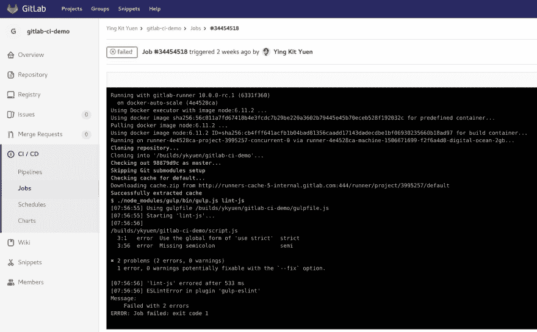

# 一个简单的 GitLab CI 示例

> 原文:[https://dev.to/ykyuen/a-simple-gitlab-ci-example-doe](https://dev.to/ykyuen/a-simple-gitlab-ci-example-doe)

最初发布在[水手长博客](https://blog.boatswain.io/post/a-simple-gitlab-ci-example/)上。

* * *

[T2】](https://res.cloudinary.com/practicaldev/image/fetch/s--jAKZHMIl--/c_limit%2Cf_auto%2Cfl_progressive%2Cq_auto%2Cw_880/https://thepracticaldev.s3.amazonaws.com/i/qwwlp4a5dpas0083qrp1.png)

在过去，我们尝试了不同的工具来管理我们的项目，以保持它们处于良好的状态。我们需要的是:

*   版本控制
*   问题跟踪器
*   证明文件
*   连续累计
*   连续交货
*   存储库(工件/docker 图像)

像 [Jenkins](https://jenkins.io/) 这样有利于持续集成和交付的工具， [Mantis](https://www.mantisbt.org/) 可以帮助跟踪问题。但是为了提高项目的效率和质量，将这些工具结合在一起是很好的。例如，我们希望让 git 提交与问题挂钩，或者在将提交推送到主分支之后触发自动化测试。通常，大多数工具已经提供了与其他服务的集成，但是配置它们仍然很麻烦。此外，如果任何一项服务停止运行，工作流就会中断。因此，如果有一个平台可以满足所有这些愿望，那就太好了，这也是我们选择 [GitLab](https://gitlab.com) 的原因。

## GitLab CI

GitLab.com 是一个 SAAS 服务，你可以托管你的 Git 库，跟踪问题，用 markdown 写维基。它们是直观的功能，所以只需注册一个帐户，你就可以尝试一下。另一方面， [GitLab CI](https://about.gitlab.com/features/gitlab-ci-cd/) 允许我们设置持续集成，我们甚至可以利用 [Docker Hub](https://hub.docker.com/) 上可用的任何 **Docker 映像**来实现它们。让我们看看下面的例子。

### 的。吉塔实验室

该 yml 包含响应 git 推送/合并而触发 CI/CD 管道后的所有阶段的定义。在这个例子中，我们有一个简单的 nodejs 项目，我们希望通过林挺和单元测试来确保代码是好的。分叉这个[存储库](https://gitlab.com/ykyuen/gitlab-ci-demo)并检查它。

```
stages:
  - lint-css
  - lint-js
  - unit-test

image: node:6.11.2

lint css:
  stage: lint-css
  before_script:
    - npm install
  cache:
    untracked: true
  only:
    - master
  script:
    - ./node_modules/gulp/bin/gulp.js lint-css

lint js:
  stage: lint-js
  cache:
    untracked: true
    policy: pull
  only:
    - master
  script:
    - ./node_modules/gulp/bin/gulp.js lint-js

run unit test:
  stage: unit-test
  cache:
    untracked: true
    policy: pull
  only:
    - master
  script:
    - ./node_modules/gulp/bin/gulp.js test 
```

<svg width="20px" height="20px" viewBox="0 0 24 24" class="highlight-action crayons-icon highlight-action--fullscreen-on"><title>Enter fullscreen mode</title></svg> <svg width="20px" height="20px" viewBox="0 0 24 24" class="highlight-action crayons-icon highlight-action--fullscreen-off"><title>Exit fullscreen mode</title></svg>

我们定义了 3 个阶段，每个阶段实际上只是一个在 *gulpfile.js* 中定义的 gulp 任务。只要安装了适当的节点，任何人都可以在本地运行该任务。但是在 [GitLab CI](https://about.gitlab.com/features/gitlab-ci-cd/) 中，我们只需要说出需要哪个 **Docker image** 。在我们的例子中，那就是*节点:6.11.2* 。此外，这个图像属性可以在阶段定义中定义，这样您可以为每个阶段使用不同的工具。

#### 关于阶段定义的更多细节

让我们更深入地了解一下阶段定义。

```
lint css:
  stage: lint-css     # <- Should map to the value defined in the 'stages'
  before_script:      # <- Pre-script
    - npm install
  cache:              # <- Enable caching on files so they are available in the next stage
    untracked: true   # <- Cache the git untracked files (ex. node_modules)
  only:
    - master          # <- This stage run only on master branch update
  script:             # <- The actually script of this stage
    - ./node_modules/gulp/bin/gulp.js lint-css 
```

<svg width="20px" height="20px" viewBox="0 0 24 24" class="highlight-action crayons-icon highlight-action--fullscreen-on"><title>Enter fullscreen mode</title></svg> <svg width="20px" height="20px" viewBox="0 0 24 24" class="highlight-action crayons-icon highlight-action--fullscreen-off"><title>Exit fullscreen mode</title></svg>

之前脚本和*脚本*的值都可以是多个(数组 in。yml)。如果*脚本*执行有错误，该阶段将被归类为失败。

### 触发管道

只需在主分支上做一些更改，就可以在 **CI / CD - >管道页面**上找到正在运行的管道。

[T2】](https://res.cloudinary.com/practicaldev/image/fetch/s---2xSkBuo--/c_limit%2Cf_auto%2Cfl_progressive%2Cq_auto%2Cw_880/https://thepracticaldev.s3.amazonaws.com/i/o8m5x67wzkra899h42gx.jpg)

#### 查看详细阶段

单击管道，您可以读取每个阶段的控制台输出。阶段/作业失败时有用。

[T2】](https://res.cloudinary.com/practicaldev/image/fetch/s--t8TKDjE0--/c_limit%2Cf_auto%2Cfl_progressive%2Cq_auto%2Cw_880/https://thepracticaldev.s3.amazonaws.com/i/5k52m2sry9j2kgmgcutp.jpg)

## 配合 Docker 使用 GitLab CI 的好处

不同的项目需要不同的工具，比如 nodejs，ant，maven...过去，当我使用像 [Jenkins](https://jenkins.io/) 这样的工具时，我必须确保它们都安装在服务器上。通过使用 [Docker](https://www.docker.com/) ，开发者可以在 [Docker Hub](https://hub.docker.com/) 上选择任何可用的工具，而无需要求服务器管理员在服务器上安装这些工具。事实上，Jenkins 也有一个管道插件，它可以与 Docker 一起工作，达到完全相同的目的。但是正如我之前提到的，需要额外的努力将 Jenkins 与版本控制结合起来。

虽然我更喜欢使用 [GitLab CI](https://about.gitlab.com/features/gitlab-ci-cd/) ，但这并不意味着它可以完全取代 [Jenkins](https://jenkins.io/) 。 [Jenkins](https://jenkins.io/) 提供可配置的用户界面，方便 QA 等非开发人员执行部署、集成测试等特定任务。

## 挑合适的不挑完美的

关键不在于工具本身，而在于使用它的人。所以在开始寻找新工具之前，试着先确定你想解决的问题。