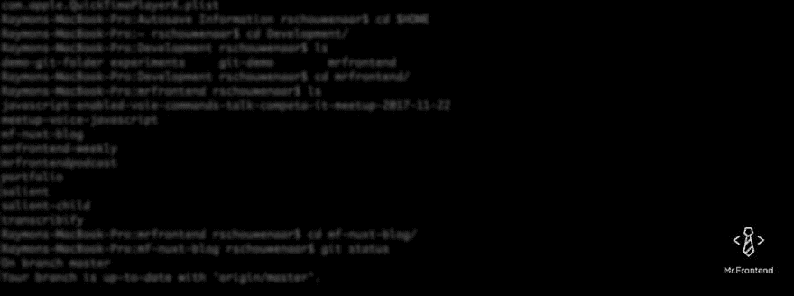

# Git 101 —步骤 3:分支

> 原文：<https://dev.to/mrfrontend/git-101--step-3-branches-4lna>

[T2】](https://res.cloudinary.com/practicaldev/image/fetch/s--da8mCc1T--/c_limit%2Cf_auto%2Cfl_progressive%2Cq_auto%2Cw_880/https://cdn-images-1.medium.com/max/1024/1%2AQzHx-SVN3OC6VomhRstEig.png)

这次我们将讨论如何在终端上用 Git 处理分支🚀。完整的解释请看视频😉

[https://www.youtube.com/embed/Kf4sjbE-G24](https://www.youtube.com/embed/Kf4sjbE-G24)

#### 什么是 Git 分支？

分支是一个独立的工作空间，它就像一个桶，您可以在其中随意摆弄，而不会破坏生产应用程序。

当您要为应用程序创建新的功能或特性时，您需要创建分支。

所以还是从树枝开始吧！

#### 检查你的分支

**检查您的分支机构**

如果你想知道你目前在哪家分公司工作？这个命令会告诉你！

```
git branch 
```

**更新您当地的分支机构**

所以让我们面对现实吧！有时你的树枝在遥控器上的树枝后面。所以要更新这个列表，可以使用这个命令。

```
git fetch origin 
```

#### 用你的树枝做点什么吧！

**创建分支**

现在我们想创建一个分支，因为我们想在没有代码的情况下瞎搞。非常简单的命令。记住用“-b”代替“-d”！！😅*，因为“-d”会删除你的分支！*

```
git checkout -b branch_name 
```

**推到分支**

当您进行了一些更改、暂存它们并添加了提交消息时，我们希望将我们的分支推送到远程。用这个命令吧！

```
git push origin branch_name 
```

**从分支中提取变更**

当您的团队成员对您正在工作的同一个分支进行了一些更改时。您可以使用这个命令将这些更改从远程位置拉入本地分支。

```
git pull origin branch_name 
```

**开关支路**

有时候因为某些原因想换一个分支。只需用这个命令签出另一个分支。

```
git checkout branch_name 
```

**删除本地分支**

小心使用这个命令！如果你没有在这个分支中进行修改，所有的修改将会丢失！

```
git branch -d branch_name 
```

#### 需要帮忙吗？

如果你和 Git 一起工作，但是被卡住了？请在评论中告诉我，或者在 twitter 上打电话给我，我会❤️帮你的！

你喜欢这个帖子吗？请大家分享一下🙏

*原载于* [*奥前端博客*](https://blog.mrfrontend.org/2017/12/git-101-step-3-branches/) *。*

* * *