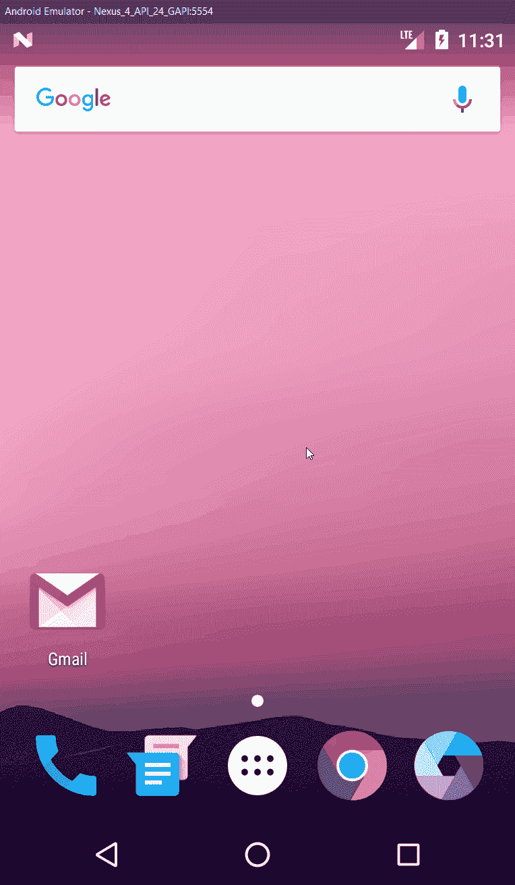

# 用 Espresso 和 JUnit 在 Android 上捕捉屏幕截图

> 原文:[https://dev . to/ser huz/capture-screens-on-Android-with-espresso-and-JUnit-81f](https://dev.to/serhuz/capturing-screenshots-on-android-with-espresso-and-junit-81f)

前几天，我对一个应用程序的用户界面做了一些修改，这是我在业余时间做的。这个应用程序很小，很简单，只有 3 个屏幕，我需要上传 8 张截图到 Google Play，这些截图将显示在应用程序的页面上。问题是，该应用程序有 3 个地区，所以我必须为每个地区提供 8 个截图。这样总共有 24 张截图。而且这只针对智能手机。也有 7 英寸和 10 英寸屏幕的平板电脑，为了让 Google Play 相信这款应用也针对这类设备进行了优化，我必须再提供 48 张截图。一共 72 张截图。通常我会手动操作，但是我突然觉得很懒。所以我决定自动化这个过程。

我已经在我的项目中使用了`Espresso`进行 UI 测试，它提供了`android.support.test.runner.screenshot`包，其中包含在测试设备或模拟器上捕获和保存截图所需的类。除了捕获实际的屏幕截图之外，在运行测试时有必要以某种方式改变区域设置，并且只在 UI 改变后捕获屏幕截图。

* * *

JUnit 规则允许修改类中每个测试方法的行为。或者他们可以做一些工作来让测试工作。为了实现这样的规则，我们需要创建一个类来实现只包含一个方法
的`TestRule`接口

```
public interface TestRule {
    /**
     * Modifies the method-running {@link Statement} to implement this
     * test-running rule.
     *
     * @param base The {@link Statement} to be modified
     * @param description A {@link Description} of the test implemented in {@code base}
     * @return a new statement, which may be the same as {@code base},
     *         a wrapper around {@code base}, or a completely new Statement.
     */
    Statement apply(Statement base, Description description);
} 
```

<svg width="20px" height="20px" viewBox="0 0 24 24" class="highlight-action crayons-icon highlight-action--fullscreen-on"><title>Enter fullscreen mode</title></svg> <svg width="20px" height="20px" viewBox="0 0 24 24" class="highlight-action crayons-icon highlight-action--fullscreen-off"><title>Exit fullscreen mode</title></svg>

让我们实现一个`TestRule`，它将在运行测试之前改变语言环境。下面是代码:

```
public class LocaleRule implements TestRule {

    private final Locale[] mLocales;
    private Locale mDeviceLocale;

    public LocaleRule(Locale... locales) {
        mLocales = locales;
    }

    @Override
    public Statement apply(Statement base, Description description) {
        return new Statement() {
            @Override
            public void evaluate() throws Throwable {
                try {
                    if (mLocales != null) {
                        mDeviceLocale = Locale.getDefault();
                        for (Locale locale : mLocales) {
                            setLocale(locale);
                            base.evaluate();
                        }
                    }
                } finally {
                    if (mDeviceLocale != null) {
                        setLocale(mDeviceLocale);
                    }
                }
            }
        };
    }

    private void setLocale(Locale locale) {
        Resources resources = InstrumentationRegistry.getTargetContext().getResources();
        Locale.setDefault(locale);
        Configuration config = resources.getConfiguration();
        config.setLocale(locale);
        DisplayMetrics displayMetrics = resources.getDisplayMetrics();
        resources.updateConfiguration(config, displayMetrics);
    }
} 
```

<svg width="20px" height="20px" viewBox="0 0 24 24" class="highlight-action crayons-icon highlight-action--fullscreen-on"><title>Enter fullscreen mode</title></svg> <svg width="20px" height="20px" viewBox="0 0 24 24" class="highlight-action crayons-icon highlight-action--fullscreen-off"><title>Exit fullscreen mode</title></svg>

基本上，这条规则所做的是在运行测试之前，遍历`mLocales`并改变设备/仿真器上的语言环境。在那个地区被改变回来之后。这种方法的主要问题是，像这样改变设备的区域设置没有得到官方支持，并且这些代码可能无法在所有 API 级别上工作。我在这里找到了一篇关于这个[的好文章。不然真的很简单。](https://proandroiddev.com/change-language-programmatically-at-runtime-on-android-5e6bc15c758)

它可以以如下方式用于测试:

```
@Rule
public final LocaleRule mLocaleRule = new LocaleRule(Locale.ENGLISH, Locale.FRENCH); 
```

<svg width="20px" height="20px" viewBox="0 0 24 24" class="highlight-action crayons-icon highlight-action--fullscreen-on"><title>Enter fullscreen mode</title></svg> <svg width="20px" height="20px" viewBox="0 0 24 24" class="highlight-action crayons-icon highlight-action--fullscreen-off"><title>Exit fullscreen mode</title></svg>

在这种情况下，*每个*测试方法将在不同的地点被调用 2 次。

您还可以静态导入传递给构造函数的值，以使代码不那么冗长。

因为我在做 3 个地区的截图，所以我创建了`Locales`类。

```
public final class Locales {

    private Locales() {
        throw new AssertionError();
    }

    public static Locale english() {
        return Locale.ENGLISH;
    }

    public static Locale russian() {
        return new Locale.Builder().setLanguage("ru").build();
    }

    public static Locale ukrainian() {
        return new Locale.Builder().setLanguage("uk").build();
    }
} 
```

<svg width="20px" height="20px" viewBox="0 0 24 24" class="highlight-action crayons-icon highlight-action--fullscreen-on"><title>Enter fullscreen mode</title></svg> <svg width="20px" height="20px" viewBox="0 0 24 24" class="highlight-action crayons-icon highlight-action--fullscreen-off"><title>Exit fullscreen mode</title></svg>

然后我这样实例化`LocaleRule`:

```
@Rule
public final LocaleRule mLocaleRule = new LocaleRule(english(), russian(), ukrainian()); 
```

<svg width="20px" height="20px" viewBox="0 0 24 24" class="highlight-action crayons-icon highlight-action--fullscreen-on"><title>Enter fullscreen mode</title></svg> <svg width="20px" height="20px" viewBox="0 0 24 24" class="highlight-action crayons-icon highlight-action--fullscreen-off"><title>Exit fullscreen mode</title></svg>

在我看来很整洁。

* * *

JUnit 还提供了`TestWatcher`类，该类可以扩展并用作`@Rule`来接收测试方法成功或失败时的通知。我将使用这个类作为实现我的`ScreenshotWatcher`的基础。

```
public class ScreenshotWatcher extends TestWatcher {

    @Override
    protected void succeeded(Description description) {
        Locale locale = InstrumentationRegistry.getTargetContext()
                .getResources()
                .getConfiguration()
                .getLocales()
                .get(0);
        captureScreenshot(description.getMethodName() + "_" + locale.toLanguageTag());
    }

    private void captureScreenshot(String name) {
        ScreenCapture capture = Screenshot.capture();
        capture.setFormat(Bitmap.CompressFormat.PNG);
        capture.setName(name);
        try {
            capture.process();
        } catch (IOException ex) {
            throw new IllegalStateException(ex);
        }
    }

    @Override
    protected void failed(Throwable e, Description description) {
        captureScreenshot(description.getMethodName() + "_fail");
    }
} 
```

<svg width="20px" height="20px" viewBox="0 0 24 24" class="highlight-action crayons-icon highlight-action--fullscreen-on"><title>Enter fullscreen mode</title></svg> <svg width="20px" height="20px" viewBox="0 0 24 24" class="highlight-action crayons-icon highlight-action--fullscreen-off"><title>Exit fullscreen mode</title></svg>

让我们更仔细地看看`captureScreenshot()`方法内部的代码。`Screenshot.capture();`捕获可视屏幕内容**用于构建。版本代码。JELLY_BEAN_MR2 及以上版本**，这意味着旧设备上没有自动截屏功能。`capture.setFormat(Bitmap.CompressFormat.PNG);`指定给定截图的输出格式。可以是`JPEG`、`PNG`或者`WEBP`。`capture.setName(name);`设置截图文件的名称。`capture.process();`实际上将图像保存到设备存储器，尽管其名称有些模糊。默认情况下，屏幕截图保存到外部存储器。这由实现`android.support.test.runner.screenshot.ScreenCaptureProcessor`接口的`android.support.test.runner.screenshot.BasicScreenCaptureProcessor`处理。`Screenshot`类公开了一个允许使用自定义`ScreenCaptureProcessor`实现的 API。

`name`传递给该方法的参数取决于每次测试的结果。它可以是你决定的任何东西。测试成功后，我和`testMethodName_currentLocale`一起去了。

这个`@Rule`然后被这样使用:

```
@Rule
public final ScreenshotWatcher mScreenshotWatcher = new ScreenshotWatcher(); 
```

<svg width="20px" height="20px" viewBox="0 0 24 24" class="highlight-action crayons-icon highlight-action--fullscreen-on"><title>Enter fullscreen mode</title></svg> <svg width="20px" height="20px" viewBox="0 0 24 24" class="highlight-action crayons-icon highlight-action--fullscreen-off"><title>Exit fullscreen mode</title></svg>

但是还有一件事需要去做。为了能够将文件保存到外部存储器，我们需要 *READ_EXTERNAL_STORAGE* 和 *WRITE_EXTERNAL_STORAGE* 权限。并且，不出所料，在运行测试之前，由开发人员来授予它们。

所以我们只需要将它添加到测试类:

```
@Rule
public final GrantPermissionRule mGrantPermissionRule = 
        GrantPermissionRule.grant(READ_EXTERNAL_STORAGE, WRITE_EXTERNAL_STORAGE); 
```

<svg width="20px" height="20px" viewBox="0 0 24 24" class="highlight-action crayons-icon highlight-action--fullscreen-on"><title>Enter fullscreen mode</title></svg> <svg width="20px" height="20px" viewBox="0 0 24 24" class="highlight-action crayons-icon highlight-action--fullscreen-off"><title>Exit fullscreen mode</title></svg>

* * *

在这之后，我们实际上已经准备好创建一个`ActivityRule`并编写一些与 UI 交互的测试，这将触发我们的截图。我将使用我的`MainActivity`。

但是，为了让所有这些规则可以预测地发挥作用，我们需要强制执行它们的应用顺序。

为了做到这一点，我们需要改变测试类中的规则声明。

```
private final LocaleRule mLocaleRule = new LocaleRule(english(), russian(), ukrainian());
private final ScreenshotWatcher mScreenshotWatcher = new ScreenshotWatcher();
private final GrantPermissionRule mGrantPermissionRule = 
        GrantPermissionRule.grant(READ_EXTERNAL_STORAGE, WRITE_EXTERNAL_STORAGE);
private final ActivityTestRule mActivityTestRule = new ActivityTestRule<>(MainActivity.class);

@Rule
public final RuleChain mRuleChain = RuleChain.outerRule(mLocaleRule)
        .around(mScreenshotWatcher)
        .around(mGrantPermissionRule)
        .around(mActivityTestRule); 
```

<svg width="20px" height="20px" viewBox="0 0 24 24" class="highlight-action crayons-icon highlight-action--fullscreen-on"><title>Enter fullscreen mode</title></svg> <svg width="20px" height="20px" viewBox="0 0 24 24" class="highlight-action crayons-icon highlight-action--fullscreen-off"><title>Exit fullscreen mode</title></svg>

而`RuleChain`正是这么做的。这里我们必须将`mLocaleRule`声明为 outerRule，否则预期的行为会被破坏。

下面是我的测试类的样子

```
@RunWith(AndroidJUnit4.class)
public class MainActivityScreenshot {

    private final LocaleRule mLocaleRule = new LocaleRule(english(), russian(), ukrainian());
    private final ScreenshotWatcher mScreenshotWatcher = new ScreenshotWatcher();
    private final GrantPermissionRule mGrantPermissionRule = GrantPermissionRule.grant(READ_EXTERNAL_STORAGE, WRITE_EXTERNAL_STORAGE);
    private final ActivityTestRule mActivityTestRule = new ActivityTestRule<>(MainActivity.class);

    @Rule
    public final RuleChain mRuleChain = RuleChain.outerRule(mLocaleRule)
            .around(mScreenshotWatcher)
            .around(mGrantPermissionRule)
            .around(mActivityTestRule);

    @Test
    public void emptyMainActivityPortrait() {
    }
} 
```

<svg width="20px" height="20px" viewBox="0 0 24 24" class="highlight-action crayons-icon highlight-action--fullscreen-on"><title>Enter fullscreen mode</title></svg> <svg width="20px" height="20px" viewBox="0 0 24 24" class="highlight-action crayons-icon highlight-action--fullscreen-off"><title>Exit fullscreen mode</title></svg>

我将这个测试类命名为`MainActivityScreenshot`,以表明它的用途。

但是还有另一个陷阱。如果测试中没有 UI 交互，那么测试活动几乎会立即结束，在最坏的情况下，你会在屏幕截图上看到一个空的主屏幕。为了迎合这一点，我将`ActivityRule`类复制到我的项目中，并在测试后添加了一个小停顿。

看起来是这样的:

```
private class ActivityStatement extends Statement {

        private final Statement mBase;

        public ActivityStatement(Statement base) {
            mBase = base;
        }

        @Override
        public void evaluate() throws Throwable {
            MonitoringInstrumentation instrumentation =
                    CustomActivityTestRule.this.mInstrumentation instanceof MonitoringInstrumentation
                            ? (MonitoringInstrumentation) CustomActivityTestRule.this.mInstrumentation
                            : null;
            try {
                if (mActivityFactory != null && instrumentation != null) {
                    instrumentation.interceptActivityUsing(mActivityFactory);
                }
                if (mLaunchActivity) {
                    launchActivity(getActivityIntent());
                }
                mBase.evaluate();

                SystemClock.sleep(1_000);
            } finally {
                if (instrumentation != null) {
                    instrumentation.useDefaultInterceptingActivityFactory();
                }
                if (mActivity != null) {
                    finishActivity();
                }
            }
        }
    } 
```

<svg width="20px" height="20px" viewBox="0 0 24 24" class="highlight-action crayons-icon highlight-action--fullscreen-on"><title>Enter fullscreen mode</title></svg> <svg width="20px" height="20px" viewBox="0 0 24 24" class="highlight-action crayons-icon highlight-action--fullscreen-off"><title>Exit fullscreen mode</title></svg>

唯一的变化就是`SystemClock.sleep(1_000);`。

* * *

现在，如果我们在模拟器上启动测试，它看起来像这样:
[](https://res.cloudinary.com/practicaldev/image/fetch/s--jOfu3Dt8--/c_limit%2Cf_auto%2Cfl_progressive%2Cq_66%2Cw_880/https://thepracticaldev.s3.amazonaws.com/i/tq4habzzopjdkw99flsw.gif)

* * *

因此，只需一点代码，我现在就可以自动化在不同地区重复相同操作并截屏的过程。

一旦实现，我不需要做任何额外的设置就可以在不同的操作系统上工作，这很好，因为我有一台 Windows 笔记本电脑和基于 Ubuntu 的台式机。但是在配置更改时保留区域设置也有问题，这不是很好。

无论如何，希望你已经对 JUnit 规则和 Espresso 有所了解。

更多关于 Espresso 截图包的信息可以在[这里](https://developer.android.com/reference/android/support/test/runner/screenshot/package-summary.html)找到。JUnit 有一个专门介绍规则[的维基页面。](https://github.com/junit-team/junit4/wiki/Rules)