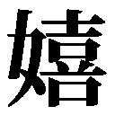
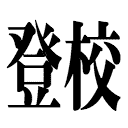

# 制作了用图像回复用 Slack 发送的文字的 bot

> 原文：<https://dev.to/amotarao/slackbot-376>

※ [Qiita 报道](https://qiita.com/amotarao/items/6bbb58ca74b4d9d1fae8)的文案

# 在此

用 Slack 发送`@textchan create 絵文字!`的话，

[T2】](https://res.cloudinary.com/practicaldev/image/fetch/s--o_3wwYBM--/c_limit%2Cf_auto%2Cfl_progressive%2Cq_auto%2Cw_880/https://qiita-image-store.s3.amazonaws.com/0/99161/05e1dd90-233a-7bec-f373-65cbb451227e.png)

试着制作一个能上传这样的图片的 bot。

# 制作理由

在 Slack 中[在经常使用自定义图画文字的队伍](http://ascii.jp/elem/000/001/177/1177479/)中，存在很多只收录了
文字的自定义图画文字。
另外，那个大多是用户手工制作的。

特别是在工程师大显身手的地方，
各工程师没有 Photoshop 等设计工具的情况也并不少见。
定制图形文字的制作时间肯定会影响职务。 应该提高效率。

例)
[](https://res.cloudinary.com/practicaldev/image/fetch/s--kLEXO1WU--/c_limit%2Cf_auto%2Cfl_progressive%2Cq_auto%2Cw_880/https://qiita-image-store.s3.amazonaws.com/0/99161/aef084e7-cf37-0720-0b92-e0eb4bc4e9cd.png)
**高兴**/高兴的时候

[](https://res.cloudinary.com/practicaldev/image/fetch/s--dOef9A8d--/c_limit%2Cf_auto%2Cfl_progressive%2Cq_auto%2Cw_880/https://qiita-image-store.s3.amazonaws.com/0/99161/6e591ac8-f24b-8ab0-aad0-d98d2def3aeb.png)
**上学**/上学时

# 为什么需要只有文字的图画文字

针对投稿，可以发送能够立即读取的 Reaction 的
[](https://res.cloudinary.com/practicaldev/image/fetch/s--1ntUCT_W--/c_limit%2Cf_auto%2Cfl_progressive%2Cq_auto%2Cw_880/https://qiita-image-store.s3.amazonaws.com/0/99161/2bc82e29-71f3-29e8-9202-0c82efa3da5f.png)

作为现在的心情，可以在 ID 的旁边作为 Status 来表示的
[](https://res.cloudinary.com/practicaldev/image/fetch/s--LimeeS24--/c_limit%2Cf_auto%2Cfl_progressive%2Cq_auto%2Cw_880/https://qiita-image-store.s3.amazonaws.com/0/99161/4b2bde77-2e5e-9d14-32be-36fcf6aa03b8.png)

# [做](#%E3%81%A4%E3%81%8F%E3%82%8B)

我觉得在进行从文本生成图像的处理时，
可以在 Node.js 上生成 canvas 的`node-canvas`比较好。
可以按照与用 web 上的 JavaScript 生成<canvas >相同的要领使用。
之后，在进行文字位置调整、颜色、字体的变更时也能够比较轻松。

另外，在 Slack 上，为了检测 Mention，上传图像使用`Botkit`。

```
# node-canvas を動かすためのライブラリのインストール
# こちらは MacでHomebrewでインストールする場合
# その他 https://github.com/Automattic/node-canvas#installation
brew install pkg-config cairo pango libpng jpeg giflib

# node packageのインストール
npm install --save node-canvas botkit 
```

Enter fullscreen mode Exit fullscreen mode

**作为参考的东西**

*   [用 5 分钟~15 分钟构筑利用了 BotKit 的 Slack Bot 的开发环境( Windows )](https://qiita.com/NagaokaKenichi/items/e0715b6bdde8459a705c)
    *   添加 Slack Bots Configuration 的方法等也在这里
*   [用 Slack 的 Botkit 上传文件的方法](https://qiita.com/nobukatsu/items/e6ba8d9299816e1a503e)
*   [Node.js 中使用 Canvas(ImageData )的简单图像处理](https://qiita.com/redshoga/items/d5afef65081b7fdf60cc)
*   其他各种存储库

**[有 GitHub Repository](https://github.com/amotarao/textchan)**
Qiita 上的代码简化了一部分

```
// index.js
const Botkit = require('botkit')
const canvas = require('./canvas')

if (!process.env.token) {
  console.log('Error: Specify token in environment')
  process.exit(1)
}

const controller = Botkit.slackbot({
  debug: false
})

controller.spawn({
  token: process.env.token
}).startRTM(function (err) {
  if (err) {
    throw new Error(err)
  }
})

controller.hears('create(.*)', ['direct_message', 'direct_mention', 'mention'], function (bot, message) {
  var setting = {
    text: '',
    color: '#000',
    fontFamily: 'YuGothic'
  }

  var args = message.match[1]
  var reg = /\s+(["“”][^"“”]+["“”]|[^  ]+)/g
  var arg, i = 0

  while (arg = reg.exec(args)) {
    arg = arg[1].replace(/^["“”](.*)["“”]$/, '$1')

    switch (i) {
      case 0:
        setting.text = arg
        break
      case 1:
        setting.color = arg
        break
      case 2:
        setting.fontFamily = arg
        break
    }
    i++
  }

  canvas(setting).then(function (fileObj) {
    var messageObj = fileObj
    messageObj.channels = message.channel

    bot.api.files.upload(messageObj, function (err, res) {
      if (err) console.log(err)
    })
  })
}) 
```

Enter fullscreen mode Exit fullscreen mode

▲记述了▲Slack 上 Mention 的检测和图像上传等处理等

```
// canvas.js
const Canvas = require('canvas')
const fs = require('fs')

var insertStr = function (str, index, insert) {
  return str.slice(0, index) + insert + str.slice(index, str.length);
}
var canvas_to_base64 = function (c) {
  return c.toDataURL().split(',')[1]
}
var decode_and_copy = function (string, filename) {
  return new Promise(function (resolve, reject) {
    var buffer = new Buffer(string, 'base64')
    fs.writeFile(filename, buffer, function (err) {
      if (err) {
        reject(err)
        return
      }
      resolve()
    })
  })
}

async function canvas(setting, next) {

  setting = setting || {
    text: 'えもじ！',
    color: '#000',
    fontFamily: 'YuGothic'
  }

  const text_n = insertStr(setting.text, 2, '\n')
  const filename = './' + setting.text + '.png'

  const c = new Canvas(128, 128)
  const ctx = c.getContext('2d')

  ctx.font = 'bold 60px ' + setting.fontFamily
  ctx.textAlign = 'center'
  ctx.fillStyle = setting.color
  ctx.fillText(text_n, 64, 56)

  await decode_and_copy(canvas_to_base64(c), filename)

  const fileObj = {
    file: fs.createReadStream(filename),
    filename: setting.text + '.png',
    title: setting.text
  }

  return fileObj
}

module.exports = canvas 
```

Enter fullscreen mode Exit fullscreen mode

▲记述将文本转换为图像的处理
这次只进行将全角 4 文字转换为 2 文字、2 文字两行的处理

# 移动

```
# [Slack API Token] は適宜置き換え
token=[Slack API Token] node index.js 
```

Enter fullscreen mode Exit fullscreen mode

```
@textchan create 絵文字！
@textchan create 赤・明朝 red "YuMincho" 
```

Enter fullscreen mode Exit fullscreen mode

[ ](https://res.cloudinary.com/practicaldev/image/fetch/s--sAMQoN7p--/c_limit%2Cf_auto%2Cfl_progressive%2Cq_auto%2Cw_880/https://qiita-image-store.s3.amazonaws.com/0/99161/fa83ec48-c92c-44d2-5fc5-a8e23c8ba323.png) [ ](https://res.cloudinary.com/practicaldev/image/fetch/s--gnsq3nQe--/c_limit%2Cf_auto%2Cfl_progressive%2Cq_auto%2Cw_880/https://qiita-image-store.s3.amazonaws.com/0/99161/f186a220-858c-c435-5c9a-2f106c2457ef.png)

恐怕这些都会返回，所以
暂时下载后作为[自定义图画文字](https://slack.com/customize/emoji)添加

# subject

*   即使是全角 4 个文字以外也能生成漂亮的图像
*   将 canvas 保存为图像文件一次，然后读取该图像文件，可能是不需要的工作
*   可以使用的字体取决于机器和服务器
*   想让他自动添加自定义图画文字

# 结束

祝您度过愉快的定制图画文字生活。