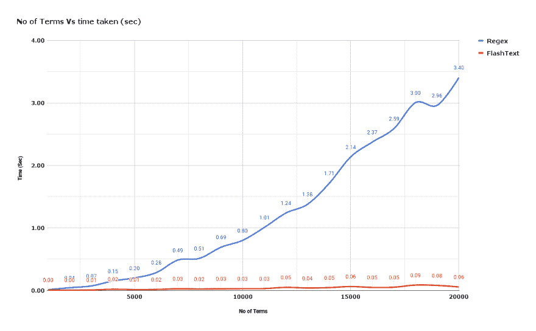
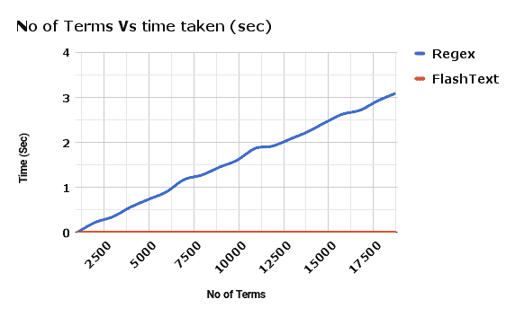
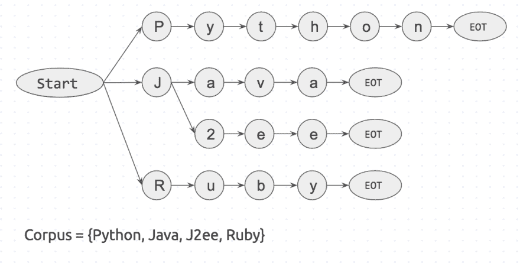
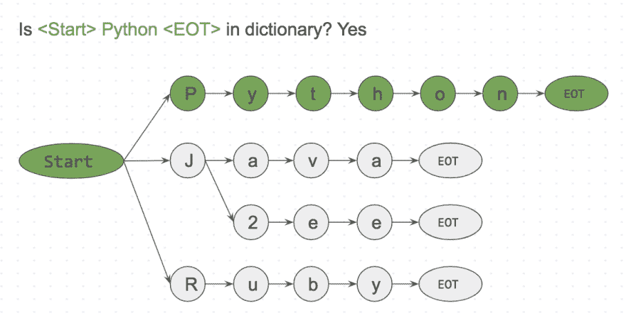
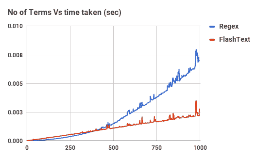

# Regex 花了 5 天时间运行。所以我做了一个工具，它能在 15 分钟内完成。

> 原文:[https://dev . to/vi3k6i 5/regex-was-taking-5-days-run-so-I-build-a-tool-that-did-it-c98](https://dev.to/vi3k6i5/regex-was-taking-5-days-to-run-so-i-built-a-tool-that-did-it-in-15-minutes-c98)

当开发人员处理文本时，他们通常需要首先清理文本。有时候是通过替换关键词。比如把“JavaScript”换成“Javascript”。其他时候，我们只是想知道文档中是否提到了“JavaScript”。

像这样的数据清理任务是大多数处理文本的数据科学项目的标准。

## 数据科学从数据清洗开始。

我最近有一个非常相似的任务。我在 Belong.co 担任数据科学家，自然语言处理是我工作的一半。

当我在我们的文档语料库上训练 Word2Vec 模型时，它开始给出同义词作为相似的术语。“JavaScript”是一个类似于“JavaScript”的术语。

为了解决这个问题，我编写了一个正则表达式(Regex ),用标准化的名称替换所有已知的同义词。正则表达式用“JavaScript”代替了“JavaScript ”,这解决了一个问题，但又产生了另一个问题。

```
Some people, when confronted with a problem, think 
“I know, I’ll use regular expressions.” Now they have two problems. 
```

<svg width="20px" height="20px" viewBox="0 0 24 24" class="highlight-action crayons-icon highlight-action--fullscreen-on"><title>Enter fullscreen mode</title></svg> <svg width="20px" height="20px" viewBox="0 0 24 24" class="highlight-action crayons-icon highlight-action--fullscreen-off"><title>Exit fullscreen mode</title></svg>

上面的引用来自这个[栈交换问题](https://softwareengineering.stackexchange.com/questions/223634/what-is-meant-by-now-you-have-two-problems)，它对我来说实现了。

事实证明，如果要搜索和替换的关键字数量在 100 个以内，Regex 是很快的。但是我的语料库有几十万个关键词和几百万个文档。

当我对我的正则表达式代码进行基准测试时，我发现完成一次运行需要 **5 天**。我的反应:

[T2】](https://res.cloudinary.com/practicaldev/image/fetch/s--ZptWYzyy--/c_limit%2Cf_auto%2Cfl_progressive%2Cq_auto%2Cw_880/https://cdn-images-1.medium.com/max/1600/1%2AGpNMd7fBtrH4TvVZRglfNg.jpeg)

显然需要做些什么。

[更新]

我开始尝试优化我正在使用的正则表达式。我了解到编译的正则表达式更快，所以我改用它。为了一起替换多个术语，有一个组选项，我采用了它。我仍然很难找到含有特殊字符的关键字，比如“C++”和“.”。Net' [链接](https://stackoverflow.com/questions/45813658/regex-not-replacing-word-starting-with-or-ending-with-like-net-or-c)。
加载到正则表达式时对关键字进行排序也提高了性能。

我最大的收获来自这个[环节](https://www.reddit.com/r/programming/comments/7j3433/regex_was_taking_5_days_to_run_so_i_built_a_tool/)。基于 Trie 的正则表达式速度更快[链接](https://stackoverflow.com/questions/42742810/speed-up-millions-of-regex-replacements-in-python-3/42789508#42789508)当我开始我的项目时，我并不知道这一点，但我朝着使用 Trie 的方向前进。

我不是说 Regex 总体上不好，只是很难理解这么多不同的实现。我用的是 Python 版本，而 RUST 有一个编译版，速度更快。还有更快的 c++版本。

如果你只是追求速度，也许你可以试试这些。我需要更多的控制和简单的使用，所以我建立了一个工具。这帮助我抽象出细节，确保任何对 Regex 了解不多的人都可以使用它。

[更新结束]

我在我的办公室和堆栈溢出上问了一圈。出现了一些建议。无论是[维奈](https://www.linkedin.com/in/vinay-pande-54810813/)、[苏雷什](https://www.linkedin.com/in/suresh-lakshmanan/)还是[堆栈溢出](https://stackoverflow.com/questions/44178449/regex-replace-is-taking-time-for-millions-of-documents-how-to-make-it-faster)都指向了这个被称为 [Aho-Corasick 算法](https://en.wikipedia.org/wiki/Aho%E2%80%93Corasick_algorithm)和 [Trie](https://en.wikipedia.org/wiki/Trie) 字典法的漂亮算法。我寻找了一些现有的解决方案，但没找到多少。

于是我写了自己的实现，于是 [FlashText](https://github.com/vi3k6i5/flashtext) 诞生了。

在我们深入了解什么是 FlashText 以及它是如何工作的之前，让我们先来看看它是如何执行的。

FlashText 与 Regex 相比查找术语所花费的时间。
[T3】](https://res.cloudinary.com/practicaldev/image/fetch/s--l7repANE--/c_limit%2Cf_auto%2Cfl_progressive%2Cq_auto%2Cw_880/https://thepracticaldev.s3.amazonaws.com/i/xruf50n6z1r37ti8rd89.png)

上面显示的图表是一个文档的编译正则表达式和 FlashText 的比较。随着关键字数量的增加，Regex 所用的时间几乎呈线性增长。然而，有了 FlashText，这并不重要。

## FlashText 将我们的运行时间从 5 天减少到 15 分钟！！

[T2】](https://res.cloudinary.com/practicaldev/image/fetch/s--_hs8EAf0--/c_limit%2Cf_auto%2Cfl_progressive%2Cq_auto%2Cw_880/https://cdn-images-1.medium.com/max/1600/1%2AZfRhHGtxhbEB0dS-3BHOAw.png)

与 Regex 相比，FlashText 替换术语所用的时间。
[T3】](https://res.cloudinary.com/practicaldev/image/fetch/s--duFLyJ1T--/c_limit%2Cf_auto%2Cfl_progressive%2Cq_auto%2Cw_880/https://thepracticaldev.s3.amazonaws.com/i/k44ghwp8o712dm58debj.png)

上面显示的用于基准测试的代码在这里链接[，在这里](https://gist.github.com/vi3k6i5/604eefd92866d081cfa19f862224e4a0)链接[。](https://gist.github.com/vi3k6i5/dc3335ee46ab9f650b19885e8ade6c7a)

## 那么什么是 FlashText 呢？

FlashText 是我在 GitHub 上开源的 Python 库。它在提取关键词和替换关键词方面都很有效。

要使用 FlashText，首先你必须给它传递一个关键字列表。该列表将在内部用于构建 Trie 字典。然后向它传递一个字符串，告诉它是否要执行替换或搜索。

对于`replace`,它会用替换的关键字创建一个新的字符串。对于`search`,它将返回在字符串中找到的关键字列表。这将在输入字符串的一次传递中完成。

以下是一位快乐的用户对该库的评价:

> 拉迪姆·řehůřek@拉迪姆·雷雷克[@ arnicas](https://twitter.com/arnicas)对于每个文档 1k 个关键字& ~10k 个标记，比编译的 regexp 快 28 倍。好听 [@vi3k6i5](https://twitter.com/vi3k6i5) ！
> 纯 Python t…[twitter.com/i/web/status/9…](https://t.co/K8x84q5q2E)2017 年 9 月 05 日上午 08:48[](https://twitter.com/intent/tweet?in_reply_to=904989624589803520)[](https://twitter.com/intent/retweet?tweet_id=904989624589803520)[](https://twitter.com/intent/like?tweet_id=904989624589803520)

Radim Rehurek 是 Gensim 的创建者。

## 为什么 FlashText 这么快？

让我们试着用一个例子来理解这一部分。假设我们有一个包含 3 个单词的句子`I like Python`，以及一个包含 4 个单词的语料库`{Python, Java, J2ee, Ruby}`。

如果我们从语料库中提取每个单词，并检查它是否出现在句子中，将需要 4 次尝试。

```
is 'Python' in sentence? 
is 'Java' in sentence?
... 
```

<svg width="20px" height="20px" viewBox="0 0 24 24" class="highlight-action crayons-icon highlight-action--fullscreen-on"><title>Enter fullscreen mode</title></svg> <svg width="20px" height="20px" viewBox="0 0 24 24" class="highlight-action crayons-icon highlight-action--fullscreen-off"><title>Exit fullscreen mode</title></svg>

如果语料库中有`n`个单词，它就会产生`n`个循环。而且每一步搜索`is <word> in sentence?`都需要花费自己的时间。这是正则表达式匹配中发生的情况。

还有一种方法与第一种方法相反。对于句子中的每个单词，检查它是否存在于语料库中。

```
is 'I' in corpus?
is 'like' in corpus?
is 'python' in corpus? 
```

<svg width="20px" height="20px" viewBox="0 0 24 24" class="highlight-action crayons-icon highlight-action--fullscreen-on"><title>Enter fullscreen mode</title></svg> <svg width="20px" height="20px" viewBox="0 0 24 24" class="highlight-action crayons-icon highlight-action--fullscreen-off"><title>Exit fullscreen mode</title></svg>

如果这个句子有`m`个单词，它就会出现`m`个循环。在这种情况下，花费的时间仅仅取决于句子的字数。而这一步，`is <word> in corpus?`可以通过使用字典查找来快速完成。

FlashText 算法基于第二种方法。它的灵感来自 Aho-Corasick 算法和 Trie 数据结构。

它的工作方式是:首先用语料库创建一个 Trie 字典。它看起来有点像这样

[T2】](https://res.cloudinary.com/practicaldev/image/fetch/s--jw9yTF9L--/c_limit%2Cf_auto%2Cfl_progressive%2Cq_auto%2Cw_880/https://cdn-images-1.medium.com/max/1600/1%2AN09Y_XEQFhFMxVpgEeqExQ.png)

`Start`和`EOT`(术语结束)代表单词边界，如`space`、`period`和`new_line`。关键字只有在两边都有单词边界时才会匹配。这将防止匹配菠萝中的苹果。

接下来我们将获取一个输入字符串`I like Python`并逐字符搜索。

```
Step 1: is <start>I<EOT> in dictionary? No
Step 2: is <start>like<EOT> in dictionary? No
Step 3: is <start>Python<EOT> in dictionary? Yes 
```

<svg width="20px" height="20px" viewBox="0 0 24 24" class="highlight-action crayons-icon highlight-action--fullscreen-on"><title>Enter fullscreen mode</title></svg> <svg width="20px" height="20px" viewBox="0 0 24 24" class="highlight-action crayons-icon highlight-action--fullscreen-off"><title>Exit fullscreen mode</title></svg>

[T2】](https://res.cloudinary.com/practicaldev/image/fetch/s--2nwZQ3se--/c_limit%2Cf_auto%2Cfl_progressive%2Cq_auto%2Cw_880/https://cdn-images-1.medium.com/max/1600/1%2AnoWWci3fCrbcbrj40B4UaA.png)

由于这是一个字符接一个字符的匹配，我们可以很容易地跳过`<start>l`处的`<start>like<EOT>`，因为`l`没有连接到`start`。这使得跳过遗漏的单词真的很快。

FlashText 算法只检查输入字符串“我喜欢 Python”的每个字符。这本字典很可能有一百万个关键字，对运行时没有任何影响。这就是 FlashText 算法的真正威力。

你可以通过构建基于 Trie 的 Regex [链接](https://stackoverflow.com/questions/42742810/speed-up-millions-of-regex-replacements-in-python-3/42789508#42789508)来获得相似的速度

## 那么什么时候应该使用 FlashText 呢？

简单回答:当关键词数量> 500 时

[T2】](https://res.cloudinary.com/practicaldev/image/fetch/s--jPcqd4XN--/c_limit%2Cf_auto%2Cfl_progressive%2Cq_auto%2Cw_880/https://thepracticaldev.s3.amazonaws.com/i/kzg3ol40sfuzpodazspp.png)

复杂的回答:Regex 可以搜索基于正则表达式的术语特殊字符，如`^,$,*,\d,.`所有这些在 FlashText 中都不被支持。所有 FlashText 都理解术语的开始和结束。简单来说它懂`\w,\b`。
所以如果你想匹配像`word\dvec`这样的偏旁词是不行的。但是对于提取`word2vec`这样的完整单词是很优秀的。

## 如何使用 FlashText

要查找术语: