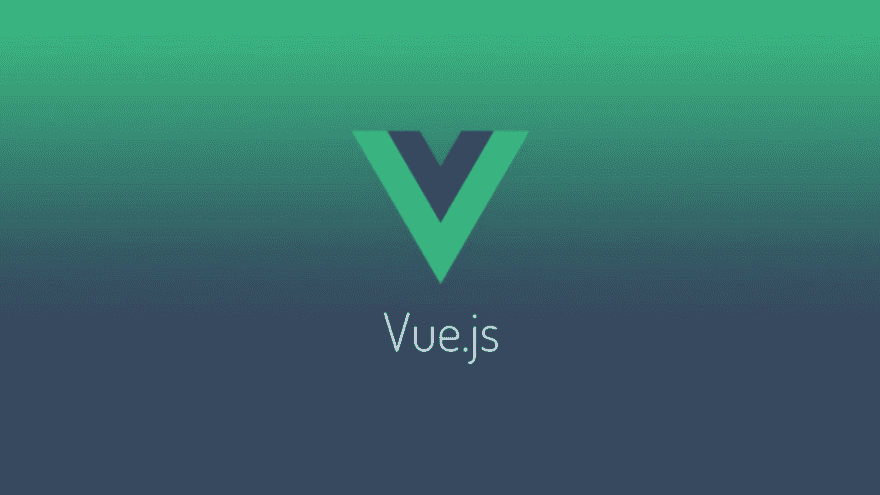
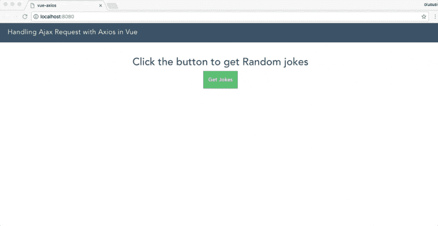
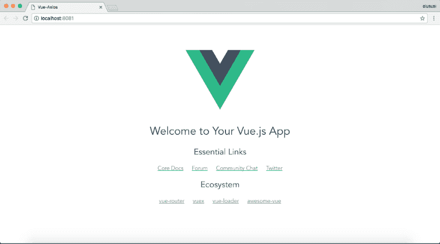
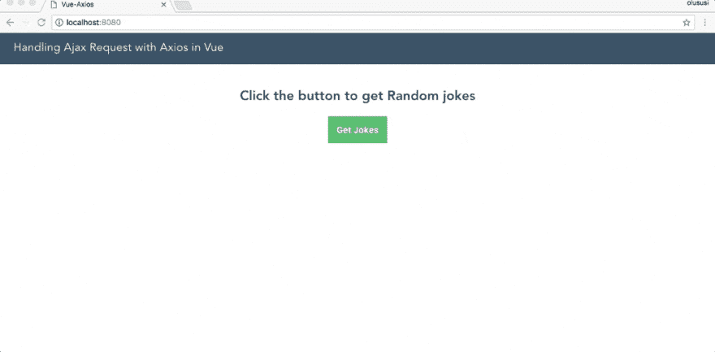
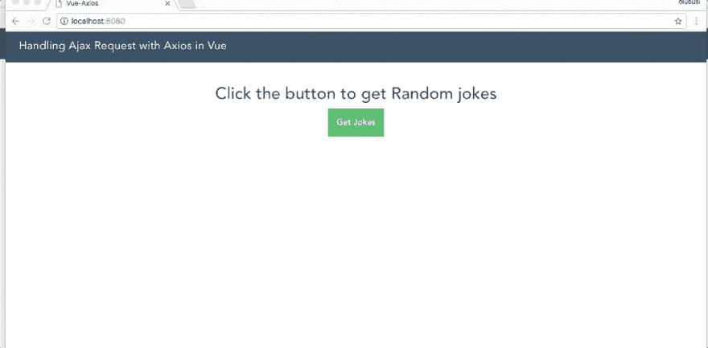

# 使用 Axios 处理 Vue 应用程序中的 Ajax 请求。

> 原文：<https://dev.to/yemiwebby/handling-ajax-request-in-vue-applications-using-axios-30cm>

[T2】](https://res.cloudinary.com/practicaldev/image/fetch/s--CWClkbj2--/c_limit%2Cf_auto%2Cfl_progressive%2Cq_auto%2Cw_880/https://cdn-images-1.medium.com/max/1024/1%2AmiB-YGBcasaouoRP4rovng.jpeg)

目前，构建 web 应用程序的流行架构是客户机-服务器模型。这使得通过从远程数据源获取数据或使用一个 [API](https://en.wikipedia.org/wiki/Application_programming_interface) 来构建 JavaScript 应用程序变得非常容易。它可以是公开可用的 API，也可以是你自己使用像 [Laravel](https://laravel.com/) 这样的框架构建的 API。

Vue 提供了使用从任何 API 获取的数据构建应用程序的灵活性，并方便地向应用程序的用户提供内容。

出于本教程的目的，我们将探索一个公开可用的 API [ICNDB](http://www.icndb.com/api/) 。它基本上是互联网上查克·诺里斯笑话的数据库。从这个 API 获取数据将让我们大致了解如何使用 Axios 成功地与来自远程数据源的信息进行通信。

对 Vue 的概念有一个基本的理解将是一个加分，以便能够在本教程中正确地跟随。

### 发出 Ajax 请求并处理响应

以前，在 Vue 应用程序中处理 Ajax 请求是通过使用 [vue-resource](https://github.com/pagekit/vue-resource) 来实现的，现在[已经退役](https://medium.com/the-vue-point/retiring-vue-resource-871a82880af4)。这意味着任何第三方库都可以用于发出 Ajax 请求，但是正如[埃文](https://twitter.com/youyuxi)所建议的，我们将使用 Axios。Axios 是一个值得称赞的基于 promise 的 HTTP 客户端库，它同时运行在客户端和服务器端。

现在我们已经熟悉了工具和我们想要构建的东西，让我们开始吧。

### 我们将建造什么

先睹为快，看看我们将在本教程中构建什么。

[](https://res.cloudinary.com/practicaldev/image/fetch/s--l7-QpQcR--/c_limit%2Cf_auto%2Cfl_progressive%2Cq_66%2Cw_880/https://cdn-images-1.medium.com/max/1024/1%2A6edx8b79WySFBSLdj3wUBQ.gif) 

<figcaption>我们将建造什么</figcaption>

准备好了吗？让我们建造它！

### 设置应用程序

这里将使用 Vue CLI 来快速设置应用程序。这个命令行界面(Vue-CLI)提供了一种快速生成单页面应用程序的方法，我们将马上安装它。在您的系统上全局安装 vue-cli 之前，我假设您已经安装了 Node 和 npm，否则请在此处快速下载它们[。完成后，您可以使用以下命令从终端验证节点和 npm:](https://nodejs.org/en/)

```
node -v

npm -v 
```

现在安装 Vue-CLI:

```
npm install -g vue-cli 
```

安装了 CLI 之后，vue 命令就可以用来搭建我们的应用程序了。让我们使用它来创建本教程的项目

```
vue init webpack-simple vue-axios 
```

我们使用 webpack-simple 模板，而不是从空白页开始。

接下来，将目录切换到新创建的项目中，并安装所有的依赖项。

```
cd vue-axios

npm install 
```

安装所有必需的文件可能需要几分钟时间，完成后，使用以下命令启动应用程序:

```
npm run dev 
```

这将在端口 8080 上的默认浏览器上启动应用程序，如下所示:

[T2】](https://res.cloudinary.com/practicaldev/image/fetch/s--0EkbCScm--/c_limit%2Cf_auto%2Cfl_progressive%2Cq_auto%2Cw_880/https://cdn-images-1.medium.com/max/1024/1%2AfN6a_CpUh3ymfhFkryFcBw.png)

### 安装 Axios

本教程的主要目标之一是学习如何在我们的应用程序中无缝地使用 axios。让我们使用 npm 安装它:

```
npm install axios --save 
```

Axios 将被安装并保存到我们应用程序的 package.json 文件中。

现在已经安装了必要的依赖项和工具。然后，我们将构建一个组件，用于进行前面描述的 API 调用，并呈现获取的内容。使用 Vue-CLI 搭建应用程序也将生成一个默认组件。/src/App.vue 打开该文件并清除其中的内容

```
<template>

<div id="app">
...

</div>

</template>

<script>

export default {

name: 'app',

data () {

return {

}

}

}

</script>

<style>

</style> 
```

如果你现在检查你的浏览器，这将导致一个空的页面。让填充开始。

```
<template>
  <div id="app">
    <header>
      <span>Handling Ajax Request with Axios in Vue</span>
    </header>
    <main>
        <h2>Click the button to get Random jokes</h2>
        <button id="btn" class="" v-on:click="getJokes">Get Jokes</button>

        <div v-if="loading">
          
          Loading.....
        </div>

      <div class="wrapper">
        ... 
      </div>
    </main>
  </div>
</template>

<script>
...
</script>

<style>
...
</style> 
```

到目前为止，在这个文件中，我们已经添加了一个标题来显示应用程序的标题。在'

<main></main>

'标签中，我们有一个按钮，一旦被点击，这个按钮将调用一个函数' get 笑话()'。这个函数很快就会被定义。

此外，我们添加了一个加载器图像，一旦 API 调用启动，就会显示该图像。一旦从远程源接收到我们的内容，此加载程序图像将被隐藏。

接下来，我们将设置脚本来进行调用，在组件中循环数据以显示结果，然后添加一点样式。

编辑“App.vue”文件:

```
<template>
...
</template>

<script>
  import axios from 'axios';

export default {
  name: 'app',
  data () {
    return {
      jokes: [],
      loading: false
    }
  }, 
  methods: {
    getJokes: function () {
      this.loading = true;
      axios.get("http://api.icndb.com/jokes/random/10")
      .then((response) => {
        this.loading = false;
        this.jokes = response.data.value;
      }, (error) => {
        this.loading = false;
      })
    }
  },
}
</script>

<style>
...
</style> 
```

首先，我们将 axios 导入到组件中，因为我们已经安装了它。然后，我们设置“get 笑话()”函数，并对“[http://api.icndb.com/jokes/random/10](http://api.icndb.com/jokes/random/10)”进行 API，这将返回 10 个随机笑话进行渲染。最后，我们还设置了加载和隐藏图像加载器的条件。

要查看 API 调用的内容，让我们返回到我们的组件并设置视图:

```
<template>
  <div id="app">
        ...
        <div v-if="loading">
          ...
        </div>

      <div class="wrapper">
        <div class="row">
          <div v-for="joke in jokes" :key="joke.id">
          <div class="col-md-4 cards">
              
            <div>
              <h3>{{ joke.id }}</h3>
              <p>{{ joke.joke }}</p>
              <p>{{ joke.category }}</p>
            </div>
          </div>
        </div>
        </div>
      </div>
    </main>
  </div>
</template>

<script>
...
</script>

<style>
...
</style> 
```

这里，我们使用 v-for 指令根据从 API 获取的数组来呈现一个项目列表。

除了用于设计应用程序样式的引导框架，我们还将添加一点自定义样式:

```
<template>
  ...
</template>

<script>
   ...
</script>

<style>
  body {
  margin: 0;
}

#app {
  font-family: 'Avenir', Helvetica, Arial, sans-serif;
  -webkit-font-smoothing: antialiased;
  -moz-osx-font-smoothing: grayscale;
  color: #2c3e50;
}

main {
  text-align: center;
  margin-top: 40px;
}

header {
  margin: 0;
  height: 56px;
  padding: 0 16px 0 24px;
  background-color: #35495E;
  color: #ffffff;
}

header span {
  display: block;
  position: relative;
  font-size: 20px;
  line-height: 1;
  letter-spacing: .02em;
  font-weight: 400;
  box-sizing: border-box;
  padding-top: 16px;
}

button {
  background: #51B767;
  color: #ffffff;
  padding: 15px;
  border-radius: 0;
  font-weight: bold;
  font-size: 15px;
  border: 0;
}

.cards {
  background: #F5F5F5;
  height:400px;
}
 .cards:hover {
  transform: translateY(-0.5em);
  background: #EBEBEB;
}

.cards {
   column-count: 1;
  column-gap: 1em;
    margin-top: 70px;

} 
</style> 
```

从[这里](https://github.com/yemiwebby/vue-axios/blob/master/src/assets/loader.gif)下载 loader image loader.gif。

并刷新浏览器:

[T2】](https://res.cloudinary.com/practicaldev/image/fetch/s--nUCj3UW2--/c_limit%2Cf_auto%2Cfl_progressive%2Cq_66%2Cw_880/https://cdn-images-1.medium.com/max/1024/1%2AShgzy9U2qMR1heYg5uKbLA.gif)

不要忘记在应用程序的 index.html 文件中包含引导程序的链接标记。

```
<link rel="stylesheet" href="https://maxcdn.bootstrapcdn.com/bootstrap/3.3.7/css/bootstrap.min.css"> 
```

到目前为止，您的页面应该看起来对齐了

[T2】](https://res.cloudinary.com/practicaldev/image/fetch/s--EXImejMM--/c_limit%2Cf_auto%2Cfl_progressive%2Cq_66%2Cw_880/https://cdn-images-1.medium.com/max/1024/1%2AxihoDGuq10sMcbwBtUKxYg.gif)

### 结论

在本文中，我们只使用 Axios 来发出 GET 请求并从 API 获取内容。Axios 足够强大，可以在我们的应用程序中的任何地方处理其他 HTTP 请求方法，如 POST、PUT、PATCH 和 DELETE。请随意改进，如果你觉得这篇文章有用，请用掌声表达你的爱。代码也可以在 github 上找到[。](https://github.com/yemiwebby/vue-axios)

* * *