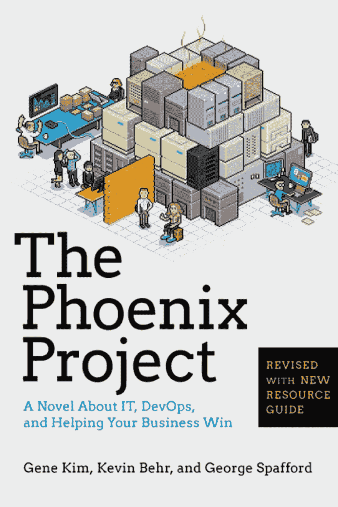

# 我是如何理解敏捷的

> 原文：<https://dev.to/schmdtdnl/how-i-managed-to-understand-agile-bm7>

在这里 [Cybay 新媒体](http://www.cybay.de)我们正处于从传统的瀑布式流程向敏捷方法转变的过程中。我们已经与整个团队的顾问进行了一些会谈，但改变员工对他们日常工作方式的看法并不容易。现有的所有出版物都有一个共同的缺点:**它们往往没有娱乐性。它们中的大多数是一套思想，包装在一个非常理论化的话语中，这使得人们很难意识到所有的副作用——尤其是当涉及到情绪的时候。**

人是习惯性的生物。多年来(甚至几十年来)以一种持续的方式解决问题构成了一种非常强烈的习惯。即使这种方式每次应用都会产生同样的问题和故障，人们还是倾向于坚持使用它，原因只有一个:他们让自己感觉很舒服。打破这些习惯是主要的挑战，也是敏捷转型失败的主要原因。

不要误解我。在我看来，敏捷**是**要走的路。但是对于非 it 人员(他们倾向于接触敏捷概念的时间更长)来说，很难改变他们的想法。

尽管如此，我们正在日常工作中实施 **[看板](https://en.wikipedia.org/wiki/Kanban)** ，世界上越来越多的公司都在这么做。我们面临着同样的问题，和其他人一样面临着同样的挑战。我也很难理解核心概念，让自己相信这种方法可以(并且会！)作为员工为我工作，为我的公司工作。我试着用前面提到的一些出版物自学，但是真正触动我的是一本**小说**。是的。一部小说，不是理论性的论述。

[T2】](https://res.cloudinary.com/practicaldev/image/fetch/s--SbwipMvj--/c_limit%2Cf_auto%2Cfl_progressive%2Cq_auto%2Cw_880/https://netz-basis.com/storage/manual-images/02-the-phoenix-project-cover.jpg)

我读了吉恩·金、凯文·贝尔和乔治·斯帕福德的《凤凰计划》。它讲述了一个虚构的“零件无限”公司和主要演员“比尔”的故事，比尔是一名 It 经理，他利用**看板**原则迫使拯救了他的部门。

书籍摘要说:

> 比尔是 Parts Unlimited 的 IT 经理。星期二早上，在开车去办公室的路上，比尔接到了首席执行官的电话。该公司的新 IT 计划，代号为凤凰计划，对零件无限的未来至关重要，但该项目大大超出预算，而且非常晚。首席执行官希望比尔直接向他汇报，并在 90 天内解决这个烂摊子，否则比尔的整个部门将被外包。在一位未来的董事会成员和他神秘的三种方式哲学的帮助下，Bill 开始发现 IT 工作和制造工厂的工作比他想象的更相似。随着时间的推移，Bill 必须组织工作流程，简化部门间的沟通，并有效地为 Parts Unlimited 的其他业务职能部门提供服务。

如前所述，这是娱乐风格。这是一本关于流程优化的小说。我很难向任何接触敏捷的人推荐这本书。

最后，引用书中的一句话:

> "任何没有在瓶颈处做出的改进都是多余的."

* * *

*本文原载于[netz-basis.com](https://netz-basis.com/blog/how-i-managed-to-understand-agile)。*