# 如何创建一个整版的英雄形象(HTML & CSS)

> 原文:[https://dev . to/code the web/how-to-create-a-full-page-hero-image-html-CSS-b5i](https://dev.to/codetheweb/how-to-create-a-full-page-hero-image-html--css-b5i)

英雄形象被互联网上的所有网站使用，看起来棒极了。在本文中学习如何编写代码…

## 我们要做什么

下面是我们今天要做的: [](https://res.cloudinary.com/practicaldev/image/fetch/s--TvhGdcKX--/c_limit%2Cf_auto%2Cfl_progressive%2Cq_66%2Cw_880/https://codetheweb.blog/assets/img/posts/full-image-hero/final-product.gif)

你可以在这里观看现场演示。

## 我们走吧！

首先，您需要为这个项目创建一个全新的空文件夹。在其中，创建两个新文件:`index.html`和`style.css`。

## 创建 HTML

首先，我们需要创建 [HTML 文档结构](https://codetheweb.blog/2017/10/07/structure-of-an-html-document/) :

```
<!DOCTYPE html>
<html>
    <head>
        <title>My awesome website</title>
        <link rel="stylesheet" href="style.css">
    </head>

    <body>
        Hello!
    </body>
</html> 
```

<svg width="20px" height="20px" viewBox="0 0 24 24" class="highlight-action crayons-icon highlight-action--fullscreen-on"><title>Enter fullscreen mode</title></svg> <svg width="20px" height="20px" viewBox="0 0 24 24" class="highlight-action crayons-icon highlight-action--fullscreen-off"><title>Exit fullscreen mode</title></svg>

不要忘记在样式表中包含`<link>`！

此时保存，在浏览器中打开你的 HTML 文件并检查一切正常。

### 英雄 HTML 代码

页面的图片部分(见演示)被称为*英雄图片*。让我们把我们的英雄图像和里面的内容添加到我们的 HTML:

```
<!DOCTYPE html>
<html>
    <head>
        <title>My awesome website</title>
        <link rel="stylesheet" href="style.css">
    </head>

    <body>
        <section class="hero">
            <div class="hero-inner">
                <h1>My awesome website</h1>
                <h2>Look at this website and bask in its amazing glory!</h2>
                <a href="https://example.com/" class="btn">Go ahead...</a>
            </div>
        </section>
    </body>
</html> 
```

<svg width="20px" height="20px" viewBox="0 0 24 24" class="highlight-action crayons-icon highlight-action--fullscreen-on"><title>Enter fullscreen mode</title></svg> <svg width="20px" height="20px" viewBox="0 0 24 24" class="highlight-action crayons-icon highlight-action--fullscreen-off"><title>Exit fullscreen mode</title></svg>

哇，这是怎么回事？我们来分解一下…

首先，我们创建一个`<section>`，它将成为我们的英雄:

```
<section class="hero">

</section> 
```

<svg width="20px" height="20px" viewBox="0 0 24 24" class="highlight-action crayons-icon highlight-action--fullscreen-on"><title>Enter fullscreen mode</title></svg> <svg width="20px" height="20px" viewBox="0 0 24 24" class="highlight-action crayons-icon highlight-action--fullscreen-off"><title>Exit fullscreen mode</title></svg>

除了告诉浏览器和搜索引擎它是我们页面上的一部分之外,`<section>`的行为就像`<div>`。

接下来，我们添加一个内部`<div>` -这是为了让我们的[flexbox](https://codetheweb.blog/2017/12/05/css-flexboxes/)工作，我将在本教程的后面深入研究。

```
<section class="hero">
    <div class="hero-inner">

    </div>
</section> 
```

<svg width="20px" height="20px" viewBox="0 0 24 24" class="highlight-action crayons-icon highlight-action--fullscreen-on"><title>Enter fullscreen mode</title></svg> <svg width="20px" height="20px" viewBox="0 0 24 24" class="highlight-action crayons-icon highlight-action--fullscreen-off"><title>Exit fullscreen mode</title></svg>

最后，我们添加实际内容——简单地添加一个`<h1>`、`<h2>`和一个链接(`<a>`)。

### 主要内容 HTML 代码

正如你从演示中看到的，我们在英雄下面有一些虚拟文本，以便我们可以滚动。为了让这篇文章不跑题，我们不会在这篇文章中设计它。所以，让我们添加我们的虚拟文本！

```
<!DOCTYPE html>
<html>

<head>
    <title>My awesome website</title>
    <link rel="stylesheet" href="style.css">
</head>

<body>
    <section class="hero">
        <div class="hero-inner">
            <h1>My awesome website</h1>
            <h2>Look at this website and bask in its amazing glory!</h2>
            <a href="https://example.com/" class="btn">Go ahead...</a>
        </div>
    </section>
    <main>
        <p>Lorem ipsum dolor sit amet, consectetur adipiscing elit. Integer nec nibh molestie, efficitur leo sed, viverra nunc. Donec vehicula accumsan erat facilisis ullamcorper. Donec commodo quis dui nec placerat. Donec mi orci, scelerisque eget nisl ac, hendrerit condimentum odio. Nam dictum odio eget quam tempus, a mattis odio ornare. Nullam auctor libero ut libero suscipit, ut accumsan nunc condimentum. Donec ullamcorper maximus sapien quis egestas.</p>

        <p>Mauris viverra scelerisque lobortis. Orci varius natoque penatibus et magnis dis parturient montes, nascetur ridiculus mus. Fusce ultrices enim sit amet elit tincidunt maximus. Suspendisse vitae pellentesque lectus. Duis commodo leo suscipit augue mollis, non venenatis dolor ullamcorper. Duis tincidunt scelerisque lacus, vel vehicula leo consectetur vel. Duis posuere nisl non odio consequat ultrices. Lorem ipsum dolor sit amet, consectetur adipiscing elit.</p>

        <p>Etiam a leo nec mi blandit euismod. Etiam fringilla odio vitae risus ornare, id bibendum velit consequat. Fusce posuere risus sollicitudin condimentum ultrices. Fusce gravida, purus eget laoreet mattis, velit sapien ultrices diam, id dapibus erat leo id quam. Maecenas quis risus convallis, placerat elit non, iaculis tortor. Nullam porttitor magna risus, quis bibendum metus tincidunt in. Etiam vel ligula ac risus mattis tincidunt vel sit amet ante. Morbi et viverra ligula. Ut ac dignissim nisi, condimentum imperdiet mauris. Pellentesque ut ipsum vel diam tristique faucibus eu et lectus. Maecenas posuere neque non lacus bibendum, sit amet pharetra justo semper. Sed mi risus, tempor sit amet ligula eget, varius pretium est. Sed a odio in orci accumsan pretium suscipit ut quam.</p>
    </main>
</body>

</html> 
```

<svg width="20px" height="20px" viewBox="0 0 24 24" class="highlight-action crayons-icon highlight-action--fullscreen-on"><title>Enter fullscreen mode</title></svg> <svg width="20px" height="20px" viewBox="0 0 24 24" class="highlight-action crayons-icon highlight-action--fullscreen-off"><title>Exit fullscreen mode</title></svg>

正如你所看到的，我们所做的只是在一个`<main>`中插入了一些`<p>`。和`<section>`一样，`<main>`的行为和`<div>`非常相似，除了它告诉浏览器和搜索引擎它是页面的“主要”内容。

这就是 HTML 的全部内容！让我们继续设计我们的页面…

## CSS！

此刻，你的网站将会是这样的: [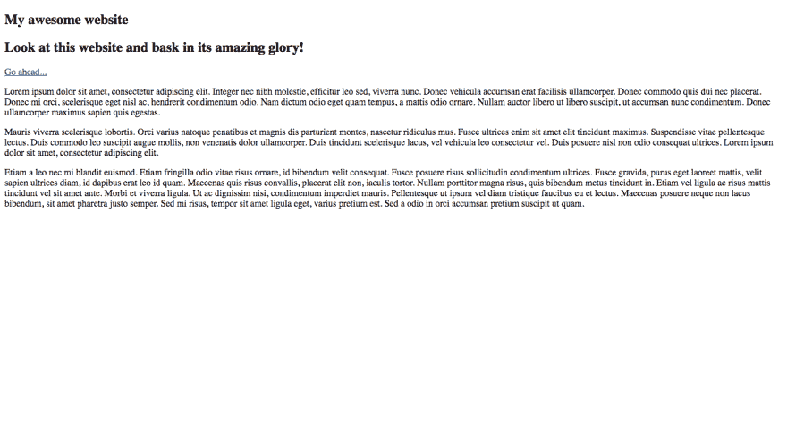](https://res.cloudinary.com/practicaldev/image/fetch/s--60C3s_Q7--/c_limit%2Cf_auto%2Cfl_progressive%2Cq_auto%2Cw_880/https://codetheweb.blog/assets/img/posts/full-image-hero/before-css.png)

那看起来一点也不像我们想要的——让我们添加一些样式！我们将从定位文本和设置大小开始…

## 身体造型

首先，让我们打开我们的`style.css`文件，并应用一些通用的造型到身体:

```
body {
    margin: 0;
    font-family: sans-serif;
} 
```

<svg width="20px" height="20px" viewBox="0 0 24 24" class="highlight-action crayons-icon highlight-action--fullscreen-on"><title>Enter fullscreen mode</title></svg> <svg width="20px" height="20px" viewBox="0 0 24 24" class="highlight-action crayons-icon highlight-action--fullscreen-off"><title>Exit fullscreen mode</title></svg>

正文有一个默认的边距，我们不希望在没有图像头的情况下插入，这就是为什么我们把它设置为 0。我们将`font-family`设置为`sans-serif`的原因是，这样你就不会被泰晤士报的新罗马字体困住😜

实际上，你可以将文本设置成任何你想要的字体，但是这要复杂一点——我将在后面的文章中详细介绍。

## 英雄定位和尺寸

让我们确定元素的位置和大小，这样我们就知道页面上的所有内容在哪里了。

首先，我们要对实际的英雄部分本身进行样式化:

```
.hero {
    /* Sizing */
    width: 100vw;
    height: 100vh;
} 
```

<svg width="20px" height="20px" viewBox="0 0 24 24" class="highlight-action crayons-icon highlight-action--fullscreen-on"><title>Enter fullscreen mode</title></svg> <svg width="20px" height="20px" viewBox="0 0 24 24" class="highlight-action crayons-icon highlight-action--fullscreen-off"><title>Exit fullscreen mode</title></svg>

如果你还不知道， [`vw`和`vh`](https://codetheweb.blog/2017/12/04/css-units/#vw--vh) 代表视口宽度和高度的百分比。在这种情况下，我们将我们的英雄设置为浏览器宽度和高度的 100%。

保存并重新加载你的浏览器-现在英雄部分占据了整个屏幕！(您必须向下滚动才能看到页面的其余部分)

[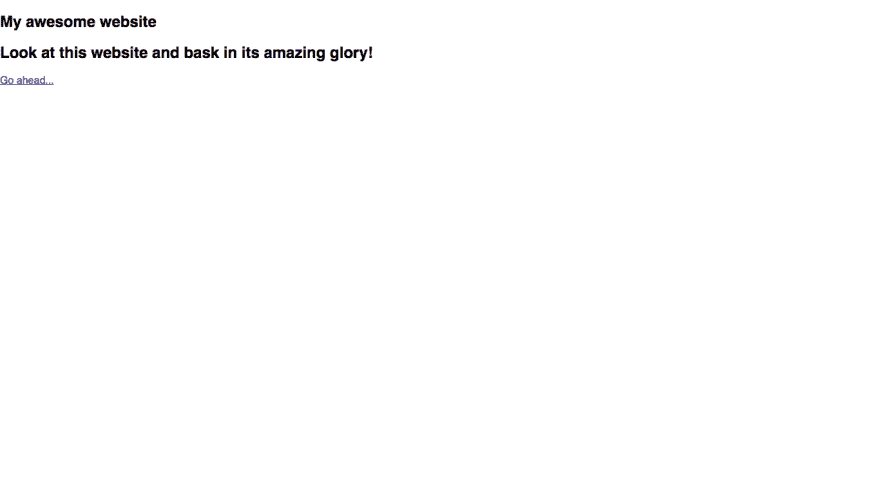T2】](https://res.cloudinary.com/practicaldev/image/fetch/s--Om5HM8oe--/c_limit%2Cf_auto%2Cfl_progressive%2Cq_auto%2Cw_880/https://codetheweb.blog/assets/img/posts/full-image-hero/hero-sizing.png)

我们希望我们的文本在我们的英雄部分中水平居中*和垂直居中*，所以它显示在屏幕的中间。最好的方法是使用[柔性盒](https://codetheweb.blog/2017/12/05/css-flexboxes/)(我在这里写了一点关于使用柔性盒[完美居中的内容](https://codetheweb.blog/2017/12/05/css-flexboxes/#perfect-centering))。

所以，让我们为我们的英雄添加一些完美的居中！

```
.hero {
    /* Sizing */
    width: 100vw;
    height: 100vh;

    /* Flexbox stuff */
    display: flex;
    justify-content: center;
    align-items: center;
} 
```

<svg width="20px" height="20px" viewBox="0 0 24 24" class="highlight-action crayons-icon highlight-action--fullscreen-on"><title>Enter fullscreen mode</title></svg> <svg width="20px" height="20px" viewBox="0 0 24 24" class="highlight-action crayons-icon highlight-action--fullscreen-off"><title>Exit fullscreen mode</title></svg>

现在，当你保存重新加载你的页面时，文本将在屏幕上居中！[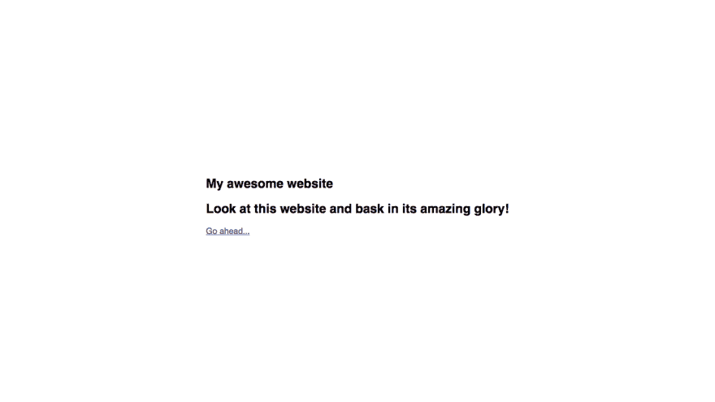T2】](https://res.cloudinary.com/practicaldev/image/fetch/s--MQ1buy4H--/c_limit%2Cf_auto%2Cfl_progressive%2Cq_auto%2Cw_880/https://codetheweb.blog/assets/img/posts/full-image-hero/flexbox-centered.png)

…或者不是。

你看，我们还需要确保我们实际的*文本*居中，而不仅仅是文本所在的元素居中。我们可以简单地通过使用`text-align: center` :
来做到这一点

```
.hero {
    /* Sizing */
    width: 100vw;
    height: 100vh;

    /* Flexbox stuff */
    display: flex;
    justify-content: center;
    align-items: center;

    /* Text styles */
    text-align: center;
} 
```

<svg width="20px" height="20px" viewBox="0 0 24 24" class="highlight-action crayons-icon highlight-action--fullscreen-on"><title>Enter fullscreen mode</title></svg> <svg width="20px" height="20px" viewBox="0 0 24 24" class="highlight-action crayons-icon highlight-action--fullscreen-off"><title>Exit fullscreen mode</title></svg>

我们走吧！我们的英雄内容现在完全居中！[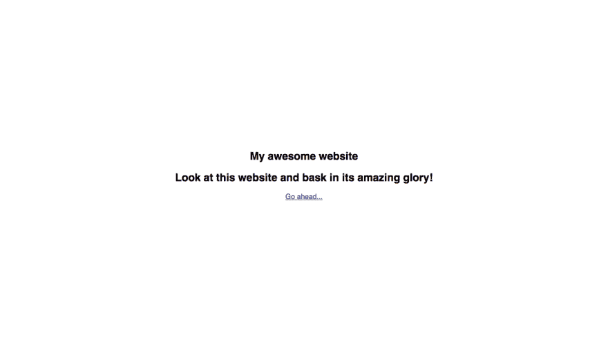T2】](https://res.cloudinary.com/practicaldev/image/fetch/s--P_925xg8--/c_limit%2Cf_auto%2Cfl_progressive%2Cq_auto%2Cw_880/https://codetheweb.blog/assets/img/posts/full-image-hero/properly-centered.png)

## 文本样式

现在，让我们把我们的主标题放大，这样我们就知道它是标题:

```
.hero h1 {
    /* Text styles */
    font-size: 5em;
} 
```

<svg width="20px" height="20px" viewBox="0 0 24 24" class="highlight-action crayons-icon highlight-action--fullscreen-on"><title>Enter fullscreen mode</title></svg> <svg width="20px" height="20px" viewBox="0 0 24 24" class="highlight-action crayons-icon highlight-action--fullscreen-off"><title>Exit fullscreen mode</title></svg>

结果: [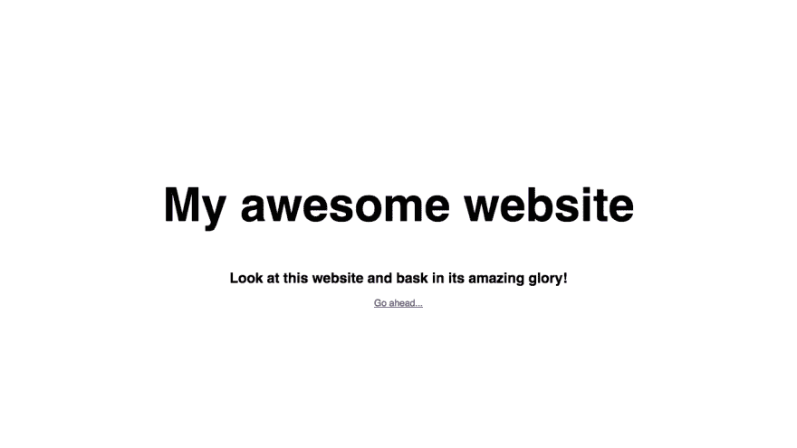](https://res.cloudinary.com/practicaldev/image/fetch/s--ctdwlBWE--/c_limit%2Cf_auto%2Cfl_progressive%2Cq_auto%2Cw_880/https://codetheweb.blog/assets/img/posts/full-image-hero/large-title.png)

然而，现在我们的标题和副标题之间有一个奇怪的大空间。这是因为默认情况下，对于标题元素，随着它的`font-size`增加，它的边距也会增加。所以，让我们稍微调整一下:

```
.hero h1 {
    /* Text styles */
    font-size: 5em;

    /* Margins */
    margin-top: 0;
    margin-bottom: 0.5em;
} 
```

<svg width="20px" height="20px" viewBox="0 0 24 24" class="highlight-action crayons-icon highlight-action--fullscreen-on"><title>Enter fullscreen mode</title></svg> <svg width="20px" height="20px" viewBox="0 0 24 24" class="highlight-action crayons-icon highlight-action--fullscreen-off"><title>Exit fullscreen mode</title></svg>

现在看起来好一点了！[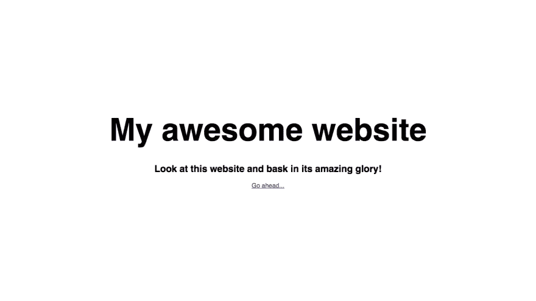T2】](https://res.cloudinary.com/practicaldev/image/fetch/s--HrYYMLZO--/c_limit%2Cf_auto%2Cfl_progressive%2Cq_auto%2Cw_880/https://codetheweb.blog/assets/img/posts/full-image-hero/fixed-title-margins.png)

现在我们的标题和副标题看起来不错，让我们来设计我们的按钮！

## 按钮样式

首先，我们需要给按钮一个`block` ( `<a>`元素默认为`inline`)的`display`类型，这样它的行为就像其他元素一样。我们还需要给它一个`width`，否则它会占据整个屏幕的宽度。为了有助于形象化所发生的事情，让我们也添加一个边框:

```
.hero .btn {
    /* Positioning and sizing */
    display: block;
    width: 200px;

    /* Border styles */
    border: 3px solid black;
} 
```

<svg width="20px" height="20px" viewBox="0 0 24 24" class="highlight-action crayons-icon highlight-action--fullscreen-on"><title>Enter fullscreen mode</title></svg> <svg width="20px" height="20px" viewBox="0 0 24 24" class="highlight-action crayons-icon highlight-action--fullscreen-off"><title>Exit fullscreen mode</title></svg>

结果: [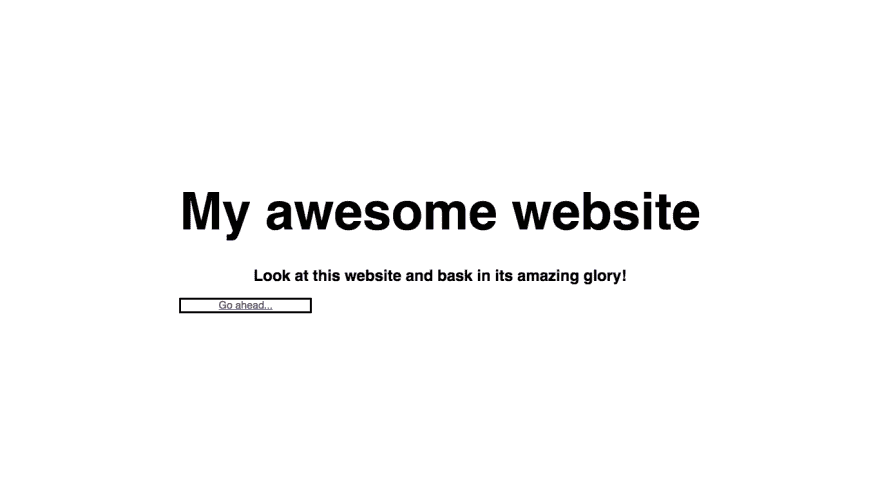](https://res.cloudinary.com/practicaldev/image/fetch/s--7mpN-PB8--/c_limit%2Cf_auto%2Cfl_progressive%2Cq_auto%2Cw_880/https://codetheweb.blog/assets/img/posts/full-image-hero/btn-initial-styling.png)

让我们添加一些`margin`和`padding`使按钮看起来更好一点:

```
.hero .btn {
    /* Positioning and sizing */
    display: block;
    width: 200px;

    /* Padding and margins */
    padding: 1em;
    margin-top: 50px;

    /* Border styles */
    border: 3px solid black;
} 
```

<svg width="20px" height="20px" viewBox="0 0 24 24" class="highlight-action crayons-icon highlight-action--fullscreen-on"><title>Enter fullscreen mode</title></svg> <svg width="20px" height="20px" viewBox="0 0 24 24" class="highlight-action crayons-icon highlight-action--fullscreen-off"><title>Exit fullscreen mode</title></svg>

[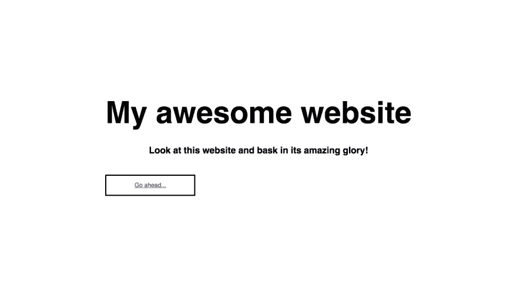T2】](https://res.cloudinary.com/practicaldev/image/fetch/s--zfAW9mU---/c_limit%2Cf_auto%2Cfl_progressive%2Cq_auto%2Cw_880/https://codetheweb.blog/assets/img/posts/full-image-hero/btn-margin-padding.png)

但是，我们的按钮仍然没有居中！这是因为它与 flexbox 中的其他元素不同，具有固定的宽度。幸运的是，修复非常简单——我们只需添加一个`auto`的`margin-left`和`margin-right`!这样做是因为`auto`占据了最大的可用空间，这意味着两边的边距相等。

来试试吧:

```
.hero .btn {
    /* Positioning and sizing */
    display: block;
    width: 200px;

    /* Padding and margins */
    padding: 1em;
    margin-top: 50px;
    margin-left: auto;
    margin-right: auto;

    /* Border styles */
    border: 3px solid black;
} 
```

<svg width="20px" height="20px" viewBox="0 0 24 24" class="highlight-action crayons-icon highlight-action--fullscreen-on"><title>Enter fullscreen mode</title></svg> <svg width="20px" height="20px" viewBox="0 0 24 24" class="highlight-action crayons-icon highlight-action--fullscreen-off"><title>Exit fullscreen mode</title></svg>

结果: [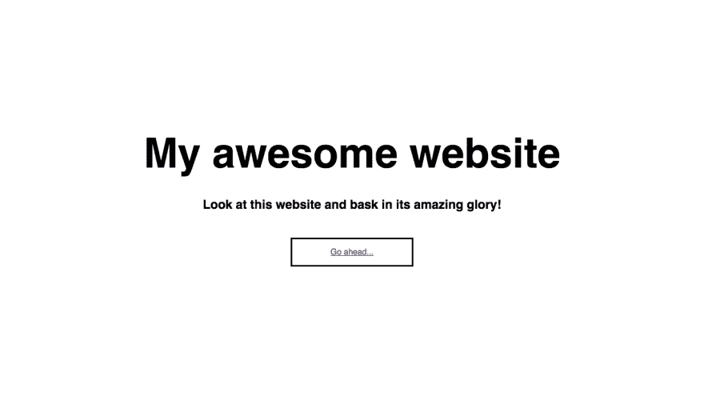](https://res.cloudinary.com/practicaldev/image/fetch/s--i1v4SXZv--/c_limit%2Cf_auto%2Cfl_progressive%2Cq_auto%2Cw_880/https://codetheweb.blog/assets/img/posts/full-image-hero/btn-centered.png)

接下来，让我们为按钮文本添加一些样式，覆盖默认的链接样式并使文本变大。这是网页设计的一个重要规则，即**人们更有可能点击更大的东西**。在这种情况下，我们希望人们点击我们的按钮(“号召行动”)，所以我们将文本变大。所以，让我们添加 CSS:

```
.hero .btn {
    /* Positioning and sizing */
    display: block;
    width: 200px;

    /* Padding and margins */
    padding: 1em;
    margin-top: 50px;
    margin-left: auto;
    margin-right: auto;

    /* Text styles */
    color: black;
    text-decoration: none;
    font-size: 1.5em;

    /* Border styles */
    border: 3px solid black;
} 
```

<svg width="20px" height="20px" viewBox="0 0 24 24" class="highlight-action crayons-icon highlight-action--fullscreen-on"><title>Enter fullscreen mode</title></svg> <svg width="20px" height="20px" viewBox="0 0 24 24" class="highlight-action crayons-icon highlight-action--fullscreen-off"><title>Exit fullscreen mode</title></svg>

结果: [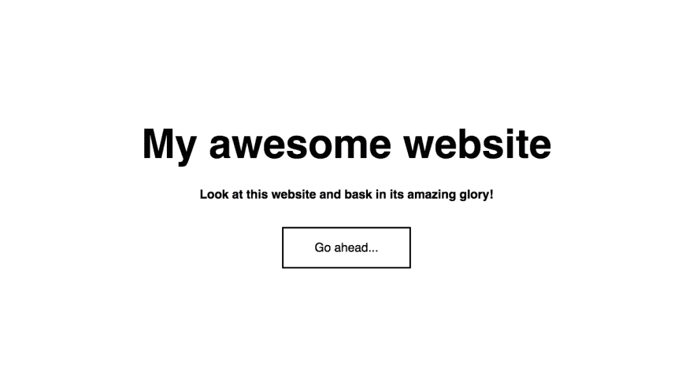](https://res.cloudinary.com/practicaldev/image/fetch/s--_6UeoW5w--/c_limit%2Cf_auto%2Cfl_progressive%2Cq_auto%2Cw_880/https://codetheweb.blog/assets/img/posts/full-image-hero/btn-text-styles.png)

剩下的就是将按钮的边缘弄圆——我们可以使用`border-radius`属性:
来实现

```
.hero .btn {
    /* Positioning and sizing */
    display: block;
    width: 200px;

    /* Padding and margins */
    padding: 1em;
    margin-top: 50px;
    margin-left: auto;
    margin-right: auto;

    /* Text styles */
    color: black;
    text-decoration: none;
    font-size: 1.5em;

    /* Border styles */
    border: 3px solid black;
    border-radius: 20px;
} 
```

<svg width="20px" height="20px" viewBox="0 0 24 24" class="highlight-action crayons-icon highlight-action--fullscreen-on"><title>Enter fullscreen mode</title></svg> <svg width="20px" height="20px" viewBox="0 0 24 24" class="highlight-action crayons-icon highlight-action--fullscreen-off"><title>Exit fullscreen mode</title></svg>

[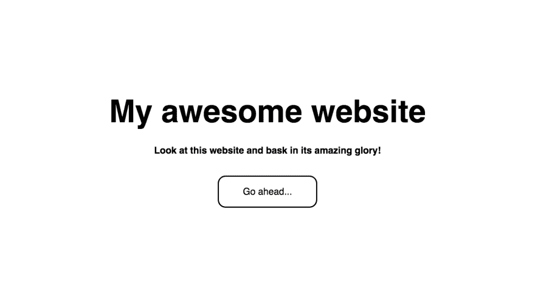T2】](https://res.cloudinary.com/practicaldev/image/fetch/s--OfI15Us---/c_limit%2Cf_auto%2Cfl_progressive%2Cq_auto%2Cw_880/https://codetheweb.blog/assets/img/posts/full-image-hero/btn-border-radius.png)

## 英雄背景造型

呜！在这一切之后，终于到了给我们的英雄添加实际图像的时候了！我们可以使用`background-image`属性，以及其他一些[背景相关的属性](https://codetheweb.blog/2017/12/02/css-advanced-background-images/) :
来做到这一点

```
.hero {
    /* Sizing */
    width: 100vw;
    height: 100vh;

    /* Flexbox stuff */
    display: flex;
    justify-content: center;
    align-items: center;

    /* Text styles */
    text-align: center;

    /* Background styles */
    background-image: url(https://codetheweb.blog/assets/img/posts/full-image-hero/image.jpg);
    background-size: cover;
    background-position: center center;
    background-repeat: no-repeat;
    background-attachment: fixed;
} 
```

<svg width="20px" height="20px" viewBox="0 0 24 24" class="highlight-action crayons-icon highlight-action--fullscreen-on"><title>Enter fullscreen mode</title></svg> <svg width="20px" height="20px" viewBox="0 0 24 24" class="highlight-action crayons-icon highlight-action--fullscreen-off"><title>Exit fullscreen mode</title></svg>

我将快速浏览一下它们各自的功能:

```
background-image: url('https://codetheweb.blog/assets/img/posts/full-image-hero/image.jpg'); 
```

<svg width="20px" height="20px" viewBox="0 0 24 24" class="highlight-action crayons-icon highlight-action--fullscreen-on"><title>Enter fullscreen mode</title></svg> <svg width="20px" height="20px" viewBox="0 0 24 24" class="highlight-action crayons-icon highlight-action--fullscreen-off"><title>Exit fullscreen mode</title></svg>

将我们的英雄的背景图像设置为[这个图像](https://codetheweb.blog/assets/img/posts/full-image-hero/image.jpg)

```
background-size: cover; 
```

<svg width="20px" height="20px" viewBox="0 0 24 24" class="highlight-action crayons-icon highlight-action--fullscreen-on"><title>Enter fullscreen mode</title></svg> <svg width="20px" height="20px" viewBox="0 0 24 24" class="highlight-action crayons-icon highlight-action--fullscreen-off"><title>Exit fullscreen mode</title></svg>

确保我们的背景足够大以覆盖整个英雄。

```
background-position: center center; 
```

<svg width="20px" height="20px" viewBox="0 0 24 24" class="highlight-action crayons-icon highlight-action--fullscreen-on"><title>Enter fullscreen mode</title></svg> <svg width="20px" height="20px" viewBox="0 0 24 24" class="highlight-action crayons-icon highlight-action--fullscreen-off"><title>Exit fullscreen mode</title></svg>

定位图像，使其位于屏幕中央。

```
background-repeat: no-repeat; 
```

<svg width="20px" height="20px" viewBox="0 0 24 24" class="highlight-action crayons-icon highlight-action--fullscreen-on"><title>Enter fullscreen mode</title></svg> <svg width="20px" height="20px" viewBox="0 0 24 24" class="highlight-action crayons-icon highlight-action--fullscreen-off"><title>Exit fullscreen mode</title></svg>

停止图像重复/平铺。

```
background-attachment: fixed; 
```

<svg width="20px" height="20px" viewBox="0 0 24 24" class="highlight-action crayons-icon highlight-action--fullscreen-on"><title>Enter fullscreen mode</title></svg> <svg width="20px" height="20px" viewBox="0 0 24 24" class="highlight-action crayons-icon highlight-action--fullscreen-off"><title>Exit fullscreen mode</title></svg>

使背景图像停留在同一个位置，即使你向下滚动页面。

保存，重新加载，看看结果: [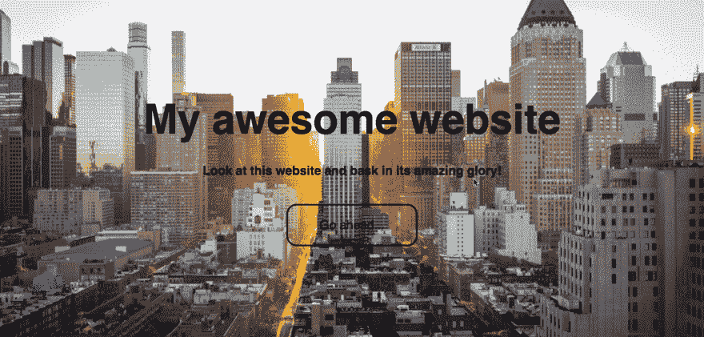](https://res.cloudinary.com/practicaldev/image/fetch/s--Omc57Y1b--/c_limit%2Cf_auto%2Cfl_progressive%2Cq_66%2Cw_880/https://codetheweb.blog/assets/img/posts/full-image-hero/bg-img.gif)

厉害！但是，现在很难看到文字。如果我们试着把所有东西都变成白色呢？下面是我们要添加/更改的 CSS 文件行:

```
body {
    margin: 0;
    font-family: sans-serif;
}

.hero {
    /* Sizing */
    width: 100vw;
    height: 100vh;

    /* Flexbox stuff */
    display: flex;
    justify-content: center;
    align-items: center;

    /* Text styles */
    text-align: center;
    color: white; /* ADD THIS LINE */

    /* Background styles */
    background-image: url('https://codetheweb.blog/assets/img/posts/full-image-hero/image.jpg');
    background-size: cover;
    background-position: center center;
    background-repeat: no-repeat;
    background-attachment: fixed;
}

.hero h1 {
    /* Text styles */
    font-size: 5em;

    /* Margins */
    margin-top: 0;
    margin-bottom: 0.5em;
}

.hero .btn {
    /* Positioning and sizing */
    display: block;
    width: 200px;

    /* Padding and margins */
    padding: 1em;
    margin-top: 50px;
    margin-left: auto;
    margin-right: auto;

    /* Text styles */
    color: white; /* CHANGE THIS LINE */
    text-decoration: none;
    font-size: 1.5em;

    /* Border styles */
    border: 3px solid white; /* CHANGE THIS LINE */
    border-radius: 20px;
} 
```

<svg width="20px" height="20px" viewBox="0 0 24 24" class="highlight-action crayons-icon highlight-action--fullscreen-on"><title>Enter fullscreen mode</title></svg> <svg width="20px" height="20px" viewBox="0 0 24 24" class="highlight-action crayons-icon highlight-action--fullscreen-off"><title>Exit fullscreen mode</title></svg>

您应该已经更改了两行并添加了一行(见上文)。

现在，让我们来看看结果: [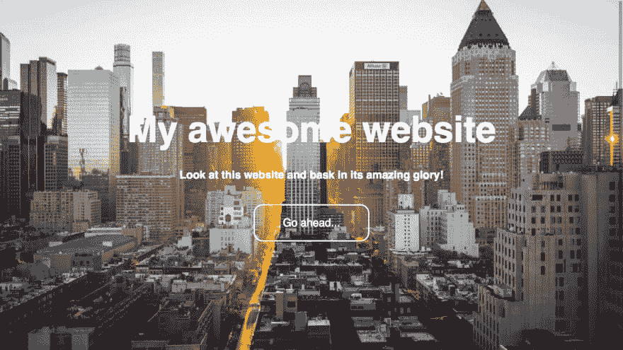](https://res.cloudinary.com/practicaldev/image/fetch/s--L_6p_ChF--/c_limit%2Cf_auto%2Cfl_progressive%2Cq_auto%2Cw_880/https://codetheweb.blog/assets/img/posts/full-image-hero/white-over-bg.png)

嗯，还是不行。然而，如果我们将背景图像变暗，那就有可能！但是我们如何做到这一点呢？

我要告诉你一些很酷的事情——信不信由你，同一个元素可以有多个背景图片！你所需要做的就是用逗号将它们分开。因此，如果我们有我们的照片背景图像，然后在上面有一个半透明的黑色背景图像，我们将能够看穿-但它会变暗。

事情是这样的`background-image`不拿颜色。但是它确实需要[渐变](https://codetheweb.blog/newsletter)！因此，我们可以在两种相同的颜色之间制作渐变，并有效地使用“颜色”作为`background-image`。下面是 CSS:

```
.hero {
    /* Sizing */
    width: 100vw;
    height: 100vh;

    /* Flexbox stuff */
    display: flex;
    justify-content: center;
    align-items: center;

    /* Text styles */
    text-align: center;
    color: white;

    /* Background styles */
    background-image: linear-gradient(rgba(0, 0, 0, 0.5),rgba(0, 0, 0, 0.5)), url('https://codetheweb.blog/assets/img/posts/full-image-hero/image.jpg');
    background-size: cover;
    background-position: center center;
    background-repeat: no-repeat;
    background-attachment: fixed;
} 
```

<svg width="20px" height="20px" viewBox="0 0 24 24" class="highlight-action crayons-icon highlight-action--fullscreen-on"><title>Enter fullscreen mode</title></svg> <svg width="20px" height="20px" viewBox="0 0 24 24" class="highlight-action crayons-icon highlight-action--fullscreen-off"><title>Exit fullscreen mode</title></svg>

这个概念可能有点难以理解，但是把它想象成顶部的渐变就像一个太阳镜镜片——它在你和景色之间，并使它变暗。如果你需要任何进一步的帮助，我很乐意在评论中。

无论如何，让我们预览一下我们的网站——保存并重新加载页面: [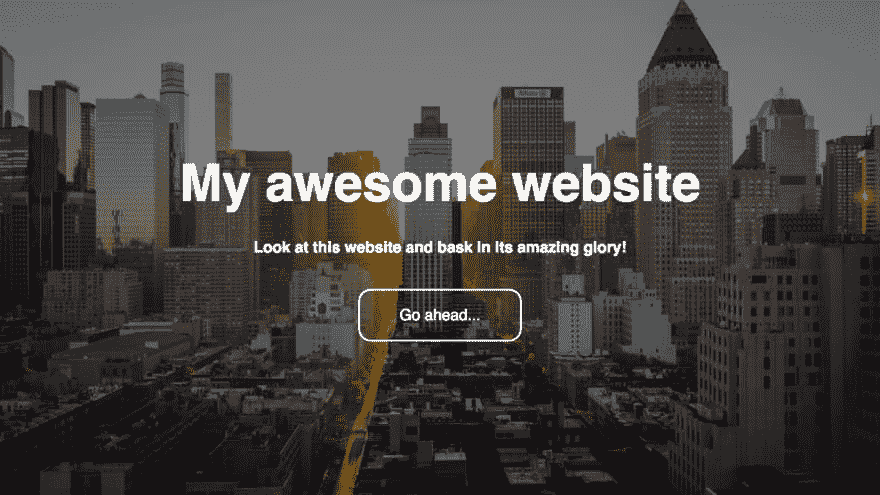](https://res.cloudinary.com/practicaldev/image/fetch/s--ZWHcvUtp--/c_limit%2Cf_auto%2Cfl_progressive%2Cq_auto%2Cw_880/https://codetheweb.blog/assets/img/posts/full-image-hero/darkened-background.png)

耶！文字终于可读了！

不过还有一点——为了帮助我们的按钮在背景图像中突出，让我们给它一个自己的`background-color`!

```
.hero .btn {
    /* Positioning and sizing */
    display: block;
    width: 200px;

    /* Padding and margins */
    padding: 1em;
    margin-top: 50px;
    margin-left: auto;
    margin-right: auto;

    /* Text styles */
    color: white;
    text-decoration: none;
    font-size: 1.5em;

    /* Border styles */
    border: 3px solid white;
    border-radius: 20px;

    /* Background styles */
    background-color: rgba(147, 112, 219, 0.8);
} 
```

<svg width="20px" height="20px" viewBox="0 0 24 24" class="highlight-action crayons-icon highlight-action--fullscreen-on"><title>Enter fullscreen mode</title></svg> <svg width="20px" height="20px" viewBox="0 0 24 24" class="highlight-action crayons-icon highlight-action--fullscreen-off"><title>Exit fullscreen mode</title></svg>

结果: [](https://res.cloudinary.com/practicaldev/image/fetch/s--TvhGdcKX--/c_limit%2Cf_auto%2Cfl_progressive%2Cq_66%2Cw_880/https://codetheweb.blog/assets/img/posts/full-image-hero/final-product.gif)

## 结论

太棒了，你成功了！现在你的网站应该看起来就像演示版一样了——恭喜😀-希望这不是太令人困惑的*😜*

一如既往，如果你需要任何帮助或有任何反馈，请在下面的评论中说出来，我会回复你的！

如果你觉得这篇文章很有帮助，我真的很希望你能分享它或者[注册时事通讯](https://codetheweb.blog/newsletter)来接收你收件箱里的新帖子。如果你做到了这两件事中的一件或两件，你就真的很棒，应该得到一个墨西哥玉米卷🌮 🌮 🚀

好吧！玩得开心，继续写代码，下次见，我会谈到如何使用 HTML & CSS 制作导航栏并设计其样式。到时候见！

> ### 想要更多这样的帖子？[注册我的简讯](https://codetheweb.blog/newsletter/)。
> 
> 我一直在努力学习这些教程，但是到目前为止还没有赚到任何钱，所以如果你注册的话，我会非常感激；)

这篇文章最初发表在 [Code The Web](https://codetheweb.blog) 上，这是一个有趣且易于理解的博客，帮助你学习 Web 开发🚀
学:[HTML](https://codetheweb.blog/learn/html/)|[CSS](https://codetheweb.blog/learn/css/)|[JavaScript](https://codetheweb.blog/learn/javascript/)