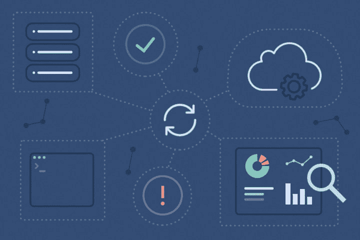

# 为什么在构建可靠的系统时一致性很重要

> 原文：<https://dev.to/nylas/why-consistency-matters-when-building-reliable-systems-a4a>

[T2】](https://www.nylas.com/blog/why-consistency-matters-when-building-reliable-systems)

我们最近面临了一次严重的面向用户的停机:我们推出了一个糟糕的补丁，导致用户收件箱中几十万个文件夹被删除和重新创建。作为 Nylas 的客户，你可能已经看到许多文件夹被删除然后重新创建。

正如我们在每次停机后所做的那样，我们进行了内部事后分析，以了解哪里出了问题，并防止类似问题在未来发生。这一次，我们决定公开分享这个事后分析，因为我们认为这个 bug 很有趣！

## 什么原因造成的？

在深入探讨这个问题之前，了解一下 [Nylas 同步引擎](https://github.com/nylas/sync-engine)的工作原理是很有帮助的。同步引擎是我们基础设施的核心，负责[与我们客户的平台同步数十亿封电子邮件](https://www.nylas.com/blog/billions-of-emails-synced-with-python)、日历数据和联系人，这些平台通常是客户关系管理平台(CRM)、申请人跟踪系统等。

在最终用户的收件箱和我们客户的平台之间保持电子邮件数据的双向同步是一个非常有趣的挑战，因为像 IMAP 和 Exchange 这样的协议并不是真正为双向同步而构建的(事实上，它们早在大多数人知道 CRM 是什么之前就已经构建好了)。

例如，当您重命名 IMAP 文件夹时，您不仅仅是重写文件夹名称。相反，你的电子邮件应用程序必须重新下载该文件夹中的所有电子邮件，并将其与之前同步的电子邮件进行协调。这意味着我们不能立即删除 IMAP 文件夹。相反，我们将它们标记为已删除，然后继续前进。稍后，我们将通过查看其中的消息来检测删除是否实际上是重命名。没有重命名的文件夹会被一个单独的进程进行垃圾收集，以确保我们不会永远保存它们。

这个垃圾收集过程是事件的源头。让我们深入到导致问题的源代码部分(如果你好奇，你可以在这里找到完整的源代码)。

在这里和下面，`Categories`是我们用来跟踪 IMAP 文件夹的模型。

```
def gc_deleted_categories(self):
    # Delete categories which have been deleted on the backend.
    # Go through all the categories and check if there are messages
    # associated with it. If not, delete it.
    with session_scope(self.namespace_id) as db_session:
        categories = db_session.query(Category).filter(
            Category.namespace_id == self.namespace_id,
            Category.deleted_at > EPOCH)

        for category in categories:
            # Check if no message is associated with the category. If yes,
            # delete it.
            count = db_session.query(func.count(MessageCategory.id)).filter(
                MessageCategory.category_id == category.id).scalar()

            if count == 0:
                db_session.delete(category)
                db_session.commit() 
```

Enter fullscreen mode Exit fullscreen mode

很简单，对吧？获取所有已删除的类别，然后检查它们是否有关联的实际消息。如果没有，删除它们。

唯一奇怪的是我们正在进行的数据库查询:

```
categories = db_session.query(Category).filter(
                Category.namespace_id == self.namespace_id,
                Category.deleted_at > EPOCH) 
```

Enter fullscreen mode Exit fullscreen mode

等等，为什么我们要过滤比 epoch 更新的消息？我们来看看品类模型就搞清楚了！下面是代码的样子:

```
class Category(MailSyncBase, HasRevisions, HasPublicID, UpdatedAtMixin,
               DeletedAtMixin):
    # Need `use_alter` here to avoid circular dependencies
    namespace_id = Column(ForeignKey('namespace.id', use_alter=True,
                                     name='category_fk1',
                                     ondelete='CASCADE'), nullable=False)
    namespace = relationship('Namespace', load_on_pending=True)
    name = Column(String(MAX_INDEXABLE_LENGTH), nullable=False, default='')
    display_name = Column(CategoryNameString(), nullable=False)

    type_ = Column(Enum('folder', 'label'), nullable=False, default='folder')

    # Override the default `deleted_at` column with one that is NOT NULL --
    # Category.deleted_at is needed in a UniqueConstraint.
    # Set the default Category.deleted_at = EPOCH instead.
    deleted_at = Column(DateTime, index=True, nullable=False,
                        default='1970-01-01 00:00:00')

    __table_args__ = (UniqueConstraint('namespace_id', 'name', 'display_name',
                                       'deleted_at'),
                      UniqueConstraint('namespace_id', 'public_id')) 
```

Enter fullscreen mode Exit fullscreen mode

这也是一个非常标准的模型。它定义了一堆字段并设置了一个`UniqueConstraint`来确保我们没有存储重复的文件夹。但是有一个问题——由于 [12 年前的 MySQL 错误](https://bugs.mysql.com/bug.php?id=8173),我们必须设置`deleted_at = epoch`,以便将文件夹标记为未删除。

快进到两周前:我们注意到一种罕见的情况，我们会在检测到重命名之前删除一个文件夹。为了解决这个问题，我们决定在删除文件夹之前增加 6 个小时的延迟。为此，我们将之前无关紧要的查询改为:

```
categories = db_session.query(Category).filter(
            Category.namespace_id == self.namespace_id,
            Category.deleted_at > EPOCH) 
```

Enter fullscreen mode Exit fullscreen mode

对此:

```
current_time = datetime.datetime.utcnow()

with session_scope(self.namespace_id) as db_session:
    categories = db_session.query(Category).filter(
        Category.namespace_id == self.namespace_id,
        Category.deleted_at <= current_time - CATEGORY_TTL) 
```

Enter fullscreen mode Exit fullscreen mode

如果`Category.deleted_at`有一个默认值`None`，这个代码将是完全正常的。然而，在我们的情况下，它有一个默认值`EPOCH`来解决这个 MySQL 错误——导致我们在 45 分钟内删除了高达 300k(空)的文件夹，这让我们注意到了这个问题并回滚了这个补丁。

## 时间轴

(所有时间均采用太平洋标准时间)

*   13:15 我们开始推出这个补丁，作为我们日常代码推向生产的一部分。
*   13:25 oncall 工程师收到传呼，因为大量账户失败。他们立即创建了一个状态页面事件，并开始调查这个问题。
*   13:35 在升级问题后，几名工程师开始研究我们的日志，以找出发生了什么。
*   13:45 我们决定回滚作为预防措施

下午晚些时候，我们仔细研究了发货的补丁，找到了问题的真正原因。

## 我们正在采取什么措施来防止这种情况再次发生？

这是一个有趣的错误，因为它强调了复杂系统中一致性的重要性:如果对象没有被软删除，我们所有的模型都遵循这样的约定，其中`deleted_at`是`NULL`。编写代码的人和审查代码的人都认为代码是无害的。没有明显的罪魁祸首；只是意外的互动。

为了确保这种情况不再发生，我们开始做两件事:
1)审计我们的代码库，找出不符合我们内部惯例的部分，并修复它们。2)所有 API 对象的稳定标识符。这将让我们从头开始重新同步帐户，而不会对客户产生任何影响。

请继续关注这方面的更多细节！

[T2】](https://res.cloudinary.com/practicaldev/image/fetch/s--qiHoNOTw--/c_limit%2Cf_auto%2Cfl_progressive%2Cq_66%2Cw_880/https://track.hubspot.com/__ptq.gif%3Fa%3D3314308%26k%3D14%26r%3Dhttps%253A%252F%252Fwww.nylas.com%252Fblog%252Fwhy-consistency-matters-when-building-reliable-systems%26bu%3Dhttps%25253A%25252F%25252Fwww.nylas.com%25252Fblog%26bvt%3Drss)

这篇文章最初发表在 Nylas 工程博客上。