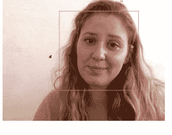
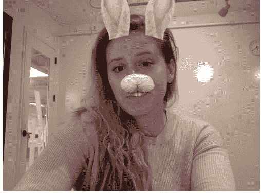
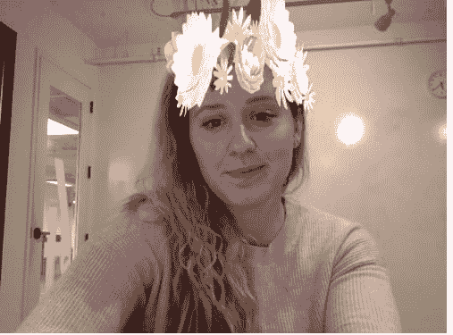
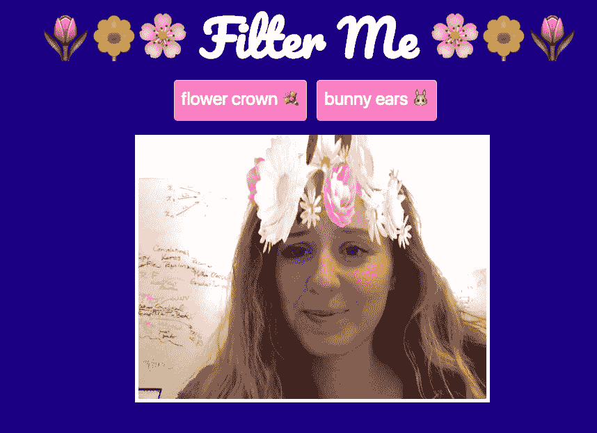
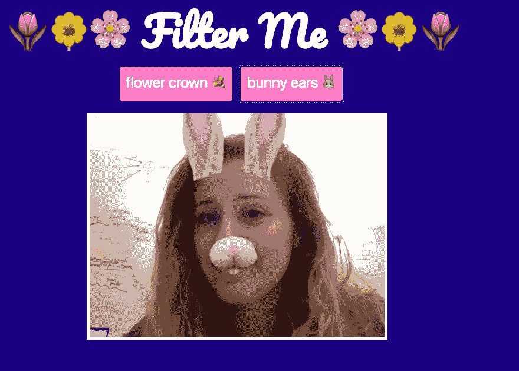

# 使用 Tracking.js 在 JavaScript 中进行面部检测

> 原文:[https://dev . to/aspittel/face-recognition-in-JavaScript-using-tracking js-3l 7](https://dev.to/aspittel/facial-recognition-in-javascript-using-trackingjs-3l7)

本周早些时候，我看到了一篇非常酷的文章，关于如何用 Python 创建类似 Snapchat 的过滤器。我很好奇前端是否存在类似的开源技术。我找到了一些资源:

*   [Tracking.js](https://trackingjs.com/)
*   [clmtrackr](https://github.com/auduno/clmtrackr)
*   [ccv](https://github.com/liuliu/ccv)
*   [head tracker](https://github.com/auduno/headtrackr)

我真的很兴奋，这种数据科学技术存在于前端，而不仅仅是在更传统的数据科学语言中，如 Python 或 r。

我认为上述所有项目都非常有趣，它们在 GitHub 上都有相对相似的星级。我决定使用 Tracking.js，因为它的文档非常好，而且有很多例子，对我来说这是最简单的学习方法！我真的希望有更好的文档来说明这个库的幕后工作——我不确定统计数据是怎么回事，也不知道这个工具在实现之后是如何工作的。

也就是说，它很容易实现。我可以很容易地扩展[面部摄像头的例子](https://github.com/auduno/headtrackr)用于我最终构建的应用程序！

## 学习过程

由于 Tracking.js 是一个较小的库，其背后的社区比我通常使用的要少，所以我的学习仅限于查看他们网站上的示例。我确实搜索了 Codepen，但上面的几支笔似乎不完整，或者与示例非常相似。

## 最终项目

警告:在这个项目中，我绝对学到了网络摄像头自拍是超级尴尬的！我不知道我高中的时候怎么会有一张脸书的网络自拍照！

我首先在 tracking.js 网站上复制了[面部相机示例](https://github.com/auduno/headtrackr)。我最终让它在本地工作，做了一些调整，并在本地下载了跟踪库。

[T2】](https://res.cloudinary.com/practicaldev/image/fetch/s--t3Cf2uF5--/c_limit%2Cf_auto%2Cfl_progressive%2Cq_auto%2Cw_880/https://thepracticaldev.s3.amazonaws.com/i/a72o42eg3iok91f0rncv.png)

然后，我在网上找了几个 PNG 的图层作为滤镜。我只是用谷歌图片搜索，然后复制到本地。然后，我实现了一个简单的算法来将过滤器添加到面部——我只是根据用户面部的位置对尺寸进行了硬编码。结果是这样的:

[](https://res.cloudinary.com/practicaldev/image/fetch/s--nEgkoJhE--/c_limit%2Cf_auto%2Cfl_progressive%2Cq_auto%2Cw_880/https://thepracticaldev.s3.amazonaws.com/i/lquvj2ouzrtxjuiu64ps.png)
[T6】](https://res.cloudinary.com/practicaldev/image/fetch/s--aQI7AIEv--/c_limit%2Cf_auto%2Cfl_progressive%2Cq_auto%2Cw_880/https://thepracticaldev.s3.amazonaws.com/i/cc1k91nw1csmyqpmnpg4.png)

我也试着实现 Snapchat 的狗脸，但是对于像这个项目这样快速的东西来说，这个数学结果对于人的脸来说太具体了！

然后，我对数学进行了概括，并为用户添加了在过滤器之间切换的功能。数学相对简单——当人在屏幕上移动时触发的事件监听器返回视图中人脸的坐标数组。然后，我将使用改进后的坐标在顶部绘制过滤器。关键代码是这样的:

```
 context.drawImage(img, rect.x + (filterX * rect.width),
      rect.y + (filterY * rect.height),
      rect.width * filterWidth,
      rect.height * filterHeight
    ) 
```

<svg width="20px" height="20px" viewBox="0 0 24 24" class="highlight-action crayons-icon highlight-action--fullscreen-on"><title>Enter fullscreen mode</title></svg> <svg width="20px" height="20px" viewBox="0 0 24 24" class="highlight-action crayons-icon highlight-action--fullscreen-off"><title>Exit fullscreen mode</title></svg>

之后我把 CSS 打磨了一下，真的很辛苦！最终的工作方式是在一个视频元素上覆盖一层 HTML 画布，所以让网格系统对齐所有内容确实很棘手。我最后第一次插入 CSS Grid 来看看这是否可行。它最终成功了，但是我做的方式感觉很粗糙。以后还得继续看 CSS 网格！

这个应用程序最终看起来是这样的:
[](https://res.cloudinary.com/practicaldev/image/fetch/s--mf8T-1sP--/c_limit%2Cf_auto%2Cfl_progressive%2Cq_auto%2Cw_880/https://thepracticaldev.s3.amazonaws.com/i/fasbgn8vuw8r3naypvvo.png) 
[](https://res.cloudinary.com/practicaldev/image/fetch/s--bJDFZo5C--/c_limit%2Cf_auto%2Cfl_progressive%2Cq_auto%2Cw_880/https://thepracticaldev.s3.amazonaws.com/i/cg3v790nwbjf0ekzofcq.png)

我的最终输出看起来还可以，它绝不是完美的，但为了让它变得更好，我可能需要创建自己的库或自己的过滤器。我也真的很难让更复杂的过滤器工作。我不得不把它们分解成各个部分——比如每只耳朵和鼻子——然后算出数学公式，把它们加到每张脸上。如果我想单独跟踪眼睛或嘴巴，而不是整个面部，我似乎很难将不同的面部特征连接在一起。

如果我想在这个项目中投入更多，我可能还会尝试添加一些平滑，以便当一个人移动一点点时，滤波器跳跃得更少。总的来说，这个项目本可以做得更好，但是我完成了我想做的来学习这个库。

## 下一步

Tracking.js 真的很酷，有据可查！我认为它是一个很棒的库，可以做一些简单的事情，比如这个应用程序。如果我是为了一份工作或更大的事情而这样做，我可能必须改进应用程序中的许多功能。我还发现网络摄像头 API 非常难以使用——我努力在网上寻找造型和拍照的例子。我也想在将来更深入地研究它。总的来说，我玩得很开心！它并不完美，但它是一个很好的快速项目。

[代码](https://github.com/aspittel/tracking/)
[App](https://aspittel.github.io/tracking/)

**我的一部分[关于学习新事物](https://medium.com/on-learning-new-things/learning-new-things-f4db7f16724)系列**