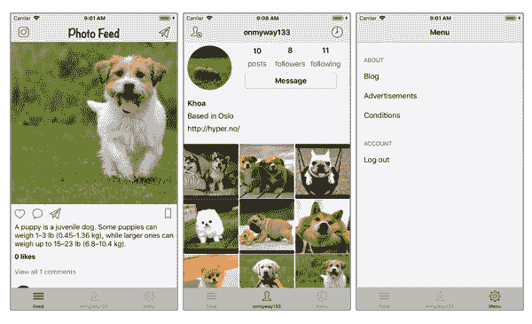
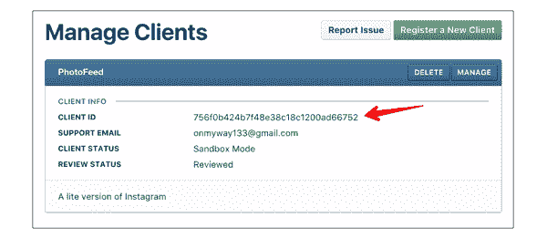
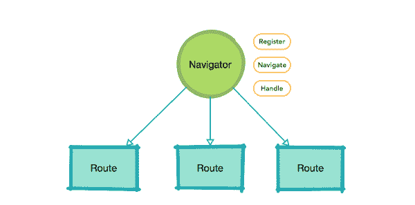
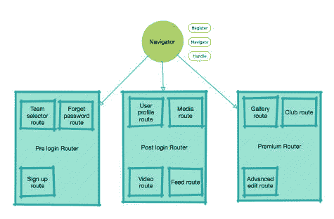
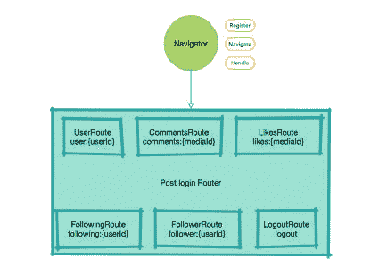
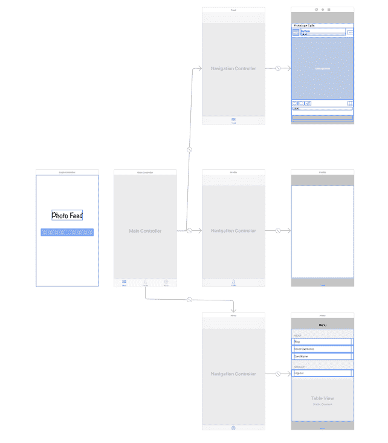

# 使用指南针的 URL 路由

> 原文:[https://dev.to/onmyway133/url-routing-with-compass-24j](https://dev.to/onmyway133/url-routing-with-compass-24j)

原帖[https://github.com/onmyway133/blog/issues/110](https://github.com/onmyway133/blog/issues/110)

应用程序通常有许多屏幕，而`UIViewController`作为一个屏幕的基础，与演示和导航 API 一起工作得很好。一切都很好，直到你迷失在流的森林中，代码变得难以维护。

避免这种情况的一种方法是`central URL routing`方法。可以把它想象成一个处理和解析所有路由请求的网络路由器。通过这种方式，代码变成了声明性的和解耦的，因此列表组件不需要知道它正在呈现什么。URL 路由还使日志记录和跟踪变得容易，同时也使处理外部请求(如深度链接)变得容易。

有各种执行 URL 路由的框架。在本教程中，为了简单起见，你将使用[指南针](https://github.com/hyperoslo/Compass)。您将重构一个现有的应用程序，这是一个名为`PhotoFeed`的简化 Instagram 应用程序。当你完成本教程，你会知道如何声明和使用路由器与指南针和处理深度链接。

# 入门

下载[启动项目](https://github.com/onmyway133/PhotoFeed/tree/start)并解压。转到`PhotoFeed`文件夹并运行`pod install`来安装这个项目的特定依赖项。打开`PhotoFeed.xcworkspace`并运行项目。点击`Login`进入 Instagram 登录页面，输入您的 Instagram 凭据，然后浏览应用程序。

[T2】](https://res.cloudinary.com/practicaldev/image/fetch/s--m6STkjQS--/c_limit%2Cf_auto%2Cfl_progressive%2Cq_auto%2Cw_880/https://user-images.githubusercontent.com/2284279/33277373-a808bf8a-d398-11e7-9b27-9ddc4549ffdc.png)

主应用程序由一个`UITabBarController`组成，显示提要、当前登录的用户资料和一个菜单。这是一个典型的`Model View Controller`项目，其中`UIViewController`处理`Cell`代表并负责导航。为了简单起见，所有视图控制器都继承了知道如何管理特定模型和单元格列表的`TableController`和`CollectionController`。所有型号都符合新的 Swift 4 `Codable`协议。

## 在 Instagram 上注册应用程序

为了使用 Instagram API，你需要在 [Instagram 开发者](https://www.instagram.com/developer/)注册你的应用。获得您的*客户 id* 后，切换回项目。转到`APIClient.swift`并修改您的`clientId`。

[T2】](https://res.cloudinary.com/practicaldev/image/fetch/s--HBjhorhU--/c_limit%2Cf_auto%2Cfl_progressive%2Cq_auto%2Cw_880/https://user-images.githubusercontent.com/2284279/33277396-b40a3bec-d398-11e7-9f1d-3033870e0738.png)

**注意**:项目自带一个默认的 app，权限有限。该应用程序无法访问关注者或追随者 API，您只能看到自己的帖子和评论

# 指南针 101

Compass 的概念非常简单:您有一组路线和处理这些路线的中心位置。把路线想象成应用程序中特定屏幕的导航请求。URL 路由背后的思想是从现代 web 服务器借鉴来的。当用户在浏览器中输入一个 URL，比如`https://www.raywenderlich.com/category/ios`，这个请求就会从浏览器发送到 web 服务器。服务器解析 URL 并返回请求的内容，比如 HTML 或 JSON。大多数 web 服务器框架都有 URL 路由支持，包括[ASP.NET](https://expressjs.com/en/guide/routing.html)、 [Express.js](https://expressjs.com/en/guide/routing.html) 等等。例如，下面是如何在 express.js 中处理 URL 路由:

```
app.get('/api/category/:categoryTag', function (req, res) {
  const page = getCategoryPageFor(req.params.categoryTag)
  res.send(page)
}) 
```

<svg width="20px" height="20px" viewBox="0 0 24 24" class="highlight-action crayons-icon highlight-action--fullscreen-on"><title>Enter fullscreen mode</title></svg> <svg width="20px" height="20px" viewBox="0 0 24 24" class="highlight-action crayons-icon highlight-action--fullscreen-off"><title>Exit fullscreen mode</title></svg>

用户或应用程序请求一个特定的 URL，该 URL 表达了应该返回或显示什么的意图。但是 Compass 不是返回网页，而是根据`UIViewController`构建屏幕并呈现它们。

## 路线模式

这就是如何在 Compass 中声明路由模式:

```
Navigator.routes = ["profile:{userId}", "post:{postId}", "logout"] 
```

<svg width="20px" height="20px" viewBox="0 0 24 24" class="highlight-action crayons-icon highlight-action--fullscreen-on"><title>Enter fullscreen mode</title></svg> <svg width="20px" height="20px" viewBox="0 0 24 24" class="highlight-action crayons-icon highlight-action--fullscreen-off"><title>Exit fullscreen mode</title></svg>

这只是你在`Navigator`上注册的模式数组。这是您定义所有路线的中心位置。因为它们在一个地方，你所有的导航都保存在一个地方，很容易被理解。看上面的例子，`{userId}, {postId}`是占位符，将被解析为实际参数。比如用`post:BYOkwgXnwr3`，你得到`BYOkwgXnwr3`的`userId`。Compass 还执行模式匹配，因为`post:BYOkwgXnwr3`匹配`post:{postId}`，而不是`comment:{postId}`、`blogpost:{postId}`，...这将在下面的章节中变得有意义。

## 导航员

`Navigator`是路线注册、导航和处理的中心。

[T2】](https://res.cloudinary.com/practicaldev/image/fetch/s--8M8MydXe--/c_limit%2Cf_auto%2Cfl_progressive%2Cq_auto%2Cw_880/https://user-images.githubusercontent.com/2284279/33277861-1855fa40-d39a-11e7-8449-0d10608d2501.png)

下一步是触发路由请求。你可以通过`Navigator`来完成。例如，这就是你如何在 feed 中请求打开一个特定的帖子:

```
Navigator.navigate(urn: "post:BYOkwgXnwr3") 
```

<svg width="20px" height="20px" viewBox="0 0 24 24" class="highlight-action crayons-icon highlight-action--fullscreen-on"><title>Enter fullscreen mode</title></svg> <svg width="20px" height="20px" viewBox="0 0 24 24" class="highlight-action crayons-icon highlight-action--fullscreen-off"><title>Exit fullscreen mode</title></svg>

Compass 使用用户友好的`urn`，即[统一资源名称](https://no.wikipedia.org/wiki/Uniform_Resource_Name)的缩写，使其与[深度链接](https://en.wikipedia.org/wiki/Mobile_deep_linking)无缝协作。这个`urn`匹配路由模式`post:{postId}`。Compass 使用`{param}`作为特殊标记来标识参数，使用`:`作为分隔符。您可以通过配置`Navigator.delimiter`将分隔符更改为其他名称。您已经学习了如何在 Compass 中注册路线和导航。接下来，您将学习如何根据您的需要定制处理代码。

## 位置

`Navigator`解析并与`Location`一起工作。给定`post:BYOkwgXnwr3`的`URN`，您将得到一个`Location`，其中`path`是路由模式，`arguments`包含已解析的参数。

```
path = "post:{postId}"
arguments = [
  "postId": "BYOkwgXnwr3"
] 
```

<svg width="20px" height="20px" viewBox="0 0 24 24" class="highlight-action crayons-icon highlight-action--fullscreen-on"><title>Enter fullscreen mode</title></svg> <svg width="20px" height="20px" viewBox="0 0 24 24" class="highlight-action crayons-icon highlight-action--fullscreen-off"><title>Exit fullscreen mode</title></svg>

为了实际执行导航，您需要分配一个闭包，它将一个`Location`赋值给`Navigator.handle`。

```
Navigator.handle = { [weak self] location in
  guard let `self` = self else {
    return
  }

  let arguments = location.arguments

  switch location.path {
    case "post:{postId}":
      let postController = PostController(postId: postID)
      self.rootController.pushViewController(postController, animated: true)
    default: 
      break
  }
} 
```

<svg width="20px" height="20px" viewBox="0 0 24 24" class="highlight-action crayons-icon highlight-action--fullscreen-on"><title>Enter fullscreen mode</title></svg> <svg width="20px" height="20px" viewBox="0 0 24 24" class="highlight-action crayons-icon highlight-action--fullscreen-off"><title>Exit fullscreen mode</title></svg>

这个`let` self `= self`舞蹈是为了确保在这个闭包执行的时候`self`不会被释放。如果它被释放，它将要执行的路由很可能是无效的，而您返回时没有做任何事情。您通常应该在拥有根控制器的组件中执行上述操作，比如上面看到的`AppDelegate`。这是指南针的基础。敏锐的读者可能已经注意到，它没有伸缩性，因为`switch`语句的数量会随着应用中路线和端点数量的增加而增加。这就是`Routable`协议的用武之地。任何符合`Routable`的东西都知道如何处理特定的路线。应用程序可能有许多模块化的部分，每个部分可能有一组路线。Compass 通过使用一个名为`Router`的组合`Routable`来处理这些场景。您可以为预登录模块、后登录模块、高级功能模块等设置路由器。

[T2】](https://res.cloudinary.com/practicaldev/image/fetch/s--9xXCutXg--/c_limit%2Cf_auto%2Cfl_progressive%2Cq_auto%2Cw_880/https://user-images.githubusercontent.com/2284279/33277894-2eff78de-d39a-11e7-8554-bf064b621921.png)

在下一节中，您将更改 PhotoFeed 以使用`Router`和`Routable`。

# 路由器来救援

第一步是将 Compass 包含在您的项目中。使用`CocoaPods`，这是一个简单的任务。编辑带有项目的`Podfile`,并在`end`语句前键入`pod 'Compass', '~> 5.0'`。然后打开终端并执行以下命令:

```
pod install 
```

<svg width="20px" height="20px" viewBox="0 0 24 24" class="highlight-action crayons-icon highlight-action--fullscreen-on"><title>Enter fullscreen mode</title></svg> <svg width="20px" height="20px" viewBox="0 0 24 24" class="highlight-action crayons-icon highlight-action--fullscreen-off"><title>Exit fullscreen mode</title></svg>

本教程使用的指南针版本是`5.1.0`。

## 注册路由器

[T2】](https://res.cloudinary.com/practicaldev/image/fetch/s--MxG7-LoV--/c_limit%2Cf_auto%2Cfl_progressive%2Cq_auto%2Cw_880/https://user-images.githubusercontent.com/2284279/33277916-3da628f6-d39a-11e7-9652-b45ea4a935fd.png)

首先，您将创建一个简单的路由器来处理所有登录后的路由。打开 *AppDelegate.swift* ，导入文件顶部的指南针:

```
import Compass 
```

<svg width="20px" height="20px" viewBox="0 0 24 24" class="highlight-action crayons-icon highlight-action--fullscreen-on"><title>Enter fullscreen mode</title></svg> <svg width="20px" height="20px" viewBox="0 0 24 24" class="highlight-action crayons-icon highlight-action--fullscreen-off"><title>Exit fullscreen mode</title></svg>

接下来，在`var mainController: MainController?`声明下添加以下路由器声明:

```
var postLoginRouter = Router() 
```

<svg width="20px" height="20px" viewBox="0 0 24 24" class="highlight-action crayons-icon highlight-action--fullscreen-on"><title>Enter fullscreen mode</title></svg> <svg width="20px" height="20px" viewBox="0 0 24 24" class="highlight-action crayons-icon highlight-action--fullscreen-off"><title>Exit fullscreen mode</title></svg>

然后声明一个名为`setupRouting`的函数，您将在一个扩展中这样做，以将路由设置与`AppDelegate`中的主代码分开。

```
extension AppDelegate {
  func setupRouting() {
    // [1] Register scheme
    Navigator.scheme = "photofeed"

    // [2] Configure routes for Router
    postLoginRouter.routes = [:]

    // [3] Register routes you 'd like to support
    Navigator.routes = Array(postLoginRouter.routes.keys)

    // [4] Do the handling
    Navigator.handle = { [weak self] location in
      guard let selectedController = self?.mainController?.selectedViewController else {
        return
      }

      // [5] Choose the current visible controller
      let currentController = (selectedController as? UINavigationController)?.topViewController
        ?? selectedController

      // [6] Navigate
      self?.postLoginRouter.navigate(to: location, from: currentController)
    }
  }
} 
```

<svg width="20px" height="20px" viewBox="0 0 24 24" class="highlight-action crayons-icon highlight-action--fullscreen-on"><title>Enter fullscreen mode</title></svg> <svg width="20px" height="20px" viewBox="0 0 24 24" class="highlight-action crayons-icon highlight-action--fullscreen-off"><title>Exit fullscreen mode</title></svg>

下面是你在上述方法中所做的事情:

1.  宣布一个指南针工作的方案。这是您的应用程序 URL 方案。当您希望支持深度链接时，这一点会大放异彩。
2.  在你的应用程序中注册所有路线。`Router`接受路线和`Routable`符合者的映射。目前这是空的，但是您将在一会儿添加几条路线。
3.  一个`Navigator`可以管理多台路由器。在这种情况下，您只需注册一台路由器。
4.  这是你提供处理关闭的地方。`Navigator`用它来处理一个已解决的定位请求。
5.  一个模块化部分中的屏幕源自一个根或父视图控制器。为了显示路线中的某些内容，您应该尝试从选定的最可见的视图控制器推送或呈现它。在这个项目中，根是一个`UITabBarController`，所以您试图从当前选择的导航中获取顶层控制器。`current controller`的选择取决于模块和你的应用用例，所以 Compass 让你来决定。如果您使用侧面菜单抽屉，那么您可以只改变选定的视图控制器。
6.  最后，因为`Router`是一个复合`Routable`，所以您将`Location`分派给它。

[T2】](https://res.cloudinary.com/practicaldev/image/fetch/s--KWM-O9wj--/c_limit%2Cf_auto%2Cfl_progressive%2Cq_auto%2Cw_880/https://user-images.githubusercontent.com/2284279/33277961-531e6342-d39a-11e7-9199-158a469a3709.png)

最后，您需要调用这个新添加的函数。在`window?.makeKeyAndVisible()`的正上方添加以下一行:

```
setupRouting() 
```

<svg width="20px" height="20px" viewBox="0 0 24 24" class="highlight-action crayons-icon highlight-action--fullscreen-on"><title>Enter fullscreen mode</title></svg> <svg width="20px" height="20px" viewBox="0 0 24 24" class="highlight-action crayons-icon highlight-action--fullscreen-off"><title>Exit fullscreen mode</title></svg>

构建并运行。似乎还没什么效果！为了让事情发生，您需要添加所有的路由处理程序。您将在下一节中完成这项工作。

## 实现路线处理程序

首先，创建一个新文件并将其命名为`Routers.swift`。这是您声明所有路由处理程序的地方。在文件的开头，加上`import Compass`。Compass 声明了一个简单的协议——`Routable`——决定如何处理来自`Current Controller`的给定`Location`请求。如果一个请求不能被处理，它将抛出`RouteError`。它的实现是这样的:

```
public protocol Routable {
  func navigate(to location: Location, from currentController: CurrentController) throws
} 
```

<svg width="20px" height="20px" viewBox="0 0 24 24" class="highlight-action crayons-icon highlight-action--fullscreen-on"><title>Enter fullscreen mode</title></svg> <svg width="20px" height="20px" viewBox="0 0 24 24" class="highlight-action crayons-icon highlight-action--fullscreen-off"><title>Exit fullscreen mode</title></svg>

这是一个非常简单的协议。您创建的任何路由都只需要实现这一个方法。现在创建您的第一个处理程序来处理用户信息请求。

```
struct UserRoute: Routable {
  func navigate(to location: Location, from currentController: CurrentController) throws {
    // [1] Examine arguments
    guard let userId = location.arguments["userId"] else {
      return
    }

    // [2] Create the controller
    let controller = UIStoryboard(name: "Main", bundle: nil).instantiateViewController(withIdentifier: "UserController") as! UserController
    controller.userId = userId
    currentController.navigationController?.pushViewController(controller, animated: true)
  }
} 
```

<svg width="20px" height="20px" viewBox="0 0 24 24" class="highlight-action crayons-icon highlight-action--fullscreen-on"><title>Enter fullscreen mode</title></svg> <svg width="20px" height="20px" viewBox="0 0 24 24" class="highlight-action crayons-icon highlight-action--fullscreen-off"><title>Exit fullscreen mode</title></svg>

当你在 feed 上点击文章作者时，这个函数就会被调用。事情是这样的:

1.  `UserRoute`处理`user:{userId} urn`，所以`location.arguments["userId"]`应该包含正确的`userId`注入`UserController`。
2.  这个应用程序使用故事板来制作 UI，所以根据它的标识符获得正确的视图控制器。记住`currentController`是导航栈中当前可见的控制器。所以你要求它的`UINavigationController`推送一个新的视图控制器。

在这个路由器的正下方，当用户想要查看谁喜欢某个帖子时，在屏幕上再添加一个路由:

```
struct LikesRoute: Routable {
  func navigate(to location: Location, from currentController: CurrentController) throws {
    guard let mediaId = location.arguments["mediaId"] else {
      return
    }

    let controller = UIStoryboard(name: "Main", bundle: nil).instantiateViewController(withIdentifier: "LikesController") as! LikesController
    controller.mediaId = mediaId
    currentController.navigationController?.pushViewController(controller, animated: true)
  }
} 
```

<svg width="20px" height="20px" viewBox="0 0 24 24" class="highlight-action crayons-icon highlight-action--fullscreen-on"><title>Enter fullscreen mode</title></svg> <svg width="20px" height="20px" viewBox="0 0 24 24" class="highlight-action crayons-icon highlight-action--fullscreen-off"><title>Exit fullscreen mode</title></svg>

### 剩余路线

现在轮到您编写其他路由处理程序:`CommentsRoute, FollowingRoute, FollowerRoute`。看你能不能先搞清楚，你可以在下面找到解决办法。下面是你应该有的:

```
struct CommentsRoute: Routable {
  func navigate(to location: Location, from currentController: CurrentController) throws {
    guard let mediaId = location.arguments["mediaId"] else {
      return
    }

    let controller = UIStoryboard(name: "Main", bundle: nil).instantiateViewController(withIdentifier: "CommentsController") as! CommentsController
    controller.mediaId = mediaId
    currentController.navigationController?.pushViewController(controller, animated: true)
  }
}

struct FollowingRoute: Routable {
  func navigate(to location: Location, from currentController: CurrentController) throws {
    guard let userId = location.arguments["userId"] else {
      return
    }

    let controller = UIStoryboard(name: "Main", bundle: nil).instantiateViewController(withIdentifier: "FollowingController") as! FollowingController
    controller.userId = userId
    currentController.navigationController?.pushViewController(controller, animated: true)
  }
}

struct FollowerRoute: Routable {
  func navigate(to location: Location, from currentController: CurrentController) throws {
    guard let userId = location.arguments["userId"] else {
      return
    }

    let controller = UIStoryboard(name: "Main", bundle: nil).instantiateViewController(withIdentifier: "FollowerController") as! FollowerController
    controller.userId = userId
    currentController.navigationController?.pushViewController(controller, animated: true)
  }
} 
```

<svg width="20px" height="20px" viewBox="0 0 24 24" class="highlight-action crayons-icon highlight-action--fullscreen-on"><title>Enter fullscreen mode</title></svg> <svg width="20px" height="20px" viewBox="0 0 24 24" class="highlight-action crayons-icon highlight-action--fullscreen-off"><title>Exit fullscreen mode</title></svg>

### logout route

还有一个要添加的路由:您将用于注销的路由。非常棘手，因为它通常涉及到改变当前的根视图控制器。有谁比 app delegate 更了解这一点？打开 *AppDelegate.swift* ，在最底部添加以下代码:

```
struct LogoutRoute: Routable {
  func navigate(to location: Location, from currentController: CurrentController) throws {
    APIClient.shared.accessToken = nil
    (UIApplication.shared.delegate as! AppDelegate).showLogin()
  }
} 
```

<svg width="20px" height="20px" viewBox="0 0 24 24" class="highlight-action crayons-icon highlight-action--fullscreen-on"><title>Enter fullscreen mode</title></svg> <svg width="20px" height="20px" viewBox="0 0 24 24" class="highlight-action crayons-icon highlight-action--fullscreen-off"><title>Exit fullscreen mode</title></svg>

现在你已经实现了所有的路由处理器，你必须告诉`Navigator`哪个路由用于哪个 URN。还是在 *AppDelegate.swift* 里，找到`postLoginRouter.routes = [:]`，替换成下面的:

```
postLoginRouter.routes = [
  "user:{userId}": UserRoute(),
  "comments:{mediaId}": CommentsRoute(),
  "likes:{mediaId}": LikesRoute(),
  "following:{userId}": FollowingRoute(),
  "follower:{userId}": FollowerRoute(),
  "logout": LogoutRoute()
] 
```

<svg width="20px" height="20px" viewBox="0 0 24 24" class="highlight-action crayons-icon highlight-action--fullscreen-on"><title>Enter fullscreen mode</title></svg> <svg width="20px" height="20px" viewBox="0 0 24 24" class="highlight-action crayons-icon highlight-action--fullscreen-off"><title>Exit fullscreen mode</title></svg>

构建应用程序，一切都应该编译。现在剩下的就是实际上*所有*你写的所有代码！

## 重构时间

是时候重构`UIViewController`中的所有代码了，用新的路由指令替换所有导航代码。从把`FeedController`从不必要的导航任务中解放出来开始。打开 *FeedController.swift* 并将以下导入添加到文件顶部:

```
import Compass 
```

<svg width="20px" height="20px" viewBox="0 0 24 24" class="highlight-action crayons-icon highlight-action--fullscreen-on"><title>Enter fullscreen mode</title></svg> <svg width="20px" height="20px" viewBox="0 0 24 24" class="highlight-action crayons-icon highlight-action--fullscreen-off"><title>Exit fullscreen mode</title></svg>

接下来，查找`// MARK: - MediaCellDelegate`，用下面的代码替换三个`MediaCell`委托方法:

```
func mediaCell(_ cell: MediaCell, didViewLikes mediaId: String) {
  try? Navigator.navigate(urn: "likes:\(mediaId)")
}

func mediaCell(_ cell: MediaCell, didViewComments mediaId: String) {
  try? Navigator.navigate(urn: "comments:\(mediaId)")
}

func mediaCell(_ cell: MediaCell, didSelectUserName userId: String) {
  try? Navigator.navigate(urn: "user:\(userId)")
} 
```

<svg width="20px" height="20px" viewBox="0 0 24 24" class="highlight-action crayons-icon highlight-action--fullscreen-on"><title>Enter fullscreen mode</title></svg> <svg width="20px" height="20px" viewBox="0 0 24 24" class="highlight-action crayons-icon highlight-action--fullscreen-off"><title>Exit fullscreen mode</title></svg>

对于这三种情况，您只需导航到另一个屏幕。因此，你需要做的就是告诉`Navigator`你想去哪里。为了简单起见，您使用`try?`来处理任何抛出的代码。构建并运行应用程序。在订阅源中搜索您最喜欢的帖子，然后点击作者、帖子评论或喜欢转到目标屏幕。该应用程序的行为和以前一样，但代码现在是干净的和声明性的。现在用 *UserController.swift* 做同样的事情。将以下导入内容添加到文件顶部:

```
import Compass 
```

<svg width="20px" height="20px" viewBox="0 0 24 24" class="highlight-action crayons-icon highlight-action--fullscreen-on"><title>Enter fullscreen mode</title></svg> <svg width="20px" height="20px" viewBox="0 0 24 24" class="highlight-action crayons-icon highlight-action--fullscreen-off"><title>Exit fullscreen mode</title></svg>

将`// MARK: - UserViewDelegate`之后的代码替换为:

```
func userView(_ view: UserView, didViewFollower userId: String) {
  try? Navigator.navigate(urn: "follower:\(userId)")
}

func userView(_ view: UserView, didViewFollowing userId: String) {
  try? Navigator.navigate(urn: "following:\(userId)")
} 
```

<svg width="20px" height="20px" viewBox="0 0 24 24" class="highlight-action crayons-icon highlight-action--fullscreen-on"><title>Enter fullscreen mode</title></svg> <svg width="20px" height="20px" viewBox="0 0 24 24" class="highlight-action crayons-icon highlight-action--fullscreen-off"><title>Exit fullscreen mode</title></svg>

你现在的任务是重构最后一条路线`LogoutRoute`。打开 *MenuController.swift* 并在顶部添加以下内容:

```
import Compass 
```

<svg width="20px" height="20px" viewBox="0 0 24 24" class="highlight-action crayons-icon highlight-action--fullscreen-on"><title>Enter fullscreen mode</title></svg> <svg width="20px" height="20px" viewBox="0 0 24 24" class="highlight-action crayons-icon highlight-action--fullscreen-off"><title>Exit fullscreen mode</title></svg>

完全删除`logout`方法。找到以下内容:

` ` swift if index path . section = = section . account . raw value，index path . row = = 0 {
logout()
}

```
 ...and replace it with:

```swift
if indexPath.section == Section.account.rawValue, indexPath.row == 0 {
  try? Navigator.navigate(urn: "logout")
} 
```

<svg width="20px" height="20px" viewBox="0 0 24 24" class="highlight-action crayons-icon highlight-action--fullscreen-on"><title>Enter fullscreen mode</title></svg> <svg width="20px" height="20px" viewBox="0 0 24 24" class="highlight-action crayons-icon highlight-action--fullscreen-off"><title>Exit fullscreen mode</title></svg>

构建并运行应用程序，导航到菜单并点击*注销*。您应该会被带到登录屏幕。

# 处理深度链接

[深度链接](https://en.wikipedia.org/wiki/Mobile_deep_linking)允许您的应用程序通过预定义的 URN 打开。系统通过其 [URL 方案](https://developer.apple.com/library/content/documentation/iPhone/Conceptual/iPhoneOSProgrammingGuide/Inter-AppCommunication/Inter-AppCommunication.html)识别每个应用。对于网页，方案通常是`http`、`https`。对于 Instagram 来说，它是`instagram`。这方面的用例是应用程序间导航和应用程序广告。例如，Messenger 应用程序使用它来打开脸书应用程序中的用户资料，Twitter 使用它来打开应用程序商店，以安装广告中的另一个应用程序。为了将用户重定向回 PhotoFeed，您需要为您的应用程序指定一个自定义 URL 方案。还记得你在哪里声明`Navigator.scheme = "photofeed"`的吗？PhotoFeed 恰好符合这个 URL 方案，所以深层链接已经起作用了——而你甚至不知道！构建并运行应用程序，然后切换到 Safari。在地址栏中键入`photofeed://`，然后轻按“前往”。这将触发您的应用程序打开。该应用程序打开，但 PhotoFeed 不会解析 URL 中的任何参数来找到任何有用的地方。是时候改变了！您的应用程序通过实现一个`UIApplicationDelegate`方法来响应 URL 方案打开。在`AppDelegate.swift`中的`setupRouting`后增加以下内容:

```
func application(_ app: UIApplication, open url: URL, options: [UIApplicationOpenURLOptionsKey : Any] = [:]) -> Bool {
  try? Navigator.navigate(url: url)
  return true
} 
```

<svg width="20px" height="20px" viewBox="0 0 24 24" class="highlight-action crayons-icon highlight-action--fullscreen-on"><title>Enter fullscreen mode</title></svg> <svg width="20px" height="20px" viewBox="0 0 24 24" class="highlight-action crayons-icon highlight-action--fullscreen-off"><title>Exit fullscreen mode</title></svg>

为你分析和处理这个。构建并再次运行。前往 Safari 应用程序，输入`photofeed://user:self`并点击 Go。Photofeed 将打开并显示当前登录用户的个人资料。因为您已经有了`UserRoute`，请求的 URL 被优雅地处理了。当路由请求到来时，你的应用程序可能已经呈现了一个特定的屏幕，但你已经通过重置导航控制器或呈现堆栈来显示所请求的屏幕。这个简单的解决方案适用于大多数情况。同样，建议您选择最上面的可见视图控制器作为`Navigator.handle`中的当前控制器。

[T2】](https://res.cloudinary.com/practicaldev/image/fetch/s--_QDCQ0no--/c_limit%2Cf_auto%2Cfl_progressive%2Cq_auto%2Cw_880/https://user-images.githubusercontent.com/2284279/33277990-709ae7c4-d39a-11e7-99b2-27acb7a1c5d0.png)

深度链接通常被认为是外部导航，因为路由请求来自应用程序外部。感谢您开发的中央路由系统，处理外部和内部路由请求的代码是非常相同的，根本不涉及代码重复。

# 带推送通知的路由

推送通知有助于吸引用户使用你的应用。你可能在*媒体*上收到过“嘿，看看今天最受欢迎的故事”这样的消息，在脸书上收到过“你的朋友今天过生日”这样的消息，...当你点击这些横幅时，你会被直接带到那个特定的屏幕。多酷啊。这可以通过你的 URL 路由方法来实现。想象一下，用户点击推送通知横幅，上面写着“你是 PhotoFeed 上的名人——现在查看你的个人资料！并被直接发送到他们的个人资料屏幕。要做到这一点，您只需将 URN 信息嵌入到推送负载中，并在您的应用程序中处理它。

## 设置

首先，您需要指定您的包 ID。转到`Target Settings\General`更改您的捆绑包 ID，因为推送通知需要唯一的捆绑包 ID 才能工作。您的项目默认使用`com.fantageek.PhotoFeed`。

[T2】](https://res.cloudinary.com/practicaldev/image/fetch/s--aiPITNYc--/c_limit%2Cf_auto%2Cfl_progressive%2Cq_auto%2Cw_880/https://user-images.githubusercontent.com/2284279/33278026-8e1fe01a-d39a-11e7-982f-854ab7056aca.png)

接下来，你需要注册你的*应用 ID* 。去[会员中心](https://developer.apple.com/account/ios/certificate)注册你的 App ID。记住你的*团队 ID* ，因为你在最后一步会用到它。同时勾选*应用服务*下的*推送通知*复选框。

[T2】](https://res.cloudinary.com/practicaldev/image/fetch/s--oL9T-GOL--/c_limit%2Cf_auto%2Cfl_progressive%2Cq_auto%2Cw_880/https://user-images.githubusercontent.com/2284279/33278038-94947866-d39a-11e7-9386-8fffcd5bf9cf.png)

现在你需要生成你的*认证密钥*。苹果提供[令牌认证](https://developer.apple.com/news/?id=09222016a)作为推送通知的新认证机制。该令牌易于生成，适用于您的所有应用程序，而且大多数情况下，它永不过期。还是在[会员中心](https://developer.apple.com/account/ios/authkey/)，新建一个*键*并下载为`.p8`文件。记住您的*密钥 ID* ，因为您将在最后一步中用到它。

[T2】](https://res.cloudinary.com/practicaldev/image/fetch/s--hanWR7Ex--/c_limit%2Cf_auto%2Cfl_progressive%2Cq_auto%2Cw_880/https://user-images.githubusercontent.com/2284279/33278050-9bb3ccc8-d39a-11e7-99b8-076138e5b559.png)

接下来:启用推送通知功能。回到 Xcode，转到`Target Settings\Capabilities`并启用*推送通知*，这会将`PhotoFeed.entitlements`添加到您的项目中。

[T2】](https://res.cloudinary.com/practicaldev/image/fetch/s--qHb0ARXu--/c_limit%2Cf_auto%2Cfl_progressive%2Cq_auto%2Cw_880/https://user-images.githubusercontent.com/2284279/33278054-a21dde8c-d39a-11e7-907b-b1ec620050b4.png)

下一步是注册推送通知。打开`MainController.swift`并将以下导入添加到 *MainController.swift* 的顶部:

```
import UserNotifications 
```

<svg width="20px" height="20px" viewBox="0 0 24 24" class="highlight-action crayons-icon highlight-action--fullscreen-on"><title>Enter fullscreen mode</title></svg> <svg width="20px" height="20px" viewBox="0 0 24 24" class="highlight-action crayons-icon highlight-action--fullscreen-off"><title>Exit fullscreen mode</title></svg>

您希望仅在登录后启用推送通知，所以`MainController`是最理想的地方。[用户通知](https://developer.apple.com/documentation/usernotifications)推荐 iOS 10 及以上版本的 app 使用。

```
override func viewDidLoad() {
  super.viewDidLoad()

  // [1] Register to get device token for remote notifications
  UIApplication.shared.registerForRemoteNotifications()

  // [2] Register to handle push notification UI
  let options: UNAuthorizationOptions = [.alert, .sound, .badge]
  UNUserNotificationCenter.current().requestAuthorization(options: options) { (granted, error) in
    print(error as Any)
  }
} 
```

<svg width="20px" height="20px" viewBox="0 0 24 24" class="highlight-action crayons-icon highlight-action--fullscreen-on"><title>Enter fullscreen mode</title></svg> <svg width="20px" height="20px" viewBox="0 0 24 24" class="highlight-action crayons-icon highlight-action--fullscreen-off"><title>Exit fullscreen mode</title></svg>

权限对话框只显示一次，所以请确保您接受它。是时候处理设备令牌了。打开`AppDelegate.swift`，在`extension AppDelegate`的末尾添加以下内容:

```
func application(_ application: UIApplication, didRegisterForRemoteNotificationsWithDeviceToken deviceToken: Data) {
  // [1] Parse to token string
  let token = deviceToken.map {
    return String(format: "%02.2hhx", $0)
  }.joined()

  // [2] Log it
  print("Your device token is \(token)")
} 
```

<svg width="20px" height="20px" viewBox="0 0 24 24" class="highlight-action crayons-icon highlight-action--fullscreen-on"><title>Enter fullscreen mode</title></svg> <svg width="20px" height="20px" viewBox="0 0 24 24" class="highlight-action crayons-icon highlight-action--fullscreen-off"><title>Exit fullscreen mode</title></svg>

如果您的应用程序成功连接到 APNs，您可以在这里获得设备令牌。通常情况下，你会将这个设备令牌发送到后端，这样他们就可以组织，但在本教程中，我们只是记录它。该工具要求能够针对特定设备。

## 搬运有效载荷

打开`AppDelegate.swift`并在`extension AppDelegate`末尾添加以下内容:

```
func application(_ application: UIApplication, didReceiveRemoteNotification userInfo: [AnyHashable : Any], fetchCompletionHandler completionHandler: @escaping (UIBackgroundFetchResult) -> Void) {
  // [1] Always call the completion handler
  defer {
    completionHandler(.newData)
  }

  // [2] Convert into JSON dictionary
  guard let json = userInfo as? [String: Any] else {
    return
  }

  // [3] Parse to aps
  guard let aps = json["aps"] as? [String: Any] else {
    return
  }

  // [4] Parse to urn
  guard let urn = aps["urn"] as? String else {
    return
  }

  try? Navigator.navigate(urn: urn)
} 
```

<svg width="20px" height="20px" viewBox="0 0 24 24" class="highlight-action crayons-icon highlight-action--fullscreen-on"><title>Enter fullscreen mode</title></svg> <svg width="20px" height="20px" viewBox="0 0 24 24" class="highlight-action crayons-icon highlight-action--fullscreen-off"><title>Exit fullscreen mode</title></svg>

当您的应用程序收到推送通知负载并正在运行时，将调用此方法。上面的代码相对简单:它首先试图从有效载荷中解析出`urn`信息，然后告诉`Navigator`去做这项工作。在设备上构建并运行应用程序，因为推送通知在模拟器上不起作用。如果出现提示，请登录应用程序。一旦在主屏幕上，授予应用程序推送通知权限，以便接收警报。您应该会看到`device token`记录到您的 Xcode 控制台。

[T2】](https://res.cloudinary.com/practicaldev/image/fetch/s--oeUheN-6--/c_limit%2Cf_auto%2Cfl_progressive%2Cq_auto%2Cw_880/https://user-images.githubusercontent.com/2284279/33278064-abbe6592-d39a-11e7-81cd-b3affc3ee4b6.PNG)

## 测试推送通知

在本教程中，你将使用一个叫做[推送通知](https://github.com/onmyway133/PushNotifications)的工具来帮助你轻松地为你的应用程序创建推送通知。从这里的[下载工具`PushNotifications`。该工具将有效载荷直接发送到 APNs。](https://github.com/onmyway133/PushNotifications/releases)

[T2】](https://res.cloudinary.com/practicaldev/image/fetch/s--3jgHpsWo--/c_limit%2Cf_auto%2Cfl_progressive%2Cq_auto%2Cw_880/https://user-images.githubusercontent.com/2284279/33278070-b3094632-d39a-11e7-81f6-62f1ed04130b.png)

选择`iOS\Token`来使用`Token Authentication`，您可以通过从[证书、标识符&配置文件](https://developer.apple.com/account/ios/authkey/)中创建并下载您的`Key`来获得。浏览您之前下载的`.p8`认证密钥文件。输入`Team ID`，可以通过进入[会员详细信息](https://developer.apple.com/account/#/membership)查看，输入`Key ID`，这是从第一步开始与`Key`关联的 ID。输入`Bundle ID`和`device token`。将以下内容粘贴到。它是与 URN 相关联的传统有效负载。

```
{  "aps":{  "alert":"You become a celebrity on PhotoFeed, checkout your profile now",  "urn":  "user:self"  }  } 
```

<svg width="20px" height="20px" viewBox="0 0 24 24" class="highlight-action crayons-icon highlight-action--fullscreen-on"><title>Enter fullscreen mode</title></svg> <svg width="20px" height="20px" viewBox="0 0 24 24" class="highlight-action crayons-icon highlight-action--fullscreen-off"><title>Exit fullscreen mode</title></svg>

因为您正在使用 Xcode 进行调试，所以选择`Sandbox`作为环境。

[T2】](https://res.cloudinary.com/practicaldev/image/fetch/s--f9ggBcow--/c_limit%2Cf_auto%2Cfl_progressive%2Cq_auto%2Cw_880/https://user-images.githubusercontent.com/2284279/33278079-baef3ece-d39a-11e7-8818-56b54ed01a1d.PNG)

现在点击`Send`。如果你的应用在后台，会出现一个提醒。点击它将带你到你的应用程序，并显示你的用户资料。太棒了。您刚刚在推送通知中实现了深度链接，再次感谢 URL 路由。

# 阅读更多

这是[的最终项目](https://github.com/onmyway133/PhotoFeed/tree/finish)，包含本教程的所有代码。您现在已经理解了中央路由模式，掌握了 Compass，甚至重构了一个真实世界的应用程序。然而，没有适用于所有应用程序的灵丹妙药。你需要了解你的需求，并相应地调整。如果您想了解更多关于其他导航模式的信息，这里有一些建议:

*   [协调人](http://khanlou.com/2015/10/coordinators-redux/)
*   [流量控制器](http://albertodebortoli.com/blog/2014/09/03/flow-controllers-on-ios-for-a-better-navigation-control/)
*   [在 VIPER 中路由](https://www.objc.io/issues/13-architecture/viper/)

请记住，这不仅仅是关于代码，也是关于你的应用程序提供的用户体验。因此，请确保您遵守人机界面指南 iOS 中的指南[导航。](https://developer.apple.com/ios/human-interface-guidelines/interaction/navigation)