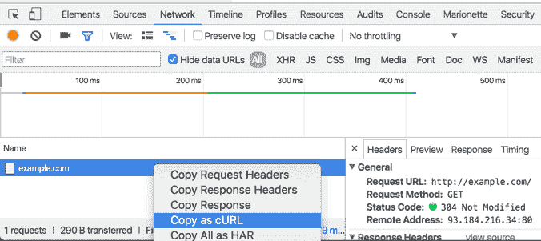

# curl 响应时间我如何使用 cURL 测量 Web APIs 的响应时间

> 原文：<https://dev.to/yuyatakeyama/how-i-measure-response-times-of-web-apis-using-curl-6nh>

## 为什么是`curl`？

有一堆专门的工具可以对 HTTP 请求进行基准测试。
`ab`，`JMeter`，`wrk`...
那为什么还要用`curl`来达到目的呢？

这是因为`curl`被广泛使用，它是 Web 开发者的一种通用语言。

此外，一些工具具有将 HTTP 请求作为`curl`命令进行检索的特性。

[T2】](https://res.cloudinary.com/practicaldev/image/fetch/s--lreKSNQS--/c_limit%2Cf_auto%2Cfl_progressive%2Cq_auto%2Cw_880/https://thepracticaldev.s3.amazonaws.com/i/3hprvahmrx5byekp2ggj.png)

这非常有用，因为它不仅复制 URL 和参数，还复制包括`Authorization`或`Cookie`在内的请求头。

## 工具

在本文中，我使用了这些工具:

*   [卷曲](https://curl.haxx.se/)
*   [curlb](https://gist.github.com/yuya-takeyama/d396e2acef8a0472353ff15d545f9fd0)
*   [n 次](https://github.com/yuya-takeyama/ntimes)
*   [百分位数](https://github.com/yuya-takeyama/percentile)

## 使用`curl`测量响应时间

首先，让我们准备一个`curl`命令。在这一次，我用谷歌浏览器控制了对我个人博客的请求。(`Cookie`被删除)

```
$ curl 'https://blog.yuyat.jp/' -H 'Accept-Encoding: gzip, deflate, sdch' -H 'Accept-Language: en-US,en;q=0.8,ja;q=0.6' -H 'Upgrade-Insecure-Requests: 1' -H 'User-Agent: Mozilla/5.0 (Macintosh; Intel Mac OS X 10_11_4) AppleWebKit/537.36 (KHTML, like Gecko) Chrome/50.0.2661.86 Safari/537.36' -H 'Connection: keep-alive' --compressed 
```

Enter fullscreen mode Exit fullscreen mode

它只是从服务器输出响应体。

让我们添加这些选项。

```
-s -o /dev/null -w  "%{time_starttransfer}\n" 
```

Enter fullscreen mode Exit fullscreen mode

`-s`是沉默进程，`-o`是将响应体处置给`/dev/null`。

而重要的是`-w`。
我们可以指定多种格式，这次我使用了`time_starttransfer`来检索响应时间(到达第一个字节的时间)。

显示如下:

```
$ curl 'https://blog.yuyat.jp/' -H 'Accept-Encoding: gzip, deflate, sdch' -H 'Accept-Language: en-US,en;q=0.8,ja;q=0.6' -H 'Upgrade-Insecure-Requests: 1' -H 'User-Agent: Mozilla/5.0 (Macintosh; Intel Mac OS X 10_11_4) AppleWebKit/537.36 (KHTML, like Gecko) Chrome/50.0.2661.86 Safari/537.36' -H 'Connection: keep-alive' --compressed -s -o /dev/null -w  "%{time_starttransfer}\n"
0.188947 
```

Enter fullscreen mode Exit fullscreen mode

响应时间为 0.188947 秒(188 毫秒)。

为了简化，我还创建了一个包装器命令`curlb` :

```
#!/bin/sh
curl -s -o /dev/null -w '%{time_starttransfer}\n' "$@" 
```

Enter fullscreen mode Exit fullscreen mode

## 测量响应时间的百分位数

仅仅从单个请求进行基准测试是不合适的。

然后让我们测量 100 个请求的百分比。

`ntimes`对这样的目的是有用的。

*   [https://github . com/yuya-takyama/ntimes](https://github.com/yuya-takeyama/ntimes)

您可以使用`go get github.com/yuya-takeyama/ntimes`进行安装，或者存储库中有预构建的二进制文件。

让我们在`curl`命令的开头添加`ntimes 100 --`。

```
$ ntimes 100 -- curlb 'https://blog.yuyat.jp/' -H 'Accept-Encoding: gzip, deflate, sdch' -H 'Accept-Language: en-US,en;q=0.8,ja;q=0.6' -H 'Upgrade-Insecure-Requests: 1' -H 'User-Agent: Mozilla/5.0 (Macintosh; Intel Mac OS X 10_11_4) AppleWebKit/537.36 (KHTML, like Gecko) Chrome/50.0.2661.86 Safari/537.36' -H 'Connection: keep-alive' --compressed
0.331915
0.064085
0.059883
0.074047
0.059774
... 
```

Enter fullscreen mode Exit fullscreen mode

而要测量数字的百分位数，名为`percentile`的命令可能是最简单的选择。

*   [https://github . com/yuya-takyama/percentile](https://github.com/yuya-takeyama/percentile)

通过`go get github.com/yuya-takeyama/percentile`安装或者从 repo 下载预建的二进制文件。

并将`| percentile`附加到命令的末尾。

```
$ ntimes 100 -- curlb 'https://blog.yuyat.jp/' -H 'Accept-Encoding: gzip, deflate, sdch' -H 'Accept-Language: en-US,en;q=0.8,ja;q=0.6' -H 'Upgrade-Insecure-Requests: 1' -H 'User-Agent: Mozilla/5.0 (Macintosh; Intel Mac OS X 10_11_4) AppleWebKit/537.36 (KHTML, like Gecko) Chrome/50.0.2661.86 Safari/537.36' -H 'Connection: keep-alive' --compressed | percentile
50%:    0.061777
66%:    0.06412
75%:    0.06872300000000001
80%:    0.07029000000000001
90%:    0.07496700000000001
95%:    0.076153
98%:    0.077226
99%:    0.07957
100%:   0.109931 
```

Enter fullscreen mode Exit fullscreen mode

就是这样！