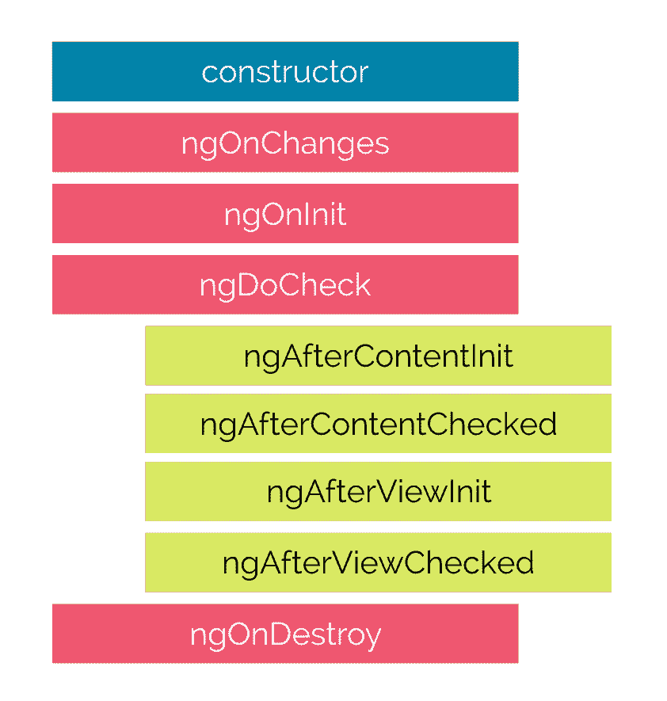
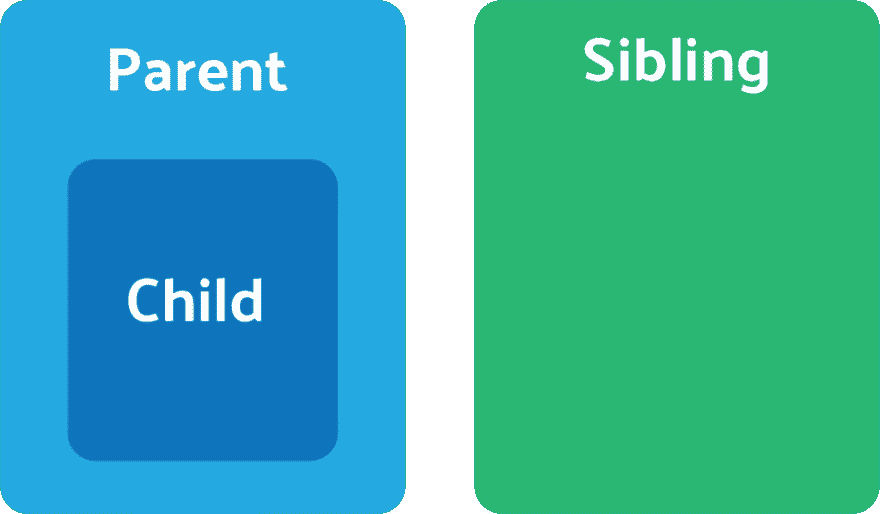

# 角分量介绍

> 原文：<https://dev.to/abelagoi/introduction-to-angular-component-aod>

### 组件:基本思想

组件是 Angular 应用程序中 UI 的最基本的构建块。它们是带有特殊装饰(@Component)和模板的指令。Component decorator 允许您将一个类标记为 Angular 组件，并提供额外的元数据来确定在运行时应该如何处理、实例化和使用组件。下面是一个组件的示例:

```
import { Component } from '@angular/core';

@Component({ 
    selector: 'hello-component', 
    templateUrl: './hello-component.html', 
    styleUrls: ['./hello-component.css']
}) 
class Greet { 
    public name: string = 'Component'; 
} 
```

这个组件可以在模板的任何地方使用，就像这个`<hello-component></hello-component>`。templateUrl 指定组件模板的部分，styleUrls 指定组件样式的部分，公共变量 **name** 用于向组件模板传递一个参数，该参数可以在模板中使用来访问。

### 组件生命周期挂钩

组件可以通过实现各种生命周期挂钩来控制它们的运行时行为。当 Angular 创建、更新和销毁组件实例时，组件实例具有生命周期。开发人员可以通过在 Angular `core`库中实现一个或多个*生命周期挂钩*接口来利用生命周期中的关键时刻。在我们构建的应用程序中，每个组件都有八个主要的钩子，下面的图表按照执行的顺序排列了它们。

[](https://res.cloudinary.com/practicaldev/image/fetch/s--SUdexL8i--/c_limit%2Cf_auto%2Cfl_progressive%2Cq_auto%2Cw_880/https://cdn-images-1.medium.com/max/1600/1%2A-5nnqZz1kMeAFQLKeZNqTg.png) 
*参考[http://www.techjini.com/blog/angular2-lifecycle-hooks/](http://www.techjini.com/blog/angular2-lifecycle-hooks/)为镜像*

有许多组件的生命周期挂钩，但我将只谈论那些我认为在本文中由于它们的用途而必须谈论的。可以访问 [angular](https://angular.io/guide/lifecycle-hooks) 了解更多关于 angular 生命周期钩子的内容。

**构造函数:**构造函数不是 angular 组件生命周期挂钩的一部分，但`constructor`是 typescript 类的预定义默认方法。在任何其他组件生命周期之前调用`constructor`。通常情况下，最好不要在构造函数中做任何事情，只对将要注入的类使用它。大多数情况下，您的构造函数应该是这样的:

```
constructor(private http: Http, private service: CustomService) {} 
```

**ngOnInit:** 组件的`ngOnInit`方法在构造函数后**被直接调用，在**后**第一次触发 *ngOnChange* 。如果你的函数的初始化处理依赖于组件的绑定，你应该使用`ngOnInit`(例如用`@Input`定义的组件参数)**

### 组件关系

Angular 由许多组件组成。有一个根组件作为父组件，由于根组件是**父组件，所以每隔一个组件都可以被称为根组件的**子组件**。**假设有一个包含两个子组件(组件 a 和组件 b)的根组件。我们可以简单地说**组件-a** 和**组件-b** 是兄弟组件。

[](https://res.cloudinary.com/practicaldev/image/fetch/s--VYn0BGk4--/c_limit%2Cf_auto%2Cfl_progressive%2Cq_auto%2Cw_880/https://cdn-images-1.medium.com/max/1600/1%2AMn10GXw-NHmQnzaCgX7VKA.png) 
*参考[https://angularfirebase . com/lessons/sharing-data-between-angular-components-four-methods/](https://angularfirebase.com/lessons/sharing-data-between-angular-components-four-methods/)*

### 在组件之间共享数据

为了在组件之间共享数据，我们必须定义组件之间存在的关系类型。是亲子关系还是兄弟姐妹关系？这种关系将决定组件之间共享数据的最佳方式。

**父到子:通过@Input decorator 共享数据:**从父到子传递数据最简单的方法是使用 **@Input binding** ，它允许通过如下所示的模板共享数据:

```
//parent.component.ts

import { Component } from '@angular/core';import { ChildComponent } from './child.component';

@Component({ 
    selector: 'parent-component', 
    template: ` <child-component [messageToChild]="parentMessage"> 
        </child-component> 
    `, 
    styleUrls: ['./parent.component.css']
})
export class ParentComponent { 
    parentMessage = "message from parent"; 
    constructor() {};
} 
```

@Input 装饰器由子组件用来接受来自父组件的数据。父组件中的[childMessage]与子组件中的属性同名。

```
//child.component.ts

import { Component } from '@angular/core';import { ParentComponent } from './parent.component';

@Component({ 
    selector: 'child-component', 
    template: ` {{ childMessage }} `, 
    styleUrls: ['./parent.component.css']
})
export class ChildComponent { 
    @Input() childMessage: string; 
    constructor() {};
} 
```

**子到父:通过@Output Decorator 和 EventEmitter 共享数据:**@ Output Decorator 用于将数据(事件)从一个组件发送到父组件。

```
 import { Component, Output, EventEmitter } from '@angular/core';import { ChildComponent } from './child.component';

@Component({ 
    selector: 'child-component', 
    template: ` 
     <button (click)="sendMessageToParent()"> 
        Send Message To Parent         
     </button> 
    `, 
    styleUrls: ['./child.component.css']
})
class ChildComponent { 
    @Output() messageFromChild = new EventEmitter(); 
    sendMessageToParent() { 
        this.messageFromChild.emit('Message from child'); 
    }
} 
```

父进程正在监听，并在收到数据(事件)时传递回调以执行适当的操作。

```
@Component({ 
    selector: 'parent-component', 
    template: ` <child-component (messageFromChild)="onMessageRecieved($event)">     
      </child-component> 
    `, 
    styleUrls: ['./parent.component.css']
})
class ParentComponent { 
    onMessageRecieved(event) { 
        console.log(event); 
    }
} 
```

**Parent to child:通过 ViewChild 共享数据:** ViewChild 使访问子组件方法或访问子组件上可用的实例变量变得容易。假设我们有一个子组件，它的 childMethod 方法如下:

```
childMethod() { 
    //a method inside child component
} 
```

然后，我们可以从父组件类中用 ViewChild 调用该方法，如下所示

```
import {Component, ViewChild, AfterViewInit} from "@angular/core";import { ChildComponent } from './child.component';

@Component({ 
    selector: 'parent-component', 
    template: ` Message From Child Component: {{ message }} 
    `, 
    styleUrls: ['./parent.component.css']
})
class ParentComponent { 
    @ViewChild(ChildComponent) childComponent: ChildComponent; 
    public message: any;

    ngAfterViewInit() { 
        this.childComponent.childMethod(); // 👶 I am a child method! 
    }
} 
```

但是，有一点需要注意，在视图初始化之前，child 是不可用的。这意味着我们需要实现 AfterViewInit 生命周期挂钩来接收来自孩子的数据，如上所示。

**兄弟(直接不相关的组件):通过服务类:**要在缺乏直接连接的组件(如兄弟、孙等)之间共享数据，您应该使用服务。下面是一个服务示例:

```
//data.service.ts

import { Injectable } from '@angular/core';

@Injectable()
export class DataService {
} 
```

数据可以是任何类型，包括对象。服务中可能有更多的代码，比如检索默认值或要共享的值的代码。然后每个组件注入这个服务并使用它的价值。

```
//componentA.component.ts

import { Component } from '@angular/core';import { DataService } from './data.service';

@Component({
 ... ...
})
export Class ComponentA { 
    constructor(public dataService: DataService) {}
    get data():string { 
        return this.dataService.serviceData(); 
    }

    set data(value: string) { 
        this.dataService.setDate = value; 
    }
}

//componentB.component.ts
import { Component } from '@angular/core';
import { DataService } from './data.service';

@Component({
    ...
    ...
})
export class ComponentB {
    constructor(public dataService: DataService){}

    get data(): string {
        return this.dataService.serviceData();
    }

    set data(value: string) {
        this.dataService.setData = value;
    } 
} 
```

在这篇关于角度组件的文章中，我试图涵盖我认为开始使用角度组件最重要的事情。如果你有任何建议，请联系我。

感谢阅读