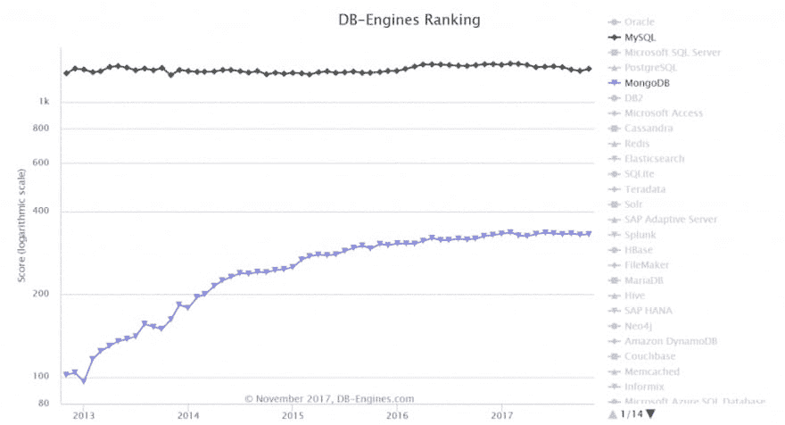
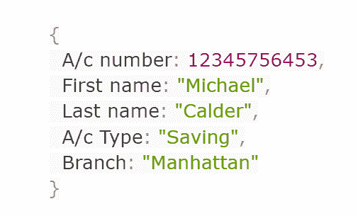
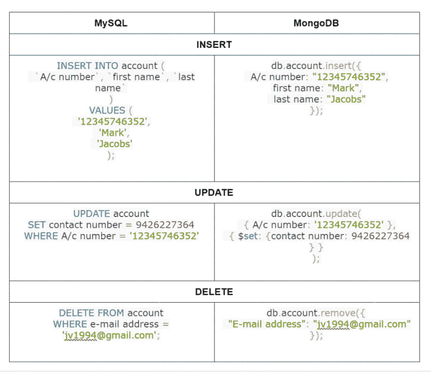
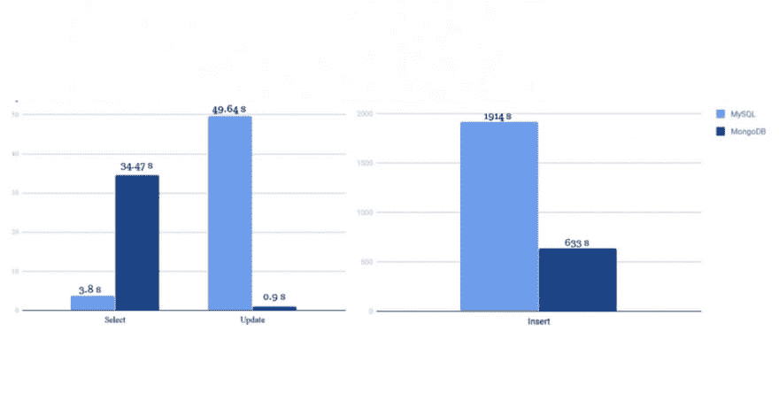
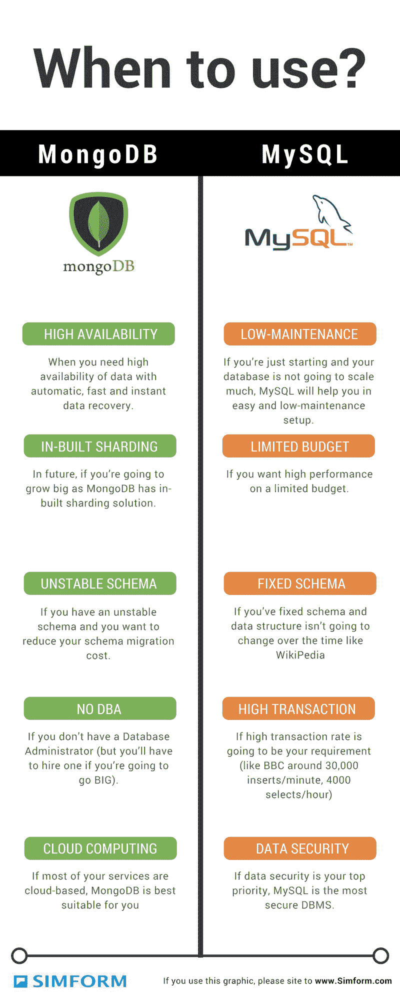

# 比较 MongoDB 和 MySQL

> 原文：<https://dev.to/jignesh_simform/comparing-mongodb--mysql-bfa>

想象一下，找到一个与您组织的技术目标一致的 DBMS。很刺激，对吧？

关系数据库在相当长的一段时间里处于领先地位。选择是显而易见的:MySQL、Oracle 或 MS SQL，仅举几例。尽管随着对更多多样性和可伸缩性的需求，时代已经发生了很大的变化，不是吗？

市场上有许多可供选择的东西，尽管我不想让你再次感到困惑。那么，两种流行程度接近的主流解决方案之间的对决会怎么样呢？

[MongoDB vs MySQL](https://www.simform.com/mongodb-vs-mysql-databases/) ？

[T2】](https://res.cloudinary.com/practicaldev/image/fetch/s--qSN8ex5B--/c_limit%2Cf_auto%2Cfl_progressive%2Cq_auto%2Cw_880/https://www.simform.com/wp-content/uploads/2017/11/database-popularity-1024x554.png)

这两者都是一些最流行的开源数据库软件。

说到这里，让我们开始吧。

## 模式的灵活性

MongoDB 最大的优点之一是对模式设计没有任何限制。您可以在一个集合中放置几个文档，这些文档之间没有必要有任何关系。唯一的限制是受支持的数据结构。

但是由于缺少连接和事务(我们将在后面讨论)，您需要根据应用程序将如何访问数据来频繁地优化您的模式。

在 MySQL 中存储任何东西之前，需要明确定义表和列，表中的每一行都应该有相同的列。

正因为如此，如果遵循规范化，存储数据的方式就没有太大的灵活性。

例如，如果您经营一家银行，其信息可以添加到名为“account”的表中，如下所示:

[T2】](https://res.cloudinary.com/practicaldev/image/fetch/s--XIbidQi5--/c_limit%2Cf_auto%2Cfl_progressive%2Cq_auto%2Cw_880/https://www.simform.com/wp-content/uploads/2017/11/Table-1024x221.png)

这就是 MySQL 存储数据的方式。正如你所看到的，桌子的设计非常死板，不容易改变。MongoDB 以 JSON 类型的方式存储数据，如下所述:

[T2】](https://res.cloudinary.com/practicaldev/image/fetch/s--J6Wcalhu--/c_limit%2Cf_auto%2Cfl_progressive%2Cq_auto%2Cw_880/https://dzone.com/storage/temp/7327596-mongodb-json.png)

这样的文档也可以存储在一个集合中。

MongoDB 创建了无模式文档，可以存储你想要的任何信息，尽管这可能会导致数据一致性的问题。MySQL 创建了一个严格的模式模板，因此它肯定会出错。

## 查询语言

MongoDB 使用非结构化的查询语言。要在 JSON 文档中构建查询，您需要指定一个文档，该文档具有您希望结果匹配的属性。

它通常使用一组非常丰富的操作符来执行，这些操作符通过 JSON 相互链接。MongoDB 将每个属性视为具有隐式布尔 AND。它本身支持布尔或查询，但是您必须使用特殊的操作符($或)来实现它。

MySQL 使用结构化查询语言 SQL 与数据库通信。尽管它很简单，但它确实是一种非常强大的语言，主要由两部分组成:数据定义语言(DDL)和数据操作语言(DML)。

我们来快速对比一下。

[T2】](https://res.cloudinary.com/practicaldev/image/fetch/s--ECe_vpp1--/c_limit%2Cf_auto%2Cfl_progressive%2Cq_auto%2Cw_880/https://www.simform.com/wp-content/uploads/2017/11/table2-1024x885.png)

## MongoDB 和 MySQL 中的关系

MongoDB 不支持 JOIN——至少，它没有对等物。相反，它支持多维数据类型，如数组，甚至其他文档。将一个文档放置在另一个文档中称为嵌入。

MySQL 最好的部分之一是连接操作。简单地说，JOIN 使关系数据库成为关系数据库。JOIN 允许用户在单个 SELECT 命令的帮助下，在单个查询中链接两个或多个表中的数据。

例如，我们可以使用一条 SQL 语句轻松获得多个表中的相关数据。

这将为您提供一个账号、名字和相应的分支机构。

## 性能和速度

与 MySQL 相比，它的一个主要优势是处理大型非结构化数据的能力。它神奇地更快，因为它允许用户以一种对工作负载更敏感的不同方式进行查询。

开发人员注意到，在处理大型数据库时，MySQL 比 MongoDB 慢得多。它无法处理大量的非结构化数据。

因此，没有“标准”基准可以帮助您找到满足您需求的最佳数据库。只有您的需求、您的数据和基础架构能够告诉您需要了解的内容。

我们先看一个一般的例子来了解 MySQL 和 MongoDB 按照各种函数的速度。

在以下情况下进行了测量:

MySQL 5.7.9

MongoDB 3.2.0

这些都已经在一个单独的 m4.xlarge Amazon 实例上用 Ubuntu 14.4 x64 和默认配置进行了测试；对 1，000，000 条记录执行了所有测试。

[T2】](https://res.cloudinary.com/practicaldev/image/fetch/s--IPb4x-vx--/c_limit%2Cf_auto%2Cfl_progressive%2Cq_auto%2Cw_880/https://www.simform.com/wp-content/uploads/2017/11/Add-subheading-1-1-1024x536.png)

从上图可以明显看出，对于相同的命令，MongoDB 比 MySQL 花费的时间要少得多。

## 安全模式

MongoDB 使用基于角色的访问控制和一组灵活的特权。它的安全特性包括身份验证、审计和授权。

此外，还可以使用传输层安全性(TLS)和安全套接字层(SSL)进行加密。这确保了它只能被目标客户端访问和读取。

MySQL 使用基于特权的安全模型。这意味着它对用户进行身份验证，并为用户提供特定数据库的特权，如创建、选择、插入、更新等。

但是它没有解释为什么给定的用户被拒绝特定的访问。在传输层，它使用 SSL 在客户端和服务器之间建立加密连接。

什么时候用 MongoDB 或者 MySQL？这张信息图解释了什么时候使用 MongoDB 而不是 MySQL，反之亦然。

[T2】](https://res.cloudinary.com/practicaldev/image/fetch/s--FTXePDOd--/c_limit%2Cf_auto%2Cfl_progressive%2Cq_auto%2Cw_880/https://dzone.com/storage/temp/7327614-mongodb-vs-mysql-1.png)

## 结论

为了回答这个问题，“为什么我应该用 X 而不是 Y？”你需要考虑你的项目目标和其他许多事情。

MySQL 因其灵活性、高性能、可靠的数据保护和易于管理数据而高度组织化。正确的数据索引可以解决您的性能问题，促进交互并确保健壮性。

但是如果您的数据不是结构化的，处理起来也不复杂，或者预定义模式对您来说不容易，那么您最好选择 MongoDB。此外，如果您需要处理大量数据并将其存储为文档，MongoDB 将会帮您大忙！

对峙的结果是:一方不一定比另一方更好。MongoDB 和 MySQL 都服务于不同的领域。

* * *

我们在这里发布了这篇文章的更新版本 [MongoDB vs MySQL:数据库的比较研究](https://www.simform.com/mongodb-vs-mysql-databases/)。如果你有更多的建议，请发表评论。