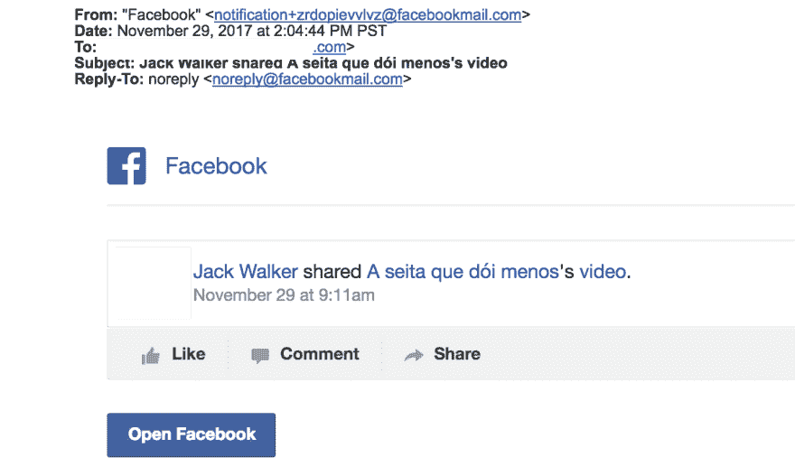
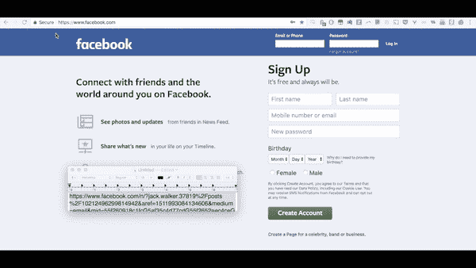

# 点击脸书链接让我登录另一个人的账户

> 原文:[https://dev . to/Peter/clicking-a-Facebook-link-logs-me-into-another-persons-account-2b 9](https://dev.to/peter/clicking-a-facebook-link-logs-me-into-another-persons-account-2b9)

## 背景

上周，我收到了一封来自我妈妈邮箱的转发邮件。我走近任何“前进:前进:前进:前进:你必须看到这一点！”带有怀疑态度的电子邮件链类型。
但是...我很好奇，我决定如果继续下去看起来安全的话，我会的。我把鼠标放在“开放脸书”的链接上，复制了网址，仔细查看了一下

`https://www.facebook.com/n/?********************`

我在 ccTLDs 周围见过足够多的域名欺骗伎俩，我相信这个链接是合法的。我决定看看她给我发了什么。

我把链接粘贴到地址栏，按下回车键，突然发现自己在看我妈妈的新闻。不知何故，我已经从**我的**账户注销，并登录了**她的**账户。

我立即退出并试图重现这一现象，怀疑自己是否在胡思乱想。你瞧，它又起作用了——我退出了脸书，现在我以她的身份登录。

## 技术说明

*   它*不*在隐名窗口工作
*   在新的 Chrome“People”实例中，它*不*工作，即使我开始登录我的个人账户
*   它只适用于我的特定 Chrome 浏览器
*   如果我已经登录了我的帐户，那么会起作用吗
*   如果我从所有帐户中注销，还能工作吗
*   我 99%确信我妈妈从未在这台电脑上登录过脸书

*   这是转发的邮件(删除了个人信息):
    

*   那封邮件里的每一个可点击的链接都让我登录；但这里有完整的“开放脸书”链接。为了保护隐私，我删除了我妈妈的电子邮件和她朋友的用户名。
    `https://www.facebook.com/n/?{mom's-friend}%2Fposts%2F10212496299814942&aref=1511993084134606&medium=email&mid=55f260918c1fcG5af35c4d77cdG55f2652aec4ceG318&bcode=2.1511993084.Abxk5s8psLBCN-Sfxn4&n_m={my-mom}%40{her-domain}.com`

*   这里有一张 GIF。请注意，出于隐私原因，我裁剪了几帧，然后在最后使用了 FB 的截图。只是不想让我妈妈的电子邮件或随机联系人出现。
    [T3】](https://res.cloudinary.com/practicaldev/image/fetch/s--sVaEhBtB--/c_limit%2Cf_auto%2Cfl_progressive%2Cq_66%2Cw_880/https://thepracticaldev.s3.amazonaws.com/i/u65giodjwndokoxrtcsr.gif)

## 结论

鉴于这仅在我的特定浏览器窗口中有效，我不得不认为这是由于 cookies 或其他原因。我还没有清空我的 cookies 缓存，因为我想在进行实验的这一步之前保存任何有用的信息。

**有人知道是怎么回事吗？**

PS——她显然想分享的视频链接是流传已久的“[滑溜溜的楼梯](https://www.youtube.com/watch?v=aKPz583WRpQ)”片段:)