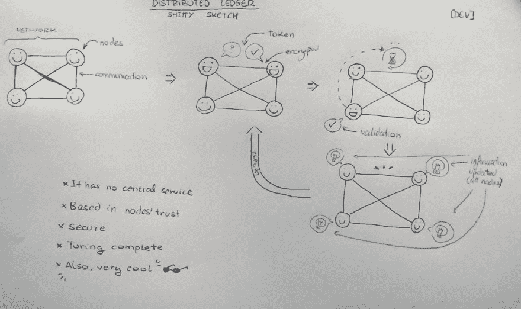
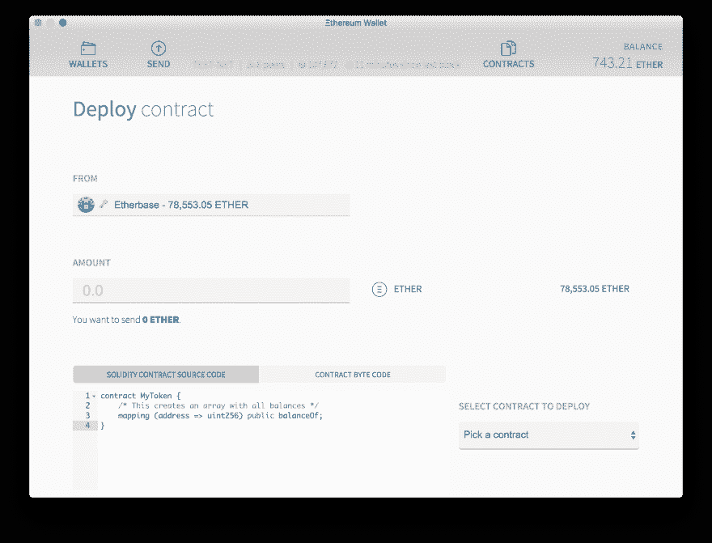

# 分布式分类帐和以太坊令牌创建

> 原文:[https://dev . to/terceranexus 6/distributed-ledger-and-ether eum-token-creation-eeh](https://dev.to/terceranexus6/distributed-ledger-and-ethereum-token-creation-eeh)

基本上，**分布式账本**就是在一个公共网络中共享数据进化控制的概念。这方面最著名的例子之一是比特币，它通过区块链工作，这是一个分布在分类账内几个参与者(节点)之间的数据库，包含节点之间每笔交易的更新状态。这些节点使用特定的协议连接。

这个系统运行的关键在于令牌，即包含信息并被加密的元素。这个令牌可以充当货币、投票、消息或任何可以在分布式分类帐系统中固定的东西。一些初创公司在这种模式中看到了新的机会和有效的方法，以获得更好的安全性和更低的成本解决方案。这样，DL 并不总是以货币形式出现，但也被认为是能源行业( [Powerledger](https://tge.powerledger.io) )、物联网([灯丝](https://filament.com))、通信或投票系统( [Horizon State](https://horizonstate.com) )的一个有趣选择。

当心！傻逼图传入:

[T2】](https://res.cloudinary.com/practicaldev/image/fetch/s--UwM0a02R--/c_limit%2Cf_auto%2Cfl_progressive%2Cq_auto%2Cw_880/https://github.com/terceranexus6/ethereum_lab/blob/mastimg/diagram.jpg%3Fraw%3Dtrue)

以太坊(一种新兴的加密货币)有一个钱包应用程序，允许开发人员在虚拟沙箱或现实世界中自由部署 c++契约来创建令牌或组织节点。这非常有趣，并且让开发人员对分布式分类帐的理解更加清晰。原始文档可以在[这里](https://www.ethereum.org/dao)和[这里](https://www.ethereum.org/token)找到，我会总结如何创建一个令牌合同。此外，在我的 [github 库](https://github.com/terceranexus6/ethereum_lab)中有关于西班牙语 DL 的更广泛的解释和一些合同示例，请随意查看并提出任何问题或建议。回购中的看板风格的板上也描绘了项目开发。

好的，基本令牌契约处理所有者(契约开发者)拥有的令牌的初始供应，以及包括检查和令牌所有权变更的基本转移功能。

```
contract MyToken {
    /* This creates an array with all balances */
    mapping (address => uint256) public balanceOf;

    /* Initializes contract with initial supply tokens to the creator of the contract */
    function MyToken(
        uint256 initialSupply
        ) {
        balanceOf[msg.sender] = initialSupply;              // Give the creator all initial tokens
    }

    /* Send coins */
    function transfer(address _to, uint256 _value) {
        require(balanceOf[msg.sender] >= _value);           // Check if the sender has enough
        require(balanceOf[_to] + _value >= balanceOf[_to]); // Check for overflows
        balanceOf[msg.sender] -= _value;                    // Subtract from the sender
        balanceOf[_to] += _value;                           // Add the same to the recipient
    }
} 
```

但是，为了创造一种更复杂的加密货币(如上所述，它也可以用于投票等其他目的)，我们应该解决一些更多的细节问题。例如，我们应该定义令牌识别的基本变量:

```
// Public variables of the token
string public name;
string public symbol;
uint8 public decimals = 18;
// 18 decimals is the strongly suggested default, avoid changing it 
```

以及一个更复杂的传递函数，它负责为将来保存余额。

```
function _transfer(address _from, address _to, uint _value) internal {
    // Prevent transfer to 0x0 address. Use burn() instead
    require(_to != 0x0);
    // Check if the sender has enough
    require(balanceOf[_from] >= _value);
    // Check for overflows
    require(balanceOf[_to] + _value > balanceOf[_to]);
    // Save this for an assertion in the future
    uint previousBalances = balanceOf[_from] + balanceOf[_to];
    // Subtract from the sender
    balanceOf[_from] -= _value;
    // Add the same to the recipient
    balanceOf[_to] += _value;
    Transfer(_from, _to, _value);
    // Asserts are used to use static analysis to find bugs in your code. They should never fail
    assert(balanceOf[_from] + balanceOf[_to] == previousBalances);
} 
```

从系统中销毁令牌(参与者拥有的令牌)的功能(不可收回！)或者来自另一个参与者的。

```
function burn(uint256 _value) public returns (bool success) {
    require(balanceOf[msg.sender] >= _value);   // Check if the sender has enough
    balanceOf[msg.sender] -= _value;            // Subtract from the sender
    totalSupply -= _value;                      // Updates totalSupply
    Burn(msg.sender, _value);
    return true;
}

function burnFrom(address _from, uint256 _value) public returns (bool success) {
    require(balanceOf[_from] >= _value);                // Check if the targeted balance is enough
    require(_value <= allowance[_from][msg.sender]);    // Check allowance
    balanceOf[_from] -= _value;                         // Subtract from the targeted balance
    allowance[_from][msg.sender] -= _value;             // Subtract from the sender's allowance
    totalSupply -= _value;                              // Update totalSupply
    Burn(_from, _value);
    return true;
} 
```

此外，一个很好的函数应该是处理 POW(工作证明)以获得令牌和签署交易的函数。

```
uint current = 1; // hehe try to guess the cubic root of the number. Imposible task >:)

    function rewardTheGenious(uint answer, uint next) {
        require(answer**3 == current); // goes on if it's correct
        balanceOf[msg.sender] += 1;         // reward the user!
        current = next;   // next test
    } 
```

但不幸的是，计算机发现这非常容易，所以也许我们应该创建一个更好的工作证明，这对于机器来说是一个真正的挑战(那些肮脏的智能烤面包机！):

```
 bytes32 public currentChallenge;                         // The coin starts with a challenge
    uint public timeOfLastProof;                             // Variable to keep track of when rewards were given
    uint public difficulty = 10**32;                         // Difficulty starts reasonably low

    function proofOfWork(uint nonce){
        bytes8 n = bytes8(sha3(nonce, currentChallenge));    // Generate a random hash based on input
        require(n >= bytes8(difficulty));                   // Check if it's under the difficulty

        uint timeSinceLastProof = (now - timeOfLastProof);  // Calculate time since last reward was given
        require(timeSinceLastProof >=  5 seconds);         // Rewards cannot be given too quickly
        balanceOf[msg.sender] += timeSinceLastProof / 60 seconds;  // The reward to the winner grows by the minute

        difficulty = difficulty * 10 minutes / timeSinceLastProof + 1;  // Adjusts the difficulty

        timeOfLastProof = now;                              // Reset the counter
        currentChallenge = sha3(nonce, currentChallenge, block.blockhash(block.number - 1));  // Save a hash that will be used as the next proof
    } 
```

一旦我们的 cruptocurrency 看起来像我们想要的那样，我们就可以使用以太坊钱包沙箱来部署它。界面相当简单，只需在编辑框中添加代码，填写你编码的选项(名字或者符号，比如好消息你可以用表情符号！)并在部署中单击。为此只需设置**正确的网络**(虚拟沙箱，有几个)，点击**合同**，寻找“**部署新合同**按钮。

[](https://res.cloudinary.com/practicaldev/image/fetch/s--v7AAbe_T--/c_limit%2Cf_auto%2Cfl_progressive%2Cq_auto%2Cw_880/https://www.ethereum.oimg/tutorial/deploy-new-contract.png)
[T6】](https://res.cloudinary.com/practicaldev/image/fetch/s--_7FNmGH1--/c_limit%2Cf_auto%2Cfl_progressive%2Cq_auto%2Cw_880/https://www.ethereum.oimg/tutorial/edit-contract.png)

无论如何，我认为作为一个研究实验来更好地理解加密货币是非常好的。我的目标是自己编写一份完善的令牌合同，以及一份在区块链组织几个节点的合同。希望你们和我一样觉得有趣！