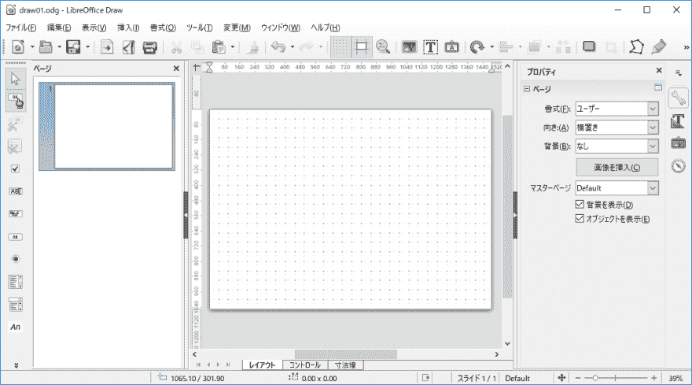
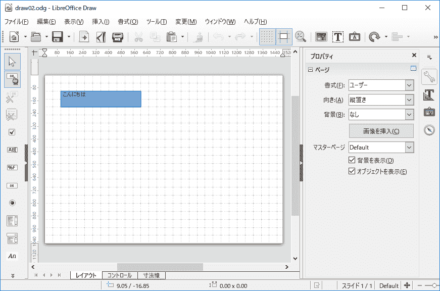
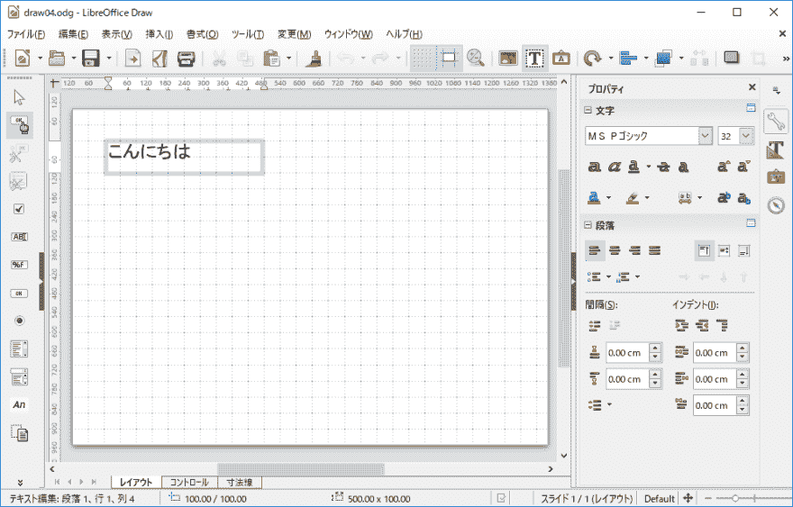
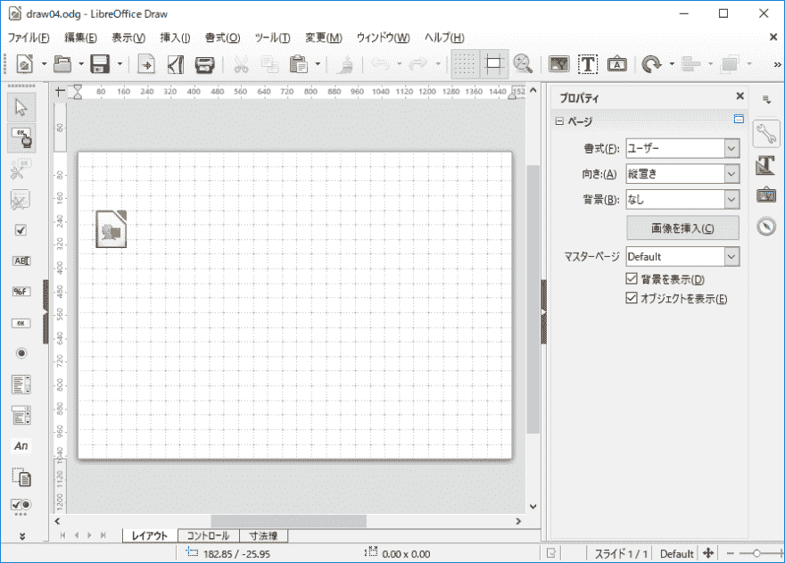

# 使 LibreOffice 绘制文档使用 odfpy

> 原文:[https://dev . to/ara chan/make-libre office-draw-document-to-use-ODF py-837](https://dev.to/arachan/make-libreoffice-draw-document-to-use-odfpy-837)

Odfpy 是制作 OpenDocument 格式的著名 Python 库。
但是，如何使用 odfpy 呢？

odfpy 官方手册在 github 中只有 [api-for-odfpy.odt](https://github.com/eea/odfpy/blob/master/api-for-odfpy.odt) 和[示例程序](https://github.com/eea/odfpy/tree/master/examples)。

OpenDocument Text 和 OpenDocument Spreadsheet 的 odfpy 教程是少数找到的。
未找到 OpenDocument Graphic 的 odfpy 教程！

我想从绘制文档的 odfpy 开始。

## 环境

*   Windows10 Pro/Home x64
*   用于 Linux 的 Windows 系统(WSL)
*   Ubuntu16.04
*   Python3
*   Python3-pip (pip)
*   odfpy
*   iPython
*   用于 Windows 的 LibreOffice 绘图

我用 WSL。
我不解释安装 WSL。
如果不安装 WSL，在 url 下勾选。

[为 Linux 安装 Windows 子系统](https://msdn.microsoft.com/ja-jp/commandline/wsl/install-win10)

### 设置 Python

```
$ sudo apt update
$ sudo apt upgrade
# Python
$ sudo apt install Python3
# pip
$ sudo apt Python3-pip
$ pip3 install -U pip -user
# odfpy iPython
$ pip3 install odfpy,iPython -user
$ pip3 list --format columns
# folder
$ mkdir odfpy
$ cd odfpy 
```

<svg width="20px" height="20px" viewBox="0 0 24 24" class="highlight-action crayons-icon highlight-action--fullscreen-on"><title>Enter fullscreen mode</title></svg> <svg width="20px" height="20px" viewBox="0 0 24 24" class="highlight-action crayons-icon highlight-action--fullscreen-off"><title>Exit fullscreen mode</title></svg>

## 制作文档和页面

首先，我启动 iPython。iPython 非常有用。

```
 $ ipython 
Python 3.6.3 (default, Nov  6 2017, 23:30:23) 
Type 'copyright', 'credits' or 'license' for more information
IPython 6.2.1 -- An enhanced Interactive Python. Type '?' for help.

In [1]: 
```

<svg width="20px" height="20px" viewBox="0 0 24 24" class="highlight-action crayons-icon highlight-action--fullscreen-on"><title>Enter fullscreen mode</title></svg> <svg width="20px" height="20px" viewBox="0 0 24 24" class="highlight-action crayons-icon highlight-action--fullscreen-off"><title>Exit fullscreen mode</title></svg>

检查您当前的目录。odfpy 在这个目录下制作 Draw 文档。
放图片和 python 脚本运行。

```
 # check your current directory In [1]: %pwd
Out [1]:'/home/username/odfpy' 
```

<svg width="20px" height="20px" viewBox="0 0 24 24" class="highlight-action crayons-icon highlight-action--fullscreen-on"><title>Enter fullscreen mode</title></svg> <svg width="20px" height="20px" viewBox="0 0 24 24" class="highlight-action crayons-icon highlight-action--fullscreen-off"><title>Exit fullscreen mode</title></svg>

制作文件

```
In:[2] from odf.opendocument import OpenDocumentDrawing
In:[3] doc=Open # press your tab key
 open()          OpenDocumentDrawing() 
```

<svg width="20px" height="20px" viewBox="0 0 24 24" class="highlight-action crayons-icon highlight-action--fullscreen-on"><title>Enter fullscreen mode</title></svg> <svg width="20px" height="20px" viewBox="0 0 24 24" class="highlight-action crayons-icon highlight-action--fullscreen-off"><title>Exit fullscreen mode</title></svg>

OpenDocu 标牌...按 tab 键。
惊艳！提前打字。

好吗？
嗯，用 addText 方法画图。
试试，它。

```
In[3]:doc=OpenDocmentDrawing()
In[3]:doc.drawing.addText('aaaa')
....(Abbreviation)...
IllegalText: The <office:drawing> element does not allow text

In[4]: 
```

<svg width="20px" height="20px" viewBox="0 0 24 24" class="highlight-action crayons-icon highlight-action--fullscreen-on"><title>Enter fullscreen mode</title></svg> <svg width="20px" height="20px" viewBox="0 0 24 24" class="highlight-action crayons-icon highlight-action--fullscreen-off"><title>Exit fullscreen mode</title></svg>

无法添加文本。
绘制文档不能放直接的文本和形状。
制作页面。
页面中的文字和形状。

打开另一个终端，在 odfpy 文件夹中创建 createpage.py 文件。

```
from odf.opendocument import OpenDocumentDrawing
from odf.draw import Page
from odf.style import Style,MasterPage,PageLayout

## Create the drawing page style dpstyle = Style(family="drawing-page",name="DP1")
doc.automaticstyles.addElement(dpstyle)

## Create page layout specifying dimensions plstyle = PageLayout(name="PM1")
doc.automaticstyles.addElement(plstyle)

## Create a master page masterpage = MasterPage(stylename=dpstyle, name="Default", pagelayoutname=plstyle)
doc.masterstyles.addElement(masterpage)

## Create a page to contain the drawing drawpage = Page(masterpagename=masterpage, name="page1", stylename=dpstyle)
doc.drawing.addElement(drawpage) 
```

<svg width="20px" height="20px" viewBox="0 0 24 24" class="highlight-action crayons-icon highlight-action--fullscreen-on"><title>Enter fullscreen mode</title></svg> <svg width="20px" height="20px" viewBox="0 0 24 24" class="highlight-action crayons-icon highlight-action--fullscreen-off"><title>Exit fullscreen mode</title></svg>

制作页面

1.  制作页面样式和页面布局。
2.  制作母版页
3.  制作页面表单母版页
4.  添加页面以绘制文档

制作页面太麻烦了。事情就是这样。

运行在 iPython 上。

```
# check File In[4]: %ls
createpage.py
In[5]: %run createpage.py 
```

<svg width="20px" height="20px" viewBox="0 0 24 24" class="highlight-action crayons-icon highlight-action--fullscreen-on"><title>Enter fullscreen mode</title></svg> <svg width="20px" height="20px" viewBox="0 0 24 24" class="highlight-action crayons-icon highlight-action--fullscreen-off"><title>Exit fullscreen mode</title></svg>

如果不是错误，成功添加页面。

## 页面属性

如何更改 PageProperties？我尝试了一点。

```
# load PageLayoutProperties In[6]:from odf.style import PageLayoutPropretis
In[7]:plsytle.addElement(PageProperties(margin="0cm",pageheight="210mm",pagewidth="297mm", printorientation="portrait"))
In[8]:doc.automaticstyles.addElement(plsytle) 
```

<svg width="20px" height="20px" viewBox="0 0 24 24" class="highlight-action crayons-icon highlight-action--fullscreen-on"><title>Enter fullscreen mode</title></svg> <svg width="20px" height="20px" viewBox="0 0 24 24" class="highlight-action crayons-icon highlight-action--fullscreen-off"><title>Exit fullscreen mode</title></svg>

没有纸张大小，所以我们改变页面高度和页面宽度。
并保存它。

```
In[9]: doc.save('draw01',True) 
```

<svg width="20px" height="20px" viewBox="0 0 24 24" class="highlight-action crayons-icon highlight-action--fullscreen-on"><title>Enter fullscreen mode</title></svg> <svg width="20px" height="20px" viewBox="0 0 24 24" class="highlight-action crayons-icon highlight-action--fullscreen-off"><title>Exit fullscreen mode</title></svg>

它会复制到 Windows 桌面。

```
$ cp draw01.odg /mnt/c/Users/username/Desktop 
```

<svg width="20px" height="20px" viewBox="0 0 24 24" class="highlight-action crayons-icon highlight-action--fullscreen-on"><title>Enter fullscreen mode</title></svg> <svg width="20px" height="20px" viewBox="0 0 24 24" class="highlight-action crayons-icon highlight-action--fullscreen-off"><title>Exit fullscreen mode</title></svg>

在 Windows 上打开它以使用 LibreOffice Draw。

[T2】](https://res.cloudinary.com/practicaldev/image/fetch/s--eWgfIEAx--/c_limit%2Cf_auto%2Cfl_progressive%2Cq_auto%2Cw_880/https://qiita-image-store.s3.amazonaws.com/0/24550/49cb8dd9-7565-1ef5-f197-3a4642c241bb.png)

好的。

## 添加文字

给我做网页太麻烦了。
果然如此。

```
In [1]:from odf.opendocument import OpenDocumentDrawing,load
In [2]:doc=load('draw01.odg')
In [3]:doc.getMediaType()
Out[3]: 'application/vnd.oasis.opendocument.graphics' 
```

<svg width="20px" height="20px" viewBox="0 0 24 24" class="highlight-action crayons-icon highlight-action--fullscreen-on"><title>Enter fullscreen mode</title></svg> <svg width="20px" height="20px" viewBox="0 0 24 24" class="highlight-action crayons-icon highlight-action--fullscreen-off"><title>Exit fullscreen mode</title></svg>

加载绘图文档。

要添加文本，

1.  制作文本
2.  制作文本框并添加文本
3.  制作框架并添加文本框
4.  取出页面
5.  将框架添加到页面

文本不能直接添加到页面。
要添加文本，将文本添加到框架或矩形...等等。

这是代码下划线。

```
In[4]: from odf.draw import Page,TextBox,Frame
# get Page In[5]: page=doc.getElementByType(Page)
In[6]: page=page[0]
In[7]: from odf.text import P
# Create Text In[8]: text=P()
In[9]: text.addText('こんにちは')
# Text add to TextBox In[10]: tb=TextBox()
In[11]: tb.addElement(text)
# TextBox add to Frame.
# x,y is position. In[12]: frame=Frame(width='100mm',height='20mm',x='2cm',y='2cm')
In[13]: frame.addElement(tb)
# Page add to Frame. In[14]: page.addElement(frame)
# Save In[15]: doc.save('draw02',True) 
```

<svg width="20px" height="20px" viewBox="0 0 24 24" class="highlight-action crayons-icon highlight-action--fullscreen-on"><title>Enter fullscreen mode</title></svg> <svg width="20px" height="20px" viewBox="0 0 24 24" class="highlight-action crayons-icon highlight-action--fullscreen-off"><title>Exit fullscreen mode</title></svg>

LibreOffice Draw open draw02.odg。

[T2】](https://res.cloudinary.com/practicaldev/image/fetch/s--UrT10nSk--/c_limit%2Cf_auto%2Cfl_progressive%2Cq_auto%2Cw_880/https://qiita-image-store.s3.amazonaws.com/0/24550/7c285c64-7791-cfd5-c460-0277aef4ca3b.png)

很好！我想改变字体大小和背景颜色。

## 文本属性和图形属性

TextProperties 改变文本的字体大小。
GraphicProperties 改变框架的背景颜色。

```
In [1]: from odf.opendocument import load
In [2]: from odf.draw import Page,Frame,TextBox
In [3]: from odf.style import Style,TextProperties,GraphicProper
   ...: ties
In [4]: from odf.text import P
# load draw file In [5]: doc=load('draw02.odg')
# Take out Frame and Text In [6]: page=doc.getElementsByType(Page)
In [7]: page=page[0]
In [8]: frame=page.getElementsByType(Frame)
In [9]: frame=frame[0]
In [10]: tb=frame.getElementsByType(TextBox)
In [11]: tb=tb[0]
In [12]: text=tb.getElementsByType(P)
In [13]: text=text[0]
# make Style In [14]: s=Style(name='P1',family='paragraph')
# English is fontsize But, Chinese Japanese Korean font is fontsizeasian.
# 「こんにちは」=fontasian In [15]: tp=TextProperties(fontsize='32pt',fontsizeasian='32pt')
In [16]: gs=Style(name='GR1',family='graphic')
In [17]: gp=GraphicProperties(fill='none',stroke='none')
# add Style to Frame and Text In [18]: text.setAttribute('stylename',s)
In [19]: frame.setAttribute('stylename',gs)
# add Style to Draw Document In [20]: doc.automaticstyles.addElement(s)
In [21]: doc.automaticstyles.addElement(gs)
# Save In [22]: doc.save('draw03',True) 
```

<svg width="20px" height="20px" viewBox="0 0 24 24" class="highlight-action crayons-icon highlight-action--fullscreen-on"><title>Enter fullscreen mode</title></svg> <svg width="20px" height="20px" viewBox="0 0 24 24" class="highlight-action crayons-icon highlight-action--fullscreen-off"><title>Exit fullscreen mode</title></svg>

[T2】](https://res.cloudinary.com/practicaldev/image/fetch/s--LmSfCipn--/c_limit%2Cf_auto%2Cfl_progressive%2Cq_auto%2Cw_880/https://qiita-image-store.s3.amazonaws.com/0/24550/e5b35803-98ac-df32-bede-1b86fade4978.png)

明白了！接下来，我想添加图像。

## 添加图像

#### 获取图像

1.  从 Wikimedia Common 获取 LibreOffice Draw 的图标 png。
2.  重命名 drawicon.png

```
$ pwd
/home/users/odfpy

$ curl -O https://upload.wikimedia.org/wikipedia/commons/thumb/8/80/LibreOffice_4.0_Draw_Icon.svg/200px-LibreOffice_4.0_Draw_Icon.svg.png
$ mv 200px-LibreOffice_4.0_Draw_Icon.svg.png drawicon.png
$ ls drawicon.png
drawicon.png 
```

<svg width="20px" height="20px" viewBox="0 0 24 24" class="highlight-action crayons-icon highlight-action--fullscreen-on"><title>Enter fullscreen mode</title></svg> <svg width="20px" height="20px" viewBox="0 0 24 24" class="highlight-action crayons-icon highlight-action--fullscreen-off"><title>Exit fullscreen mode</title></svg>

好吧，我明白了。

## 添加图像

```
# load file. In [1]: from odf.opendocument import load
In [2]: doc=load('draw01.odg')
# import need's Object In [3]: from odf.draw import Page,Image,Frame
# Take out Page In [4]: page=doc.getElementsByType(Page)
In [5]: page=page[0]
# make PhotoFrame. x,y is position,height width is size.
# This image is square,so height and width is same scale. In [6]: photoframe=Frame(x='10mm',y='40mm',height='26mm',width='26mm')
# add Image to Draw Document. In [7]: href=doc.addPicture('drawicon.png')
# add Image to photoframe In [8]: photoframe.addElement(Image(href=href))
# add photoframe to Page In [9]: page.addElement(photoframe)
# Save In [10]: doc.save('draw04',True) 
```

<svg width="20px" height="20px" viewBox="0 0 24 24" class="highlight-action crayons-icon highlight-action--fullscreen-on"><title>Enter fullscreen mode</title></svg> <svg width="20px" height="20px" viewBox="0 0 24 24" class="highlight-action crayons-icon highlight-action--fullscreen-off"><title>Exit fullscreen mode</title></svg>

你在文档中添加图像了吗？好的，检查文件。

[T2】](https://res.cloudinary.com/practicaldev/image/fetch/s--pc1gE3jM--/c_limit%2Cf_auto%2Cfl_progressive%2Cq_auto%2Cw_880/https://qiita-image-store.s3.amazonaws.com/0/24550/bd99a6b3-eb87-71d8-aafb-ae7d95151c46.png)

成功！

## 结论

1.  页面属性
2.  放置文本
3.  放置图像和形状
4.  救援

我相信它能让 odfpy 入门。

## 引用

[API 为 Odfpy - odt](https://github.com/eea/odfpy/blob/master/api-for-odfpy.odt)
API 参考。
示例程序的说明很少。

[odfpy -示例](https://github.com/eea/odfpy/tree/master/examples)
示例程序。

官方只有两个参考。

[搜索并替换文本 odfpy - StackOverflow](https://stackoverflow.com/questions/26887105/search-and-replace-text-odfpy)
我知道它给文本添加设置样式。p 使用 SetAttribute。