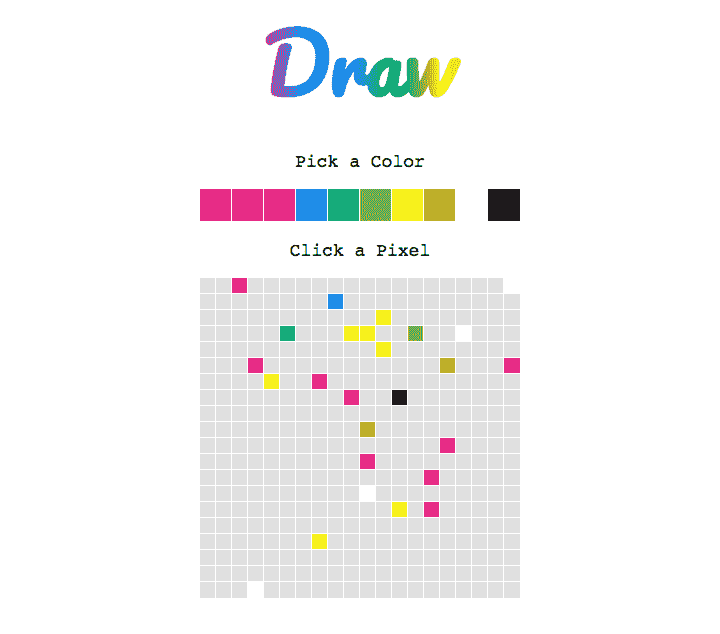
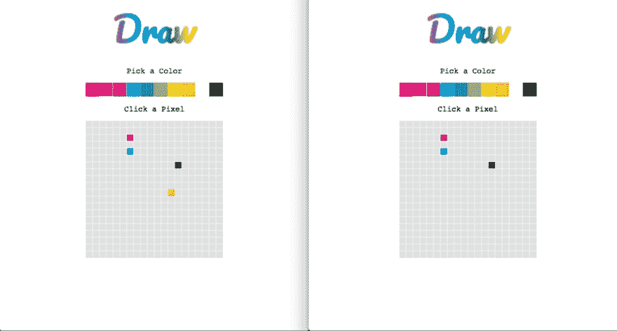

# Socket.io:让 Web Sockets 变得易如反掌！

> 原文:[https://dev . to/aspittel/socket io-making-web-sockets-a-piece-a-piece-a-piece-BMD](https://dev.to/aspittel/socketio-making-web-sockets-a-piece-of-cake-bmd)

本周，我决定学习 websockets，因为它们超级酷。根据 MDN T1 的说法，websockets“使得在用户的浏览器和服务器之间打开一个交互式通信会话成为可能。”换句话说，您可以构建多个用户可以使用 websockets 非常容易地进行实时通信的应用程序。实现 websockets 的最著名的 JavaScript 库之一是 [Socket.io](https://socket.io/) ，所以我决定在我的项目中使用它。

这么说吧，Socket.io 太神奇了。它使得用 websockets 编写应用程序变得超级简单和快速，我不需要太多额外的代码——事实上，这可能比发出一个简单的 AJAX 请求更容易。

## 学习过程

我首先浏览了 Socket.io 网站上的[教程](https://socket.io/get-started/chat/)——用大约 20 行代码，你就有了一个功能完整的 websocket 应用程序！它帮助我理解了库的过程和语法。构建这个应用程序非常容易——由于某种原因，websockets 一直让我感到害怕，我认为它们会更难使用！在那次指导之后，我觉得自己做东西很舒服。

## 最终项目

去年愚人节，Reddit 制作了一个名为/r/place 的应用程序，允许用户合作构建像素艺术。和世界上的其他人一起合作绘画和一个非常酷的项目是一件非常有趣的事情。

我决定使用 React 作为前端，Express 作为后端，Socket.io 作为通信，构建一个非常非常简单的版本。

将 Socket.io 与 React 集成起来也非常容易。最后，我将事件监听器添加到 React 的`componentDidMount`生命周期方法中，类似于放置 AJAX 请求的地方。总而言之，Socket.io 代码非常简单。我的 Express 应用程序的 My app.js 在下面——它只是监听连接和像素改变颜色。在那下面，我附上了我的 React 应用程序的 App.js。如果这是一个完整的项目，我会进一步清理 React 代码，但对于像这样的东西，我没有打扰。[后端](https://github.com/aspittel/websocket-drawing-backend/blob/master/app.js)和[前端](https://github.com/aspittel/websocket-drawing/blob/master/src/App.js)代码托管在 GitHub 上！该应用程序也部署在[在线](https://aspittel.github.io/websocket-drawing/)，所以和你的朋友一起玩吧！

[T2】](https://res.cloudinary.com/practicaldev/image/fetch/s--Dl540XaS--/c_limit%2Cf_auto%2Cfl_progressive%2Cq_auto%2Cw_880/https://cdn-images-1.medium.com/max/880/1%2A0Nef284ApeQsqw77FbT1vA.png)

websockets 的美妙之处在于，我可以打开两个标签，或者告诉我的一个朋友使用该应用程序，他们的像素编辑也会显示在我的应用程序上，就像这样:

[T2】](https://res.cloudinary.com/practicaldev/image/fetch/s--atXJXa_H--/c_limit%2Cf_auto%2Cfl_progressive%2Cq_auto%2Cw_880/https://cdn-images-1.medium.com/max/880/1%2AOQeyQcdQR1ctEyHL-OHxWg.png)

## 最后的想法

再一次，我被 Socket.io 和 websockets 的简单性震惊了。我肯定会继续使用它们来构建具有实时流动数据的交互式程序。我喜欢最终项目的结果，我在构建它的过程中获得了很多乐趣！

**我的一部分[关于学习新事物](https://medium.com/on-learning-new-things/learning-new-things-f4db7f16724)系列**