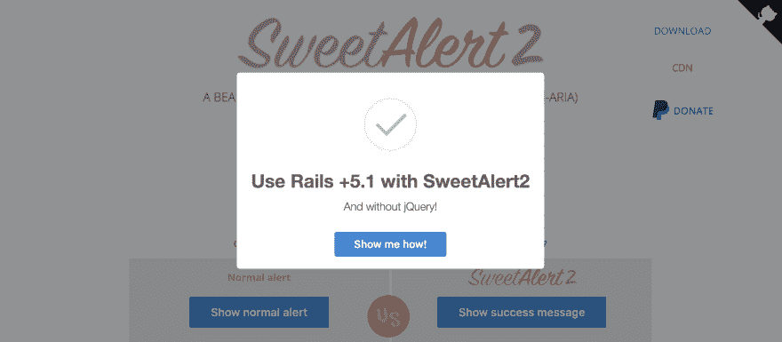

# 如何在没有 jQuery 的情况下将 SweetAlert2 用于 Rails +5.1 (rails-ujs)确认

> 原文:[https://dev . to/Peter fication/how-to-use-sweet alert 2-for-your-rails-51-rails-ujs-confirms-without query-67h](https://dev.to/peterfication/how-to-use-sweetalert2-for-your-rails-51-rails-ujs-confirms-withoutjquery-67h)

[T2】](https://res.cloudinary.com/practicaldev/image/fetch/s--G6OlQUQ2--/c_limit%2Cf_auto%2Cfl_progressive%2Cq_auto%2Cw_880/https://thepracticaldev.s3.amazonaws.com/i/816weq5ka6lzy04vn34j.png)

*TL；见[博士这个演示项目](https://github.com/store2be/rails-sweetalert)的最终解决方案。*

请注意，此处的示例提供了 ES6 语法。[让 ES6 在 Rails 中工作有不同的方法](https://stackoverflow.com/a/42464363)。演示项目有一个 [ES5 分支](https://github.com/store2be/rails-sweetalert/tree/master-es5)作为参考。

* * *

如果你正在读这篇文章，我想你应该熟悉 Ruby on Rails 和 T2 的 SweetAlert2。对于版本 5.1 之前的 Rails，[当 rails-ujs 还是 jquery-ujs](https://blog.bigbinary.com/2017/06/20/rails-5-1-has-dropped-dependency-on-jquery-from-the-default-stack.html) 时，有一种简单的方法[将 SweetAlert(或 SweetAlert2)](http://alexzerbach.com/use-sweet-alert-rails/) 与[Rails 确认功能](https://stackoverflow.com/questions/16668949/how-to-add-confirm-message-with-link-to-ruby-on-rails)挂钩。

实现它的一个方法是重写 Rails 的确认处理程序:

```
// Override the default confirm dialog of Rails
$.rails.handleConfirm = link => {
  if (link.data('confirm') === undefined){
    return true
  }
  showSweetAlertConfirmationDialog(link)
  return false
} 
```

<svg width="20px" height="20px" viewBox="0 0 24 24" class="highlight-action crayons-icon highlight-action--fullscreen-on"><title>Enter fullscreen mode</title></svg> <svg width="20px" height="20px" viewBox="0 0 24 24" class="highlight-action crayons-icon highlight-action--fullscreen-off"><title>Exit fullscreen mode</title></svg>

我们的一个应用中有这个解决方案，我想使用新的`rails-ujs`。我的第一个想法是，适应应该是一件容易的事情。只要把`$.rails.`换成`Rails.`就可以了:

```
// Override the default confirm dialog of Rails
Rails.handleConfirm = link => {
  if (link.data('confirm') === undefined){
    return true
  }
  showSweetAlertConfirmationDialog(link)
  return false
} 
```

<svg width="20px" height="20px" viewBox="0 0 24 24" class="highlight-action crayons-icon highlight-action--fullscreen-on"><title>Enter fullscreen mode</title></svg> <svg width="20px" height="20px" viewBox="0 0 24 24" class="highlight-action crayons-icon highlight-action--fullscreen-off"><title>Exit fullscreen mode</title></svg>

事实证明有些事情已经改变了。

`Rails.handleConfirm`可以被覆盖，但不会覆盖自`rails-ujs`初始化以来已经连接的事件监听器。但是没问题，让我们写我们自己的事件处理程序，并把它插入到新的`rails-ujs`做事方式中。如果你看一下`rails-ujs` 开始部分的源代码[，你会看到事件监听器是如何创建的。为我们自己的方法添加事件监听器的代码如下所示:](https://github.com/rails/rails/blob/master/actionview/app/assets/javascripts/rails-ujs/start.coffee) 

```
const handleConfirm = link => {
  // Do your thing
}
Rails.delegate(document, 'a[data-confirm-swal]', 'click', handleConfirm) 
```

<svg width="20px" height="20px" viewBox="0 0 24 24" class="highlight-action crayons-icon highlight-action--fullscreen-on"><title>Enter fullscreen mode</title></svg> <svg width="20px" height="20px" viewBox="0 0 24 24" class="highlight-action crayons-icon highlight-action--fullscreen-off"><title>Exit fullscreen mode</title></svg>

好吧，酷。现在它适用于属性为`data-confirm-swal="Are you sure?"`的链接🎉… **但是等待**，如果你有一个删除链接，确认对话框永远不会出现，因为这个方法永远不会被调用。🤔原来`method: :delete`的事件监听器被提前调用，因为它在我们的 SweetAlert2 的事件监听器之前被初始化。这是因为在评估代码时，`rails-ujs`的事件监听器是直接连接的。

如果我们想通过在`rails-ujs`之前要求我们的 Javascript 代码来添加我们的事件监听器，那么我们会遇到一个问题，即`Rails.delegate`还没有定义。当你要求`rails-ujs`这是正在发生的事情:

*   定义事件处理程序和`Rails.delegate`
*   在文档上触发`rails:attachBindings`事件
*   附加事件处理程序(`Rails.start`)

所以为了介于`Rails.delegate`的定义和`Rails.start`的执行之间，我们必须附加到`rails:attachBindings`事件。(为此，我们需要在 `rails-ujs`之前要求我们的脚本*！)* 

```
document.addEventListener('rails:attachBindings', element => {
  Rails.delegate(document, 'a[data-confirm-swal]', 'click', handleConfirm)
}) 
```

<svg width="20px" height="20px" viewBox="0 0 24 24" class="highlight-action crayons-icon highlight-action--fullscreen-on"><title>Enter fullscreen mode</title></svg> <svg width="20px" height="20px" viewBox="0 0 24 24" class="highlight-action crayons-icon highlight-action--fullscreen-off"><title>Exit fullscreen mode</title></svg>

🎉现在一切都按预期运行🎉

* * *

对于最终的解决方案[，看看这个演示项目](https://github.com/store2be/rails-sweetalert)(有 ES5 和 ES6 版本)或者看看下面的代码(只有 ES6)。

```
// This file has to be required before rails-ujs
// To use it change `data-confirm` of your links to `data-confirm-swal`
(function() {
  const handleConfirm = function(element) {
    if (!allowAction(this)) {
      Rails.stopEverything(element)
    }
  }

  const allowAction = element => {
    if (element.getAttribute('data-confirm-swal') === null) {
      return true
    }

    showConfirmationDialog(element)
    return false
  }

  // Display the confirmation dialog
  const showConfirmationDialog = element => {
    const message = element.getAttribute('data-confirm-swal')
    const text = element.getAttribute('data-text')

    swal({
      title: message || 'Are you sure?',
      text: text || '',
      type: 'warning',
      showCancelButton: true,
      confirmButtonText: 'Yes',
      cancelButtonText: 'Cancel',
    }).then(result => confirmed(element, result))
  }

  const confirmed = (element, result) => {
    if (result.value) {
      // User clicked confirm button
      element.removeAttribute('data-confirm-swal')
      element.click()
    }
  }

  // Hook the event before the other rails events so it works togeter
  // with `method: :delete`.
  // See https://github.com/rails/rails/blob/master/actionview/app/assets/javascripts/rails-ujs/start.coffee#L69
  document.addEventListener('rails:attachBindings', element => {
    Rails.delegate(document, 'a[data-confirm-swal]', 'click', handleConfirm)
  })

}).call(this) 
```

<svg width="20px" height="20px" viewBox="0 0 24 24" class="highlight-action crayons-icon highlight-action--fullscreen-on"><title>Enter fullscreen mode</title></svg> <svg width="20px" height="20px" viewBox="0 0 24 24" class="highlight-action crayons-icon highlight-action--fullscreen-off"><title>Exit fullscreen mode</title></svg>

* * *

为了找出这一切，我花了几个小时，因为我不熟悉`rails-ujs`的代码库。但是一路上我学到了很多。希望通过这篇文章，我也可以帮助其他一些想在 SweetAlert2 中使用最新版本的 Rails 而不使用 jQuery 的开发人员。

* * *

如果你使用 [Webpacker](https://github.com/rails/webpacker) ，有一个简单的方法进入`rails-ujs`代码和启动脚本:

```
import Rails from 'rails-ujs';

const handleConfirm = () => {
  // Do your thing
}

// Add event listener before the other Rails event listeners like the one
// for `method: :delete`
Rails.delegate(document, 'a[data-confirm-swal]', 'click', handleConfirm)

Rails.start() 
```

<svg width="20px" height="20px" viewBox="0 0 24 24" class="highlight-action crayons-icon highlight-action--fullscreen-on"><title>Enter fullscreen mode</title></svg> <svg width="20px" height="20px" viewBox="0 0 24 24" class="highlight-action crayons-icon highlight-action--fullscreen-off"><title>Exit fullscreen mode</title></svg>

*大家好，我们是 [store2be](https://www.store2be.com) ，一家总部位于柏林的初创公司，致力于为短期零售空间建立一个 SaaS 式的市场。如果你喜欢我们发布的内容，你可能想看看[store 2 be 技术页面](https://tech.store2be.com)或者关注我们的[媒体频道](https://medium.com/store2be-tech)。*