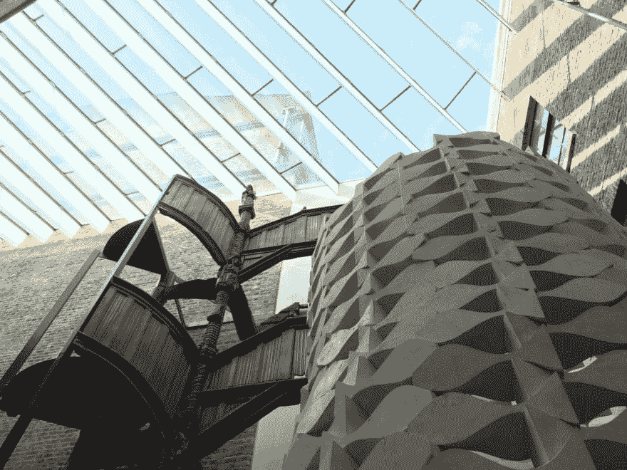

# Flux、Redux 与心理模型等值的推导

> 原文:[https://dev . to/Luke/flux-redux-and-the-derivation-of-mental-model-equivalence-ia](https://dev.to/luke/flux-redux-and-the-derivation-of-mental-model-equivalence-ia)

*更新:*这是我第二次尝试发帖，上次尝试失败了。

[T2】](https://res.cloudinary.com/practicaldev/image/fetch/s--fAiZAsa3--/c_limit%2Cf_auto%2Cfl_progressive%2Cq_auto%2Cw_880/https://thepracticaldev.s3.amazonaws.com/i/swy1fhfcrpgj49j8nnvv.JPG)

今天，我和我的同事就我们目前在 [Riot](https://about.riot.im) 中实现的一个新 UI 进行了有趣的讨论，这是一个我已经帮助构建了将近一年的应用程序。

有问题的 UI 是在 React 中构建的，并由一个 Flux store 支持，所以我将通篇使用 React、 [Flux](https://github.com/facebook/flux/tree/master/examples/flux-concepts) 和 [Redux](https://redux.js.org/) 术语。

讨论大致如下:

*   “这个视图与商店高度耦合，当然视图应该包含操作所需的逻辑和状态，并基于此向商店发送操作”

和...相对

*   “但在变化中，你应该向商店发送意图，而不是状态-动作应该代表用户与应用程序的交互”。

这让我们开始思考视图和存储应该管理什么样的状态。

为了帮助我们在生存危机中进行推理，我们举了几个例子。

## 示例-复选框

一个例子是不起眼的复选框:
[](https://res.cloudinary.com/practicaldev/image/fetch/s--x5tTx6Op--/c_limit%2Cf_auto%2Cfl_progressive%2Cq_auto%2Cw_880/https://thepracticaldev.s3.amazonaws.com/i/5i7ev8iepfc21euflr06.png)

考虑可以以两种状态之一显示的复选框—选中和未选中。复选框由存储支持，存储也可以处于两种状态之一(也就是说，复选框侦听存储广播的“更新”事件，当接收到该事件时，更新复选框以反映存储的状态)。出于我们的目的，我们不认为复选框是由商店之外的任何东西控制的(即，它不是由本机 UI 处理控制的)。

实现该系统有两种方式:

1.  单击时，复选框会发送一个“toggle_checkbox”类型的操作。商店将收到这个，并翻转它辛辛苦苦保护的单个位(老实说，非常得意)。然后，商店广播更新，复选框与商店的状态保持一致。或者，
2.  点击时，复选框发送“复选框 _ 开”或“复选框 _ 关”类型的动作，这取决于当前的状态，即*显示*。

## UX 视角

注意显示的单词*上的强调。在 UX 设计中，我们的目标是尽可能符合用户的期望。有人可能会说，用户的期望应该被认为是从当前的视图和他们的行为中获得的。这意味着选项 2。是更好的选择，因为动作本身是从显示给用户的视图中派生出来的。*

考虑到所有这些，我们可以构建一个粗略的方程组来描述用户与系统的理想交互，这有助于我们进一步推理。为简洁起见，我只提推导的结果。完整的“证明”，见文末。

```
 render(Reduce(CurrentState, Action)) = reason(UserReduce(UserState, Action)) 
```

<svg width="20px" height="20px" viewBox="0 0 24 24" class="highlight-action crayons-icon highlight-action--fullscreen-on"><title>Enter fullscreen mode</title></svg> <svg width="20px" height="20px" viewBox="0 0 24 24" class="highlight-action crayons-icon highlight-action--fullscreen-off"><title>Exit fullscreen mode</title></svg>

### 派生原理

上面的等式是为什么在 UI/Flux/Redux 开发中应该遵守以下规则的粗略形式:

*   一个动作应该代表在用户的系统心理模型上采取的行动。
*   Reduce 函数应该表示用户的行为如何操作用户的心智模型。
*   CurrentState 应该代表用户的心理模型。
*   app 当前状态的渲染方法要“合理”。或者更确切地说，我们呈现当前状态的推理应该紧密地模仿用户用来可视化他们期望的视图的推理。

那么，这与我们实现 humble 复选框的两个选项究竟有什么关系呢？

在这两个选项中，被发送的动作可以说代表了用户操纵他们自己的心智模型的行为。但是，第二个选项考虑了用户当前正在查看的视图，将存储状态的控制权交给了视图。这有什么实际意义？

## 骑车实用性

尽管这个系统很简单，但选择任何一个选项都有实际意义。即在快速连续地启动两个相同动作的场景中。我们假设在这种情况下，用户希望两次点击能够有效地相互抵消。在每种情况下，都可能发生以下情况:

1.  调度两个“toggle_checkbox”操作，存储通过两次调用来设置其内部状态。存储将通过使用其当前状态来推断新状态，这导致该位翻转到 1，然后又回到 0。理论上，这些更新可以快速连续地显示给用户。
2.  调度两个“checkbox_on”动作，并且存储通过将其内部状态位设置为 1 两次来响应。这是(理论上)在视图更新之前，之后当点击时，它将发送“checkbox_off”动作。

选项 2。清楚地显示了一个用户的期望没有被满足的情况，尽管这些行为看起来代表了用户对他们心智模型的操纵。但是严格来说这是真的吗？

用户对复选框行为的推理是否与选项 2 中计算的状态缩减相同。？是的，它是。如果有人让你开灯，然后在你开灯后又让你开灯，你可能不会去关灯(但有趣的是，你可能会怀疑这个人有精神病...型号)。

所以，如果商店是好的，这是该受责备的观点吗？是的。选项 2 中的视图。通过设置存储状态来控制存储和反转数据流。它通过使用自己可能过时的状态来做到这一点，将自己确立为真理的(邪恶)来源。

## 回到 UX 视角

那么，当我们应用 UX 设计的基本原理时，我们错过了什么吗？我们不是说过选项 2。因为它考虑了用户当前看到的视图。

换句话说，动作不仅仅来自用户，而是来自对用户如何操作的假设。在选项 2 中。我们假设更新商店的状态将会更新用户的内部状态，并且在用户再次点击时用户的内部状态没有被“推理”。

我们在设计方案 2 时没有考虑到的是。用户的期望远远超出了一个单独的动作。这就是为什么不从视图中派生动作是如此重要的原因，因为这样做我们假设视图与用户的心理模型相匹配。我们只能希望我们派生的原则；我们不应该认为我们可以使它们短路。

就这样，我留给你们一些可能有意义的等式。

### 心理模型等价的推导(tm)

我们用 Redux 来推导如下:

```
 View = render(CurrentState)

 NextState = Reduce(CurrentState, Action)

 NextView = render(Reduce(CurrentState, Action)) 
```

<svg width="20px" height="20px" viewBox="0 0 24 24" class="highlight-action crayons-icon highlight-action--fullscreen-on"><title>Enter fullscreen mode</title></svg> <svg width="20px" height="20px" viewBox="0 0 24 24" class="highlight-action crayons-icon highlight-action--fullscreen-off"><title>Exit fullscreen mode</title></svg>

并且在理想世界中，我们希望用户期望的视图与我们即将渲染的视图相匹配:

```
 NextView = render(Reduce(CurrentState, Action)) === UserExpectedNextView 
```

<svg width="20px" height="20px" viewBox="0 0 24 24" class="highlight-action crayons-icon highlight-action--fullscreen-on"><title>Enter fullscreen mode</title></svg> <svg width="20px" height="20px" viewBox="0 0 24 24" class="highlight-action crayons-icon highlight-action--fullscreen-off"><title>Exit fullscreen mode</title></svg>

考虑用户观点的一种方式是一种精神上的“渲染”，更普遍的说法是推理:

```
 UserView = reason(UserState) 
```

<svg width="20px" height="20px" viewBox="0 0 24 24" class="highlight-action crayons-icon highlight-action--fullscreen-on"><title>Enter fullscreen mode</title></svg> <svg width="20px" height="20px" viewBox="0 0 24 24" class="highlight-action crayons-icon highlight-action--fullscreen-off"><title>Exit fullscreen mode</title></svg>

，其中用户状态是用户对当前系统状态的当前信念。

由此可知，

```
 UserExpectedNextView = reason(UserExpectedNextState) 
```

<svg width="20px" height="20px" viewBox="0 0 24 24" class="highlight-action crayons-icon highlight-action--fullscreen-on"><title>Enter fullscreen mode</title></svg> <svg width="20px" height="20px" viewBox="0 0 24 24" class="highlight-action crayons-icon highlight-action--fullscreen-off"><title>Exit fullscreen mode</title></svg>

可以建议用户期望的下一个视图也是当前视图和用户采取的动作的函数:

```
 UserExpectedNextView = user(View, Action) 
```

<svg width="20px" height="20px" viewBox="0 0 24 24" class="highlight-action crayons-icon highlight-action--fullscreen-on"><title>Enter fullscreen mode</title></svg> <svg width="20px" height="20px" viewBox="0 0 24 24" class="highlight-action crayons-icon highlight-action--fullscreen-off"><title>Exit fullscreen mode</title></svg>

因此理想情况下，

```
 render(Reduce(CurrentState, Action)) = user(View, Action) = reason(UserExpectedNextState) 
```

<svg width="20px" height="20px" viewBox="0 0 24 24" class="highlight-action crayons-icon highlight-action--fullscreen-on"><title>Enter fullscreen mode</title></svg> <svg width="20px" height="20px" viewBox="0 0 24 24" class="highlight-action crayons-icon highlight-action--fullscreen-off"><title>Exit fullscreen mode</title></svg>

实际上，用户也知道状态应该如何改变:

```
 UserExpectedNextState = UserReduce(UserState, Action) 
```

<svg width="20px" height="20px" viewBox="0 0 24 24" class="highlight-action crayons-icon highlight-action--fullscreen-on"><title>Enter fullscreen mode</title></svg> <svg width="20px" height="20px" viewBox="0 0 24 24" class="highlight-action crayons-icon highlight-action--fullscreen-off"><title>Exit fullscreen mode</title></svg>

所以

```
 render(Reduce(CurrentState, Action)) = reason(UserReduce(UserState, Action)) 
```

<svg width="20px" height="20px" viewBox="0 0 24 24" class="highlight-action crayons-icon highlight-action--fullscreen-on"><title>Enter fullscreen mode</title></svg> <svg width="20px" height="20px" viewBox="0 0 24 24" class="highlight-action crayons-icon highlight-action--fullscreen-off"><title>Exit fullscreen mode</title></svg>